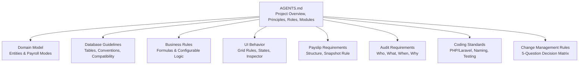
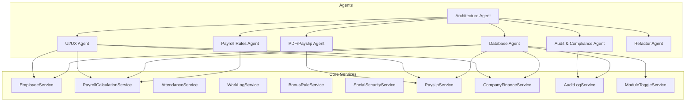
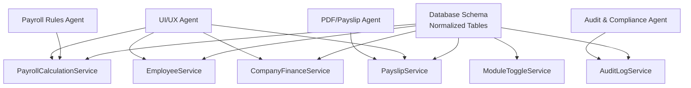

# Anti-Patterns and Best Practices

<cite>
**Referenced Files in This Document**
- [AGENTS.md](file://AGENTS.md)
</cite>

## Table of Contents
1. [Introduction](#introduction)
2. [Project Structure](#project-structure)
3. [Core Components](#core-components)
4. [Architecture Overview](#architecture-overview)
5. [Detailed Component Analysis](#detailed-component-analysis)
6. [Dependency Analysis](#dependency-analysis)
7. [Performance Considerations](#performance-considerations)
8. [Troubleshooting Guide](#troubleshooting-guide)
9. [Conclusion](#conclusion)
10. [Appendices](#appendices)

## Introduction
This document consolidates the anti-patterns and best practices for building the xHR Payroll & Finance System. It translates the project’s explicit anti-pattern list and design principles into actionable guidance for database design, service architecture, UI development, and audit implementation. It also provides decision-making frameworks for common development dilemmas and illustrates good versus bad approaches with concrete examples drawn from the repository’s authoritative guidance.

## Project Structure
The repository defines a comprehensive development contract and guide for the xHR system. It establishes:
- Core design principles (record-based, single source of truth, rule-driven, dynamic but controlled editing, maintainability)
- Technology constraints and agent roles
- Domain model and module requirements
- Database conventions and business rules
- UI behavior expectations and audit requirements
- Coding standards and folder structure guidance

These elements collectively define the project’s structure and serve as the foundation for anti-pattern identification and best practice enforcement.

**Section sources**
- [AGENTS.md:9-31](file://AGENTS.md#L9-L31)
- [AGENTS.md:121-150](file://AGENTS.md#L121-L150)
- [AGENTS.md:385-435](file://AGENTS.md#L385-L435)
- [AGENTS.md:438-506](file://AGENTS.md#L438-L506)
- [AGENTS.md:508-547](file://AGENTS.md#L508-L547)
- [AGENTS.md:549-574](file://AGENTS.md#L549-L574)
- [AGENTS.md:576-595](file://AGENTS.md#L576-L595)
- [AGENTS.md:598-620](file://AGENTS.md#L598-L620)
- [AGENTS.md:650-661](file://AGENTS.md#L650-L661)

## Core Components
This section distills the 12 prohibited practices and the rationale behind each, linking them to the project’s design principles and agent responsibilities.

- Anti-pattern 1: Excel cell-based thinking
  - Rationale: Reliance on row/column positions or cell references leads to brittle logic that breaks when layouts change.
  - Consequences: Maintenance nightmares, incorrect calculations, and inability to evolve UI without breaking backend assumptions.
  - Best practice: Store all logic and references as records with explicit identifiers (e.g., employee_id, payroll_batch_id, payroll_item_type, work_log_id).

- Anti-pattern 2: Hardcoded values
  - Rationale: Hardcoding values that change over time (e.g., SSO ceilings, rates) removes flexibility and introduces risk.
  - Consequences: Requires code changes for every policy update, increases regression risk, and complicates audits.
  - Best practice: Move values into configuration tables (e.g., rate_rules, layer_rate_rules, social_security_configs) and treat them as runtime-configurable.

- Anti-pattern 3: Business logic in views
  - Rationale: Views should present data; logic belongs in services/controllers.
  - Consequences: Difficult to test, debug, and reuse logic; fragile to layout changes.
  - Best practice: Encapsulate logic in service classes and keep views declarative.

- Anti-pattern 4: Report-as-source-of-truth scenarios
  - Rationale: Reports derived from raw data are not the canonical source of truth for decisions.
  - Consequences: Decisions made from reports can be inconsistent with actual stored data, causing disputes and rework.
  - Best practice: Treat stored records as the single source of truth; derive reports from normalized data.

- Anti-pattern 5: Copy-pasting logic across services
  - Rationale: Duplication increases maintenance cost and divergence risks.
  - Consequences: Updates in one place missed elsewhere; inconsistent behavior.
  - Best practice: Extract shared logic into reusable services and centralize configuration.

- Anti-pattern 6: Using human-readable names as keys
  - Rationale: Names are not stable identifiers and can collide or change.
  - Consequences: Breaks referential integrity and makes automation harder.
  - Best practice: Use numeric or UUID identifiers for foreign keys and stable references.

- Anti-pattern 7: Using report pages as the source of truth
  - Rationale: Pages are presentation artifacts, not data stores.
  - Consequences: Data drift, confusion about what is final, and audit gaps.
  - Best practice: Enforce canonical data stores and disallow edits on report pages.

- Anti-pattern 8: PDFs calculating on-the-fly during render
  - Rationale: On-render calculations can diverge from stored snapshots.
  - Consequences: Discrepancies between PDF and official records; audit trail integrity issues.
  - Best practice: Build a snapshot rule so finalized payslips are rendered from stored items.

- Anti-pattern 9: Hiding manual overrides without user visibility
  - Rationale: Transparency is essential for trust and compliance.
  - Consequences: Users cannot track changes; auditors cannot verify decisions.
  - Best practice: Expose source flags (auto, manual, override, master) and show field states.

- Anti-pattern 10: Inline editing without validation and audit
  - Rationale: Unvalidated edits can corrupt data and obscure provenance.
  - Consequences: Data quality issues and audit gaps.
  - Best practice: Enforce validation, permissions, and audit logging for every edit.

- Anti-pattern 11: Overengineering with unnecessary microservices
  - Rationale: Early fragmentation increases complexity without delivering value.
  - Consequences: Operational overhead, distributed state, and reduced cohesion.
  - Best practice: Start monolithic with clear boundaries; split only when justified.

- Anti-pattern 12: Magic numbers in views
  - Rationale: Non-obvious constants reduce readability and increase errors.
  - Consequences: Difficult to maintain and explain.
  - Best practice: Replace with named constants or configuration entries.

Rationale and consequences are grounded in the project’s emphasis on record-based design, single source of truth, rule-driven logic, dynamic but controlled editing, and auditability.

**Section sources**
- [AGENTS.md:36-48](file://AGENTS.md#L36-L48)
- [AGENTS.md:49](file://AGENTS.md#L49)
- [AGENTS.md:61-74](file://AGENTS.md#L61-L74)
- [AGENTS.md:75-91](file://AGENTS.md#L75-L91)
- [AGENTS.md:112-118](file://AGENTS.md#L112-L118)
- [AGENTS.md:170-174](file://AGENTS.md#L170-L174)
- [AGENTS.md:245-256](file://AGENTS.md#L245-L256)
- [AGENTS.md:498-506](file://AGENTS.md#L498-L506)
- [AGENTS.md:528-538](file://AGENTS.md#L528-L538)
- [AGENTS.md:663-672](file://AGENTS.md#L663-L672)

## Architecture Overview
The system architecture is guided by the principle of record-based storage, single source of truth, and rule-driven computation. Agents define responsibilities across architecture, database, payroll rules, UI/UX, PDF/payslip generation, audit/compliance, and refactoring.

**Diagram sources**
- [AGENTS.md:158-283](file://AGENTS.md#L158-L283)
- [AGENTS.md:636-647](file://AGENTS.md#L636-L647)

**Section sources**
- [AGENTS.md:158-283](file://AGENTS.md#L158-L283)
- [AGENTS.md:636-647](file://AGENTS.md#L636-L647)

## Detailed Component Analysis

### Database Design Best Practices
- Use record-based storage: Every concept (employee, salary profile, payroll item, payslip) is persisted as a normalized record with explicit identifiers.
- Single source of truth: Define canonical tables for each domain concept and avoid duplicating data across modules.
- Configurable rules: Store formulas and thresholds in dedicated tables (e.g., rate_rules, layer_rate_rules, social_security_configs) to enable runtime changes.
- phpMyAdmin-friendly schema: Favor straightforward SQL, readable column names, and migrations compatible with shared hosting environments.
- Monetary and time fields: Use precise decimal types for money and integer minutes/seconds for durations to avoid precision loss.
- Audit-ready schema: Include timestamps, status flags, and soft deletes where appropriate; ensure audit references are present.

Examples of good vs bad implementations:
- Bad: Storing computed totals in a report table and basing decisions on it.
- Good: Persisting raw inputs and derived totals in normalized tables; deriving reports from canonical records.

**Section sources**
- [AGENTS.md:385-435](file://AGENTS.md#L385-L435)
- [AGENTS.md:418-427](file://AGENTS.md#L418-L427)
- [AGENTS.md:488-497](file://AGENTS.md#L488-L497)
- [AGENTS.md:498-506](file://AGENTS.md#L498-L506)

### Service Architecture Best Practices
- Encapsulate business logic in service classes; keep controllers thin.
- Use transactions for critical operations to ensure atomicity.
- Separate concerns: EmployeeService, PayrollCalculationService, AttendanceService, WorkLogService, BonusRuleService, SocialSecurityService, PayslipService, CompanyFinanceService, AuditLogService, ModuleToggleService.
- Avoid God Classes: Distribute responsibilities across focused services.
- Validation: Use FormRequest or service-level validation to enforce constraints.

Examples of good vs bad implementations:
- Bad: Copying identical logic across multiple services.
- Good: Centralizing shared logic and exposing it via reusable services.

**Section sources**
- [AGENTS.md:598-620](file://AGENTS.md#L598-L620)
- [AGENTS.md:636-647](file://AGENTS.md#L636-L647)
- [AGENTS.md:272-283](file://AGENTS.md#L272-L283)

### UI Development Best Practices
- Mimic spreadsheet behavior: inline editing, add/remove/duplicate rows, instant recalculation.
- Show field states and source flags: locked, auto, manual, override, from_master, rule_applied, draft, finalized.
- Detail inspector: display source, formula/rule source, monthly-only vs master, notes/reasons, and audit history.
- Maintain a single-page workspace for core tasks: Employee Board, Employee Workspace, Payslip Preview, Annual Summary, Company Finance, Rule Manager, Settings.

Examples of good vs bad implementations:
- Bad: Hiding manual overrides or not indicating source flags.
- Good: Transparent state indicators and a detail inspector that surfaces provenance and history.

**Section sources**
- [AGENTS.md:508-547](file://AGENTS.md#L508-L547)
- [AGENTS.md:222-244](file://AGENTS.md#L222-L244)
- [AGENTS.md:303-321](file://AGENTS.md#L303-L321)

### Audit Implementation Best Practices
- Capture who, what entity, what field, old value, new value, action, timestamp, and optional reason.
- Prioritize high-risk areas: employee salary profile changes, payroll item amounts, payslip finalize/unfinalize, rule changes, module toggle changes, SSO config changes.
- Maintain audit logs for all significant edits and enforce permissions to prevent unauthorized changes.

Examples of good vs bad implementations:
- Bad: Not logging changes or allowing report pages to be edited as canonical sources.
- Good: Canonical data stores, strict edit controls, and comprehensive audit trails.

**Section sources**
- [AGENTS.md:576-595](file://AGENTS.md#L576-L595)
- [AGENTS.md:588-594](file://AGENTS.md#L588-L594)

### Payslip Generation Best Practices
- Structure: company header, employee details, month, payment date, account/bank info, left-side incomes, right-side deductions, totals, signatures.
- Snapshot rule: upon finalization, copy items to payslip_items, store totals and rendering metadata, and render PDF from the snapshot.
- Prohibit reducing income by lowering base salary without transparency; reductions must appear as deductions.

Examples of good vs bad implementations:
- Bad: PDF renders live calculations from the UI.
- Good: Finalized payslips are immutable snapshots used for rendering.

**Section sources**
- [AGENTS.md:549-574](file://AGENTS.md#L549-L574)
- [AGENTS.md:562-566](file://AGENTS.md#L562-L566)
- [AGENTS.md:567-573](file://AGENTS.md#L567-L573)

### Decision-Making Frameworks
Use the 5-question decision matrix for every change:
1. Is this change at the master level or monthly level?
2. Which payroll modes does it impact?
3. Does it affect payslip/report/finance summary?
4. Does it require a schema migration?
5. Should audit coverage or tests be expanded?

If you cannot answer these questions confidently, do not merge the change.

**Section sources**
- [AGENTS.md:650-661](file://AGENTS.md#L650-L661)

## Dependency Analysis
The system’s dependencies center on normalized data stores and service-layer orchestration. The following diagram highlights how agents and services depend on the database and each other.

**Diagram sources**
- [AGENTS.md:175-195](file://AGENTS.md#L175-L195)
- [AGENTS.md:196-221](file://AGENTS.md#L196-L221)
- [AGENTS.md:222-256](file://AGENTS.md#L222-L256)
- [AGENTS.md:257-271](file://AGENTS.md#L257-L271)
- [AGENTS.md:636-647](file://AGENTS.md#L636-L647)

**Section sources**
- [AGENTS.md:175-283](file://AGENTS.md#L175-L283)
- [AGENTS.md:636-647](file://AGENTS.md#L636-L647)

## Performance Considerations
- Prefer normalized schemas with appropriate indexing to support frequent reads and writes in payroll batches.
- Use decimal types for monetary fields to avoid floating-point errors.
- Keep UI recalculation lightweight; defer heavy computations to batch jobs or background tasks when feasible.
- Ensure audit logs are indexed on high-frequency fields (e.g., entity_id, timestamp) to support quick lookups.

[No sources needed since this section provides general guidance]

## Troubleshooting Guide
Common issues and resolutions:
- Incorrect calculations after layout changes: Verify that logic relies on record identifiers, not cell positions.
- Sudden policy changes break the system: Move values to configuration tables and expose them via services.
- Reports differ from stored data: Ensure reports are derived from canonical tables, not edited report pages.
- Discrepancies in finalized payslips: Confirm the snapshot rule is enforced and PDFs render from stored items.
- Audit gaps: Review the 5-question decision matrix and ensure all high-risk changes are logged.

**Section sources**
- [AGENTS.md:663-672](file://AGENTS.md#L663-L672)
- [AGENTS.md:567-573](file://AGENTS.md#L567-L573)
- [AGENTS.md:576-595](file://AGENTS.md#L576-L595)
- [AGENTS.md:650-661](file://AGENTS.md#L650-L661)

## Conclusion
By adhering to record-based design, single source of truth, rule-driven logic, dynamic but controlled editing, and robust auditability, the xHR system avoids the pitfalls of legacy spreadsheet-based systems while remaining maintainable and scalable. The 12 anti-patterns and best practices outlined here provide a practical blueprint for sound architecture and development discipline.

[No sources needed since this section summarizes without analyzing specific files]

## Appendices
- Folder structure guidance aligns with Laravel conventions and promotes separation of concerns across Models, Services, Actions, Enums/Support, Controllers, Requests, Policies, Views, Migrations, and Seeders.

**Section sources**
- [AGENTS.md:622-647](file://AGENTS.md#L622-L647)