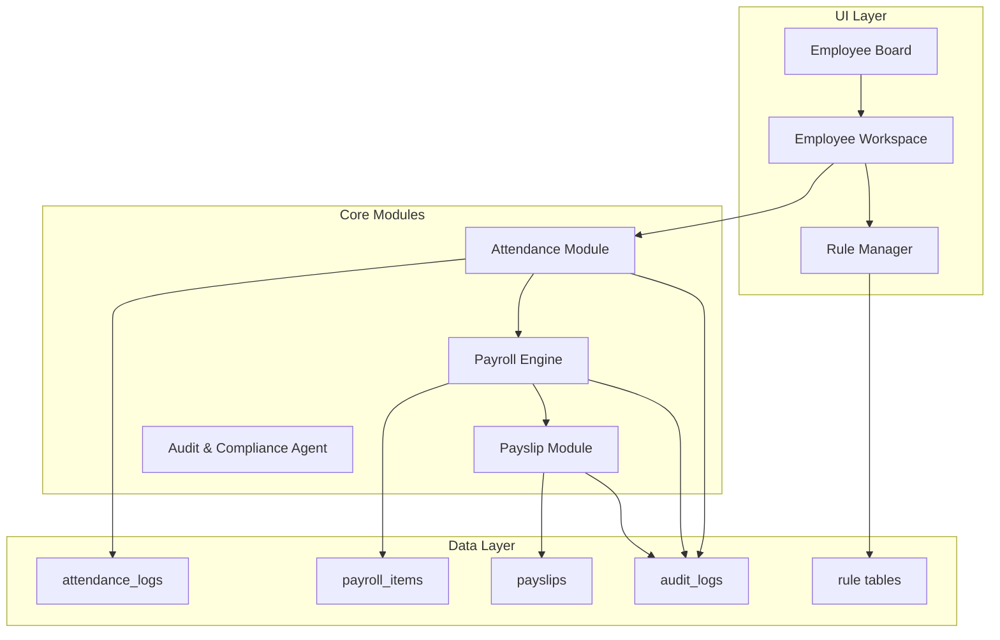
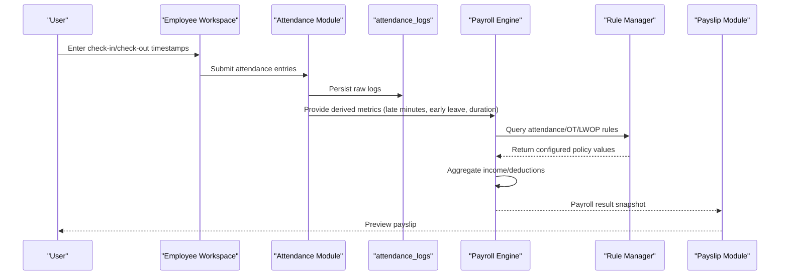
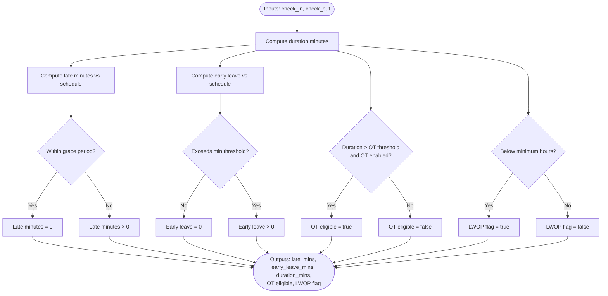
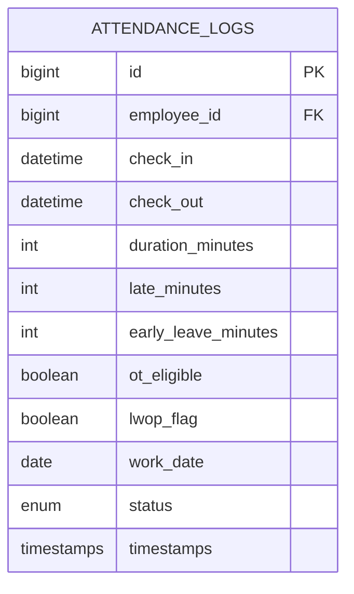
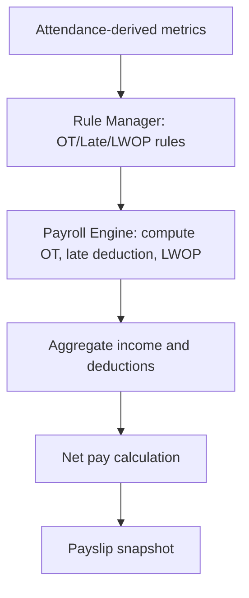
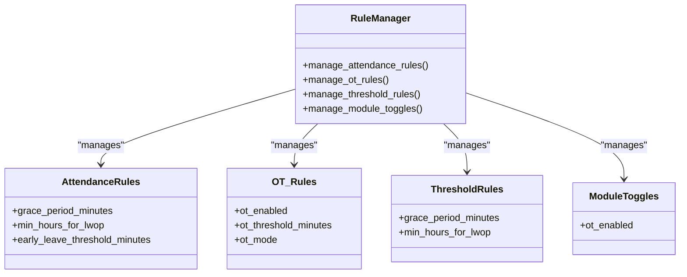
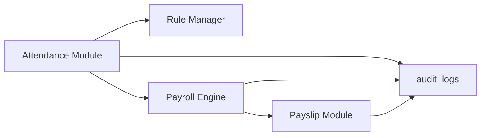

# Attendance Logs Management

<cite>
**Referenced Files in This Document**
- [AGENTS.md](file://AGENTS.md)
</cite>

## Table of Contents
1. [Introduction](#introduction)
2. [Project Structure](#project-structure)
3. [Core Components](#core-components)
4. [Architecture Overview](#architecture-overview)
5. [Detailed Component Analysis](#detailed-component-analysis)
6. [Dependency Analysis](#dependency-analysis)
7. [Performance Considerations](#performance-considerations)
8. [Troubleshooting Guide](#troubleshooting-guide)
9. [Conclusion](#conclusion)
10. [Appendices](#appendices)

## Introduction
This document describes the Attendance Logs Management subsystem within a payroll system. It focuses on how employees’ check-in/check-out inputs are captured, how time-recording mechanisms compute late minutes, early leave, and overtime, and how these attendance-derived metrics integrate with the payroll calculation engine to influence net pay through late deductions, days without pay (LWOP), and overtime processing. It also documents configuration options such as grace periods, minimum hours thresholds, and OT enablement flags, and provides examples of rule configurations and their impact on compensation.

## Project Structure
The system is designed around a rule-driven, database-first architecture with explicit separation of concerns across modules. The Attendance Module is one of several required modules and interacts with the Payroll Engine, Rule Manager, and Payslip Builder.

**Diagram sources**
- [AGENTS.md:322-328](file://AGENTS.md#L322-L328)
- [AGENTS.md:338-343](file://AGENTS.md#L338-L343)
- [AGENTS.md:344-353](file://AGENTS.md#L344-L353)
- [AGENTS.md:354-359](file://AGENTS.md#L354-L359)
- [AGENTS.md:387-401](file://AGENTS.md#L387-L401)
- [AGENTS.md:576-596](file://AGENTS.md#L576-L596)

**Section sources**
- [AGENTS.md:23-31](file://AGENTS.md#L23-L31)
- [AGENTS.md:322-328](file://AGENTS.md#L322-L328)
- [AGENTS.md:338-353](file://AGENTS.md#L338-L353)
- [AGENTS.md:387-401](file://AGENTS.md#L387-L401)
- [AGENTS.md:576-596](file://AGENTS.md#L576-L596)

## Core Components
- Attendance Module: Provides check-in/check-out input, computes late minutes, early leave, and flags OT eligibility and LWOP.
- Payroll Engine: Aggregates income and deductions, applies configurable rules, and produces a payroll result snapshot.
- Rule Manager: Manages attendance rules, OT rules, threshold rules, and module toggles that govern how attendance data influences compensation.
- Payslip Module: Renders and finalizes payslips from the calculated payroll result snapshot.
- Audit & Compliance Agent: Ensures all changes to attendance and payroll data are auditable.

**Section sources**
- [AGENTS.md:322-328](file://AGENTS.md#L322-L328)
- [AGENTS.md:338-343](file://AGENTS.md#L338-L343)
- [AGENTS.md:344-353](file://AGENTS.md#L344-L353)
- [AGENTS.md:354-359](file://AGENTS.md#L354-L359)
- [AGENTS.md:576-596](file://AGENTS.md#L576-L596)

## Architecture Overview
The Attendance Module captures raw check-in/check-out events and transforms them into derived metrics (late minutes, early leave, duration) that feed into the Payroll Engine. The Payroll Engine consults the Rule Manager for configurable policies (grace periods, OT thresholds, LWOP rules) and applies them to compute income adjustments and deductions. The Payslip Module renders the final compensation snapshot, and the Audit Agent tracks all changes.

**Diagram sources**
- [AGENTS.md:322-328](file://AGENTS.md#L322-L328)
- [AGENTS.md:338-343](file://AGENTS.md#L338-L343)
- [AGENTS.md:344-353](file://AGENTS.md#L344-L353)
- [AGENTS.md:354-359](file://AGENTS.md#L354-L359)

## Detailed Component Analysis

### Attendance Module: Inputs and Derived Metrics
- Inputs: Check-in and check-out timestamps per day.
- Derived metrics:
  - Late minutes: computed from scheduled start time minus actual check-in, minus a configurable grace period.
  - Early leave minutes: computed from actual check-out minus scheduled end time, with a configurable minimum threshold before counting as early leave.
  - Duration minutes: total worked minutes between check-in and check-out.
  - OT eligible: set when duration exceeds daily threshold and OT is enabled by module toggle.
  - LWOP flag: set when absence criteria are met (e.g., zero duration or below minimum hours threshold).

**Diagram sources**
- [AGENTS.md:322-328](file://AGENTS.md#L322-L328)
- [AGENTS.md:454-466](file://AGENTS.md#L454-L466)
- [AGENTS.md:467-471](file://AGENTS.md#L467-L471)

**Section sources**
- [AGENTS.md:322-328](file://AGENTS.md#L322-L328)
- [AGENTS.md:454-466](file://AGENTS.md#L454-L466)
- [AGENTS.md:467-471](file://AGENTS.md#L467-L471)

### Attendance Log Data Model
The Attendance Module persists raw check-in/check-out records and supports downstream computations. The suggested table includes:
- attendance_logs: stores employee attendance records with timestamps and derived flags.

**Diagram sources**
- [AGENTS.md:387-401](file://AGENTS.md#L387-L401)
- [AGENTS.md:418-427](file://AGENTS.md#L418-L427)

**Section sources**
- [AGENTS.md:387-401](file://AGENTS.md#L387-L401)
- [AGENTS.md:418-427](file://AGENTS.md#L418-L427)

### Payroll Integration: How Attendance Affects Net Pay
- Income adjustments:
  - Overtime pay: computed when ot_eligible is true and OT rules permit OT for the given period.
  - Diligence allowance: applied when late_minutes_total = 0 and lwop_days_total = 0, with configurable default.
- Deductions:
  - Late deduction: computed from accumulated late minutes using fixed-per-minute or tiered penalties with grace period consideration.
  - LWOP deduction: computed either as a day-based or proportional salary deduction depending on policy.
- Net pay: total_income minus total_deduction.

**Diagram sources**
- [AGENTS.md:440-446](file://AGENTS.md#L440-L446)
- [AGENTS.md:447-453](file://AGENTS.md#L447-L453)
- [AGENTS.md:454-466](file://AGENTS.md#L454-L466)
- [AGENTS.md:467-471](file://AGENTS.md#L467-L471)

**Section sources**
- [AGENTS.md:440-446](file://AGENTS.md#L440-L446)
- [AGENTS.md:447-453](file://AGENTS.md#L447-L453)
- [AGENTS.md:454-466](file://AGENTS.md#L454-L466)
- [AGENTS.md:467-471](file://AGENTS.md#L467-L471)

### Rule Manager: Configuration Options
- Attendance rules: define daily thresholds for late minutes, early leave, and minimum hours to trigger LWOP.
- OT rules: define OT enablement flags, OT thresholds, and OT computation modes (by minute or hour).
- Threshold rules: configure grace periods and minimum hours thresholds.
- Module toggles: enable/disable OT and other attendance-related features.

**Diagram sources**
- [AGENTS.md:344-353](file://AGENTS.md#L344-L353)
- [AGENTS.md:454-466](file://AGENTS.md#L454-L466)
- [AGENTS.md:467-471](file://AGENTS.md#L467-L471)

**Section sources**
- [AGENTS.md:344-353](file://AGENTS.md#L344-L353)
- [AGENTS.md:454-466](file://AGENTS.md#L454-L466)
- [AGENTS.md:467-471](file://AGENTS.md#L467-L471)

### Example Configurations and Compensation Impact
- Example 1: Grace period of 15 minutes, late minute penalty of fixed rate per minute, OT enabled with 480-minute threshold.
  - Impact: Employees within 15 minutes of scheduled start are not penalized; late deductions apply only after grace; OT pay computed when duration exceeds threshold.
- Example 2: Minimum hours threshold of 4 hours triggers LWOP; LWOP deduction is proportional to missing hours.
  - Impact: Employees working less than 4 hours are flagged for LWOP and deducted proportionally.
- Example 3: OT disabled by module toggle.
  - Impact: No OT pay computed regardless of duration.

These examples illustrate how configuration choices directly affect net pay through late deductions, LWOP calculations, and OT processing.

**Section sources**
- [AGENTS.md:454-466](file://AGENTS.md#L454-L466)
- [AGENTS.md:467-471](file://AGENTS.md#L467-L471)
- [AGENTS.md:344-353](file://AGENTS.md#L344-L353)

## Dependency Analysis
- Coupling: Attendance Module depends on Rule Manager for policy values and on Payroll Engine for applying those rules to compute compensation.
- Cohesion: Each module encapsulates a distinct responsibility—data capture (Attendance), policy configuration (Rule Manager), computation (Payroll Engine), and presentation (Payslip).
- Audit trail: All changes are logged to audit_logs for compliance and rollback capability.

**Diagram sources**
- [AGENTS.md:322-328](file://AGENTS.md#L322-L328)
- [AGENTS.md:338-343](file://AGENTS.md#L338-L343)
- [AGENTS.md:354-359](file://AGENTS.md#L354-L359)
- [AGENTS.md:576-596](file://AGENTS.md#L576-L596)

**Section sources**
- [AGENTS.md:576-596](file://AGENTS.md#L576-L596)

## Performance Considerations
- Indexing: Ensure attendance_logs has indexes on employee_id, work_date, and status for efficient queries during payroll runs.
- Batch processing: Compute derived metrics (late minutes, early leave, duration) in batch to minimize repeated scans.
- Rule caching: Cache frequently accessed rule sets (e.g., OT thresholds, grace periods) to reduce database overhead.
- Pagination and filtering: Use month selectors and filters in Employee Workspace to limit dataset sizes during interactive editing.

[No sources needed since this section provides general guidance]

## Troubleshooting Guide
- Symptom: Incorrect late minutes reported.
  - Check: Grace period configuration and scheduled vs actual timestamps.
  - Action: Adjust grace period in ThresholdRules or correct check-in/check-out timestamps.
- Symptom: OT not computed despite long hours.
  - Check: Module toggle for OT and OT threshold in OT_Rules.
  - Action: Enable OT module toggle and adjust ot_threshold_minutes if needed.
- Symptom: LWOP applied unexpectedly.
  - Check: Minimum hours threshold and whether duration was below the configured threshold.
  - Action: Review ThresholdRules and correct work logs if necessary.
- Symptom: Payslip discrepancies after edits.
  - Check: Audit logs for changes to attendance or payroll items.
  - Action: Re-run payroll calculation and review audit trail for unauthorized overrides.

**Section sources**
- [AGENTS.md:576-596](file://AGENTS.md#L576-L596)
- [AGENTS.md:454-466](file://AGENTS.md#L454-L466)
- [AGENTS.md:467-471](file://AGENTS.md#L467-L471)

## Conclusion
The Attendance Logs Management subsystem provides a robust, configurable pipeline from check-in/check-out inputs to payroll outcomes. By separating concerns across the Attendance Module, Rule Manager, Payroll Engine, and Payslip Builder—and by maintaining a strict audit trail—it ensures transparency, maintainability, and accurate compensation computation influenced by configurable policies for grace periods, OT enablement, and LWOP handling.

[No sources needed since this section summarizes without analyzing specific files]

## Appendices
- Glossary:
  - OT: Overtime
  - LWOP: Days Without Pay
  - Grace period: Allowed tolerance before late minutes are counted
  - Module toggle: Feature switch enabling/disabling OT and related behaviors

[No sources needed since this section provides general guidance]