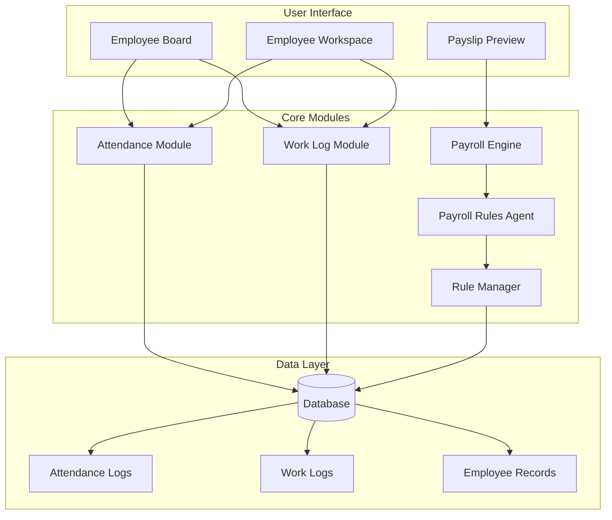
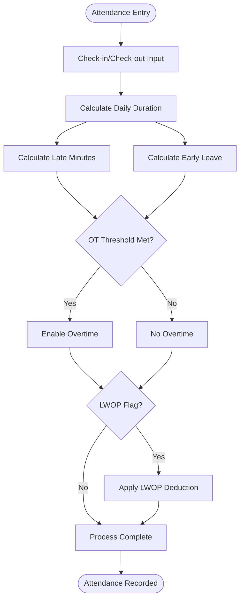
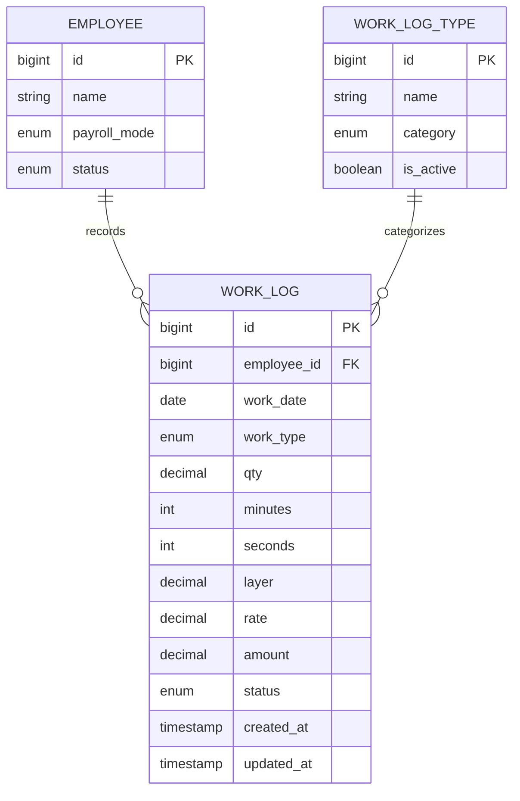
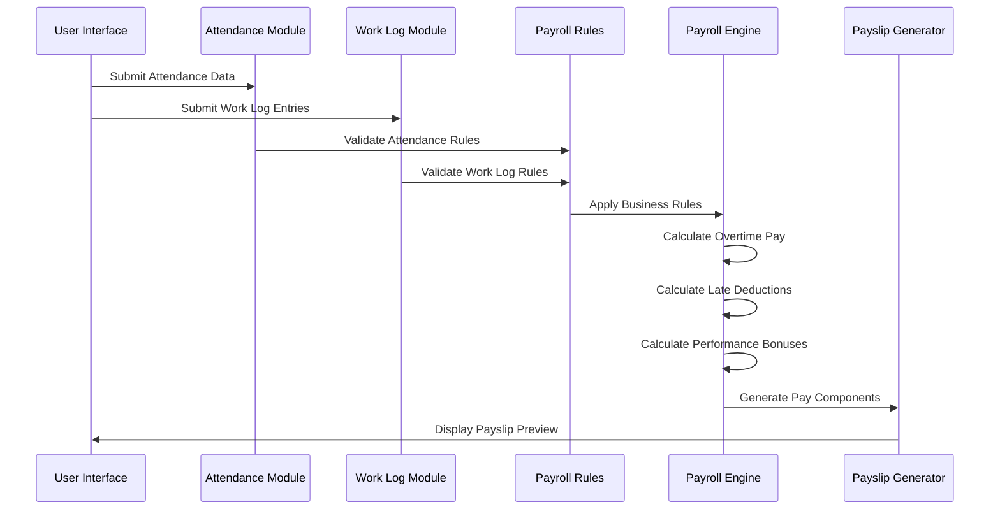
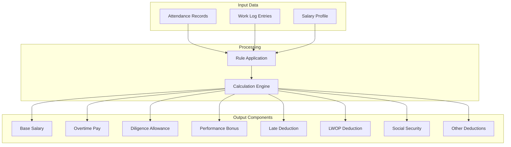
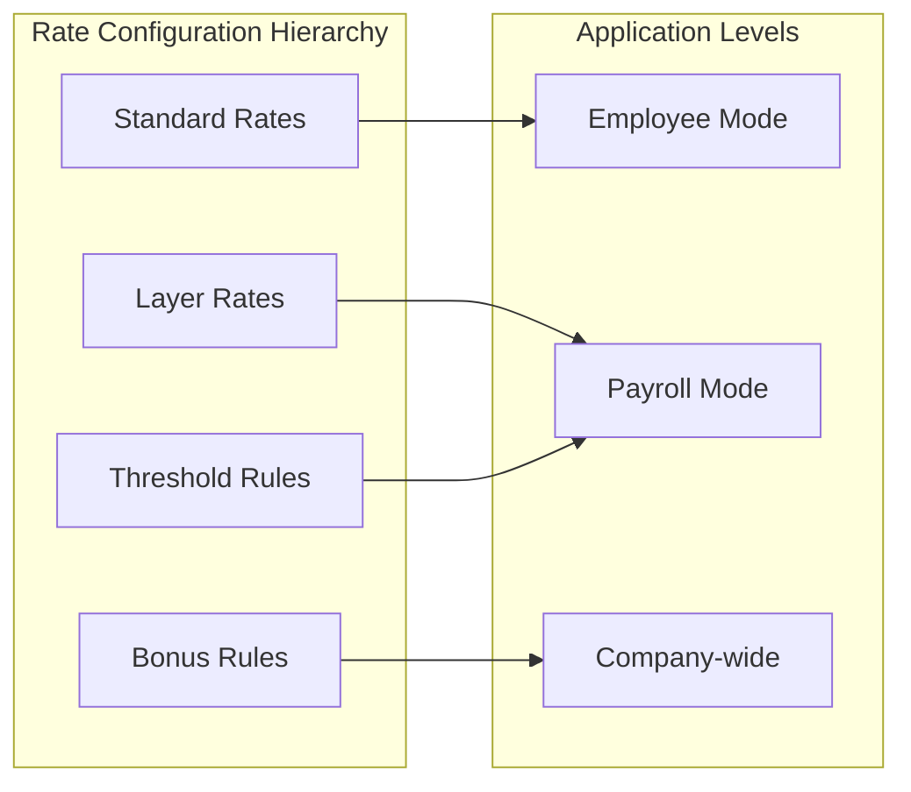
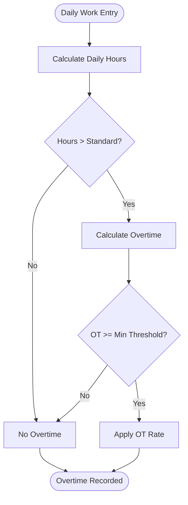
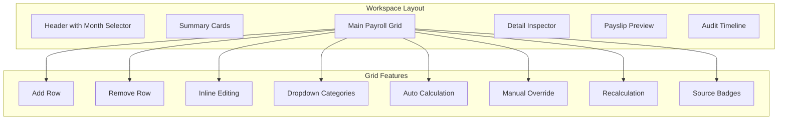
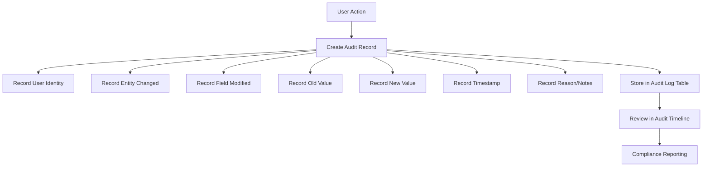
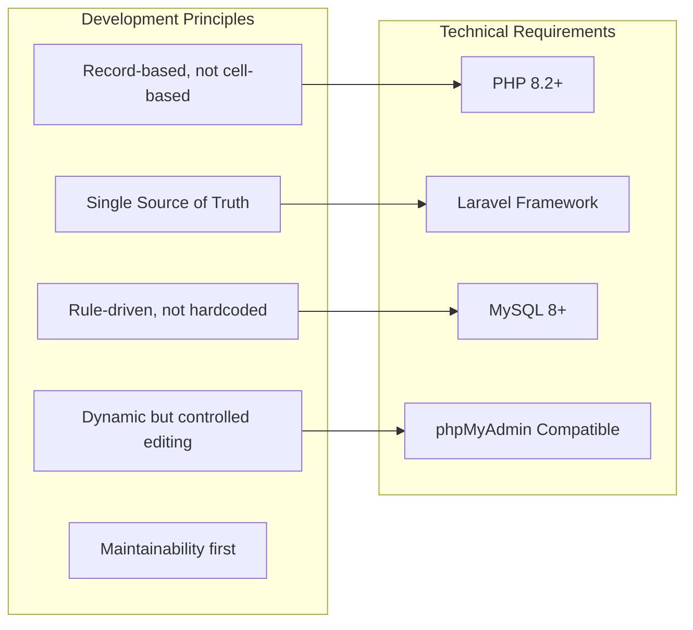

# Attendance and Work Tracking

<cite>
**Referenced Files in This Document**
- [AGENTS.md](file://AGENTS.md)
</cite>

## Table of Contents
1. [Introduction](#introduction)
2. [System Architecture](#system-architecture)
3. [Attendance Module](#attendance-module)
4. [Work Log Module](#work-log-module)
5. [Payroll Integration](#payroll-integration)
6. [Configuration Management](#configuration-management)
7. [Data Models](#data-models)
8. [Business Rules](#business-rules)
9. [UI/UX Considerations](#uiux-considerations)
10. [Audit and Compliance](#audit-and-compliance)
11. [Implementation Guidelines](#implementation-guidelines)
12. [Conclusion](#conclusion)

## Introduction

The xHR Payroll & Finance System is a comprehensive HR management solution designed to replace traditional Excel-based payroll systems with a modern, rule-driven, and auditable platform. This system specifically addresses attendance and work tracking requirements for both monthly staff and freelancers, providing automated calculation of overtime, late deductions, and performance bonuses while maintaining full compliance with Thai labor regulations.

The system follows six core design principles: PHP-first development, MySQL/phpMyAdmin compatibility, dynamic data entry, rule-driven architecture, audit-ability, and easy maintainability. These principles guide the implementation of attendance and work tracking functionality to ensure scalability and future-proofing.

## System Architecture

The system employs a modular architecture with clear separation of concerns across multiple specialized agents:



**Diagram sources**
- [AGENTS.md:155-284](file://AGENTS.md#L155-L284)

The architecture ensures that attendance and work tracking data flows seamlessly into the broader payroll ecosystem, with each module maintaining its own domain boundaries while sharing common data structures and audit trails.

## Attendance Module

The Attendance Module provides comprehensive time tracking capabilities for monthly staff employees, supporting check-in/check-out style input with sophisticated time calculation logic.

### Core Functionality

The attendance system manages four primary time-related metrics:



**Diagram sources**
- [AGENTS.md:322-328](file://AGENTS.md#L322-L328)

### Attendance Data Structure

The system captures detailed attendance information through the AttendanceLog entity, which includes:

- **Check-in/Check-out timestamps** for precise time tracking
- **Late minutes calculation** based on scheduled work hours minus actual arrival time
- **Early leave recording** measuring departure time minus scheduled end time
- **Overtime flag** indicating when work exceeds standard daily hours
- **LWOP (Without Pay Without Reason) flag** for unauthorized absences

### Time Calculation Logic

The attendance system implements sophisticated time calculation rules:

```mermaid
flowchart LR
subgraph "Time Inputs"
CI[Check-in Time]
CO[Check-out Time]
SCH[Schedule]
end
subgraph "Calculations"
DUR[Duration = CO - CI]
LATE[Late = MAX(0, CI - SCH.start)]
EARLY[Early = MAX(0, SCH.end - CO)]
OT[Overtime = MAX(0, DUR - SCH.hours_per_day)]
end
subgraph "Outputs"
LATE_MIN[Late Minutes]
EARLY_MIN[Early Minutes]
OT_MIN[Overtime Minutes]
LWOP[LWOP Flag]
end
CI --> DUR
CO --> DUR
SCH --> DUR
DUR --> LATE
DUR --> EARLY
DUR --> OT
LATE --> LATE_MIN
EARLY --> EARLY_MIN
OT --> OT_MIN
SCH --> LWOP
```

**Diagram sources**
- [AGENTS.md:454-471](file://AGENTS.md#L454-L471)

## Work Log Module

The Work Log Module serves freelancers and hybrid payroll modes with flexible time and quantity tracking capabilities.

### Work Log Types

The system supports multiple work log categories:

| Work Type | Measurement Unit | Description |
|-----------|------------------|-------------|
| **Layer Work** | Minutes/Seconds | Time-based work with tiered rate calculations |
| **Fixed Work** | Quantity | Pre-determined quantity-based work |
| **Service Work** | Hours | Professional service delivery |
| **Project Work** | Days | Project-based assignments |

### Data Capture Structure



**Diagram sources**
- [AGENTS.md:329-337](file://AGENTS.md#L329-L337)

### Calculation Formulas

The work log system implements standardized calculation formulas:

**Freelance Layer Formula:**
- `duration_minutes = minute + (second / 60)`
- `amount = duration_minutes × rate_per_minute`

**Freelance Fixed Formula:**
- `amount = quantity × fixed_rate`

**Layer Rate Calculations:**
The system supports tiered rate structures where rates increase based on accumulated work hours or project milestones, allowing for progressive compensation structures.

## Payroll Integration

The attendance and work tracking systems integrate deeply with the payroll calculation engine, providing automated income and deduction calculations.

### Income Integration



**Diagram sources**
- [AGENTS.md:338-343](file://AGENTS.md#L338-L343)

### Deduction Integration

The system automatically applies various deductions based on attendance patterns:

- **Late Deduction**: Calculated per minute of lateness with configurable grace periods
- **Early Leave Deduction**: Applied for early departures beyond allowed tolerance
- **LWOP Deduction**: Day-based or proportional salary deductions for unauthorized absences
- **Social Security**: Automatic SSO contributions based on configured rates and salary ceilings

### Pay Component Generation

The payroll engine generates comprehensive pay components:



**Diagram sources**
- [AGENTS.md:440-444](file://AGENTS.md#L440-L444)

## Configuration Management

The system provides extensive configuration options through dedicated rule management interfaces.

### Attendance Configuration Rules

| Configuration Category | Parameters | Purpose |
|----------------------|------------|---------|
| **OT Rules** | Enable flag, threshold minutes, calculation method | Control overtime eligibility and payment |
| **Late Deduction Rules** | Fixed per minute rate, tier penalties, grace period | Manage lateness penalties |
| **LWOP Rules** | Day-based deduction, proportional salary deduction | Handle unauthorized absences |
| **Diligence Allowance** | Fixed amount, eligibility criteria | Reward punctuality |

### Rate Configuration

The system supports multiple rate configuration levels:



**Diagram sources**
- [AGENTS.md:344-353](file://AGENTS.md#L344-L353)

### Rule Management Features

- **Dynamic Rule Updates**: Rules can be modified without affecting historical payroll calculations
- **Effective Date Management**: Changes take effect from specified dates
- **Audit Trail**: All rule modifications are logged with change details
- **Validation**: Interdependent rules are validated before activation

## Data Models

The system maintains comprehensive data structures for attendance and work tracking:

### Attendance Log Schema

| Field | Type | Description | Constraints |
|-------|------|-------------|-------------|
| `id` | `bigint unsigned` | Primary key | Auto-increment |
| `employee_id` | `bigint unsigned` | Foreign key to employees | Required |
| `work_date` | `date` | Date of attendance | Required, unique per employee |
| `check_in_time` | `timestamp` | Actual check-in time | Nullable |
| `check_out_time` | `timestamp` | Actual check-out time | Nullable |
| `scheduled_check_in` | `time` | Scheduled start time | Required |
| `scheduled_check_out` | `time` | Scheduled end time | Required |
| `late_minutes` | `integer` | Minutes late | Default 0 |
| `early_minutes` | `integer` | Minutes early | Default 0 |
| `overtime_minutes` | `integer` | Overtime minutes | Default 0 |
| `lwop_flag` | `boolean` | LWOP indicator | Default false |
| `status` | `enum` | Record status | Default 'active' |
| `created_at` | `timestamp` | Creation timestamp | Auto-fill |
| `updated_at` | `timestamp` | Update timestamp | Auto-fill |

### Work Log Schema

| Field | Type | Description | Constraints |
|-------|------|-------------|-------------|
| `id` | `bigint unsigned` | Primary key | Auto-increment |
| `employee_id` | `bigint unsigned` | Foreign key to employees | Required |
| `work_date` | `date` | Date of work | Required |
| `work_type` | `enum` | Work category | Required |
| `qty` | `decimal(12,2)` | Quantity or amount | Nullable |
| `minutes` | `integer` | Minutes worked | Default 0 |
| `seconds` | `integer` | Seconds worked | Default 0 |
| `layer` | `decimal(12,2)` | Layer rating | Nullable |
| `rate` | `decimal(12,2)` | Rate per unit | Nullable |
| `amount` | `decimal(12,2)` | Total calculated amount | Default 0 |
| `status` | `enum` | Record status | Default 'active' |
| `created_at` | `timestamp` | Creation timestamp | Auto-fill |
| `updated_at` | `timestamp` | Update timestamp | Auto-fill |

## Business Rules

The system enforces comprehensive business rules governing attendance and work tracking calculations.

### Overtime Calculation Rules



**Diagram sources**
- [AGENTS.md:454-460](file://AGENTS.md#L454-L460)

### Late Deduction Rules

The late deduction system implements configurable penalty structures:

- **Fixed Per Minute**: Straightforward per-minute penalty calculation
- **Tier Penalty**: Progressive penalties for increasing lateness
- **Grace Period**: Lateness within specified tolerance is ignored

### LWOP Handling

Unauthorized absences trigger automatic deductions:

- **Day-Based Deduction**: Full day salary reduction for unauthorized absence
- **Proportional Deduction**: Pro-rata reduction based on daily salary rate
- **Accumulation Tracking**: LWOP days tracked for annual reporting

### Diligence Allowance

The system provides performance-based allowances:

- **Eligibility Criteria**: Zero late minutes and zero LWOP days
- **Default Amount**: Configurable allowance amount
- **Automatic Application**: Applied when eligibility criteria are met

## UI/UX Considerations

The system provides intuitive interfaces for attendance and work tracking entry:

### Employee Workspace

The Employee Workspace consolidates all payroll-related activities:



**Diagram sources**
- [AGENTS.md:310-321](file://AGENTS.md#L310-L321)

### Attendance Entry Interface

The interface supports efficient time entry with validation:

- **Check-in/Check-out Input Fields**: Real-time validation against schedule
- **Late/Early Detection**: Automatic calculation with visual indicators
- **Overtime Flag**: Clear indication when overtime applies
- **LWOP Option**: Simple flagging for unauthorized absences

### Work Log Entry Interface

Flexible work log entry supports multiple work types:

- **Date Selection**: Calendar-based date picker
- **Type Dropdown**: Work type selection with category filtering
- **Measurement Inputs**: Flexible quantity, time, or layer inputs
- **Rate Application**: Automatic rate application based on configurations
- **Amount Calculation**: Real-time amount calculation

## Audit and Compliance

The system maintains comprehensive audit trails for all attendance and work tracking activities.

### Audit Logging Requirements



**Diagram sources**
- [AGENTS.md:576-595](file://AGENTS.md#L576-L595)

### High-Priority Audit Areas

The system focuses audit coverage on critical areas:

- **Employee Salary Profile Changes**: All modifications to base salary and rates
- **Payroll Item Amount Changes**: Significant adjustments to calculated amounts
- **Payslip Finalization**: Complete audit trail of finalization process
- **Rule Configuration Changes**: All modifications to business rules
- **Module Toggle Changes**: Activation/deactivation of system features
- **SSO Configuration Changes**: Social security benefit modifications

### Compliance Features

- **Change Management**: Five-question change approval process
- **Permission Control**: Role-based access to sensitive operations
- **Validation**: Built-in validation to prevent invalid data entry
- **Reporting**: Comprehensive audit reports for compliance purposes

## Implementation Guidelines

### Development Approach

The system follows established development guidelines:



**Diagram sources**
- [AGENTS.md:23-31](file://AGENTS.md#L23-L31)

### Service Architecture

Recommended service classes for implementation:

- **AttendanceService**: Core attendance calculation and validation
- **WorkLogService**: Work log entry, validation, and calculation
- **PayrollCalculationService**: Integration with payroll engine
- **RuleManagerService**: Configuration and validation of business rules
- **AuditLogService**: Comprehensive audit trail management

### Testing Strategy

Minimum testing requirements include:

- **Payroll Mode Calculation Tests**: Verification of all payroll mode calculations
- **SSO Calculation Tests**: Social security contribution accuracy
- **Layer Rate Tests**: Tiered rate calculation correctness
- **Payslip Snapshot Tests**: Finalization and PDF generation accuracy
- **Audit Logging Tests**: Complete audit trail verification

## Conclusion

The xHR Payroll & Finance System provides a comprehensive solution for attendance and work tracking that balances user-friendly interfaces with robust business logic and strict compliance requirements. The system's modular architecture, rule-driven design, and extensive configuration options ensure it can adapt to various organizational needs while maintaining data integrity and auditability.

Key strengths of the system include:

- **Automated Calculations**: Reduces manual errors through standardized business rules
- **Flexible Configuration**: Adaptable to changing organizational policies and regulations
- **Comprehensive Audit**: Complete traceability of all changes and calculations
- **Scalable Architecture**: Modular design supports future enhancements
- **User Experience**: Intuitive interfaces that feel familiar yet maintain proper controls

The attendance and work tracking modules serve as foundational components that integrate seamlessly with the broader payroll ecosystem, providing the data foundation necessary for accurate compensation calculations and regulatory compliance reporting.