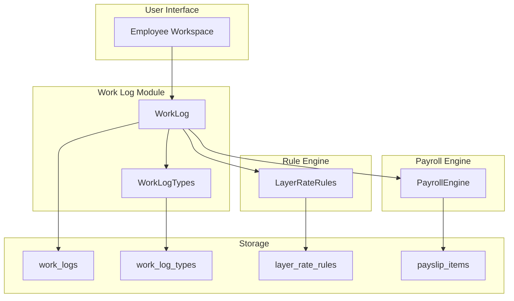
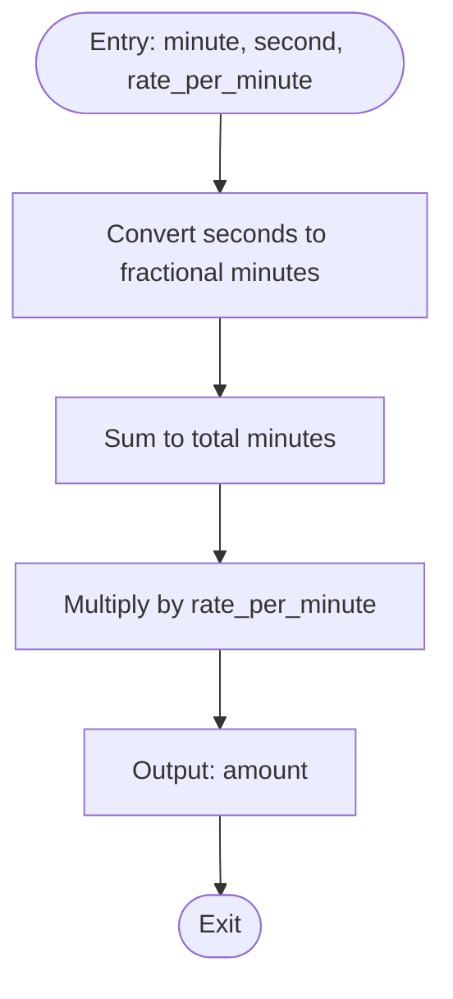
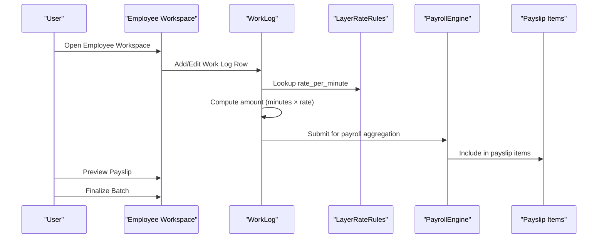
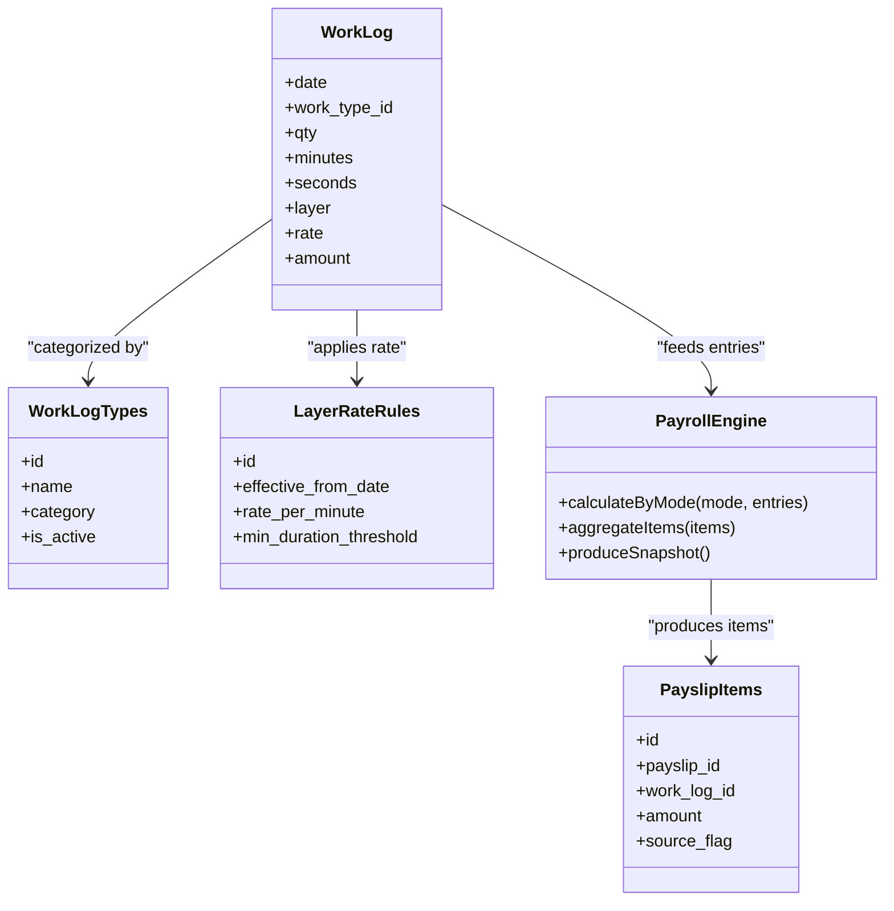
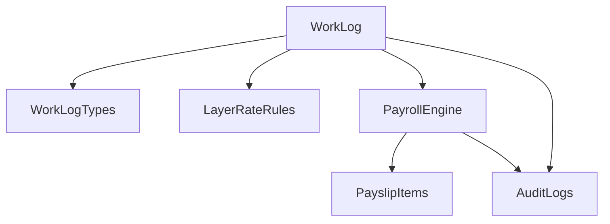

# Work Log System

<cite>
**Referenced Files in This Document**
- [AGENTS.md](file://AGENTS.md)
</cite>

## Table of Contents
1. [Introduction](#introduction)
2. [Project Structure](#project-structure)
3. [Core Components](#core-components)
4. [Architecture Overview](#architecture-overview)
5. [Detailed Component Analysis](#detailed-component-analysis)
6. [Dependency Analysis](#dependency-analysis)
7. [Performance Considerations](#performance-considerations)
8. [Troubleshooting Guide](#troubleshooting-guide)
9. [Conclusion](#conclusion)

## Introduction
This document describes the Work Log System used primarily for freelancers and hybrid payroll modes within the xHR Payroll & Finance System. It explains the work log data model, including date fields, work type categorization, quantity/time measurements, layer rate calculations, and amount computations. It also details the work log types table structure, how different work categories are configured, and how work logs integrate with the payroll calculation engine to determine final compensation for freelance staff.

## Project Structure
The Work Log System is part of the broader xHR Payroll & Finance System, which supports multiple payroll modes including monthly staff, freelance layer, freelance fixed, youtuber salary, youtuber settlement, and custom hybrid. The system emphasizes rule-driven configuration, dynamic but controlled editing, and auditability.

Key aspects of the Work Log Module:
- Purpose: Used for freelancers and certain hybrid scenarios
- Core fields: date, work type, qty/minutes/seconds, layer, rate, amount
- Integration: Feeds into the Payroll Engine to compute compensation
- UI behavior: Inline editing, auto amount calculation, manual override, recalculation, and source badges

**Section sources**
- [AGENTS.md: 329-337:329-337](file://AGENTS.md#L329-L337)
- [AGENTS.md: 123-131:123-131](file://AGENTS.md#L123-L131)
- [AGENTS.md: 338-343:338-343](file://AGENTS.md#L338-L343)

## Core Components
The Work Log System comprises several core components that define how work is recorded, categorized, and monetized:

- WorkLog entity: Stores individual work entries with date, work type, duration (qty/minutes/seconds), layer, rate, and computed amount.
- WorkLogTypes table: Defines categories and classifications for work performed, enabling flexible categorization of tasks.
- LayerRateRules configuration: Provides the rule set for calculating amounts based on time durations and rates.
- PayrollEngine integration: Aggregates work log entries and applies applicable payroll rules to produce final compensation.

These components collectively support dynamic data entry, rule-driven calculations, and audit trails.

**Section sources**
- [AGENTS.md: 329-337:329-337](file://AGENTS.md#L329-L337)
- [AGENTS.md: 401-405:401-405](file://AGENTS.md#L401-L405)
- [AGENTS.md: 338-343:338-343](file://AGENTS.md#L338-L343)

## Architecture Overview
The Work Log System fits into the xHR Payroll & Finance System as follows:

- Data Entry: Users enter work logs in the Employee Workspace grid, selecting work types from WorkLogTypes and specifying quantities or durations.
- Calculation: The Payroll Engine applies LayerRateRules to convert durations into amounts for freelance layer entries.
- Storage: Work logs are persisted in the work_logs table, linked to employees and payroll batches.
- Output: Calculated amounts contribute to the final payslip via the Payroll Engine and are captured in payslips and payslip_items.

**Diagram sources**
- [AGENTS.md: 329-337:329-337](file://AGENTS.md#L329-L337)
- [AGENTS.md: 401-405:401-405](file://AGENTS.md#L401-L405)
- [AGENTS.md: 338-343:338-343](file://AGENTS.md#L338-L343)

## Detailed Component Analysis

### Work Log Data Model
The WorkLog entity captures essential attributes for tracking work performed by freelancers and hybrid staff:

- Date: The calendar date when the work occurred.
- Work Type: Categorization of the work activity (selected from WorkLogTypes).
- Quantity/Minutes/Seconds: Duration or count of work performed.
- Layer: Indicates the applicable layer or category for rate computation.
- Rate: The rate per unit time or per unit quantity.
- Amount: Computed amount derived from duration and rate.

These fields enable precise tracking and calculation of freelance compensation.

**Section sources**
- [AGENTS.md: 329-337:329-337](file://AGENTS.md#L329-L337)

### Work Log Types Table Structure
The WorkLogTypes table defines categories and classifications for work performed. It enables flexible categorization of tasks and supports dynamic selection in the UI. The table structure aligns with the system’s conventions for naming, data types, and auditability.

Key characteristics:
- Table naming convention: plural snake_case
- Primary key: id
- Foreign keys: <entity>_id
- Status flags: status, is_active
- Dates: *_date
- Durations: *_minutes or *_seconds
- Amount fields: decimal(12,2)
- Percentage fields: decimal(5,2) or decimal fraction

**Section sources**
- [AGENTS.md: 401-405:401-405](file://AGENTS.md#L401-L405)
- [AGENTS.md: 418-427:418-427](file://AGENTS.md#L418-L427)

### Layer Rate Calculation Algorithm
For freelance layer entries, the system computes amounts using a standardized algorithm:

- Convert duration to minutes: duration_minutes = minute + (second / 60)
- Compute amount: amount = duration_minutes × rate_per_minute

This rule is configurable via LayerRateRules, allowing adjustments to rates and thresholds without hardcoding.

**Diagram sources**
- [AGENTS.md: 472-476:472-476](file://AGENTS.md#L472-L476)

**Section sources**
- [AGENTS.md: 472-476:472-476](file://AGENTS.md#L472-L476)

### Work Log Entry Workflow
The typical workflow for entering and processing work logs:

1. User navigates to the Employee Workspace and selects the month.
2. User adds rows in the main payroll grid, choosing work types from dropdowns.
3. User enters quantities or durations (minutes/seconds) and selects the applicable layer.
4. The system auto-calculates amounts based on LayerRateRules.
5. User can manually override values when necessary.
6. After recalculation, the user previews the payslip and finalizes the batch.

**Diagram sources**
- [AGENTS.md: 513-515:513-515](file://AGENTS.md#L513-L515)
- [AGENTS.md: 338-343:338-343](file://AGENTS.md#L338-L343)
- [AGENTS.md: 472-476:472-476](file://AGENTS.md#L472-L476)

**Section sources**
- [AGENTS.md: 513-515:513-515](file://AGENTS.md#L513-L515)
- [AGENTS.md: 516-527:516-527](file://AGENTS.md#L516-L527)

### Validation Rules and UI Behaviors
The system enforces validation and provides clear UI states to ensure data integrity:

- Inline editing, add/remove/duplicate rows, and instant recalculation
- Dropdown type/category selection
- Auto amount calculation with manual override capability
- Source badges indicating whether values are locked, auto, manual, or override
- Detail inspector showing source, formula/rule source, and audit history

These behaviors support dynamic but controlled editing while maintaining auditability.

**Section sources**
- [AGENTS.md: 516-527:516-527](file://AGENTS.md#L516-L527)
- [AGENTS.md: 528-546:528-546](file://AGENTS.md#L528-L546)

### Integration with Payroll Calculation Engine
Work logs integrate with the Payroll Engine to compute final compensation:

- Work logs feed into the Payroll Engine, which aggregates income and deductions according to the selected payroll mode.
- For freelance layer mode, amounts are calculated using LayerRateRules.
- For hybrid modes, work logs may be combined with other payroll items and rules.
- The Payroll Engine produces a payroll result snapshot, which is later rendered into payslips.

**Diagram sources**
- [AGENTS.md: 329-337:329-337](file://AGENTS.md#L329-L337)
- [AGENTS.md: 401-405:401-405](file://AGENTS.md#L401-L405)
- [AGENTS.md: 338-343:338-343](file://AGENTS.md#L338-L343)

**Section sources**
- [AGENTS.md: 338-343:338-343](file://AGENTS.md#L338-L343)
- [AGENTS.md: 401-405:401-405](file://AGENTS.md#L401-L405)

## Dependency Analysis
The Work Log System interacts with several core entities and services:

- WorkLog depends on WorkLogTypes for categorization and LayerRateRules for rate configuration.
- PayrollEngine consumes WorkLog entries to compute compensation and generates PayslipItems for final payout.
- Audit and compliance agents track changes to WorkLog entries and related configurations.

**Diagram sources**
- [AGENTS.md: 401-405:401-405](file://AGENTS.md#L401-L405)
- [AGENTS.md: 338-343:338-343](file://AGENTS.md#L338-L343)

**Section sources**
- [AGENTS.md: 401-405:401-405](file://AGENTS.md#L401-L405)
- [AGENTS.md: 338-343:338-343](file://AGENTS.md#L338-L343)

## Performance Considerations
- Use efficient indexing on date, employee_id, and work_type_id to optimize filtering and aggregation.
- Store durations as integers (minutes/seconds) to simplify calculations and reduce precision errors.
- Apply rate rules at the point of entry to minimize repeated lookups during payroll runs.
- Batch process work log updates to reduce database load during mass recalculations.

## Troubleshooting Guide
Common issues and resolutions:

- Incorrect amounts: Verify that LayerRateRules are correctly configured and that durations are entered in the expected units (minutes/seconds).
- Missing work types: Ensure WorkLogTypes are populated and active; confirm dropdown selections match available categories.
- Audit discrepancies: Review AuditLogs for changes to WorkLog entries and related configurations.
- Payroll mismatches: Confirm that PayrollEngine is processing WorkLog entries for the correct payroll mode and month.

**Section sources**
- [AGENTS.md: 576-595:576-595](file://AGENTS.md#L576-L595)

## Conclusion
The Work Log System provides a robust, rule-driven mechanism for capturing and monetizing work performed by freelancers and hybrid staff. Its integration with WorkLogTypes and LayerRateRules ensures flexibility and configurability, while the Payroll Engine and audit systems guarantee accuracy and transparency. By adhering to the documented data model, calculation rules, and UI behaviors, organizations can efficiently manage freelance compensation and generate accurate payslips.