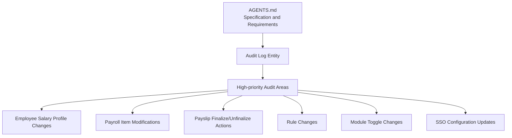
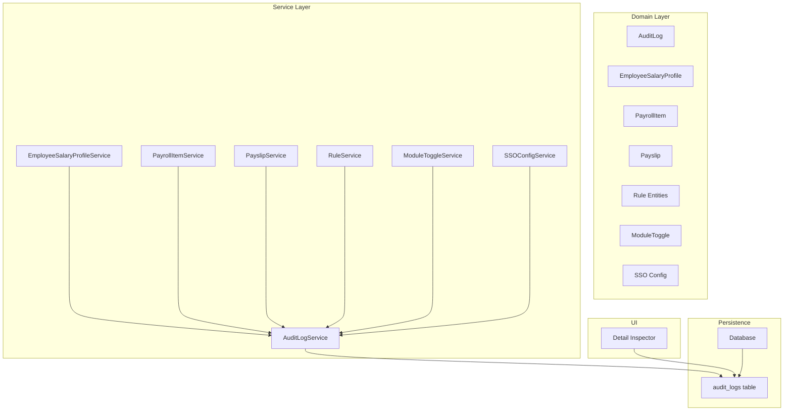
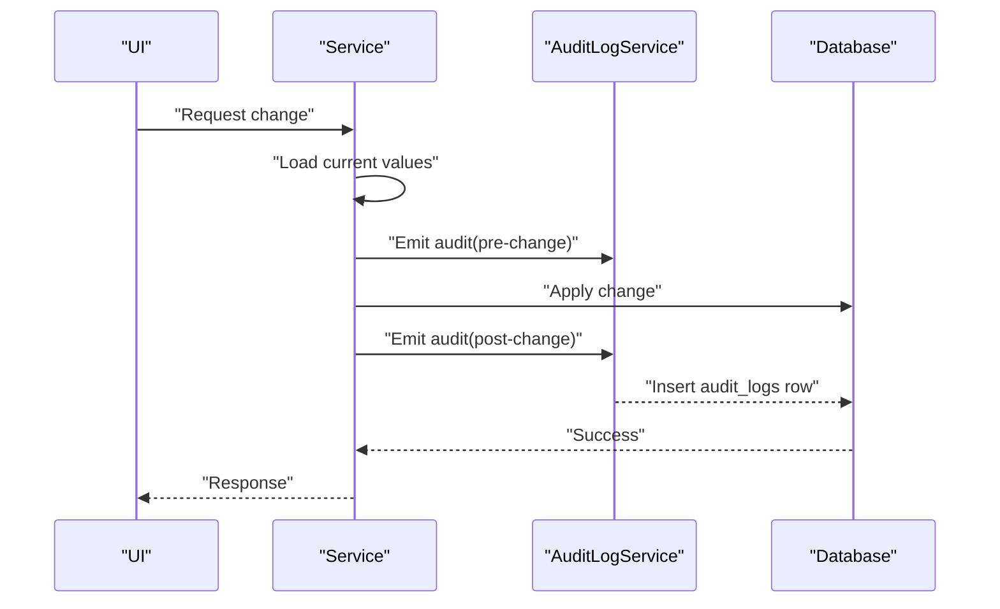
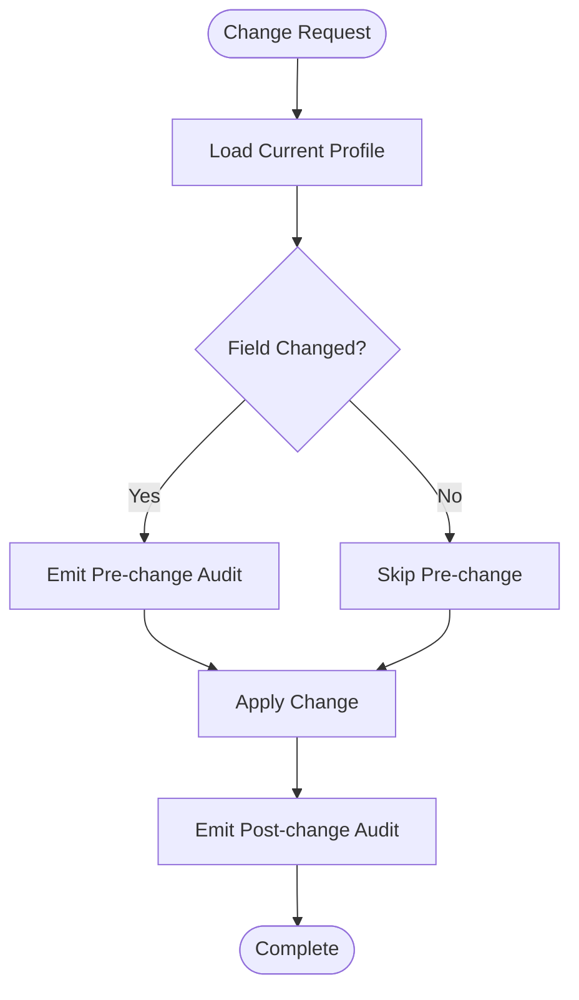
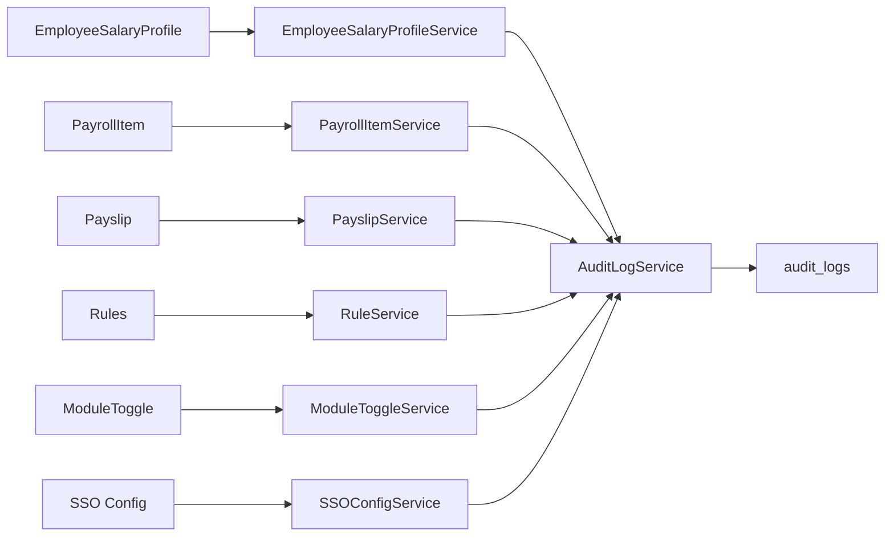

# Audit Trail Implementation

<cite>
**Referenced Files in This Document**
- [AGENTS.md](file://AGENTS.md)
</cite>

## Table of Contents
1. [Introduction](#introduction)
2. [Project Structure](#project-structure)
3. [Core Components](#core-components)
4. [Architecture Overview](#architecture-overview)
5. [Detailed Component Analysis](#detailed-component-analysis)
6. [Dependency Analysis](#dependency-analysis)
7. [Performance Considerations](#performance-considerations)
8. [Troubleshooting Guide](#troubleshooting-guide)
9. [Conclusion](#conclusion)
10. [Appendices](#appendices)

## Introduction
This document describes the audit trail implementation for the payroll system. It covers the mandatory logging fields, audit log structure, data capture mechanisms, and storage requirements. It also explains the implementation of high-priority audit areas such as employee salary profile changes, payroll item modifications, payslip finalize/unfinalize actions, rule changes, module toggle changes, and SSO configuration updates. Finally, it outlines technical specifications for audit log schema, indexing strategies, performance considerations, retention policies, data lifecycle management, and compliance requirements.

## Project Structure
The repository contains a single specification document that defines the audit requirements and high-priority audit areas. The audit log is modeled as a dedicated entity within the system’s domain model and database schema.

**Diagram sources**
- [AGENTS.md:149](file://AGENTS.md#L149)
- [AGENTS.md:588](file://AGENTS.md#L588)

**Section sources**
- [AGENTS.md:149](file://AGENTS.md#L149)
- [AGENTS.md:588](file://AGENTS.md#L588)

## Core Components
The audit log is a core entity in the system’s domain model and database schema. It captures the who, what, when, old/new values, action, timestamp, and optional reason for each significant change.

- Who: The identity of the actor performing the action (e.g., user ID).
- What entity: The affected domain entity (e.g., employee_salary_profile, payroll_item, payslip).
- What field: The specific field that changed (e.g., base_salary, amount).
- Old value: The previous value before the change.
- New value: The new value after the change.
- Action: The type of operation performed (e.g., create, update, delete, finalize, unfinalize).
- Timestamp: The precise time of the event.
- Optional reason: A note explaining the change (e.g., “adjustment for performance review”).

These fields collectively enable full traceability and support compliance reporting.

**Section sources**
- [AGENTS.md:578](file://AGENTS.md#L578)
- [AGENTS.md:588](file://AGENTS.md#L588)

## Architecture Overview
The audit trail is integrated into the system’s architecture as follows:
- Domain model includes an AuditLog entity.
- Services that modify sensitive data emit audit records.
- The database stores audit logs with appropriate indices for efficient querying.
- UI surfaces audit history for rows and entities.

**Diagram sources**
- [AGENTS.md:149](file://AGENTS.md#L149)
- [AGENTS.md:416](file://AGENTS.md#L416)
- [AGENTS.md:645](file://AGENTS.md#L645)

## Detailed Component Analysis

### Audit Log Schema
The audit log schema is designed to capture all mandatory fields and support efficient querying and compliance.

- Fields:
  - id: Unique identifier.
  - actor_id: Identifier of the user or process that performed the action.
  - entity_type: Type of the affected entity (e.g., employee_salary_profile, payroll_item, payslip).
  - entity_id: Identifier of the affected entity record.
  - field_name: Name of the field that changed.
  - old_value: Previous value stored as JSON or text.
  - new_value: New value stored as JSON or text.
  - action: Operation type (create, update, delete, finalize, unfinalize).
  - reason: Optional explanatory note.
  - created_at: Timestamp of the event.

- Indexes:
  - actor_id + created_at
  - entity_type + entity_id + created_at
  - field_name + created_at
  - action + created_at

- Storage:
  - Use a dedicated audit_logs table.
  - Normalize where appropriate (e.g., separate actor and entity references).
  - Consider partitioning by time for long-term retention.

- Compliance:
  - Ensure immutability of audit records (e.g., write-once or append-only).
  - Support export of audit trails for regulatory audits.

**Section sources**
- [AGENTS.md:578](file://AGENTS.md#L578)
- [AGENTS.md:416](file://AGENTS.md#L416)

### Data Capture Mechanisms
Audit events are captured at the service layer during critical operations. The AuditLogService coordinates the emission of audit records.

- Trigger points:
  - Employee salary profile changes: capture old and new values for relevant fields.
  - Payroll item modifications: capture old and new amounts and types.
  - Payslip finalize/unfinalize: capture before/after states and reason.
  - Rule changes: capture old and new rule configurations.
  - Module toggle changes: capture module name and new state.
  - SSO configuration updates: capture old and new configuration values.

- Capture flow:
  - Before applying changes, read current values.
  - After applying changes, compute differences.
  - Emit audit records with actor, entity, field, old/new values, action, timestamp, and reason.

**Diagram sources**
- [AGENTS.md:588](file://AGENTS.md#L588)
- [AGENTS.md:645](file://AGENTS.md#L645)

**Section sources**
- [AGENTS.md:588](file://AGENTS.md#L588)
- [AGENTS.md:645](file://AGENTS.md#L645)

### High-priority Audit Areas

#### Employee Salary Profile Changes
- Scope: Base salary, allowances, deductions, and other compensation fields.
- Capture: Track old and new values for each modified field.
- Reason: Encourage justification for changes (e.g., promotion, adjustment).

**Diagram sources**
- [AGENTS.md:589](file://AGENTS.md#L589)

**Section sources**
- [AGENTS.md:589](file://AGENTS.md#L589)

#### Payroll Item Modifications
- Scope: Amounts, types, and statuses of items.
- Capture: Record old and new values for amount and type; include reason.

**Section sources**
- [AGENTS.md:590](file://AGENTS.md#L590)

#### Payslip Finalize/Unfinalize Actions
- Scope: Finalization and unfinalization of payslips.
- Capture: Store before/after states and reason; ensure immutable snapshot on finalize.

**Section sources**
- [AGENTS.md:591](file://AGENTS.md#L591)

#### Rule Changes
- Scope: Rate rules, layer rate rules, bonus rules, threshold rules, and social security configs.
- Capture: Record old and new rule definitions and parameters.

**Section sources**
- [AGENTS.md:592](file://AGENTS.md#L592)

#### Module Toggle Changes
- Scope: Enable/disable modules affecting payroll computation.
- Capture: Record module name and new state.

**Section sources**
- [AGENTS.md:593](file://AGENTS.md#L593)

#### SSO Configuration Updates
- Scope: Social Security Organization configuration values.
- Capture: Record old and new configuration values.

**Section sources**
- [AGENTS.md:594](file://AGENTS.md#L594)

### UI Integration
- Detail Inspector: Allow users to add a reason for changes and view audit history for a row.
- State indicators: Show whether a field is locked, auto-calculated, manually edited, or overridden.

**Section sources**
- [AGENTS.md:544](file://AGENTS.md#L544)
- [AGENTS.md:545](file://AGENTS.md#L545)
- [AGENTS.md:530](file://AGENTS.md#L530)

## Dependency Analysis
The audit system depends on:
- Domain entities (employee_salary_profile, payroll_item, payslip, rules, module toggles, SSO config).
- Services that modify these entities.
- AuditLogService for emitting audit records.
- Database for durable storage with appropriate indices.

**Diagram sources**
- [AGENTS.md:149](file://AGENTS.md#L149)
- [AGENTS.md:645](file://AGENTS.md#L645)
- [AGENTS.md:416](file://AGENTS.md#L416)

**Section sources**
- [AGENTS.md:149](file://AGENTS.md#L149)
- [AGENTS.md:645](file://AGENTS.md#L645)
- [AGENTS.md:416](file://AGENTS.md#L416)

## Performance Considerations
- Indexing:
  - actor_id + created_at for user activity reports.
  - entity_type + entity_id + created_at for entity timelines.
  - field_name + created_at for field-level analytics.
  - action + created_at for operational dashboards.
- Partitioning:
  - Consider time-based partitioning (monthly/yearly) to manage growth.
- Write patterns:
  - Batch writes for bulk operations to reduce overhead.
  - Asynchronous auditing for non-critical paths to minimize latency.
- Query patterns:
  - Denormalize minimal metadata (e.g., actor display name) to reduce joins.
  - Use projections to limit payload size in UI timelines.
- Retention:
  - Archive older entries to cold storage while keeping recent logs searchable.
- Compliance:
  - Enforce immutability to meet regulatory requirements.

[No sources needed since this section provides general guidance]

## Troubleshooting Guide
- Missing audit records:
  - Verify that services emit pre/post-change audits around all modifications.
  - Confirm that AuditLogService is invoked and that database writes succeed.
- Incorrect old/new values:
  - Ensure pre-change snapshots are taken before applying updates.
  - Validate serialization of complex values (JSON/text).
- Performance issues:
  - Review missing or underused indexes.
  - Check partitioning strategy and archival policies.
- Compliance gaps:
  - Confirm immutability and export capabilities.
  - Validate retention and deletion policies.

[No sources needed since this section provides general guidance]

## Conclusion
The audit trail implementation centers on a dedicated AuditLog entity capturing who, what, when, old/new values, action, timestamp, and optional reason. High-priority audit areas are covered comprehensively across salary profiles, payroll items, payslips, rules, module toggles, and SSO configurations. The schema, indexing, and performance strategies outlined here support robust traceability, efficient querying, and compliance readiness.

[No sources needed since this section summarizes without analyzing specific files]

## Appendices

### Audit Log Schema Reference
- Table: audit_logs
- Columns:
  - id
  - actor_id
  - entity_type
  - entity_id
  - field_name
  - old_value
  - new_value
  - action
  - reason
  - created_at

**Section sources**
- [AGENTS.md:416](file://AGENTS.md#L416)
- [AGENTS.md:578](file://AGENTS.md#L578)

### High-priority Audit Areas Checklist
- Employee salary profile changes
- Payroll item modifications
- Payslip finalize/unfinalize actions
- Rule changes
- Module toggle changes
- SSO configuration updates

**Section sources**
- [AGENTS.md:588](file://AGENTS.md#L588)