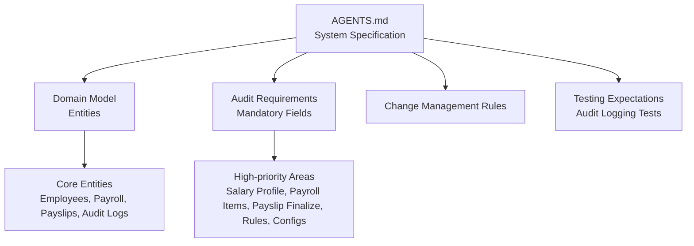
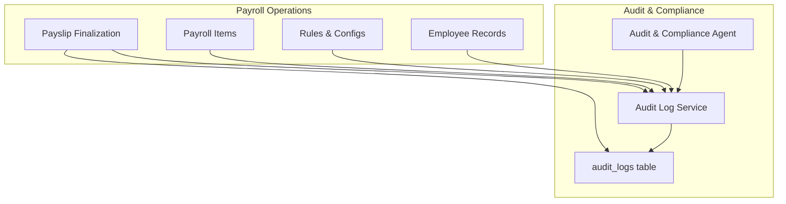
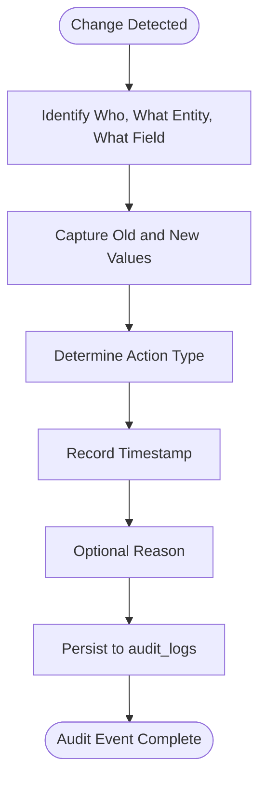
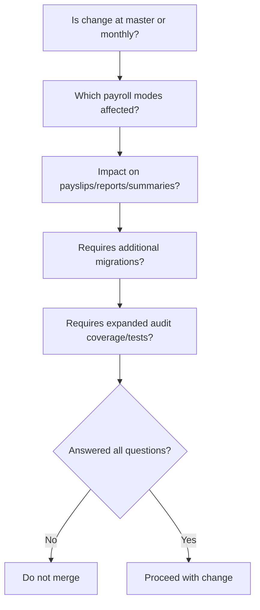
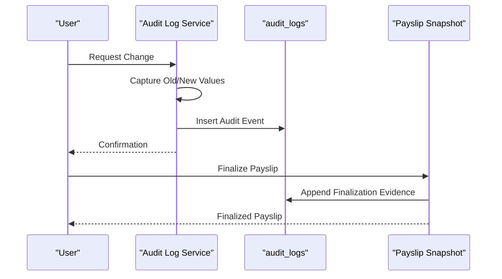
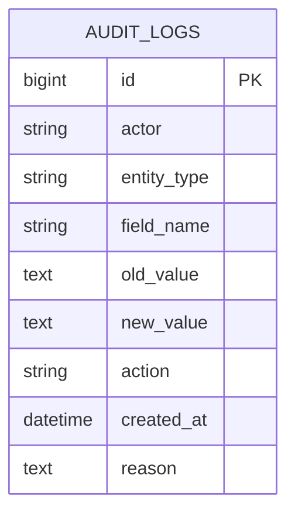
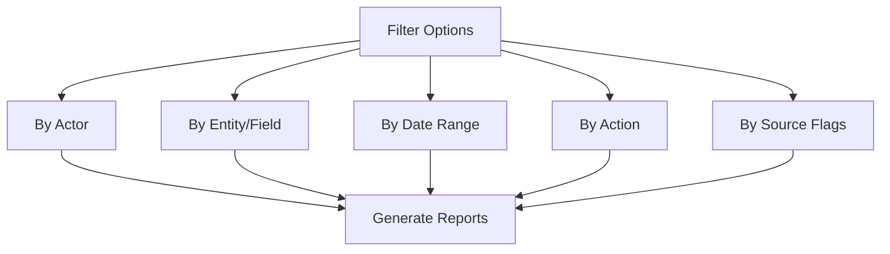
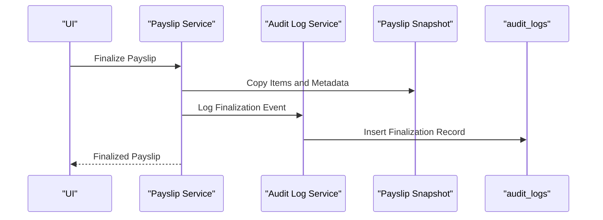
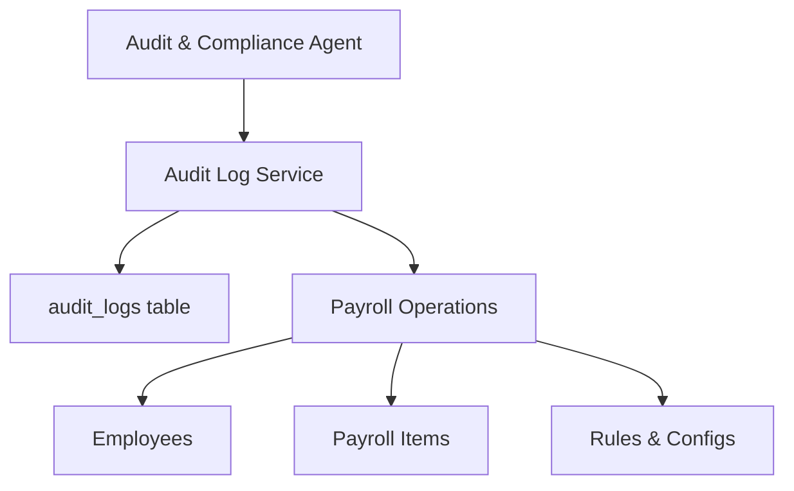

# Audit and Compliance System

<cite>
**Referenced Files in This Document**
- [AGENTS.md](file://AGENTS.md)
</cite>

## Table of Contents
1. [Introduction](#introduction)
2. [Project Structure](#project-structure)
3. [Core Components](#core-components)
4. [Architecture Overview](#architecture-overview)
5. [Detailed Component Analysis](#detailed-component-analysis)
6. [Dependency Analysis](#dependency-analysis)
7. [Performance Considerations](#performance-considerations)
8. [Troubleshooting Guide](#troubleshooting-guide)
9. [Conclusion](#conclusion)
10. [Appendices](#appendices)

## Introduction
This document describes the audit and compliance system for the xHR Payroll & Finance System. It focuses on the audit trail implementation, mandatory logging fields, high-priority audit areas, compliance requirements, change management, approval workflows, rollback capabilities, audit log structure, filtering/reporting, integration with regulatory compliance, data governance, retention policies, forensic audit preparation, and the relationship between audit logs and the payslip finalization process.

## Project Structure
The repository contains a single specification document that defines the system’s architecture, domain model, and audit/compliance requirements. The document outlines:
- Core design principles emphasizing record-based storage and auditability
- Domain entities including employees, payroll batches, payslips, and audit logs
- Audit requirements specifying mandatory fields and high-priority audit areas
- Change management rules and testing expectations for audit coverage

**Diagram sources**
- [AGENTS.md:121-149](file://AGENTS.md#L121-L149)
- [AGENTS.md:576-595](file://AGENTS.md#L576-L595)
- [AGENTS.md:650-660](file://AGENTS.md#L650-L660)
- [AGENTS.md:612-619](file://AGENTS.md#L612-L619)

**Section sources**
- [AGENTS.md:1-692](file://AGENTS.md#L1-L692)

## Core Components
- Audit & Compliance Agent: Responsible for ensuring all significant changes are logged, maintaining historical records, and enabling rollback capability at the data level. The agent audits employee status changes, salary profile changes, payroll item changes, payslip edits/finalizations, SSO config changes, bonus rule changes, and module toggle changes.
- Audit Log Service: A dedicated service responsible for capturing audit events with mandatory fields and storing them in the audit logs table.
- Audit Logs Table: A core database table designed to persist audit events with fields for identity, entity, field, old/new values, action, timestamp, and optional reason.
- Payslip Finalization Snapshot: A process that copies payslip items and metadata into a snapshot table upon finalization to preserve immutable evidence for PDF generation and audit trails.

Key responsibilities and artifacts:
- Mandatory logging fields: who, what entity, what field, old value, new value, action, timestamp, optional reason
- High-priority audit areas: employee salary profile, payroll item amount, payslip finalize/unfinalize, rule changes, module toggle changes, SSO config changes
- Audit coverage requirements: audit logging tests in the minimum deliverables

**Section sources**
- [AGENTS.md:257-271](file://AGENTS.md#L257-L271)
- [AGENTS.md:576-595](file://AGENTS.md#L576-L595)
- [AGENTS.md:645](file://AGENTS.md#L645)
- [AGENTS.md:416](file://AGENTS.md#L416)
- [AGENTS.md:567-573](file://AGENTS.md#L567-L573)
- [AGENTS.md:612-619](file://AGENTS.md#L612-L619)

## Architecture Overview
The audit and compliance architecture centers on the Audit & Compliance Agent and the Audit Log Service. The system enforces mandatory logging fields and high-priority audit areas across payroll operations. Audit events are persisted in the audit logs table, while payslip finalization triggers a snapshot to ensure immutable evidence.

**Diagram sources**
- [AGENTS.md:257-271](file://AGENTS.md#L257-L271)
- [AGENTS.md:645](file://AGENTS.md#L645)
- [AGENTS.md:416](file://AGENTS.md#L416)
- [AGENTS.md:567-573](file://AGENTS.md#L567-L573)

## Detailed Component Analysis

### Audit Trail Implementation
The audit trail captures:
- Identity: who performed the change
- Entity: what was changed
- Field: which field was modified
- Old/New Values: before and after values
- Action: the operation performed
- Timestamp: when the change occurred
- Optional Reason: justification for the change

High-priority audit areas include:
- Employee salary profile
- Payroll item amounts
- Payslip finalize/unfinalize
- Rule changes
- Module toggle changes
- SSO config changes

**Diagram sources**
- [AGENTS.md:578-587](file://AGENTS.md#L578-L587)
- [AGENTS.md:588-594](file://AGENTS.md#L588-L594)

**Section sources**
- [AGENTS.md:576-595](file://AGENTS.md#L576-L595)

### Change Management Process and Approval Workflows
The system defines a five-question change management rule:
1. Is the change at master or monthly level?
2. Which payroll modes are impacted?
3. Does it impact payslips, reports, or finance summaries?
4. Does it require additional migrations?
5. Does it require expanded audit coverage or tests?

Approval workflows are implied by requiring audit coverage and tests for any change. The Audit & Compliance Agent ensures that changes affecting high-priority audit areas are captured and tested.

**Diagram sources**
- [AGENTS.md:652-660](file://AGENTS.md#L652-L660)

**Section sources**
- [AGENTS.md:650-660](file://AGENTS.md#L650-L660)

### Rollback Capabilities
Rollback capability is enabled by:
- Maintaining historical records in the audit logs
- Preserving immutable snapshots during payslip finalization
- Supporting data-level rollbacks for high-priority audit areas

**Diagram sources**
- [AGENTS.md:567-573](file://AGENTS.md#L567-L573)
- [AGENTS.md:416](file://AGENTS.md#L416)

**Section sources**
- [AGENTS.md:257-271](file://AGENTS.md#L257-L271)

### Audit Log Structure
The audit logs table stores:
- Identity fields (who)
- Entity and field identifiers
- Old and new values
- Action type
- Timestamp
- Optional reason

**Diagram sources**
- [AGENTS.md:416](file://AGENTS.md#L416)
- [AGENTS.md:578-587](file://AGENTS.md#L578-L587)

**Section sources**
- [AGENTS.md:416](file://AGENTS.md#L416)
- [AGENTS.md:578-587](file://AGENTS.md#L578-L587)

### Filtering and Reporting Capabilities
The specification emphasizes:
- Showing audit history for rows in the UI
- Tagging and labeling states (locked, auto, manual, override, from_master, rule_applied, draft, finalized)
- Using source flags to track value origins

These capabilities support filtering and reporting by:
- Actor
- Entity and field
- Date/time range
- Action type
- Source flags

**Diagram sources**
- [AGENTS.md:528-546](file://AGENTS.md#L528-L546)

**Section sources**
- [AGENTS.md:528-546](file://AGENTS.md#L528-L546)

### Relationship Between Audit Logs and Payslip Finalization
Finalization triggers:
- Copying payslip items into the snapshot table
- Storing totals and rendering metadata
- Ensuring PDFs reference immutable snapshots

This preserves evidence for audits and forensic investigations.

**Diagram sources**
- [AGENTS.md:567-573](file://AGENTS.md#L567-L573)
- [AGENTS.md:578-587](file://AGENTS.md#L578-L587)

**Section sources**
- [AGENTS.md:567-573](file://AGENTS.md#L567-L573)
- [AGENTS.md:578-587](file://AGENTS.md#L578-L587)

## Dependency Analysis
The Audit & Compliance Agent depends on:
- Audit Log Service for event persistence
- Audit Logs table for storage
- Payslip Service for finalization-related audit events
- Domain entities (employees, payroll items, rules, configs) for change detection

**Diagram sources**
- [AGENTS.md:257-271](file://AGENTS.md#L257-L271)
- [AGENTS.md:645](file://AGENTS.md#L645)
- [AGENTS.md:416](file://AGENTS.md#L416)

**Section sources**
- [AGENTS.md:257-271](file://AGENTS.md#L257-L271)
- [AGENTS.md:645](file://AGENTS.md#L645)
- [AGENTS.md:416](file://AGENTS.md#L416)

## Performance Considerations
- Audit logging overhead: Ensure efficient indexing on audit logs by actor, entity, field, and timestamp
- Snapshot writes: Batch or optimize payslip snapshot writes to minimize I/O
- Filtering performance: Add composite indexes for frequent filter combinations (actor-entity-field-date)
- Reporting: Use materialized summaries for high-volume audit reports

## Troubleshooting Guide
Common issues and resolutions:
- Missing audit events: Verify that the Audit Log Service is invoked for all high-priority audit areas and that tests cover audit logging
- Incomplete audit history: Confirm that UI Detail Inspector displays audit history for rows and that source flags are set appropriately
- Finalization discrepancies: Check that payslip snapshot copying occurs before PDF generation and that audit events are recorded for finalization/unfinalization actions

**Section sources**
- [AGENTS.md:612-619](file://AGENTS.md#L612-L619)
- [AGENTS.md:540-546](file://AGENTS.md#L540-L546)
- [AGENTS.md:567-573](file://AGENTS.md#L567-L573)

## Conclusion
The xHR Payroll & Finance System’s audit and compliance framework is built around mandatory logging fields, high-priority audit areas, robust change management, and immutable snapshotting for payslips. The Audit & Compliance Agent, Audit Log Service, and audit logs table form the backbone of compliance readiness, while UI features support filtering and reporting. Adhering to the change management rules and testing expectations ensures reliable audit coverage and forensic audit preparation.

## Appendices
- Minimum deliverables include audit logs, which are essential for compliance and audit readiness
- Compliance integration: Align audit fields and retention policies with applicable regulations; ensure immutable evidence for finalization events

**Section sources**
- [AGENTS.md:675-690](file://AGENTS.md#L675-L690)