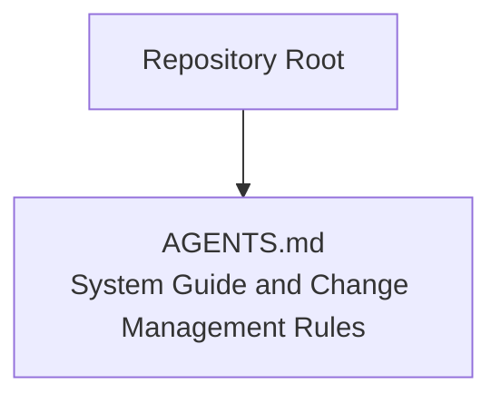
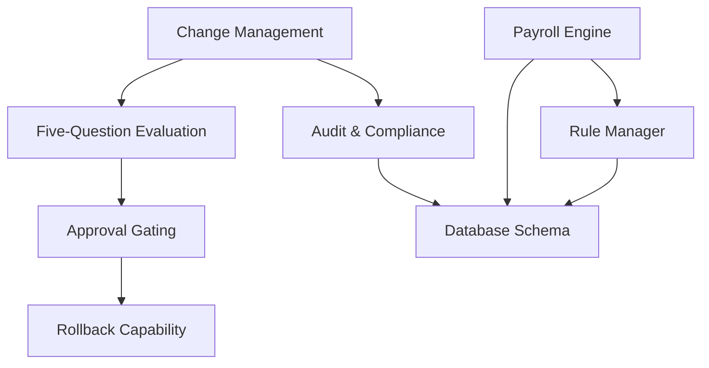
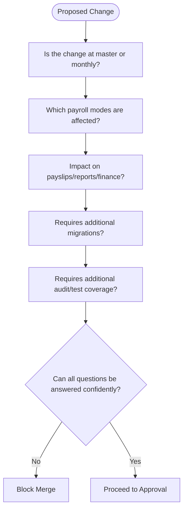
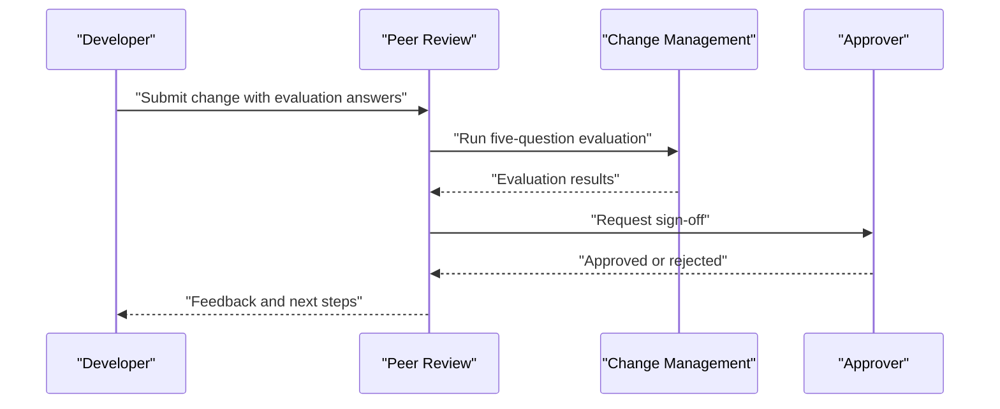
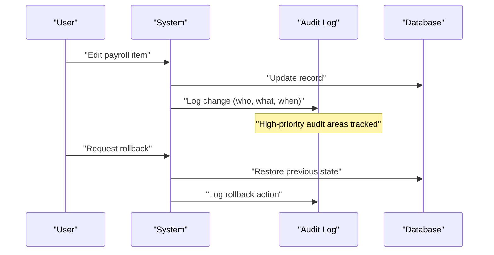
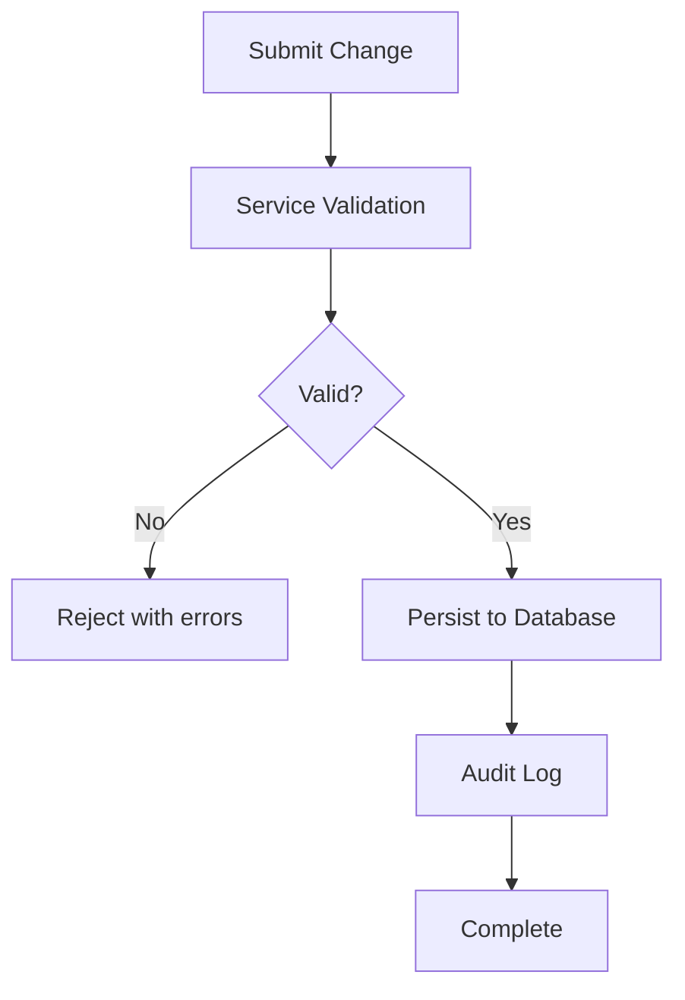
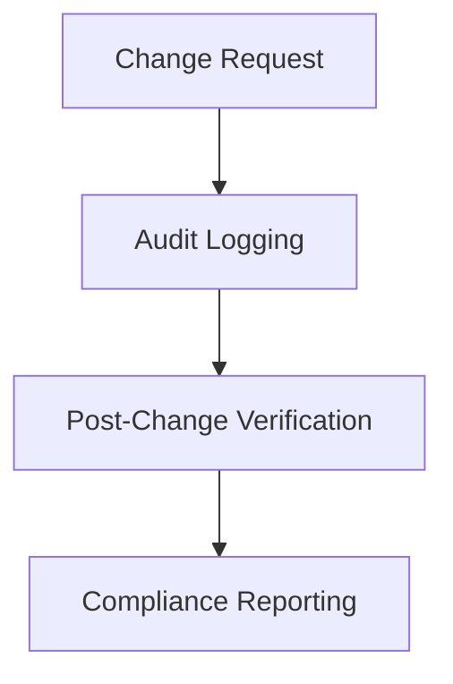
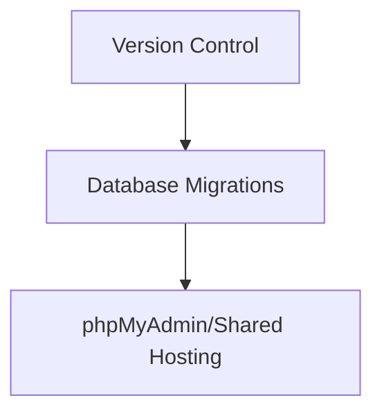
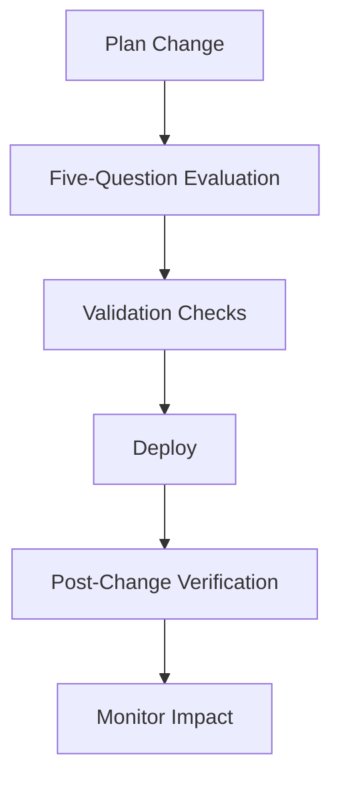
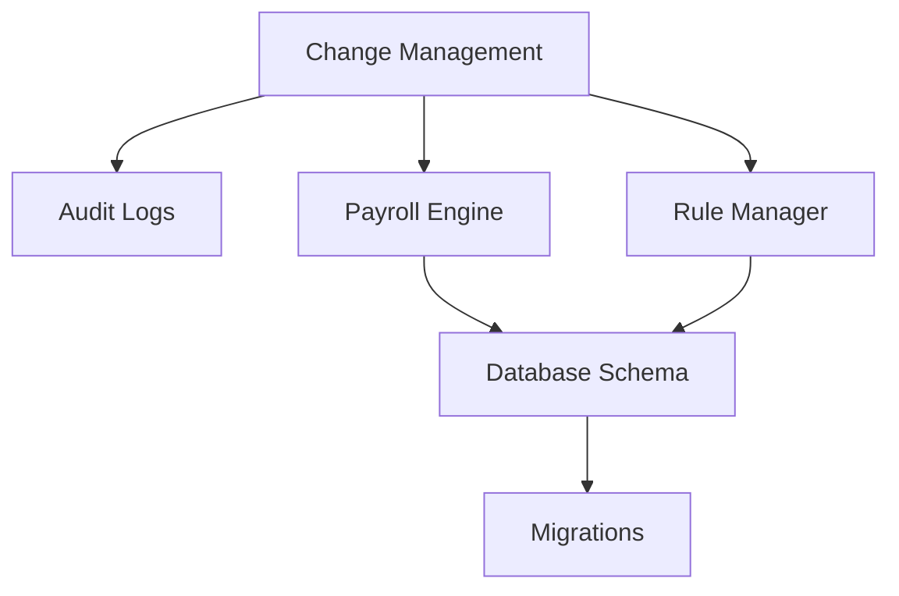

# Change Management Process

<cite>
**Referenced Files in This Document**
- [AGENTS.md](file://AGENTS.md)
</cite>

## Table of Contents
1. [Introduction](#introduction)
2. [Project Structure](#project-structure)
3. [Core Components](#core-components)
4. [Architecture Overview](#architecture-overview)
5. [Detailed Component Analysis](#detailed-component-analysis)
6. [Dependency Analysis](#dependency-analysis)
7. [Performance Considerations](#performance-considerations)
8. [Troubleshooting Guide](#troubleshooting-guide)
9. [Conclusion](#conclusion)
10. [Appendices](#appendices)

## Introduction
This document defines the change management process for the xHR Payroll & Finance System. It establishes a five-question evaluation framework to assess the scope and risk of proposed changes, outlines approval and rollback practices, and connects change management to audit and compliance requirements. It also provides guidelines for handling emergency changes, integrating version control, and deploying updates while maintaining system integrity.

## Project Structure
The repository contains a single, authoritative guide that documents the system’s design principles, modules, database conventions, and change management rules. The guide is organized into numbered sections covering project overview, design principles, technology constraints, domain model, agent responsibilities, required modules, database guidelines, business rules, dynamic UI behavior, payslip requirements, audit requirements, coding standards, folder structure guidance, change management rules, anti-patterns, minimum deliverables, definition of done, and final intent.

**Diagram sources**
- [AGENTS.md](file://AGENTS.md)

**Section sources**
- [AGENTS.md](file://AGENTS.md)

## Core Components
- Five-question evaluation framework: Every change must be evaluated against five criteria before merging.
- Approval gating: If any question cannot be answered confidently, merging is prohibited.
- Rollback capability: Data-level history and snapshot mechanisms support rollback.
- Audit and compliance: Comprehensive audit logging and high-priority audit areas define compliance obligations.
- Payroll modes: Multiple payroll modes influence the impact of changes and require targeted validation.

**Section sources**
- [AGENTS.md:650-661](file://AGENTS.md#L650-L661)
- [AGENTS.md:257-271](file://AGENTS.md#L257-L271)
- [AGENTS.md:576-595](file://AGENTS.md#L576-L595)
- [AGENTS.md:123-131](file://AGENTS.md#L123-L131)

## Architecture Overview
The change management process integrates with the system’s audit and compliance agents, payroll engine, and rule manager. Changes are validated against the five-question framework, logged for audit, and executed with rollback capability where applicable.

**Diagram sources**
- [AGENTS.md:650-661](file://AGENTS.md#L650-L661)
- [AGENTS.md:257-271](file://AGENTS.md#L257-L271)
- [AGENTS.md:338-343](file://AGENTS.md#L338-L343)
- [AGENTS.md:344-353](file://AGENTS.md#L344-L353)
- [AGENTS.md:385-435](file://AGENTS.md#L385-L435)

## Detailed Component Analysis

### Five-Question Evaluation Framework
Every proposed change must be assessed against the following questions:
1. Is the change applied at the master level or at the monthly level?
2. Which payroll modes are affected?
3. Does the change impact payslips, reports, or financial summaries?
4. Does the change require additional database migrations?
5. Does the change require additional audit coverage or test coverage?

If any question cannot be answered confidently, merging is prohibited.

**Diagram sources**
- [AGENTS.md:652-659](file://AGENTS.md#L652-L659)

**Section sources**
- [AGENTS.md:652-659](file://AGENTS.md#L652-L659)

### Approval Workflow
- Approval gating ensures that changes are only merged when all five evaluation questions can be answered confidently.
- The policy explicitly prohibits merging changes that cannot be fully evaluated.

**Diagram sources**
- [AGENTS.md:658-659](file://AGENTS.md#L658-L659)

**Section sources**
- [AGENTS.md:658-659](file://AGENTS.md#L658-L659)

### Rollback Capabilities
- Data-level history and rollback capability are required for data integrity.
- Audit logs capture who changed what, when, and why, enabling targeted rollbacks.
- Snapshot rules ensure that finalized payslips are immutable and can be regenerated from historical snapshots.

**Diagram sources**
- [AGENTS.md:259-261](file://AGENTS.md#L259-L261)
- [AGENTS.md:578-586](file://AGENTS.md#L578-L586)
- [AGENTS.md:567-573](file://AGENTS.md#L567-L573)

**Section sources**
- [AGENTS.md:259-261](file://AGENTS.md#L259-L261)
- [AGENTS.md:578-586](file://AGENTS.md#L578-L586)
- [AGENTS.md:567-573](file://AGENTS.md#L567-L573)

### Change Validation Procedures
- Validation is enforced at the service layer and through form requests.
- Validation ensures that changes conform to business rules and schema constraints before being persisted.

**Diagram sources**
- [AGENTS.md:602-605](file://AGENTS.md#L602-L605)

**Section sources**
- [AGENTS.md:602-605](file://AGENTS.md#L602-L605)

### Relationship Between Change Management and Audit Requirements
- Audit requirements mandate logging who, what, when, and why for significant changes.
- High-priority audit areas include salary profiles, payroll item amounts, payslip finalize/unfinalize actions, rule changes, module toggle changes, and SSO configuration changes.
- Audit logs support post-change verification and compliance reporting.

**Diagram sources**
- [AGENTS.md:578-595](file://AGENTS.md#L578-L595)

**Section sources**
- [AGENTS.md:578-595](file://AGENTS.md#L578-L595)

### Emergency Changes
- While the guide does not define explicit emergency procedures, the five-question evaluation framework and approval gating apply universally.
- Emergency changes must still be evaluated against the five questions and approved before merging.
- Rollback capability remains essential for emergency scenarios to restore system stability.

**Section sources**
- [AGENTS.md:652-659](file://AGENTS.md#L652-L659)
- [AGENTS.md:259-261](file://AGENTS.md#L259-L261)

### Version Control Integration
- Database migrations are part of the version-controlled artifact set.
- Migrations must remain compatible with phpMyAdmin/shared hosting environments.
- Migration requirements are part of the five-question evaluation framework.

**Diagram sources**
- [AGENTS.md:180-182](file://AGENTS.md#L180-L182)
- [AGENTS.md:432-434](file://AGENTS.md#L432-L434)
- [AGENTS.md:656](file://AGENTS.md#L656)

**Section sources**
- [AGENTS.md:180-182](file://AGENTS.md#L180-L182)
- [AGENTS.md:432-434](file://AGENTS.md#L432-L434)
- [AGENTS.md:656](file://AGENTS.md#L656)

### Deployment Strategies
- Maintain system integrity by validating changes against the five-question framework and ensuring audit coverage.
- Use snapshot rules to protect finalized payslips and enable regeneration from historical data.
- Ensure that payroll calculations and rule changes are validated across all affected payroll modes.

**Diagram sources**
- [AGENTS.md:652-659](file://AGENTS.md#L652-L659)
- [AGENTS.md:567-573](file://AGENTS.md#L567-L573)
- [AGENTS.md:612-619](file://AGENTS.md#L612-L619)

**Section sources**
- [AGENTS.md:652-659](file://AGENTS.md#L652-L659)
- [AGENTS.md:567-573](file://AGENTS.md#L567-L573)
- [AGENTS.md:612-619](file://AGENTS.md#L612-L619)

## Dependency Analysis
The change management process depends on:
- Audit logging for compliance and rollback support.
- Payroll engine and rule manager for evaluating impacts across payroll modes.
- Database schema and migrations for structural changes.
- Validation mechanisms to prevent invalid changes from persisting.

**Diagram sources**
- [AGENTS.md:578-595](file://AGENTS.md#L578-L595)
- [AGENTS.md:338-343](file://AGENTS.md#L338-L343)
- [AGENTS.md:344-353](file://AGENTS.md#L344-L353)
- [AGENTS.md:385-435](file://AGENTS.md#L385-L435)
- [AGENTS.md:180-182](file://AGENTS.md#L180-L182)

**Section sources**
- [AGENTS.md:578-595](file://AGENTS.md#L578-L595)
- [AGENTS.md:338-343](file://AGENTS.md#L338-L343)
- [AGENTS.md:344-353](file://AGENTS.md#L344-L353)
- [AGENTS.md:385-435](file://AGENTS.md#L385-L435)
- [AGENTS.md:180-182](file://AGENTS.md#L180-L182)

## Performance Considerations
- Audit logging and rollback capability add overhead; ensure logging is efficient and targeted to high-priority audit areas.
- Validation checks should be fast and deterministic to avoid blocking deployments.
- Snapshot rules for finalized payslips reduce runtime computation during PDF generation and improve performance.

[No sources needed since this section provides general guidance]

## Troubleshooting Guide
- If a change cannot be evaluated against the five questions, block the merge until sufficient information is gathered.
- If audit logs are missing or incomplete, investigate the logging mechanism and ensure high-priority audit areas are covered.
- If rollback fails, verify that historical snapshots and audit records are intact and that the rollback procedure targets the correct data.

**Section sources**
- [AGENTS.md:658-659](file://AGENTS.md#L658-L659)
- [AGENTS.md:578-595](file://AGENTS.md#L578-L595)
- [AGENTS.md:567-573](file://AGENTS.md#L567-L573)

## Conclusion
The change management process for the xHR Payroll & Finance System centers on a rigorous five-question evaluation framework, strict approval gating, robust audit and rollback capabilities, and validation procedures. By applying these practices consistently, the system maintains integrity, supports compliance, and enables safe, targeted modifications across multiple payroll modes.

[No sources needed since this section summarizes without analyzing specific files]

## Appendices
- Minimum deliverables and definition of done provide acceptance criteria for changes and ensure system readiness after updates.

**Section sources**
- [AGENTS.md:675-709](file://AGENTS.md#L675-L709)