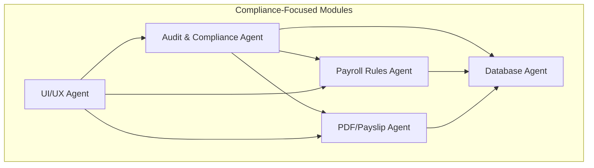
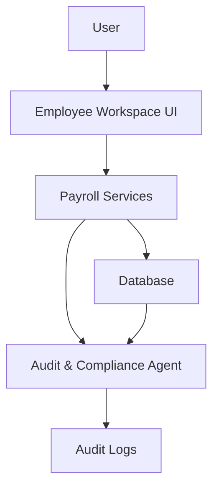
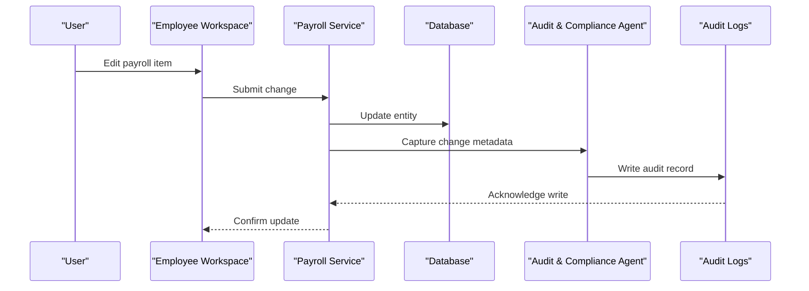
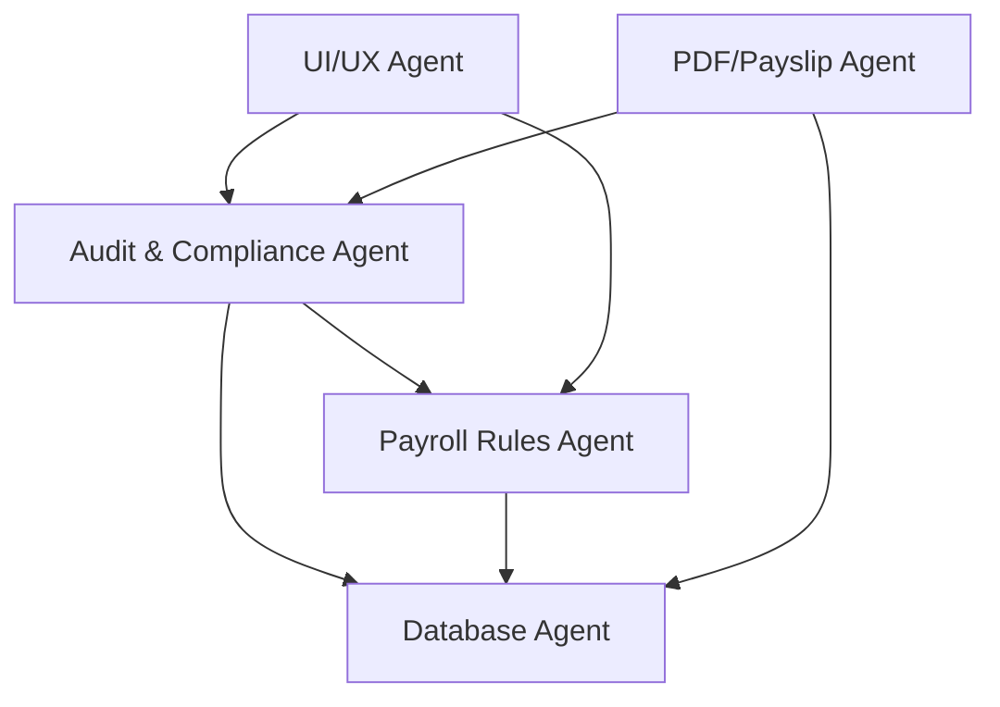

# Compliance Requirements

<cite>
**Referenced Files in This Document**
- [AGENTS.md](file://AGENTS.md)
</cite>

## Table of Contents
1. [Introduction](#introduction)
2. [Project Structure](#project-structure)
3. [Core Components](#core-components)
4. [Architecture Overview](#architecture-overview)
5. [Detailed Component Analysis](#detailed-component-analysis)
6. [Dependency Analysis](#dependency-analysis)
7. [Performance Considerations](#performance-considerations)
8. [Troubleshooting Guide](#troubleshooting-guide)
9. [Conclusion](#conclusion)
10. [Appendices](#appendices)

## Introduction
This document defines the compliance requirements for the xHR Payroll & Finance System, focusing on regulatory compliance obligations, legal frameworks, and industry standards applicable to payroll and finance operations. It documents the relationship between audit logs and regulatory reporting, data protection requirements, and retention policies. It also explains compliance validation processes, audit readiness procedures, and forensic audit preparation capabilities. Coverage includes Thai labor law compliance, social security regulations, tax reporting requirements, and financial statement accuracy. Finally, it addresses data governance policies, privacy considerations, and access control mechanisms required for compliance.

## Project Structure
The system is designed around a rule-driven, record-based architecture with strong auditability and dynamic data entry. The compliance framework is embedded across the system’s agents and modules, ensuring that every change is logged, validated, and traceable.

Key structural elements relevant to compliance:
- Audit-ability and audit logs are foundational design principles.
- Rule-driven configuration enables controlled, auditable changes to payroll logic.
- Single Source of Truth ensures consistent, authoritative data for reporting and audits.
- Dynamic but controlled editing balances usability with compliance controls.

**Diagram sources**
- [AGENTS.md:257-271](file://AGENTS.md#L257-L271)
- [AGENTS.md:196-221](file://AGENTS.md#L196-L221)
- [AGENTS.md:175-195](file://AGENTS.md#L175-L195)
- [AGENTS.md:245-256](file://AGENTS.md#L245-L256)
- [AGENTS.md:222-244](file://AGENTS.md#L222-L244)

**Section sources**
- [AGENTS.md:23-31](file://AGENTS.md#L23-L31)
- [AGENTS.md:49-60](file://AGENTS.md#L49-L60)
- [AGENTS.md:175-195](file://AGENTS.md#L175-L195)
- [AGENTS.md:222-244](file://AGENTS.md#L222-L244)
- [AGENTS.md:245-256](file://AGENTS.md#L245-L256)
- [AGENTS.md:257-271](file://AGENTS.md#L257-L271)

## Core Components
This section outlines the compliance-relevant components and their responsibilities.

- Audit & Compliance Agent
  - Ensures all material changes are captured in audit logs.
  - Controls historical rollbacks at the data level.
  - Logs changes to rules, modules, and configurations.

- Payroll Rules Agent
  - Defines calculable logic per payroll mode.
  - Supports Thailand social security configuration and tax rules.
  - Prevents hardcoded legal values and enforces configurable rules.

- Database Agent
  - Enforces schema conventions suitable for audit and reporting.
  - Provides audit references and timestamps for traceability.
  - Supports phpMyAdmin compatibility for manual inspection and debugging.

- PDF/Payslip Agent
  - Renders payslips from authoritative data snapshots.
  - Prevents live calculations in the UI and enforces snapshot-based rendering.

- UI/UX Agent
  - Presents clear field states and source flags for transparency.
  - Integrates audit timelines and detail inspectors for traceability.

**Section sources**
- [AGENTS.md:196-221](file://AGENTS.md#L196-L221)
- [AGENTS.md:257-271](file://AGENTS.md#L257-L271)
- [AGENTS.md:175-195](file://AGENTS.md#L175-L195)
- [AGENTS.md:245-256](file://AGENTS.md#L245-L256)
- [AGENTS.md:222-244](file://AGENTS.md#L222-L244)

## Architecture Overview
The system architecture embeds compliance controls at every layer. Audit logs capture who changed what, when, and why. Rule managers centralize policy changes, while the database enforces audit references and timestamps. The UI exposes audit trails and source flags to ensure transparency.

**Diagram sources**
- [AGENTS.md:257-271](file://AGENTS.md#L257-L271)
- [AGENTS.md:578-595](file://AGENTS.md#L578-L595)
- [AGENTS.md:385-417](file://AGENTS.md#L385-L417)

**Section sources**
- [AGENTS.md:578-595](file://AGENTS.md#L578-L595)
- [AGENTS.md:385-417](file://AGENTS.md#L385-L417)

## Detailed Component Analysis

### Audit Logging and Regulatory Reporting
Audit logs are mandatory for regulatory compliance. They must capture:
- Who performed the action
- What entity and field were affected
- Old and new values
- Action type and timestamp
- Optional reason for changes

High-priority audit areas include:
- Employee salary profile changes
- Payroll item amounts
- Payslip finalize/unfinalize actions
- Rule changes
- Module toggle changes
- Social security configuration changes

These logs support regulatory reporting by providing an immutable trail of decisions and calculations.

**Diagram sources**
- [AGENTS.md:578-595](file://AGENTS.md#L578-L595)
- [AGENTS.md:257-271](file://AGENTS.md#L257-L271)

**Section sources**
- [AGENTS.md:578-595](file://AGENTS.md#L578-L595)
- [AGENTS.md:257-271](file://AGENTS.md#L257-L271)

### Data Protection and Privacy Considerations
Data protection and privacy are addressed through:
- Controlled editing with explicit source flags (auto, manual, override, master)
- Permission controls integrated into the UI and backend
- Validation layers to prevent unauthorized or incorrect changes
- Snapshot-based payslip rendering to prevent tampering

Privacy-sensitive data is stored in dedicated tables with audit references and timestamps, enabling traceability without exposing raw data unnecessarily.

**Section sources**
- [AGENTS.md:86-91](file://AGENTS.md#L86-L91)
- [AGENTS.md:222-244](file://AGENTS.md#L222-L244)
- [AGENTS.md:245-256](file://AGENTS.md#L245-L256)
- [AGENTS.md:385-417](file://AGENTS.md#L385-L417)

### Access Control Mechanisms
Access control is enforced via:
- Role and permission systems
- Field-level state indicators (locked, auto, manual, override)
- Explicit approval workflows for sensitive changes
- UI detail inspectors that show audit history and reasons

These mechanisms ensure least privilege and provide evidence of approvals during audits.

**Section sources**
- [AGENTS.md:288-293](file://AGENTS.md#L288-L293)
- [AGENTS.md:528-538](file://AGENTS.md#L528-L538)
- [AGENTS.md:540-546](file://AGENTS.md#L540-L546)

### Thai Labor Law Compliance
The system supports Thai labor law compliance through:
- Configurable social security contributions with effective date support
- Allowance for diligence bonuses and performance thresholds
- Clear separation between income and deduction categories
- Snapshot-based payslips to prevent retroactive changes

Rules for Thailand social security include configurable rates, salary ceilings, and maximum monthly contributions.

**Section sources**
- [AGENTS.md:488-497](file://AGENTS.md#L488-L497)
- [AGENTS.md:440-444](file://AGENTS.md#L440-L444)
- [AGENTS.md:217-221](file://AGENTS.md#L217-L221)

### Social Security Regulations
Social security configuration must be:
- Effective-date aware
- Fully configurable
- Logged in audit logs
- Integrated with payslip calculations

This ensures compliance with changing statutory requirements and provides a verifiable audit trail.

**Section sources**
- [AGENTS.md:488-497](file://AGENTS.md#L488-L497)
- [AGENTS.md:588-595](file://AGENTS.md#L588-L595)

### Tax Reporting Requirements
Tax-related capabilities include:
- Tax rules configuration
- Tax simulation in company finance summaries
- Snapshot-based payslips for tax reporting accuracy

These features support accurate tax reporting and reduce risk of discrepancies.

**Section sources**
- [AGENTS.md:351-352](file://AGENTS.md#L351-L352)
- [AGENTS.md:373-374](file://AGENTS.md#L373-L374)
- [AGENTS.md:567-573](file://AGENTS.md#L567-L573)

### Financial Statement Accuracy
Financial reporting accuracy is ensured by:
- Centralized rule management for income and expense items
- Company finance summary with revenue, expenses, profit/loss, and quarterly views
- Snapshot-based payslips and payroll items for auditability

These mechanisms support reliable financial statements and reduce reclassification risks.

**Section sources**
- [AGENTS.md:367-375](file://AGENTS.md#L367-L375)
- [AGENTS.md:567-573](file://AGENTS.md#L567-L573)

### Data Governance Policies
Data governance is enforced through:
- Single Source of Truth for all core entities
- Schema conventions that improve readability and auditability
- Soft deletes and timestamps for historical tracking
- Audit references embedded in relevant tables

These policies ensure data integrity, traceability, and compliance with regulatory expectations.

**Section sources**
- [AGENTS.md:49-60](file://AGENTS.md#L49-L60)
- [AGENTS.md:418-427](file://AGENTS.md#L418-L427)
- [AGENTS.md:184-195](file://AGENTS.md#L184-L195)

### Retention Policies
Retention policies should align with regulatory requirements and internal governance. While specific retention periods are not defined in the repository, the system’s audit logs and snapshot-based data model support:
- Long-term storage of authoritative records
- Historical reconstruction of changes
- Compliance-ready archives for audits and inspections

Organizations should define retention schedules based on local regulations and integrate them with the system’s audit and snapshot mechanisms.

**Section sources**
- [AGENTS.md:578-595](file://AGENTS.md#L578-L595)
- [AGENTS.md:567-573](file://AGENTS.md#L567-L573)

### Compliance Validation Processes
Validation processes include:
- Unit tests for payroll modes, social security calculations, layer rates, payslip snapshots, and audit logging
- Change management rules requiring five key questions before merging changes
- Continuous validation of rule-driven logic against configured rules

These processes ensure that compliance-critical logic remains accurate and auditable.

**Section sources**
- [AGENTS.md:612-619](file://AGENTS.md#L612-L619)
- [AGENTS.md:650-660](file://AGENTS.md#L650-L660)

### Audit Readiness Procedures
Audit readiness is supported by:
- Comprehensive audit logs with full metadata
- UI detail inspectors showing audit history and reasons
- Snapshot-based payslips and payroll items
- Centralized rule management with audit coverage

These features streamline audit preparation and minimize discovery risk.

**Section sources**
- [AGENTS.md:540-546](file://AGENTS.md#L540-L546)
- [AGENTS.md:567-573](file://AGENTS.md#L567-L573)
- [AGENTS.md:578-595](file://AGENTS.md#L578-L595)

### Forensic Audit Preparation Capabilities
Forensic readiness is enabled by:
- Full audit trails with timestamps and reasons
- Rollback capability at the data level
- Snapshot-based data to prevent tampering
- Detailed inspectors showing source and formula/rule origins

These capabilities support forensic investigations and regulatory enforcement actions.

**Section sources**
- [AGENTS.md:257-271](file://AGENTS.md#L257-L271)
- [AGENTS.md:567-573](file://AGENTS.md#L567-L573)
- [AGENTS.md:540-546](file://AGENTS.md#L540-L546)

## Dependency Analysis
Compliance depends on tight coupling between:
- Audit logging and rule management
- Database schema and audit references
- UI transparency and audit visibility
- Payroll services and snapshot-based rendering

**Diagram sources**
- [AGENTS.md:196-221](file://AGENTS.md#L196-L221)
- [AGENTS.md:175-195](file://AGENTS.md#L175-L195)
- [AGENTS.md:222-244](file://AGENTS.md#L222-L244)
- [AGENTS.md:245-256](file://AGENTS.md#L245-L256)
- [AGENTS.md:257-271](file://AGENTS.md#L257-L271)

**Section sources**
- [AGENTS.md:196-221](file://AGENTS.md#L196-L221)
- [AGENTS.md:175-195](file://AGENTS.md#L175-L195)
- [AGENTS.md:222-244](file://AGENTS.md#L222-L244)
- [AGENTS.md:245-256](file://AGENTS.md#L245-L256)
- [AGENTS.md:257-271](file://AGENTS.md#L257-L271)

## Performance Considerations
- Audit logging overhead should be minimized through efficient writes and indexing on audit logs.
- Snapshot-based rendering reduces real-time computation but increases storage; balance storage and retrieval performance.
- Rule-driven calculations should be cached where appropriate to reduce repeated computations.

[No sources needed since this section provides general guidance]

## Troubleshooting Guide
Common compliance-related issues and resolutions:
- Missing audit entries: Verify audit logging is enabled and that high-priority areas are covered.
- Unauthorized changes: Review permission controls and field states; ensure locked fields remain protected.
- Inconsistent payslips: Confirm snapshot-based rendering is used and that finalized items are not editable.
- Rule misconfiguration: Use the rule manager to validate and reapply rules; check audit logs for recent changes.

**Section sources**
- [AGENTS.md:578-595](file://AGENTS.md#L578-L595)
- [AGENTS.md:288-293](file://AGENTS.md#L288-L293)
- [AGENTS.md:567-573](file://AGENTS.md#L567-L573)
- [AGENTS.md:344-353](file://AGENTS.md#L344-L353)

## Conclusion
The xHR Payroll & Finance System embeds compliance into its architecture through rule-driven logic, robust audit logging, snapshot-based data, and transparent UI controls. These features collectively support Thai labor law compliance, social security regulations, tax reporting, and financial statement accuracy, while ensuring data governance, privacy, and access control meet regulatory expectations. Organizations can rely on the system’s built-in auditability and forensic readiness to satisfy audits and enforcement actions.

[No sources needed since this section summarizes without analyzing specific files]

## Appendices
- Minimum deliverables include project structure, database schema, migrations, seed data, model relationships, payroll services, rule manager, employee workspace UI, payslip builder + PDF, audit logs, annual summary, and company finance summary.

**Section sources**
- [AGENTS.md:675-690](file://AGENTS.md#L675-L690)