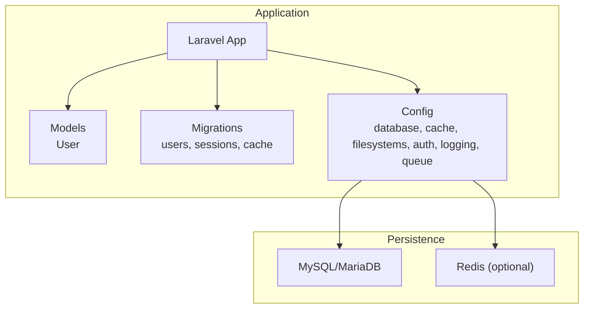
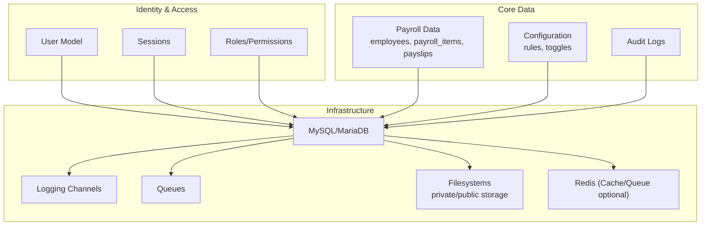
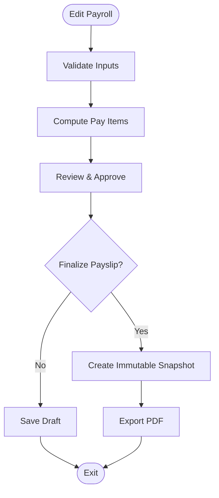
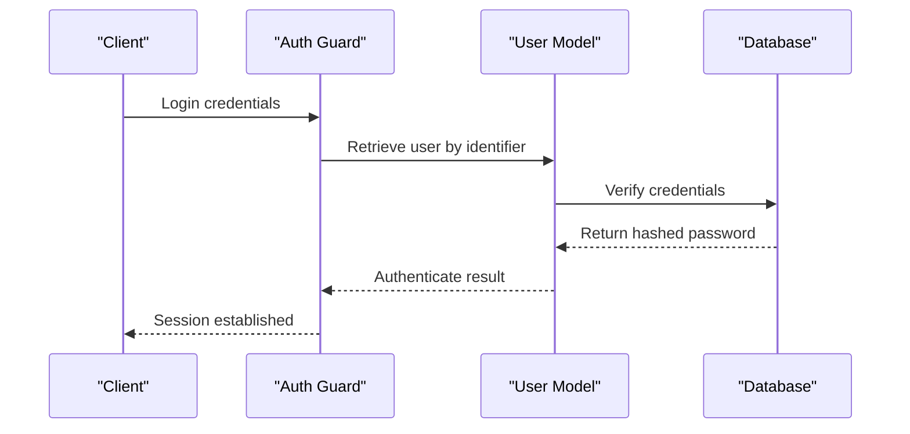
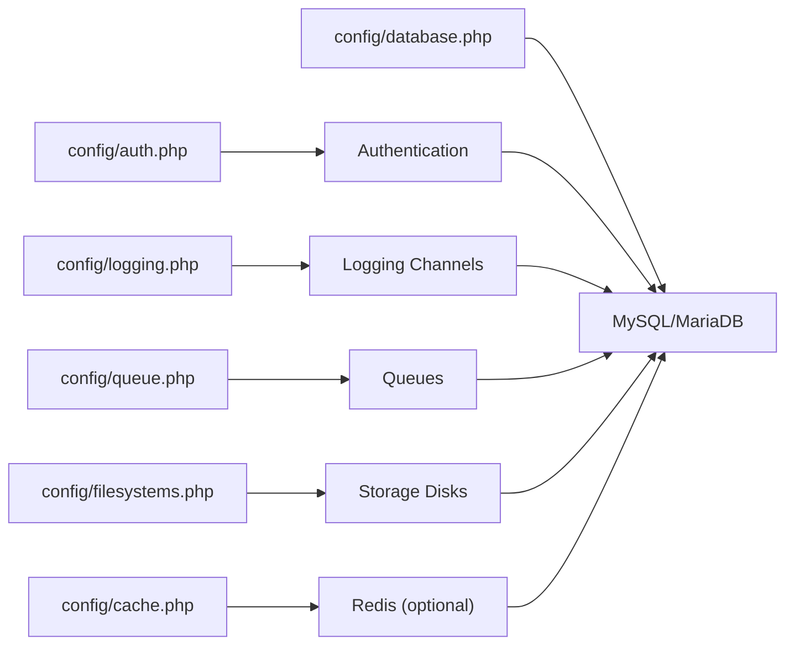

# Data Governance and Retention

<cite>
**Referenced Files in This Document**
- [AGENTS.md](file://AGENTS.md)
- [composer.json](file://laravel-temp/composer.json)
- [config/database.php](file://laravel-temp/config/database.php)
- [config/cache.php](file://laravel-temp/config/cache.php)
- [config/filesystems.php](file://laravel-temp/config/filesystems.php)
- [config/auth.php](file://laravel-temp/config/auth.php)
- [config/logging.php](file://laravel-temp/config/logging.php)
- [config/queue.php](file://laravel-temp/config/queue.php)
- [app/Models/User.php](file://laravel-temp/app/Models/User.php)
- [database/migrations/0001_01_01_000000_create_users_table.php](file://laravel-temp/database/migrations/0001_01_01_000000_create_users_table.php)
- [database/migrations/0001_01_01_000001_create_cache_table.php](file://laravel-temp/database/migrations/0001_01_01_000001_create_cache_table.php)
</cite>

## Table of Contents
1. [Introduction](#introduction)
2. [Project Structure](#project-structure)
3. [Core Components](#core-components)
4. [Architecture Overview](#architecture-overview)
5. [Detailed Component Analysis](#detailed-component-analysis)
6. [Dependency Analysis](#dependency-analysis)
7. [Performance Considerations](#performance-considerations)
8. [Troubleshooting Guide](#troubleshooting-guide)
9. [Conclusion](#conclusion)
10. [Appendices](#appendices)

## Introduction
This document defines data governance and retention policies for the xHR Payroll & Finance System. It covers data lifecycle management, archival strategies, access control, retention schedules for payroll data, audit logs, and configuration information, along with data classification, sensitivity levels, data minimization, secure deletion, compliance readiness, backup and disaster recovery, and data integrity verification.

## Project Structure
The system is a Laravel application with a MySQL-compatible persistence model and explicit audit and logging configurations. The repository includes:
- A comprehensive domain specification and data governance guide
- Laravel configuration for database, cache, filesystems, authentication, logging, and queues
- Eloquent models and migrations for core entities and audit trails

**Diagram sources**
- [composer.json:1-86](file://laravel-temp/composer.json#L1-L86)
- [config/database.php:1-185](file://laravel-temp/config/database.php#L1-L185)
- [config/cache.php:1-131](file://laravel-temp/config/cache.php#L1-L131)
- [config/filesystems.php:1-81](file://laravel-temp/config/filesystems.php#L1-L81)
- [config/auth.php:1-118](file://laravel-temp/config/auth.php#L1-L118)
- [config/logging.php:1-133](file://laravel-temp/config/logging.php#L1-L133)
- [config/queue.php:1-130](file://laravel-temp/config/queue.php#L1-L130)
- [app/Models/User.php:1-33](file://laravel-temp/app/Models/User.php#L1-L33)
- [database/migrations/0001_01_01_000000_create_users_table.php:1-50](file://laravel-temp/database/migrations/0001_01_01_000000_create_users_table.php#L1-L50)
- [database/migrations/0001_01_01_000001_create_cache_table.php:1-36](file://laravel-temp/database/migrations/0001_01_01_000001_create_cache_table.php#L1-L36)

**Section sources**
- [AGENTS.md:1-721](file://AGENTS.md#L1-L721)
- [composer.json:1-86](file://laravel-temp/composer.json#L1-L86)
- [config/database.php:1-185](file://laravel-temp/config/database.php#L1-L185)
- [config/cache.php:1-131](file://laravel-temp/config/cache.php#L1-L131)
- [config/filesystems.php:1-81](file://laravel-temp/config/filesystems.php#L1-L81)
- [config/auth.php:1-118](file://laravel-temp/config/auth.php#L1-L118)
- [config/logging.php:1-133](file://laravel-temp/config/logging.php#L1-L133)
- [config/queue.php:1-130](file://laravel-temp/config/queue.php#L1-L130)
- [app/Models/User.php:1-33](file://laravel-temp/app/Models/User.php#L1-L33)
- [database/migrations/0001_01_01_000000_create_users_table.php:1-50](file://laravel-temp/database/migrations/0001_01_01_000000_create_users_table.php#L1-L50)
- [database/migrations/0001_01_01_000001_create_cache_table.php:1-36](file://laravel-temp/database/migrations/0001_01_01_000001_create_cache_table.php#L1-L36)

## Core Components
- Data lifecycle: Defined by record-based persistence, audit logging, and immutable snapshots for payslips.
- Archival: Use long-term storage and offload strategies for historical payroll and audit records.
- Access control: Role-based permissions, session management, and strong authentication.
- Retention: Define schedules per data category aligned with legal and business needs.
- Classification: Sensitive personal data, financial data, and administrative metadata.
- Minimization: Collect only necessary data; avoid hardcoded values; keep configuration dynamic.
- Secure deletion: Implement soft deletes where appropriate and secure purge for sensitive data.
- Compliance: Align with data protection principles; maintain audit trails; support data subject requests.

**Section sources**
- [AGENTS.md:34-100](file://AGENTS.md#L34-L100)
- [AGENTS.md:576-596](file://AGENTS.md#L576-L596)
- [AGENTS.md:598-620](file://AGENTS.md#L598-L620)
- [AGENTS.md:650-661](file://AGENTS.md#L650-L661)
- [AGENTS.md:675-709](file://AGENTS.md#L675-L709)

## Architecture Overview
The system’s data governance architecture integrates Laravel configuration with database and caching backends, enforcing access control, auditability, and operational resilience.

**Diagram sources**
- [app/Models/User.php:1-33](file://laravel-temp/app/Models/User.php#L1-L33)
- [database/migrations/0001_01_01_000000_create_users_table.php:1-50](file://laravel-temp/database/migrations/0001_01_01_000000_create_users_table.php#L1-L50)
- [config/database.php:1-185](file://laravel-temp/config/database.php#L1-L185)
- [config/cache.php:1-131](file://laravel-temp/config/cache.php#L1-L131)
- [config/filesystems.php:1-81](file://laravel-temp/config/filesystems.php#L1-L81)
- [config/logging.php:1-133](file://laravel-temp/config/logging.php#L1-L133)
- [config/queue.php:1-130](file://laravel-temp/config/queue.php#L1-L130)

## Detailed Component Analysis

### Data Lifecycle Management
- Record-based persistence ensures each change is tracked and auditable.
- Immutable payslip snapshots prevent retroactive alterations.
- Controlled editing with explicit state flags supports transparency and traceability.

**Diagram sources**
- [AGENTS.md:513-527](file://AGENTS.md#L513-L527)
- [AGENTS.md:567-573](file://AGENTS.md#L567-L573)

**Section sources**
- [AGENTS.md:36-91](file://AGENTS.md#L36-L91)
- [AGENTS.md:567-573](file://AGENTS.md#L567-L573)

### Archival Strategies
- Archive historical payroll batches and finalized payslips to long-term storage.
- Maintain separate cold storage for compliance periods exceeding active retention.
- Use database partitioning or external systems for large-scale historical datasets.

[No sources needed since this section provides general guidance]

### Access Control Mechanisms
- Authentication via Eloquent user provider with hashed passwords and session management.
- Authorization through roles and permissions; enforce RBAC at controller and policy levels.
- Session security with IP/user-agent payload and last activity indexing.

**Diagram sources**
- [config/auth.php:18-74](file://laravel-temp/config/auth.php#L18-L74)
- [app/Models/User.php:25-31](file://laravel-temp/app/Models/User.php#L25-L31)
- [database/migrations/0001_01_01_000000_create_users_table.php:14-37](file://laravel-temp/database/migrations/0001_01_01_000000_create_users_table.php#L14-L37)

**Section sources**
- [config/auth.php:1-118](file://laravel-temp/config/auth.php#L1-L118)
- [app/Models/User.php:1-33](file://laravel-temp/app/Models/User.php#L1-L33)
- [database/migrations/0001_01_01_000000_create_users_table.php:1-50](file://laravel-temp/database/migrations/0001_01_01_000000_create_users_table.php#L1-L50)

### Retention Schedules
Define retention periods aligned with legal obligations and business needs. The following categories illustrate typical retention horizons; adjust per jurisdiction and organizational policy.

- Employee profiles and payroll items: 7 years post-employment or as required by tax authority.
- Finalized payslips: 7 years to satisfy labor and tax audits.
- Audit logs: 3–7 years depending on risk classification.
- Configuration rules and module toggles: 3–5 years after deactivation.
- Authentication logs and sessions: 90 days to 1 year for security investigations.
- Financial summaries and reports: 7 years to align with accounting standards.

[No sources needed since this section provides general guidance]

### Data Classification and Sensitivity Levels
- Highly sensitive: Personal identification, bank account details, social security numbers, compensation data.
- Sensitive: Attendance logs, performance metrics, bonus calculations.
- Internal: Configuration rules, module toggles, system settings.
- Public: Summaries and non-sensitive dashboards.

[No sources needed since this section provides general guidance]

### Data Minimization and Handling Procedures
- Collect only necessary personal data; avoid magic numbers; centralize configuration.
- Enforce strict validation and sanitization; apply least privilege access.
- Document handling procedures for data subject requests (withdrawal, portability, erasure).

**Section sources**
- [AGENTS.md:112-118](file://AGENTS.md#L112-L118)
- [AGENTS.md:663-672](file://AGENTS.md#L663-L672)

### Secure Deletion Processes
- Soft delete pattern for entities where history is required; hard purge for sensitive records upon expiration.
- Secure overwrite and cryptographic erasure for files in private storage.
- Purge sessions and cached sensitive data after consent withdrawal or retention expiry.

[No sources needed since this section provides general guidance]

### Compliance with Data Protection Regulations
- Maintain audit trails for all high-risk changes (salary profile, payslip finalize, rule changes).
- Support data subject rights with automated reporting and deletion workflows.
- Apply pseudonymization and encryption for sensitive data at rest and in transit.

**Section sources**
- [AGENTS.md:578-595](file://AGENTS.md#L578-L595)

### Backup and Disaster Recovery
- Database backups: Automated daily/full incremental with point-in-time recovery.
- File storage: Back up private documents and generated PDFs; validate restore procedures.
- Offsite storage: Encrypt and transfer backups to remote vaults.
- DR testing: Regular failover drills for database and application tiers.

[No sources needed since this section provides general guidance]

### Data Integrity Verification
- Hash-based integrity checks for critical files and exports.
- Database checksums for audit records and payroll snapshots.
- Periodic reconciliation of cache and database for consistency.

[No sources needed since this section provides general guidance]

## Dependency Analysis
The application depends on Laravel’s configuration subsystem to coordinate persistence, caching, filesystems, authentication, logging, and queues.

**Diagram sources**
- [config/database.php:1-185](file://laravel-temp/config/database.php#L1-L185)
- [config/cache.php:1-131](file://laravel-temp/config/cache.php#L1-L131)
- [config/filesystems.php:1-81](file://laravel-temp/config/filesystems.php#L1-L81)
- [config/auth.php:1-118](file://laravel-temp/config/auth.php#L1-L118)
- [config/logging.php:1-133](file://laravel-temp/config/logging.php#L1-L133)
- [config/queue.php:1-130](file://laravel-temp/config/queue.php#L1-L130)

**Section sources**
- [config/database.php:1-185](file://laravel-temp/config/database.php#L1-L185)
- [config/cache.php:1-131](file://laravel-temp/config/cache.php#L1-L131)
- [config/filesystems.php:1-81](file://laravel-temp/config/filesystems.php#L1-L81)
- [config/auth.php:1-118](file://laravel-temp/config/auth.php#L1-L118)
- [config/logging.php:1-133](file://laravel-temp/config/logging.php#L1-L133)
- [config/queue.php:1-130](file://laravel-temp/config/queue.php#L1-L130)

## Performance Considerations
- Use indexed foreign keys and appropriate data types for high-volume payroll entities.
- Employ database and Redis-backed caching judiciously; set TTLs aligned with retention.
- Batch audit writes and offload heavy computations to queues.

[No sources needed since this section provides general guidance]

## Troubleshooting Guide
- Authentication failures: Verify user existence, hashed password, and session integrity.
- Audit gaps: Confirm logging channel configuration and database connectivity.
- Cache inconsistencies: Validate cache store configuration and lock tables.
- Queue backlogs: Monitor failed job storage and retry policies.

**Section sources**
- [config/auth.php:18-74](file://laravel-temp/config/auth.php#L18-L74)
- [config/logging.php:53-132](file://laravel-temp/config/logging.php#L53-L132)
- [config/cache.php:35-102](file://laravel-temp/config/cache.php#L35-L102)
- [config/queue.php:32-128](file://laravel-temp/config/queue.php#L32-L128)

## Conclusion
The xHR Payroll & Finance System establishes a robust foundation for data governance through record-based persistence, explicit audit logging, configurable access control, and modular infrastructure. Align retention schedules with legal and business requirements, classify data appropriately, and implement secure deletion and integrity verification to meet compliance goals.

[No sources needed since this section summarizes without analyzing specific files]

## Appendices

### Appendix A: Audit Logging Requirements
- Capture identity, entity, field, old/new values, action, timestamp, and optional reason.
- Focus high-priority areas: salary profile, payslip finalize/unfinalize, rule/module changes, SSO config.

**Section sources**
- [AGENTS.md:578-595](file://AGENTS.md#L578-L595)

### Appendix B: Database and Cache Configuration References
- Database connections: SQLite, MySQL, MariaDB, PostgreSQL, SQL Server.
- Cache stores: array, database, file, memcached, redis, dynamodb, octane, failover.
- Filesystems: local, FTP, SFTP, S3.
- Queues: sync, database, beanstalkd, SQS, redis, deferred, background, failover.

**Section sources**
- [config/database.php:33-117](file://laravel-temp/config/database.php#L33-L117)
- [config/cache.php:35-102](file://laravel-temp/config/cache.php#L35-L102)
- [config/filesystems.php:31-63](file://laravel-temp/config/filesystems.php#L31-L63)
- [config/queue.php:32-92](file://laravel-temp/config/queue.php#L32-L92)