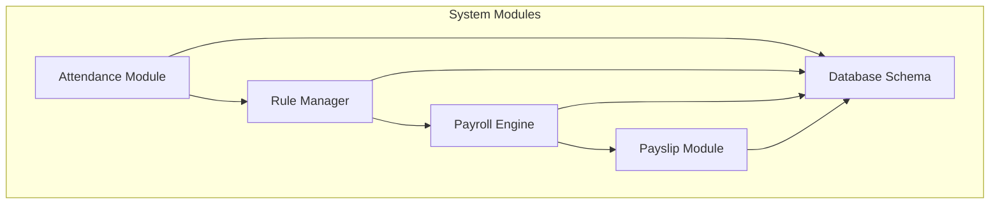
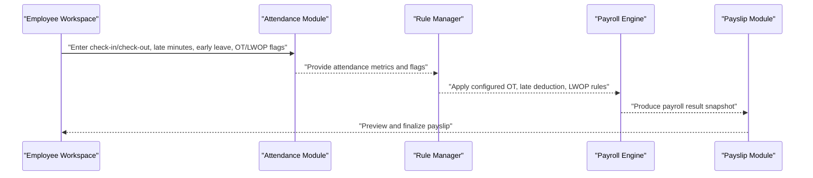
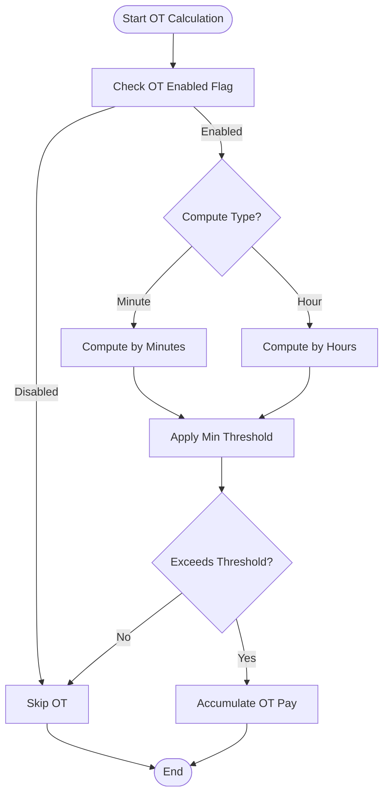
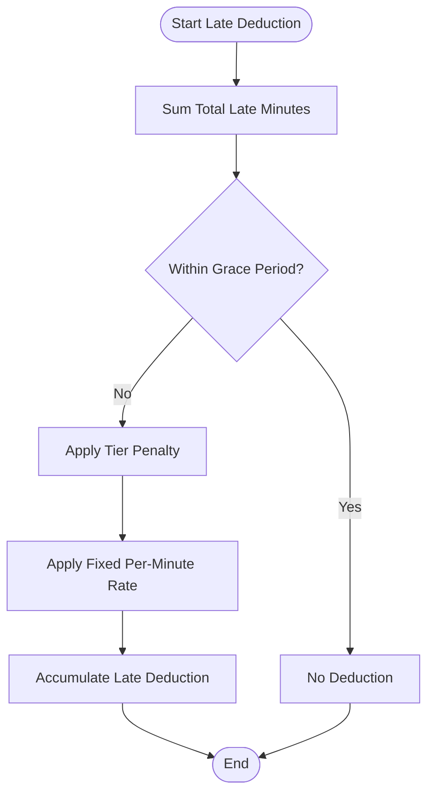
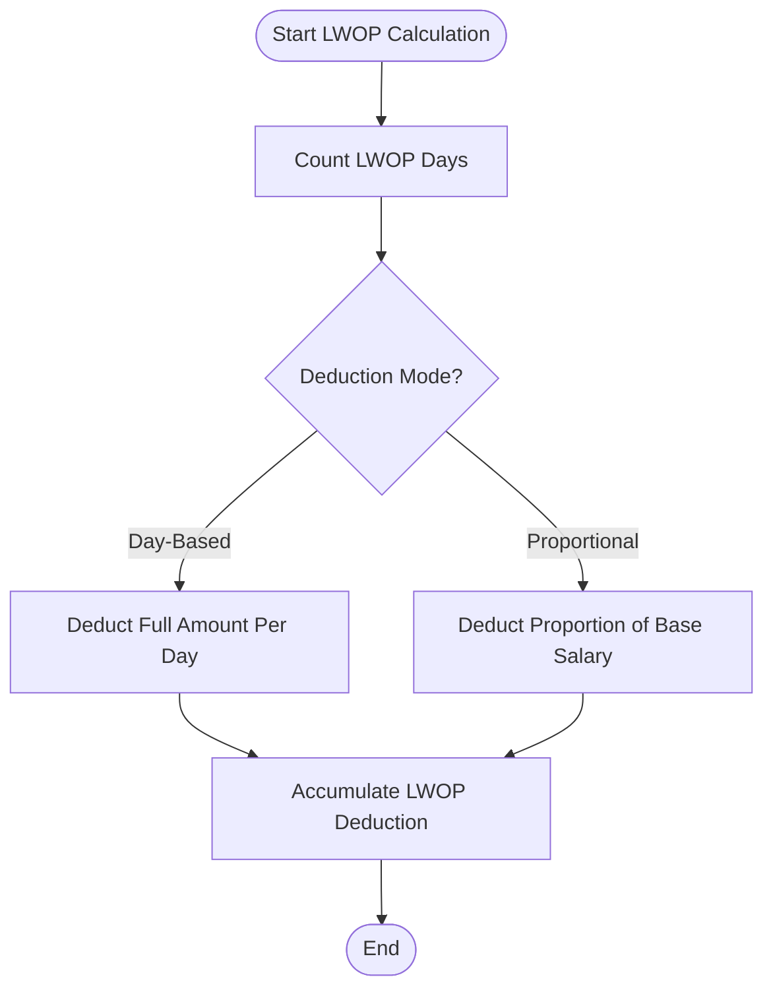
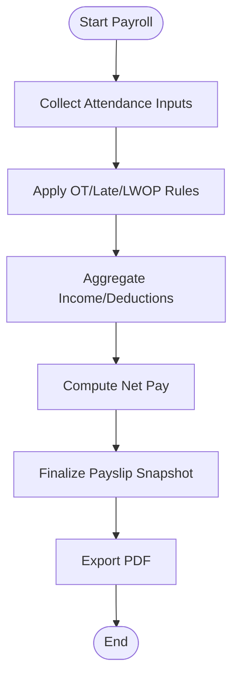
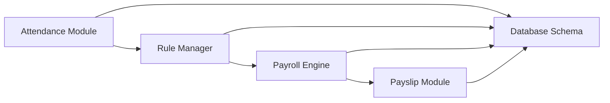

# Attendance Rules

<cite>
**Referenced Files in This Document**
- [AGENTS.md](file://AGENTS.md)
</cite>

## Table of Contents
1. [Introduction](#introduction)
2. [Project Structure](#project-structure)
3. [Core Components](#core-components)
4. [Architecture Overview](#architecture-overview)
5. [Detailed Component Analysis](#detailed-component-analysis)
6. [Dependency Analysis](#dependency-analysis)
7. [Performance Considerations](#performance-considerations)
8. [Troubleshooting Guide](#troubleshooting-guide)
9. [Conclusion](#conclusion)

## Introduction
This document describes the attendance rules system within the xHR Payroll & Finance System. It focuses on how attendance data influences payroll calculations, specifically:
- Overtime (OT) computation rules (minute/hour-based, minimum thresholds, enable flags)
- Late deduction rules (fixed per-minute penalties, tier-based penalties, grace periods)
- Leave Without Pay (LWOP) rules (day-based deductions and proportional salary deductions)
- Integration with payroll processing and impact on net pay

The system is designed to be rule-driven, configurable, and audit-enabled, with clear separation of concerns across modules and services.

## Project Structure
The repository defines the overall system design and module responsibilities. The attendance rules are part of the broader payroll engine and rule manager subsystems.

**Diagram sources**
- [AGENTS.md: 322-352:322-352](file://AGENTS.md#L322-L352)
- [AGENTS.md: 338-343:338-343](file://AGENTS.md#L338-L343)
- [AGENTS.md: 354-359:354-359](file://AGENTS.md#L354-L359)

**Section sources**
- [AGENTS.md: 322-352:322-352](file://AGENTS.md#L322-L352)
- [AGENTS.md: 338-343:338-343](file://AGENTS.md#L338-L343)
- [AGENTS.md: 354-359:354-359](file://AGENTS.md#L354-L359)

## Core Components
- Attendance Module: Captures check-in/check-out, late minutes, early leave, OT enable flag, and LWOP flag.
- Rule Manager: Manages attendance rules, OT rules, bonus rules, threshold rules, layer rate rules, SSO rules, tax rules, and module toggles.
- Payroll Engine: Calculates payroll by mode, aggregates income/deductions, supports manual override, and produces a payroll result snapshot.
- Payslip Module: Renders payslips from finalized data, supports PDF export, and enforces snapshot rules.

These components collectively ensure that attendance inputs are transformed into accurate payroll outcomes.

**Section sources**
- [AGENTS.md: 322-328:322-328](file://AGENTS.md#L322-L328)
- [AGENTS.md: 344-352:344-352](file://AGENTS.md#L344-L352)
- [AGENTS.md: 338-343:338-343](file://AGENTS.md#L338-L343)
- [AGENTS.md: 354-359:354-359](file://AGENTS.md#L354-L359)

## Architecture Overview
The attendance rules integrate with the payroll pipeline as follows:

**Diagram sources**
- [AGENTS.md: 322-328:322-328](file://AGENTS.md#L322-L328)
- [AGENTS.md: 344-352:344-352](file://AGENTS.md#L344-L352)
- [AGENTS.md: 338-343:338-343](file://AGENTS.md#L338-L343)
- [AGENTS.md: 354-359:354-359](file://AGENTS.md#L354-L359)

## Detailed Component Analysis

### Overtime (OT) Calculation Rules
OT rules support:
- Minute-based OT
- Hour-based OT
- Minimum threshold (only compute OT if exceeded)
- Enable flag (OT must be explicitly enabled)

Configuration and behavior are managed via the Rule Manager and applied during payroll calculation.

**Diagram sources**
- [AGENTS.md: 454-460:454-460](file://AGENTS.md#L454-L460)
- [AGENTS.md: 344-352:344-352](file://AGENTS.md#L344-L352)

**Section sources**
- [AGENTS.md: 454-460:454-460](file://AGENTS.md#L454-L460)
- [AGENTS.md: 344-352:344-352](file://AGENTS.md#L344-L352)

### Late Deduction Rules
Late deduction supports:
- Fixed per-minute penalty
- Tier-based penalties
- Grace period (no deduction up to a threshold)

These rules are configured in the Rule Manager and enforced during payroll calculation.

**Diagram sources**
- [AGENTS.md: 461-466:461-466](file://AGENTS.md#L461-L466)
- [AGENTS.md: 344-352:344-352](file://AGENTS.md#L344-L352)

**Section sources**
- [AGENTS.md: 461-466:461-466](file://AGENTS.md#L461-L466)
- [AGENTS.md: 344-352:344-352](file://AGENTS.md#L344-L352)

### LWOP (Leave Without Pay) Rules
LWOP supports:
- Day-based deduction
- Proportional salary deduction

These rules are configured in the Rule Manager and applied during payroll calculation.

**Diagram sources**
- [AGENTS.md: 467-471:467-471](file://AGENTS.md#L467-L471)
- [AGENTS.md: 344-352:344-352](file://AGENTS.md#L344-L352)

**Section sources**
- [AGENTS.md: 467-471:467-471](file://AGENTS.md#L467-L471)
- [AGENTS.md: 344-352:344-352](file://AGENTS.md#L344-L352)

### Integration With Payroll Processing and Net Pay
The payroll engine aggregates income and deductions, including OT, late deduction, and LWOP, to compute net pay. The payslip module renders the final result and enforces snapshot rules.

**Diagram sources**
- [AGENTS.md: 440-444:440-444](file://AGENTS.md#L440-L444)
- [AGENTS.md: 338-343:338-343](file://AGENTS.md#L338-L343)
- [AGENTS.md: 354-359:354-359](file://AGENTS.md#L354-L359)

**Section sources**
- [AGENTS.md: 440-444:440-444](file://AGENTS.md#L440-L444)
- [AGENTS.md: 338-343:338-343](file://AGENTS.md#L338-L343)
- [AGENTS.md: 354-359:354-359](file://AGENTS.md#L354-L359)

## Dependency Analysis
The attendance rules depend on:
- Attendance Module inputs (check-in/check-out, late minutes, early leave, OT/LWOP flags)
- Rule Manager configuration (OT rules, late deduction rules, LWOP rules)
- Payroll Engine for aggregation and net pay computation
- Payslip Module for rendering and snapshotting

**Diagram sources**
- [AGENTS.md: 322-328:322-328](file://AGENTS.md#L322-L328)
- [AGENTS.md: 344-352:344-352](file://AGENTS.md#L344-L352)
- [AGENTS.md: 338-343:338-343](file://AGENTS.md#L338-L343)
- [AGENTS.md: 354-359:354-359](file://AGENTS.md#L354-L359)

**Section sources**
- [AGENTS.md: 322-328:322-328](file://AGENTS.md#L322-L328)
- [AGENTS.md: 344-352:344-352](file://AGENTS.md#L344-L352)
- [AGENTS.md: 338-343:338-343](file://AGENTS.md#L338-L343)
- [AGENTS.md: 354-359:354-359](file://AGENTS.md#L354-L359)

## Performance Considerations
- Keep attendance inputs minimal and structured to reduce rule evaluation overhead.
- Use module toggles to disable expensive rule evaluations when not needed.
- Ensure database indices on frequently queried fields (e.g., employee_id, payroll_batch_id) to speed up aggregation.

## Troubleshooting Guide
Common issues and resolutions:
- OT not computed: Verify the OT enable flag and minimum threshold configuration in the Rule Manager.
- Late deduction not applied: Confirm grace period and tier settings; ensure late minutes exceed grace threshold.
- LWOP not deducted: Check LWOP mode (day-based vs. proportional) and ensure LWOP days are recorded.
- Net pay incorrect: Review the aggregation of income and deductions; confirm snapshot correctness in the Payslip Module.

Audit logs track changes to rules and payroll items, aiding in diagnosing discrepancies.

**Section sources**
- [AGENTS.md: 576-595:576-595](file://AGENTS.md#L576-L595)
- [AGENTS.md: 344-352:344-352](file://AGENTS.md#L344-L352)
- [AGENTS.md: 354-359:354-359](file://AGENTS.md#L354-L359)

## Conclusion
The attendance rules system is designed to be configurable, rule-driven, and audit-enabled. By separating concerns across the Attendance Module, Rule Manager, Payroll Engine, and Payslip Module, the system ensures accurate and transparent payroll outcomes influenced by attendance data. Proper configuration of OT, late deduction, and LWOP rules, combined with careful auditing and snapshotting, guarantees reliable net pay computations.