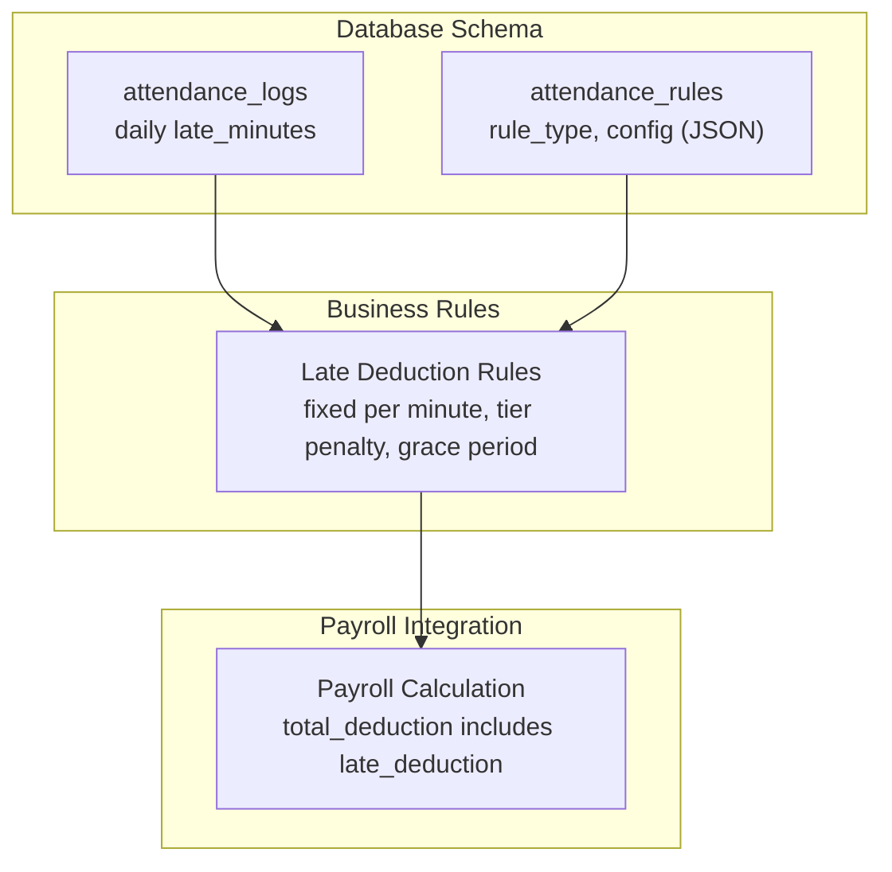
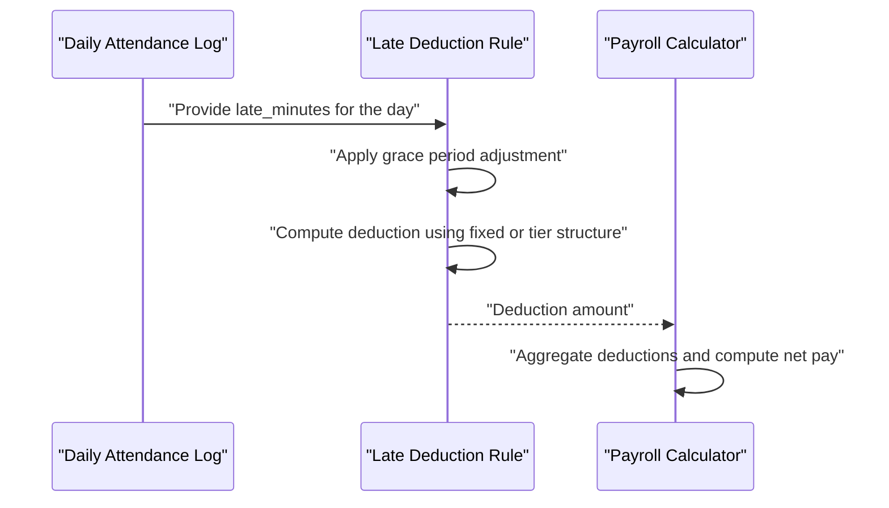
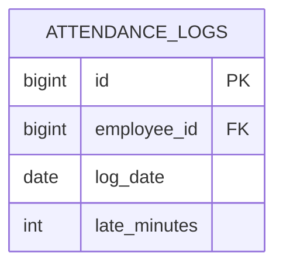
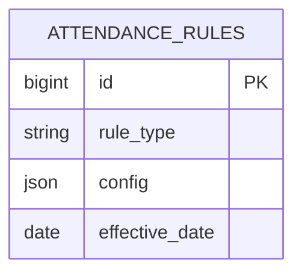
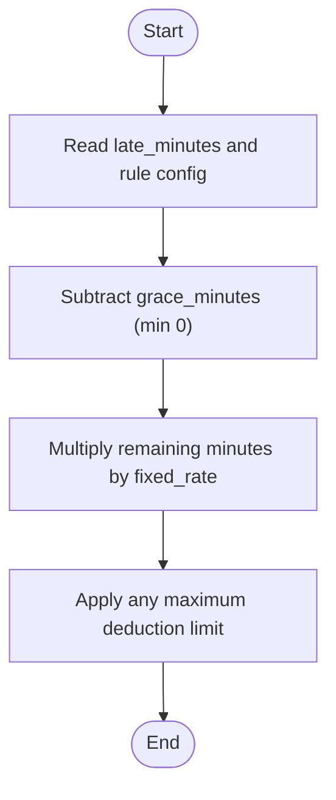
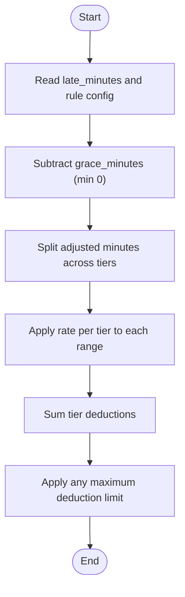
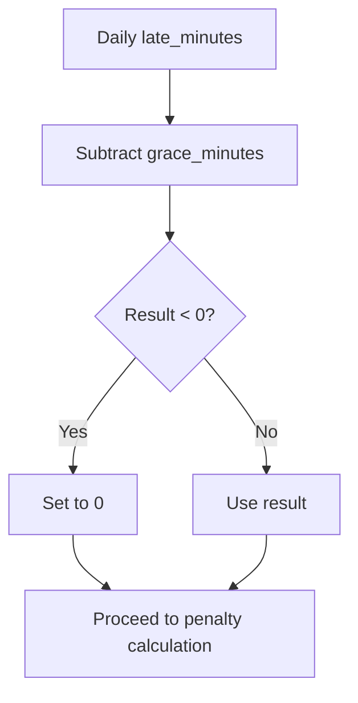
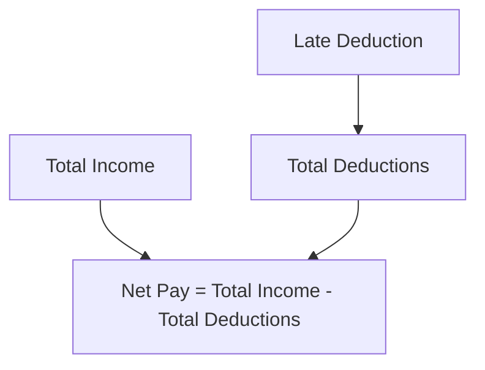
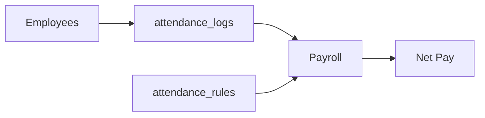

# Late Deduction Rules

<cite>
**Referenced Files in This Document**
- [AGENTS.md](file://AGENTS.md)
- [0001_01_01_000006_create_attendance_worklogs_tables.php](file://database/migrations/0001_01_01_000006_create_attendance_worklogs_tables.php)
- [0001_01_01_000008_create_rules_config_tables.php](file://database/migrations/0001_01_01_000008_create_rules_config_tables.php)
- [composer.json](file://composer.json)
</cite>

## Table of Contents
1. [Introduction](#introduction)
2. [Project Structure](#project-structure)
3. [Core Components](#core-components)
4. [Architecture Overview](#architecture-overview)
5. [Detailed Component Analysis](#detailed-component-analysis)
6. [Dependency Analysis](#dependency-analysis)
7. [Performance Considerations](#performance-considerations)
8. [Troubleshooting Guide](#troubleshooting-guide)
9. [Conclusion](#conclusion)

## Introduction
This document describes the late deduction rules system, focusing on how late minutes from attendance logs are tracked and converted into monetary deductions. It explains supported penalty structures (fixed per minute and tier-based), grace period handling, configuration via flexible JSON rules, and how these integrate into payroll calculations. It also outlines validation logic, maximum deduction limits, and impacts on net pay.

## Project Structure
The repository defines the late deduction system through:
- Attendance log schema capturing daily late minutes
- A centralized rules table supporting configurable rule types including late deduction
- Business rules documentation specifying supported structures and payroll integration

**Diagram sources**
- [0001_01_01_000006_create_attendance_worklogs_tables.php:11-29](file://database/migrations/0001_01_01_000006_create_attendance_worklogs_tables.php#L11-L29)
- [0001_01_01_000008_create_rules_config_tables.php:71-78](file://database/migrations/0001_01_01_000008_create_rules_config_tables.php#L71-L78)
- [AGENTS.md:461-466](file://AGENTS.md#L461-L466)
- [AGENTS.md:442-444](file://AGENTS.md#L442-L444)

**Section sources**
- [0001_01_01_000006_create_attendance_worklogs_tables.php:11-29](file://database/migrations/0001_01_01_000006_create_attendance_worklogs_tables.php#L11-L29)
- [0001_01_01_000008_create_rules_config_tables.php:71-78](file://database/migrations/0001_01_01_000008_create_rules_config_tables.php#L71-L78)
- [AGENTS.md:461-466](file://AGENTS.md#L461-L466)
- [AGENTS.md:442-444](file://AGENTS.md#L442-L444)

## Core Components
- Attendance Logs: Stores daily late minutes per employee per day.
- Late Deduction Rules: Configurable rule entries with a type discriminator and a JSON configuration payload.
- Payroll Integration: Late deduction is included in total_deduction and affects net pay.

Key capabilities documented:
- Fixed per minute penalty
- Tier penalty
- Grace period

These are applied during payroll computation to derive the late deduction amount.

**Section sources**
- [0001_01_01_000006_create_attendance_worklogs_tables.php:18](file://database/migrations/0001_01_01_000006_create_attendance_worklogs_tables.php#L18)
- [0001_01_01_000008_create_rules_config_tables.php:73-74](file://database/migrations/0001_01_01_000008_create_rules_config_tables.php#L73-L74)
- [AGENTS.md:461-466](file://AGENTS.md#L461-L466)
- [AGENTS.md:442-444](file://AGENTS.md#L442-L444)

## Architecture Overview
The late deduction pipeline:
- Attendance logs capture late minutes per day.
- A late deduction rule is selected by effective date and type.
- The rule’s JSON configuration defines the penalty structure and grace period.
- Payroll computes the total late deduction for the period and includes it in total_deduction, impacting net pay.

**Diagram sources**
- [0001_01_01_000006_create_attendance_worklogs_tables.php:18](file://database/migrations/0001_01_01_000006_create_attendance_worklogs_tables.php#L18)
- [0001_01_01_000008_create_rules_config_tables.php:73-74](file://database/migrations/0001_01_01_000008_create_rules_config_tables.php#L73-L74)
- [AGENTS.md:442-444](file://AGENTS.md#L442-L444)

## Detailed Component Analysis

### Attendance Logs: Late Minutes Tracking
- Each record captures late_minutes for a given employee on a given date.
- These values feed into the late deduction calculation.

**Diagram sources**
- [0001_01_01_000006_create_attendance_worklogs_tables.php:11-29](file://database/migrations/0001_01_01_000006_create_attendance_worklogs_tables.php#L11-L29)

**Section sources**
- [0001_01_01_000006_create_attendance_worklogs_tables.php:18](file://database/migrations/0001_01_01_000006_create_attendance_worklogs_tables.php#L18)

### Late Deduction Rules: Configuration Model
- A single rules table supports multiple rule types including late_deduction.
- The config column stores flexible JSON defining the penalty structure and grace period.

Supported rule types include late_deduction, enabling configuration of:
- Fixed per minute penalty
- Tier-based penalty
- Grace period

**Diagram sources**
- [0001_01_01_000008_create_rules_config_tables.php:71-78](file://database/migrations/0001_01_01_000008_create_rules_config_tables.php#L71-L78)

**Section sources**
- [0001_01_01_000008_create_rules_config_tables.php:73-74](file://database/migrations/0001_01_01_000008_create_rules_config_tables.php#L73-L74)
- [AGENTS.md:461-466](file://AGENTS.md#L461-L466)

### Calculation Algorithms

#### Fixed Per Minute Penalty
- Applies a constant rate per minute of lateness after grace period.
- Formula outline:
  - Adjust late minutes by subtracting the configured grace minutes (non-negative).
  - Multiply remaining minutes by the fixed rate to obtain the deduction amount.

**Diagram sources**
- [0001_01_01_000006_create_attendance_worklogs_tables.php:18](file://database/migrations/0001_01_01_000006_create_attendance_worklogs_tables.php#L18)
- [0001_01_01_000008_create_rules_config_tables.php:73-74](file://database/migrations/0001_01_01_000008_create_rules_config_tables.php#L73-L74)

#### Tier-Based Penalty
- Defines ranges of late minutes with associated rates.
- Applies the appropriate rate band to each range and sums the resulting deductions.
- Grace period is applied before tier allocation.

**Diagram sources**
- [0001_01_01_000006_create_attendance_worklogs_tables.php:18](file://database/migrations/0001_01_01_000006_create_attendance_worklogs_tables.php#L18)
- [0001_01_01_000008_create_rules_config_tables.php:73-74](file://database/migrations/0001_01_01_000008_create_rules_config_tables.php#L73-L74)

### Grace Period Handling
- Grace minutes are subtracted from daily late minutes prior to applying penalties.
- If the result is negative, it is treated as zero for deduction purposes.
- Grace is applied consistently for both fixed and tier structures.

**Diagram sources**
- [0001_01_01_000006_create_attendance_worklogs_tables.php:18](file://database/migrations/0001_01_01_000006_create_attendance_worklogs_tables.php#L18)
- [0001_01_01_000008_create_rules_config_tables.php:73-74](file://database/migrations/0001_01_01_000008_create_rules_config_tables.php#L73-L74)

### Payroll Integration and Net Pay Impact
- Late deduction is included in total_deduction.
- Net pay equals total_income minus total_deduction, so higher late deductions reduce take-home pay.

**Diagram sources**
- [AGENTS.md:442-444](file://AGENTS.md#L442-L444)

**Section sources**
- [AGENTS.md:442-444](file://AGENTS.md#L442-L444)

### Configuration Examples and Scenarios
Note: The following are conceptual examples to illustrate configuration options. Replace with actual JSON payloads stored in the config column of the rules table.

- Fixed per minute:
  - grace_minutes: integer
  - fixed_rate: decimal per minute
  - max_deduction_per_period: optional cap

- Tier-based:
  - grace_minutes: integer
  - tiers: array of objects with:
    - from_minutes: integer
    - to_minutes: integer
    - rate_per_minute: decimal
  - max_deduction_per_period: optional cap

Validation and enforcement:
- Ensure grace_minutes is non-negative.
- Ensure tier ranges are contiguous and non-overlapping where applicable.
- Ensure max_deduction_per_period is enforced at the period level.

Integration with payroll:
- Aggregate daily late deductions per employee for the pay period.
- Apply max_deduction_per_period if configured.
- Include the computed late deduction in total_deduction for net pay computation.

**Section sources**
- [0001_01_01_000008_create_rules_config_tables.php:73-74](file://database/migrations/0001_01_01_000008_create_rules_config_tables.php#L73-L74)
- [AGENTS.md:442-444](file://AGENTS.md#L442-L444)

## Dependency Analysis
- Attendance logs depend on employees and are indexed by date for efficient queries.
- Late deduction rules depend on effective_date to select the active rule for a given period.
- Payroll depends on both attendance logs and late deduction rules to compute deductions.

**Diagram sources**
- [0001_01_01_000006_create_attendance_worklogs_tables.php:13-28](file://database/migrations/0001_01_01_000006_create_attendance_worklogs_tables.php#L13-L28)
- [0001_01_01_000008_create_rules_config_tables.php:75](file://database/migrations/0001_01_01_000008_create_rules_config_tables.php#L75)
- [AGENTS.md:442-444](file://AGENTS.md#L442-L444)

**Section sources**
- [0001_01_01_000006_create_attendance_worklogs_tables.php:13-28](file://database/migrations/0001_01_01_000006_create_attendance_worklogs_tables.php#L13-L28)
- [0001_01_01_000008_create_rules_config_tables.php:75](file://database/migrations/0001_01_01_000008_create_rules_config_tables.php#L75)
- [AGENTS.md:442-444](file://AGENTS.md#L442-L444)

## Performance Considerations
- Index attendance_logs by employee_id and log_date to support fast aggregation by employee and date range.
- Limit rule lookups to the latest effective_date on or before the pay period start date.
- Batch process daily late minutes to avoid repeated scans.
- Cache frequently accessed rule configurations keyed by employee and effective_date.

[No sources needed since this section provides general guidance]

## Troubleshooting Guide
Common issues and resolutions:
- No late deduction appearing:
  - Verify attendance_logs contain late_minutes for the target dates.
  - Confirm a late deduction rule exists with an effective_date covering the pay period.
- Incorrect deduction amounts:
  - Check grace_minutes alignment with policy.
  - Validate fixed_rate or tier rates in the rule config.
  - Ensure max_deduction_per_period is not inadvertently capping results too early.
- Unexpected zero deductions:
  - Confirm grace_minutes are not absorbing all late minutes.
  - Review tier boundaries to ensure ranges match actual late minute buckets.

**Section sources**
- [0001_01_01_000006_create_attendance_worklogs_tables.php:18](file://database/migrations/0001_01_01_000006_create_attendance_worklogs_tables.php#L18)
- [0001_01_01_000008_create_rules_config_tables.php:73-74](file://database/migrations/0001_01_01_000008_create_rules_config_tables.php#L73-L74)

## Conclusion
The late deduction rules system integrates attendance logs with configurable penalty structures and grace periods. By storing flexible rule configurations and aggregating daily late minutes, payroll computation can accurately reflect employee punctuality costs while maintaining compliance with organizational policies and caps.