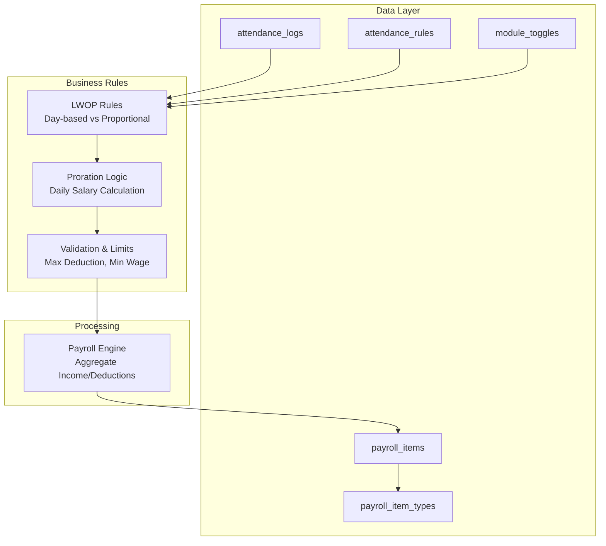
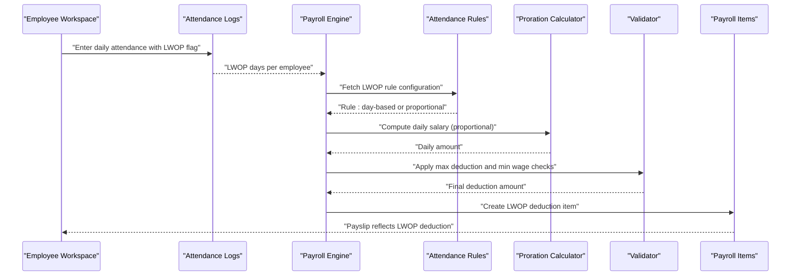
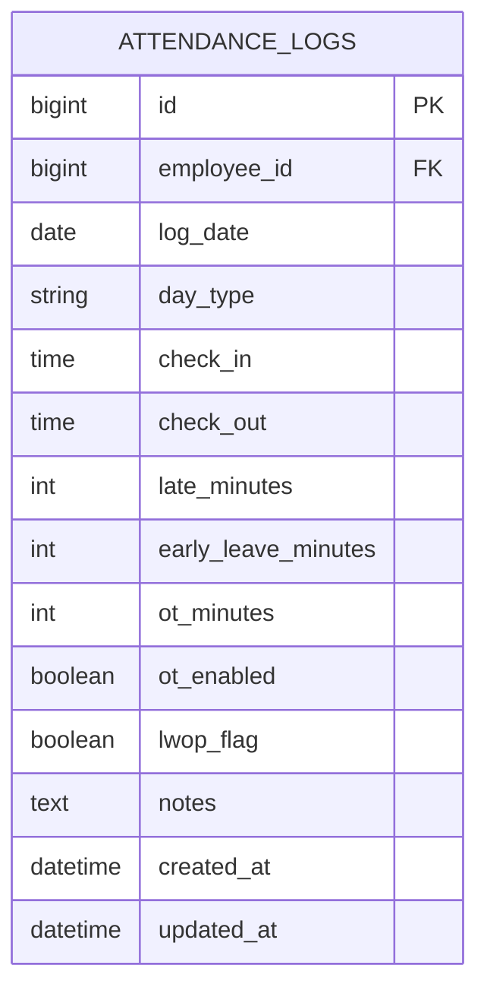
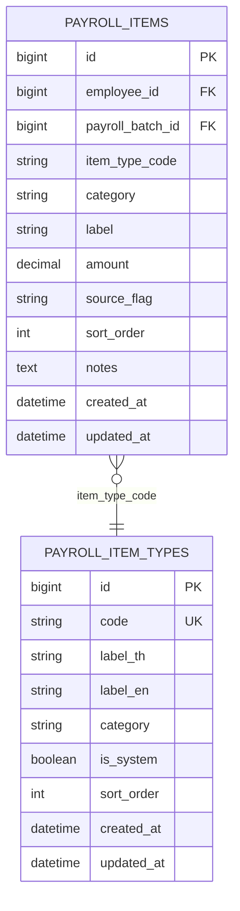
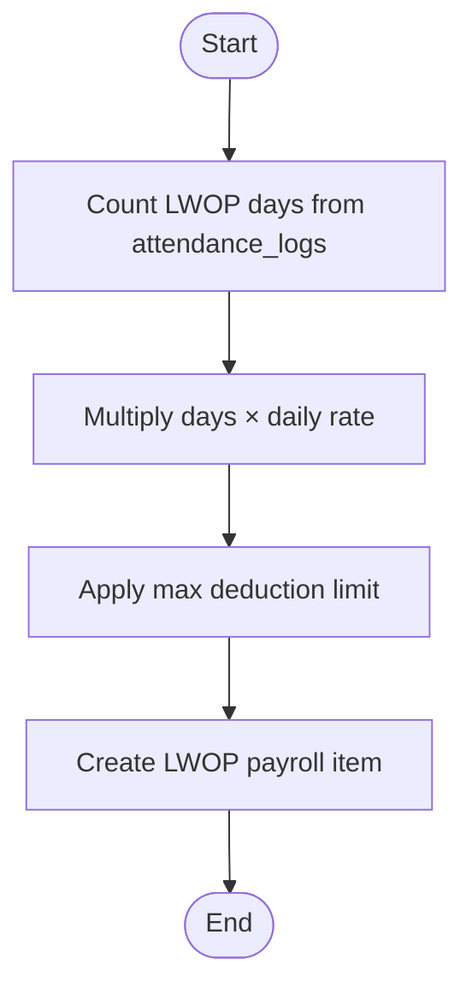
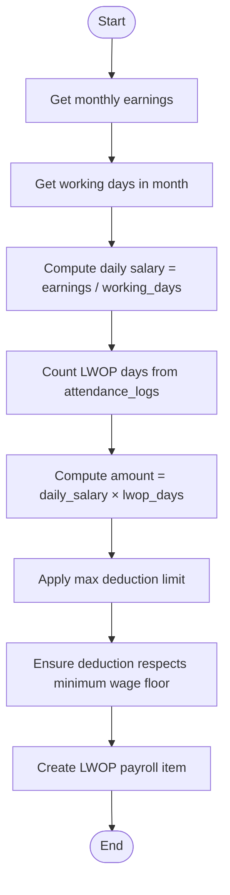
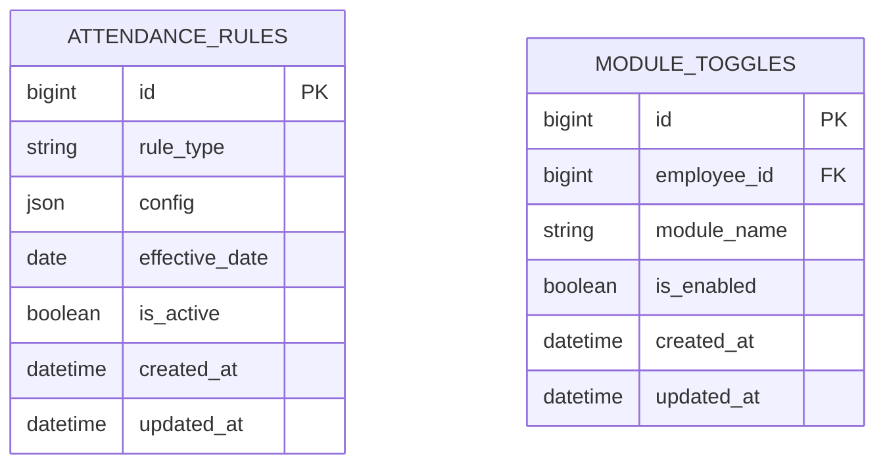
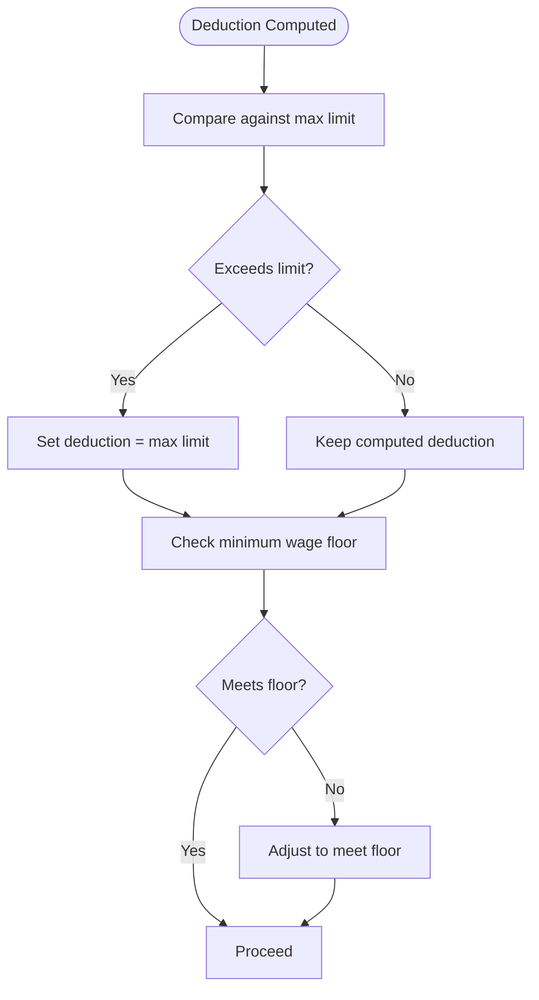
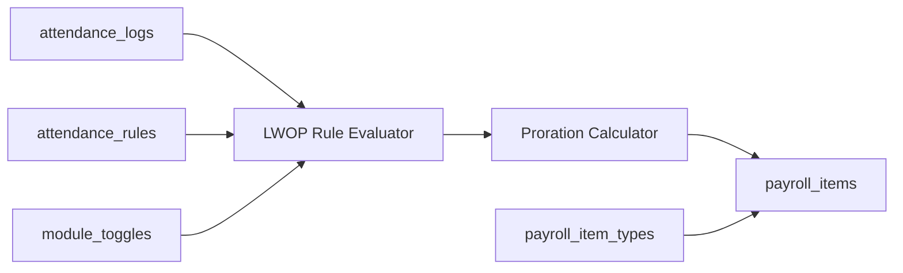

# Leave Without Pay (LWOP) Rules

<cite>
**Referenced Files in This Document**
- [AGENTS.md](file://AGENTS.md)
- [0001_01_01_000006_create_attendance_worklogs_tables.php](file://database/migrations/0001_01_01_000006_create_attendance_worklogs_tables.php)
- [0001_01_01_000007_create_payroll_tables.php](file://database/migrations/0001_01_01_000007_create_payroll_tables.php)
- [0001_01_01_000008_create_rules_config_tables.php](file://database/migrations/0001_01_01_000008_create_rules_config_tables.php)
</cite>

## Table of Contents
1. [Introduction](#introduction)
2. [Project Structure](#project-structure)
3. [Core Components](#core-components)
4. [Architecture Overview](#architecture-overview)
5. [Detailed Component Analysis](#detailed-component-analysis)
6. [Dependency Analysis](#dependency-analysis)
7. [Performance Considerations](#performance-considerations)
8. [Troubleshooting Guide](#troubleshooting-guide)
9. [Conclusion](#conclusion)
10. [Appendices](#appendices)

## Introduction
This document specifies the Leave Without Pay (LWOP) deduction rules for the xHR Payroll & Finance System. It explains how LWOP is modeled in the system, how attendance logs track LWOP days, and how those days convert into monetary deductions. It covers two deduction approaches:
- Day-based deduction: a fixed amount per LWOP day
- Proportional salary deduction: prorated daily salary based on monthly earnings and working days

It also documents configuration surfaces for LWOP rates, maximum deduction limits, integration with payroll processing, validation logic, minimum wage considerations, and impacts on net pay.

## Project Structure
The LWOP system is implemented using:
- Attendance records that capture LWOP flags per day
- Payroll item types and payroll items to persist LWOP deductions
- Configurable rules and toggles to govern LWOP behavior
- A payroll engine that aggregates income and deductions and computes net pay

**Diagram sources**
- [0001_01_01_000006_create_attendance_worklogs_tables.php:11-29](file://database/migrations/0001_01_01_000006_create_attendance_worklogs_tables.php#L11-L29)
- [0001_01_01_000007_create_payroll_tables.php:35-51](file://database/migrations/0001_01_01_000007_create_payroll_tables.php#L35-L51)
- [0001_01_01_000008_create_rules_config_tables.php:71-78](file://database/migrations/0001_01_01_000008_create_rules_config_tables.php#L71-L78)
- [AGENTS.md:467-471](file://AGENTS.md#L467-L471)

**Section sources**
- [AGENTS.md:438-446](file://AGENTS.md#L438-L446)
- [AGENTS.md:467-471](file://AGENTS.md#L467-L471)
- [0001_01_01_000006_create_attendance_worklogs_tables.php:11-29](file://database/migrations/0001_01_01_000006_create_attendance_worklogs_tables.php#L11-L29)
- [0001_01_01_000007_create_payroll_tables.php:35-51](file://database/migrations/0001_01_01_000007_create_payroll_tables.php#L35-L51)
- [0001_01_01_000008_create_rules_config_tables.php:71-78](file://database/migrations/0001_01_01_000008_create_rules_config_tables.php#L71-L78)

## Core Components
- Attendance Logs: Each record captures a single day’s status and an LWOP flag. The presence of the flag indicates a LWOP day eligible for deduction.
- Payroll Item Types: A dedicated item type exists for LWOP deductions so they appear consistently on payslips and contribute to net pay computation.
- Payroll Items: Per-employee, per-batch LWOP deduction entries are persisted here with source flags to maintain auditability.
- Rules and Toggles: Attendance rules define LWOP behavior (e.g., day-based or proportional), and module toggles enable/disable LWOP processing per employee or globally.

Key modeling artifacts:
- Attendance log schema includes an LWOP flag column.
- Payroll item schema includes category and item type code to classify LWOP as a deduction.
- Attendance rules table stores flexible configurations for LWOP behavior.
- Module toggles table enables LWOP processing per employee.

**Section sources**
- [0001_01_01_000006_create_attendance_worklogs_tables.php:11-29](file://database/migrations/0001_01_01_000006_create_attendance_worklogs_tables.php#L11-L29)
- [0001_01_01_000007_create_payroll_tables.php:35-51](file://database/migrations/0001_01_01_000007_create_payroll_tables.php#L35-L51)
- [0001_01_01_000008_create_rules_config_tables.php:71-78](file://database/migrations/0001_01_01_000008_create_rules_config_tables.php#L71-L78)
- [AGENTS.md:467-471](file://AGENTS.md#L467-L471)

## Architecture Overview
The LWOP deduction pipeline:
1. Attendance capture: Employees’ daily attendance includes an LWOP flag.
2. Batch processing: The payroll engine collects LWOP days per employee and per batch.
3. Rule evaluation: Based on configured LWOP rules, the system selects either day-based or proportional deduction.
4. Proration: If proportional, daily salary is computed from monthly earnings and working days.
5. Limits and validation: Maximum deduction limits and minimum wage considerations are enforced.
6. Payroll aggregation: LWOP deduction is recorded as a payroll item and included in net pay computation.

**Diagram sources**
- [0001_01_01_000006_create_attendance_worklogs_tables.php:11-29](file://database/migrations/0001_01_01_000006_create_attendance_worklogs_tables.php#L11-L29)
- [0001_01_01_000007_create_payroll_tables.php:35-51](file://database/migrations/0001_01_01_000007_create_payroll_tables.php#L35-L51)
- [0001_01_01_000008_create_rules_config_tables.php:71-78](file://database/migrations/0001_01_01_000008_create_rules_config_tables.php#L71-L78)
- [AGENTS.md:467-471](file://AGENTS.md#L467-L471)

## Detailed Component Analysis

### Attendance Tracking of LWOP Days
- Each attendance log entry records a single calendar day for an employee.
- The LWOP flag marks a day as unpaid leave; absence without the flag implies a normal workday.
- Unique constraint on employee and date ensures one LWOP flag per day per employee.
- Index on log_date supports efficient monthly aggregation.

**Diagram sources**
- [0001_01_01_000006_create_attendance_worklogs_tables.php:11-29](file://database/migrations/0001_01_01_000006_create_attendance_worklogs_tables.php#L11-L29)

**Section sources**
- [0001_01_01_000006_create_attendance_worklogs_tables.php:11-29](file://database/migrations/0001_01_01_000006_create_attendance_worklogs_tables.php#L11-L29)

### Payroll Itemization and Net Pay Impact
- LWOP deductions are represented as a payroll item with category “deduction.”
- Item type code identifies LWOP items for consistent reporting and audit.
- Payroll items are grouped by employee and payroll batch, enabling per-period reconciliation.
- Net pay equals total income minus total deductions, including LWOP.

**Diagram sources**
- [0001_01_01_000007_create_payroll_tables.php:11-20](file://database/migrations/0001_01_01_000007_create_payroll_tables.php#L11-L20)
- [0001_01_01_000007_create_payroll_tables.php:35-51](file://database/migrations/0001_01_01_000007_create_payroll_tables.php#L35-L51)

**Section sources**
- [0001_01_01_000007_create_payroll_tables.php:35-51](file://database/migrations/0001_01_01_000007_create_payroll_tables.php#L35-L51)
- [AGENTS.md:440-446](file://AGENTS.md#L440-L446)

### Deduction Approaches

#### Day-Based Deduction
- Applies when the LWOP rule is configured to deduct a fixed amount per LWOP day.
- Count LWOP days from attendance logs during the payroll batch period.
- Multiply LWOP days by the configured daily rate to compute the total deduction.

**Diagram sources**
- [0001_01_01_000006_create_attendance_worklogs_tables.php:11-29](file://database/migrations/0001_01_01_000006_create_attendance_worklogs_tables.php#L11-L29)
- [0001_01_01_000008_create_rules_config_tables.php:71-78](file://database/migrations/0001_01_01_000008_create_rules_config_tables.php#L71-L78)
- [0001_01_01_000007_create_payroll_tables.php:35-51](file://database/migrations/0001_01_01_000007_create_payroll_tables.php#L35-L51)

#### Proportional Salary Deduction
- Applies when the LWOP rule is configured to prorate the deduction from the employee’s monthly earnings.
- Compute daily salary by dividing monthly earnings by the number of working days in the month.
- Multiply daily salary by the number of LWOP days to derive the deduction.
- Enforce maximum deduction limits and minimum wage floor considerations.

**Diagram sources**
- [0001_01_01_000006_create_attendance_worklogs_tables.php:11-29](file://database/migrations/0001_01_01_000006_create_attendance_worklogs_tables.php#L11-L29)
- [0001_01_01_000008_create_rules_config_tables.php:71-78](file://database/migrations/0001_01_01_000008_create_rules_config_tables.php#L71-L78)
- [0001_01_01_000007_create_payroll_tables.php:35-51](file://database/migrations/0001_01_01_000007_create_payroll_tables.php#L35-L51)

### Configuration Surfaces
- Attendance Rules: Define LWOP behavior (day-based or proportional) and related parameters. The rule type field distinguishes LWOP configurations from others.
- Module Toggles: Enable or disable LWOP processing per employee or globally.
- Payroll Item Types: Maintain a dedicated item type for LWOP deductions to ensure consistent categorization.

**Diagram sources**
- [0001_01_01_000008_create_rules_config_tables.php:71-78](file://database/migrations/0001_01_01_000008_create_rules_config_tables.php#L71-L78)
- [0001_01_01_000008_create_rules_config_tables.php:80-89](file://database/migrations/0001_01_01_000008_create_rules_config_tables.php#L80-L89)

**Section sources**
- [0001_01_01_000008_create_rules_config_tables.php:71-78](file://database/migrations/0001_01_01_000008_create_rules_config_tables.php#L71-L78)
- [0001_01_01_000008_create_rules_config_tables.php:80-89](file://database/migrations/0001_01_01_000008_create_rules_config_tables.php#L80-L89)
- [AGENTS.md:467-471](file://AGENTS.md#L467-L471)

### Validation Logic and Controls
- Maximum Deduction Limit: Enforce a cap on LWOP deductions per period to prevent excessive reductions.
- Minimum Wage Considerations: Ensure that after LWOP deductions, take-home pay meets statutory minimum wage thresholds.
- Net Pay Impact: Confirm that LWOP appears as a deduction in the net pay computation and does not reduce income via base salary adjustments.

**Diagram sources**
- [AGENTS.md:440-446](file://AGENTS.md#L440-L446)

**Section sources**
- [AGENTS.md:440-446](file://AGENTS.md#L440-L446)

## Dependency Analysis
- Attendance Logs feed the LWOP rule evaluator with LWOP day counts.
- Attendance Rules and Module Toggles influence whether and how LWOP is deducted.
- Proration logic depends on monthly earnings and working days.
- Payroll Items depend on Payroll Item Types for categorization and visibility on payslips.

**Diagram sources**
- [0001_01_01_000006_create_attendance_worklogs_tables.php:11-29](file://database/migrations/0001_01_01_000006_create_attendance_worklogs_tables.php#L11-L29)
- [0001_01_01_000007_create_payroll_tables.php:35-51](file://database/migrations/0001_01_01_000007_create_payroll_tables.php#L35-L51)
- [0001_01_01_000008_create_rules_config_tables.php:71-78](file://database/migrations/0001_01_01_000008_create_rules_config_tables.php#L71-L78)

**Section sources**
- [0001_01_01_000006_create_attendance_worklogs_tables.php:11-29](file://database/migrations/0001_01_01_000006_create_attendance_worklogs_tables.php#L11-L29)
- [0001_01_01_000007_create_payroll_tables.php:35-51](file://database/migrations/0001_01_01_000007_create_payroll_tables.php#L35-L51)
- [0001_01_01_000008_create_rules_config_tables.php:71-78](file://database/migrations/0001_01_01_000008_create_rules_config_tables.php#L71-L78)

## Performance Considerations
- Indexes on log_date and employee_id in attendance_logs improve monthly aggregation performance.
- Batch processing should group by employee and payroll batch to minimize repeated scans.
- Proration computations should cache daily salary where appropriate to avoid redundant recalculations.
- Rule lookups should leverage effective_date ordering and is_active flags to select current configurations efficiently.

[No sources needed since this section provides general guidance]

## Troubleshooting Guide
- LWOP not appearing on payslip:
  - Verify LWOP flag is set in attendance_logs for the target period.
  - Confirm LWOP item type exists and is categorized as a deduction.
  - Check module toggles and attendance rules for LWOP enablement.
- Incorrect deduction amount:
  - For day-based: confirm daily rate and LWOP day count.
  - For proportional: verify monthly earnings, working days, and proration logic.
  - Review maximum deduction limits and minimum wage floor adjustments.
- Net pay anomalies:
  - Ensure LWOP is recorded as a deduction and not offset by reducing base salary.
  - Reconcile totals across income and deduction categories.

**Section sources**
- [0001_01_01_000006_create_attendance_worklogs_tables.php:11-29](file://database/migrations/0001_01_01_000006_create_attendance_worklogs_tables.php#L11-L29)
- [0001_01_01_000007_create_payroll_tables.php:35-51](file://database/migrations/0001_01_01_000007_create_payroll_tables.php#L35-L51)
- [0001_01_01_000008_create_rules_config_tables.php:71-78](file://database/migrations/0001_01_01_000008_create_rules_config_tables.php#L71-L78)
- [AGENTS.md:440-446](file://AGENTS.md#L440-L446)

## Conclusion
The LWOP deduction system integrates attendance flags with configurable rules to compute either a fixed day-based deduction or a proportional reduction based on daily salary. By persisting LWOP as a formal payroll item and enforcing maximum limits and minimum wage protections, the system maintains accuracy, transparency, and compliance while supporting flexible payroll modes.

[No sources needed since this section summarizes without analyzing specific files]

## Appendices

### Configuration Examples
- Day-based LWOP Rate Structure:
  - Configure a daily rate in attendance rules for LWOP.
  - Count LWOP days from attendance_logs for the payroll batch.
  - Deduction = days × daily rate; cap by maximum deduction limit.
- Proportional LWOP Rate Structure:
  - Compute daily salary from monthly earnings divided by working days.
  - Deduction = daily salary × LWOP days; cap by maximum deduction limit.
  - Ensure deduction does not reduce net pay below minimum wage floor.
- Integration with Payroll Processing:
  - Persist LWOP as a payroll item with category “deduction.”
  - Include LWOP in total_deductions and recompute net pay accordingly.

**Section sources**
- [0001_01_01_000006_create_attendance_worklogs_tables.php:11-29](file://database/migrations/0001_01_01_000006_create_attendance_worklogs_tables.php#L11-L29)
- [0001_01_01_000007_create_payroll_tables.php:35-51](file://database/migrations/0001_01_01_000007_create_payroll_tables.php#L35-L51)
- [0001_01_01_000008_create_rules_config_tables.php:71-78](file://database/migrations/0001_01_01_000008_create_rules_config_tables.php#L71-L78)
- [AGENTS.md:440-446](file://AGENTS.md#L440-L446)
- [AGENTS.md:467-471](file://AGENTS.md#L467-L471)