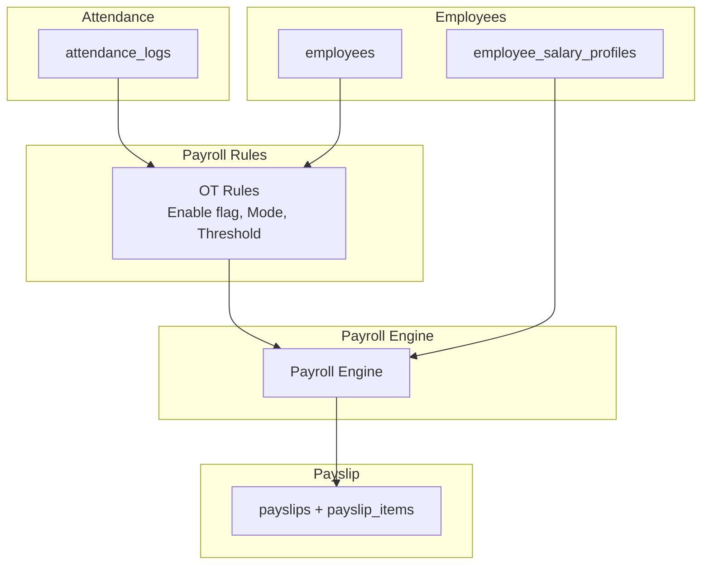
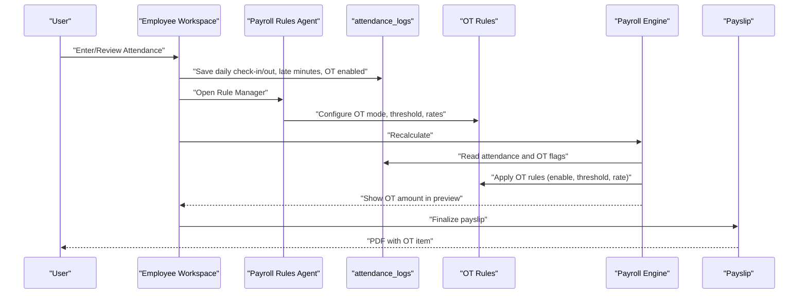
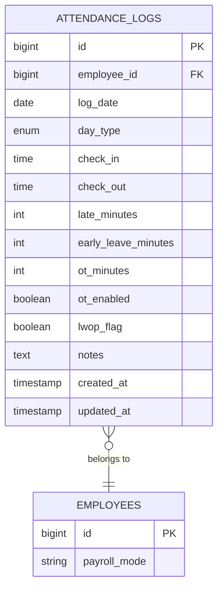
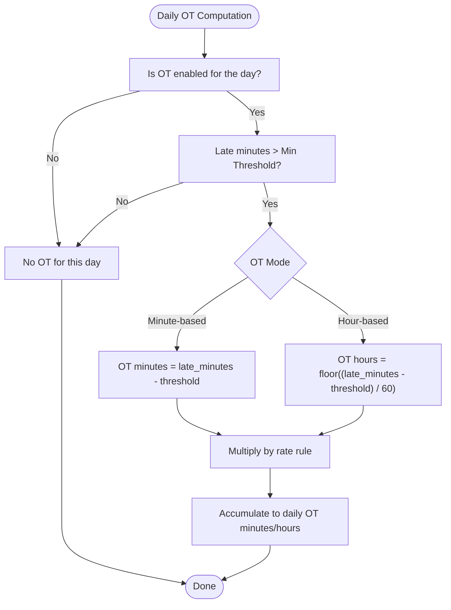
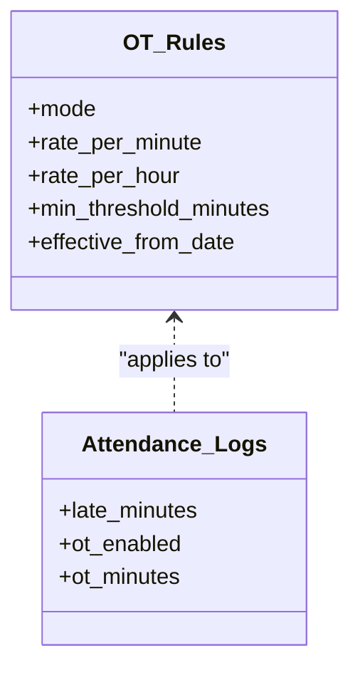
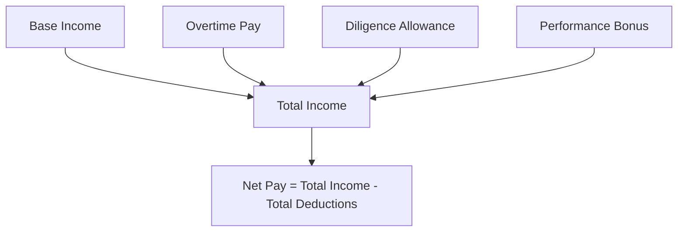
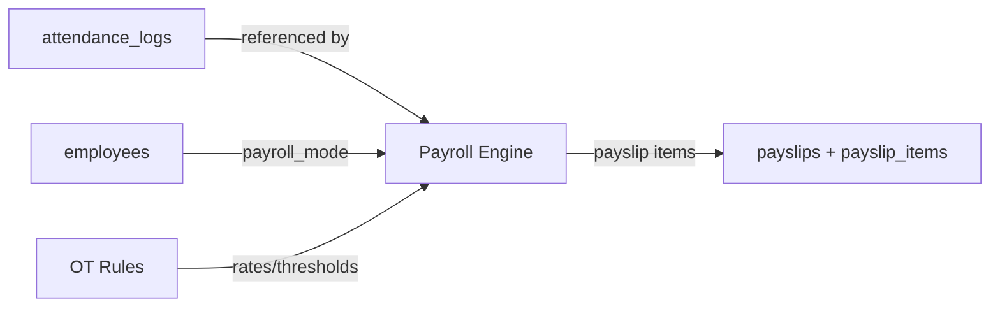

# Overtime Calculation Rules

<cite>
**Referenced Files in This Document**
- [AGENTS.md](file://AGENTS.md)
- [0001_01_01_000006_create_attendance_worklogs_tables.php](file://database/migrations/0001_01_01_000006_create_attendance_worklogs_tables.php)
- [0001_01_01_000005_create_employees_tables.php](file://database/migrations/0001_01_01_000005_create_employees_tables.php)
- [database.php](file://config/database.php)
</cite>

## Table of Contents
1. [Introduction](#introduction)
2. [Project Structure](#project-structure)
3. [Core Components](#core-components)
4. [Architecture Overview](#architecture-overview)
5. [Detailed Component Analysis](#detailed-component-analysis)
6. [Dependency Analysis](#dependency-analysis)
7. [Performance Considerations](#performance-considerations)
8. [Troubleshooting Guide](#troubleshooting-guide)
9. [Conclusion](#conclusion)

## Introduction
This document describes the overtime (OT) calculation rules system as designed in the repository. It focuses on OT computation modes (minute-based vs hour-based), thresholds, enable flags, and how OT integrates with payroll processing. It also explains how attendance logs feed OT calculations, including how late minutes convert to overtime hours, and how OT affects net pay.

## Project Structure
The overtime system is rule-driven and relies on:
- Attendance logs capturing daily check-in/out, late minutes, early leave, and OT flags
- Payroll modes per employee determining applicable rules
- A rule manager for OT and related configurations
- Payroll engine aggregating income and deductions, including OT

**Diagram sources**
- [AGENTS.md](file://AGENTS.md)
- [0001_01_01_000006_create_attendance_worklogs_tables.php](file://database/migrations/0001_01_01_000006_create_attendance_worklogs_tables.php)
- [0001_01_01_000005_create_employees_tables.php](file://database/migrations/0001_01_01_000005_create_employees_tables.php)

**Section sources**
- [AGENTS.md](file://AGENTS.md)
- [0001_01_01_000006_create_attendance_worklogs_tables.php](file://database/migrations/0001_01_01_000006_create_attendance_worklogs_tables.php)
- [0001_01_01_000005_create_employees_tables.php](file://database/migrations/0001_01_01_000005_create_employees_tables.php)

## Core Components
- OT calculation modes
  - Minute-based OT: OT computed in minutes and converted to pay using a rate rule
  - Hour-based OT: OT computed in hours and converted to pay using a rate rule
- Minimum threshold configuration
  - OT is only counted if minutes exceed a configured minimum threshold
- Enable/disable flags
  - Daily OT enable flag per attendance log
  - Global OT module toggle via module toggles
- Calculation algorithms
  - From attendance logs: late minutes contribute to OT minutes when OT is enabled and thresholds are met
  - Rate rules define how OT minutes/hours are monetized
- Integration with payroll
  - OT feeds into total income aggregation and net pay computation
  - OT items appear as rule-generated payroll items and can be overridden

**Section sources**
- [AGENTS.md](file://AGENTS.md)
- [0001_01_01_000006_create_attendance_worklogs_tables.php](file://database/migrations/0001_01_01_000006_create_attendance_worklogs_tables.php)

## Architecture Overview
The OT system is rule-driven and record-based:
- Attendance logs capture daily timekeeping events and OT flags
- Employee payroll mode determines which rules apply
- OT rules define rates, thresholds, and enablement
- Payroll engine aggregates OT into income and updates net pay

**Diagram sources**
- [AGENTS.md](file://AGENTS.md)
- [0001_01_01_000006_create_attendance_worklogs_tables.php](file://database/migrations/0001_01_01_000006_create_attendance_worklogs_tables.php)

## Detailed Component Analysis

### Attendance Logs and OT Inputs
- Fields relevant to OT:
  - Late minutes: accumulated late minutes per day
  - Early leave minutes: may influence net OT minutes depending on policy
  - OT enabled: boolean flag enabling OT computation for the day
  - OT minutes: aggregated OT minutes after applying rules
- Unique constraint ensures one attendance record per employee per day
- Indexes optimize queries by employee and date

**Diagram sources**
- [0001_01_01_000006_create_attendance_worklogs_tables.php](file://database/migrations/0001_01_01_000006_create_attendance_worklogs_tables.php)
- [0001_01_01_000005_create_employees_tables.php](file://database/migrations/0001_01_01_000005_create_employees_tables.php)

**Section sources**
- [0001_01_01_000006_create_attendance_worklogs_tables.php](file://database/migrations/0001_01_01_000006_create_attendance_worklogs_tables.php)

### OT Calculation Modes and Thresholds
- Modes
  - Minute-based: OT minutes are computed and multiplied by a minute rate
  - Hour-based: OT hours are computed and multiplied by an hourly rate
- Threshold
  - Only minutes exceeding the configured minimum threshold count toward OT
- Enable flag
  - Daily OT enabled flag must be true for OT to be considered for that day
- Grace period handling
  - While not explicitly modeled in the schema, grace handling is configurable in the rule manager and can cap or waive small late-minute OT contributions

**Diagram sources**
- [AGENTS.md](file://AGENTS.md)
- [0001_01_01_000006_create_attendance_worklogs_tables.php](file://database/migrations/0001_01_01_000006_create_attendance_worklogs_tables.php)

**Section sources**
- [AGENTS.md](file://AGENTS.md)

### Rate Rules and OT Amount Calculation
- Rate rules define:
  - OT mode (minute-based or hour-based)
  - Rate per minute or per hour
  - Effective date(s) for rate changes
- OT amount per day is derived from:
  - OT minutes or OT hours × rate
- These amounts become payroll items and contribute to total income and net pay

**Diagram sources**
- [AGENTS.md](file://AGENTS.md)
- [0001_01_01_000006_create_attendance_worklogs_tables.php](file://database/migrations/0001_01_01_000006_create_attendance_worklogs_tables.php)

**Section sources**
- [AGENTS.md](file://AGENTS.md)

### Net Pay Impact
- OT contributes to total income
- Net pay equals total income minus total deductions
- OT items are rule-generated and can be overridden during manual editing

**Diagram sources**
- [AGENTS.md](file://AGENTS.md)

**Section sources**
- [AGENTS.md](file://AGENTS.md)

### Validation Logic and Edge Cases
- Daily validation
  - OT enabled flag must be true to compute OT for the day
  - Late minutes must exceed the minimum threshold
  - OT minutes must be non-negative after threshold subtraction
- Cross-day aggregation
  - OT minutes accumulate across days within a payroll period
- Payroll mode compatibility
  - Only employees with compatible payroll modes participate in OT computations governed by the rules
- Rule precedence
  - Effective date-based rate rules take effect from their respective dates
- Module toggles
  - OT module must be enabled globally to process OT

**Section sources**
- [AGENTS.md](file://AGENTS.md)
- [0001_01_01_000006_create_attendance_worklogs_tables.php](file://database/migrations/0001_01_01_000006_create_attendance_worklogs_tables.php)

## Dependency Analysis
- Attendance logs depend on employees
- OT rules are applied by the Payroll Rules Agent
- Payroll Engine depends on attendance logs and OT rules
- Payslip depends on Payroll Engine outputs

**Diagram sources**
- [0001_01_01_000006_create_attendance_worklogs_tables.php](file://database/migrations/0001_01_01_000006_create_attendance_worklogs_tables.php)
- [0001_01_01_000005_create_employees_tables.php](file://database/migrations/0001_01_01_000005_create_employees_tables.php)
- [AGENTS.md](file://AGENTS.md)

**Section sources**
- [0001_01_01_000006_create_attendance_worklogs_tables.php](file://database/migrations/0001_01_01_000006_create_attendance_worklogs_tables.php)
- [0001_01_01_000005_create_employees_tables.php](file://database/migrations/0001_01_01_000005_create_employees_tables.php)
- [AGENTS.md](file://AGENTS.md)

## Performance Considerations
- Indexes on attendance_logs (employee_id, log_date) and employees (payroll_mode) improve query performance for daily and monthly aggregations
- Storing durations as integers (minutes/seconds) enables efficient arithmetic and avoids floating-point precision issues
- Rule lookups by effective date should leverage indexed date fields to minimize scans

**Section sources**
- [0001_01_01_000006_create_attendance_worklogs_tables.php](file://database/migrations/0001_01_01_000006_create_attendance_worklogs_tables.php)
- [database.php](file://config/database.php)

## Troubleshooting Guide
- OT not appearing on payslips
  - Verify OT enabled flag is true for the day
  - Confirm late minutes exceed the minimum threshold
  - Check that OT module toggle is enabled
  - Ensure rate rules exist and are effective
- Incorrect OT amount
  - Validate OT mode matches expected computation (minute-based vs hour-based)
  - Review rate rule values and effective dates
  - Confirm no unintended manual overrides masked the rule-generated amount
- Excess OT due to rounding
  - For hour-based mode, confirm floor division behavior aligns with policy
- Data integrity
  - Confirm unique constraint on attendance_logs per employee per day
  - Ensure proper foreign keys and cascading deletes

**Section sources**
- [AGENTS.md](file://AGENTS.md)
- [0001_01_01_000006_create_attendance_worklogs_tables.php](file://database/migrations/0001_01_01_000006_create_attendance_worklogs_tables.php)

## Conclusion
The overtime calculation rules system is designed to be dynamic, rule-driven, and record-based. It supports minute-based and hour-based OT computation, configurable minimum thresholds, and enable flags. Attendance logs supply the raw inputs, OT rules define monetization, and the Payroll Engine integrates OT into total income and net pay. Proper configuration of OT rules, thresholds, and module toggles ensures accurate and auditable OT processing aligned with payroll policies.