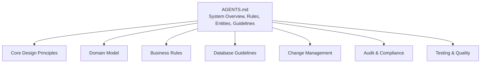
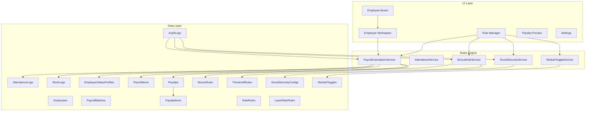
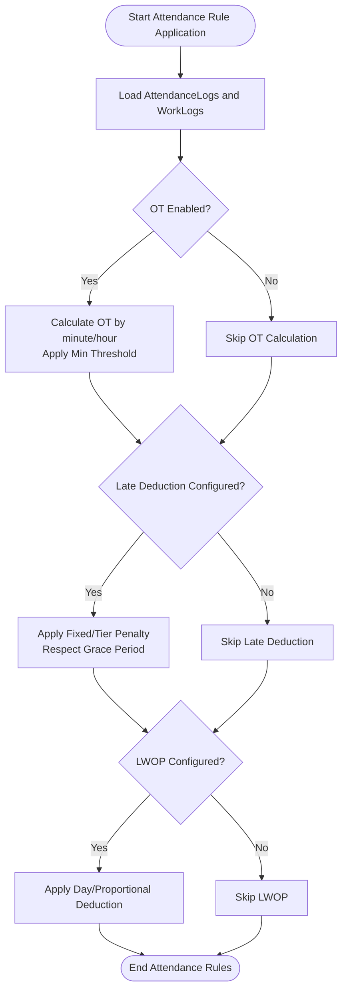
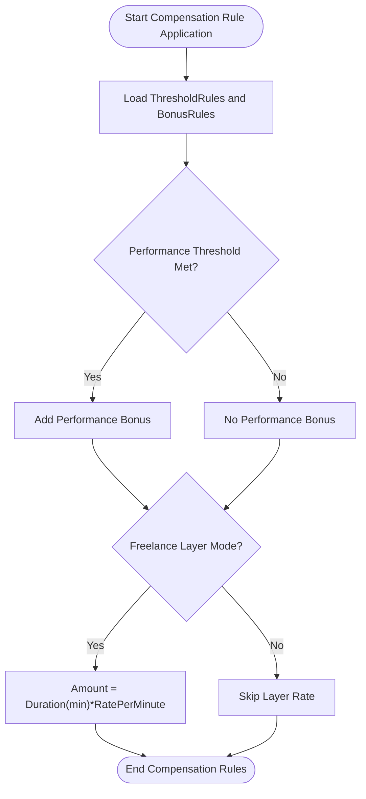
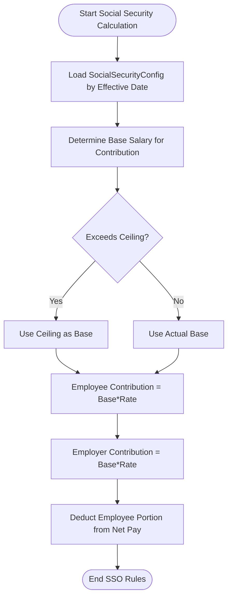
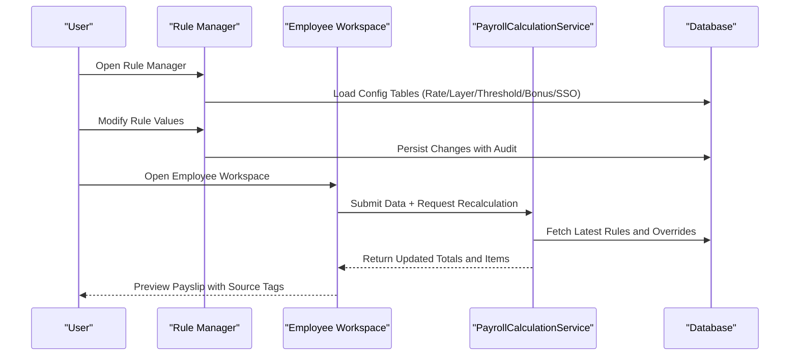
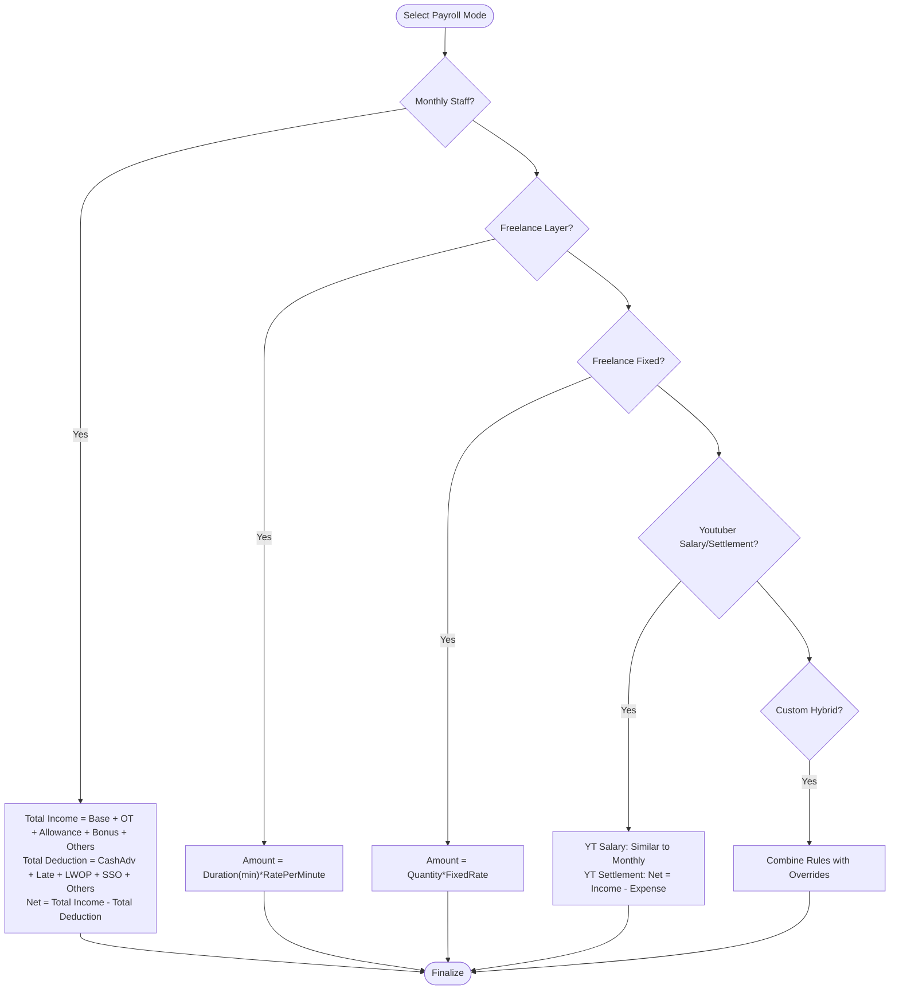
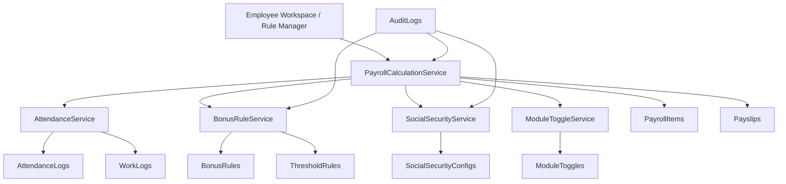

# Business Rules and Configuration

<cite>
**Referenced Files in This Document**
- [AGENTS.md](file://AGENTS.md)
</cite>

## Table of Contents
1. [Introduction](#introduction)
2. [Project Structure](#project-structure)
3. [Core Components](#core-components)
4. [Architecture Overview](#architecture-overview)
5. [Detailed Component Analysis](#detailed-component-analysis)
6. [Dependency Analysis](#dependency-analysis)
7. [Performance Considerations](#performance-considerations)
8. [Troubleshooting Guide](#troubleshooting-guide)
9. [Conclusion](#conclusion)
10. [Appendices](#appendices)

## Introduction
This document explains the business rules and configuration system for the xHR Payroll & Finance System. It focuses on the rule-driven architecture, covering:
- Attendance rules: overtime calculation, late deductions, leave without pay (LWOP)
- Compensation rules: performance bonuses, threshold-based bonuses, layer-rate calculations
- Social security configuration: Thailand-specific rules and effective-date management
- Rule management interface and configuration tables
- Dynamic rule application across payroll modes
- Examples of rule setup, validation logic, and cascading effects through payroll calculation
- Versioning, effective date management, and impact assessment procedures

The system emphasizes dynamic, configurable rules stored in database tables rather than hardcoded logic, with auditability and maintainability as core principles.

## Project Structure
The repository contains a single guide document that defines the system’s design principles, entities, business rules, and operational guidelines. The structure is conceptual and does not include code files.

**Section sources**
- [AGENTS.md:1-692](file://AGENTS.md#L1-L692)

## Core Components
The system is built around a set of core entities and rule categories that define how payroll is calculated and presented. The following components are central to the rule-driven architecture:

- Payroll modes: monthly staff, freelance layer, freelance fixed, youtuber salary, youtuber settlement, custom hybrid
- Attendance and compensation rules: OT, diligence allowance, performance bonus, late deduction, LWOP
- Social security configuration: Thailand-specific rules with configurable rates and ceilings
- Rule management interface: UI for configuring and validating rules
- Configuration tables: rate rules, layer rate rules, bonus rules, threshold rules, social security configs, module toggles
- Audit logging: comprehensive tracking of rule changes and payroll impacts

These components are designed to be configurable, auditable, and maintainable, with clear separation between master data, monthly overrides, manual items, and rule-generated values.

**Section sources**
- [AGENTS.md:121-149](file://AGENTS.md#L121-L149)
- [AGENTS.md:196-221](file://AGENTS.md#L196-L221)
- [AGENTS.md:387-416](file://AGENTS.md#L387-L416)
- [AGENTS.md:438-505](file://AGENTS.md#L438-L505)
- [AGENTS.md:576-595](file://AGENTS.md#L576-L595)

## Architecture Overview
The rule-driven architecture separates concerns into:
- Data model: employees, salary profiles, attendance logs, work logs, payroll batches, and items
- Rule engine: configuration tables and services that apply rules during calculation
- UI layer: employee workspace, rule manager, payslip preview, and settings
- Output: payslips and financial summaries, with snapshots for auditability

**Diagram sources**
- [AGENTS.md:121-149](file://AGENTS.md#L121-L149)
- [AGENTS.md:387-416](file://AGENTS.md#L387-L416)
- [AGENTS.md:636-647](file://AGENTS.md#L636-L647)

**Section sources**
- [AGENTS.md:23-692](file://AGENTS.md#L23-L692)

## Detailed Component Analysis

### Attendance Rules
- Overtime (OT): supports minute/hour-based calculation, minimum thresholds, and enable flags
- Late deduction: supports fixed-per-minute and tiered penalties with grace periods
- LWOP: supports day-based and proportional deductions

These rules are configured via UI and applied dynamically during payroll calculation. They are validated against attendance logs and work logs, and their impact is reflected in monthly payroll items.

**Section sources**
- [AGENTS.md:454-471](file://AGENTS.md#L454-L471)
- [AGENTS.md:499-505](file://AGENTS.md#L499-L505)

### Compensation Rules
- Performance bonus: configurable by threshold rules and bonus rules
- Threshold-based bonuses: define conditions and amounts
- Layer rate calculations: for freelance layer mode, amount equals duration in minutes times rate per minute

These rules are applied after attendance adjustments and influence total income and net pay.

**Section sources**
- [AGENTS.md:404-407](file://AGENTS.md#L404-L407)
- [AGENTS.md:472-480](file://AGENTS.md#L472-L480)
- [AGENTS.md:481-487](file://AGENTS.md#L481-L487)

### Social Security Configuration (Thailand)
- Configurable rates for employee and employer contributions
- Salary ceiling and maximum monthly contribution
- Effective date management to support rule versioning

Rules are applied consistently across payroll modes and are audited for changes.

**Section sources**
- [AGENTS.md:488-497](file://AGENTS.md#L488-L497)

### Rule Management Interface
- Rule Manager UI enables configuration of OT, allowances, bonuses, thresholds, layer rates, SSO, and module toggles
- Employee Workspace allows dynamic editing with instant recalculation and preview
- UI states distinguish locked, auto, manual, override, from_master, rule_applied, draft, finalized

**Section sources**
- [AGENTS.md:228-244](file://AGENTS.md#L228-L244)
- [AGENTS.md:234-235](file://AGENTS.md#L234-L235)
- [AGENTS.md:514-515](file://AGENTS.md#L514-L515)

### Dynamic Rule Application Across Payroll Modes
- Monthly staff: base salary plus OT, allowances, performance bonus, other income; deductions include cash advances, late, LWOP, SSO, and others
- Freelance layer: amount computed from duration and rate per minute
- Freelance fixed: amount equals quantity times fixed rate
- Youtuber salary: similar to monthly staff with module toggle
- Youtuber settlement: net equals total income minus total expense
- Hybrid override: custom combinations of rules

**Section sources**
- [AGENTS.md:440-487](file://AGENTS.md#L440-L487)
- [AGENTS.md:123-130](file://AGENTS.md#L123-L130)

### Example Scenarios
- OT calculation: enable OT flag, set minute/hour mode, define minimum threshold; applied automatically when eligible
- Performance bonus: configure threshold rule and bonus rule; bonus added when performance meets criteria
- Layer rate: set rate per minute; amount computed from logged duration
- SSO Thailand: set employee/employer rates, ceiling, and max monthly contribution; effective date controls versioning

Validation logic ensures:
- Deductions appear only under deductions, not by reducing base salary
- Rule changes are audited and tracked
- Payslip snapshot captures final state for PDF generation

**Section sources**
- [AGENTS.md:454-471](file://AGENTS.md#L454-L471)
- [AGENTS.md:472-487](file://AGENTS.md#L472-L487)
- [AGENTS.md:488-497](file://AGENTS.md#L488-L497)
- [AGENTS.md:562-573](file://AGENTS.md#L562-L573)
- [AGENTS.md:578-595](file://AGENTS.md#L578-L595)

## Dependency Analysis
The rule engine depends on configuration tables and services. The UI interacts with services to compute and present results. Audit logs capture changes to rules and payroll items.

**Diagram sources**
- [AGENTS.md:636-647](file://AGENTS.md#L636-L647)
- [AGENTS.md:387-416](file://AGENTS.md#L387-L416)

**Section sources**
- [AGENTS.md:387-416](file://AGENTS.md#L387-L416)
- [AGENTS.md:576-595](file://AGENTS.md#L576-L595)

## Performance Considerations
- Prefer batch processing for payroll batches to minimize repeated rule evaluations
- Use indexed fields for effective dates, employee IDs, and payroll batch IDs
- Cache frequently accessed rule configurations per effective date
- Limit recalculations to only affected rows when editing in the workspace
- Use snapshots for PDF generation to avoid recomputation overhead

[No sources needed since this section provides general guidance]

## Troubleshooting Guide
Common issues and resolutions:
- Deduction appears in income: verify the critical rule that deductions must not reduce income via base salary adjustments
- SSO mismatch: confirm effective date alignment and ceiling/max monthly contribution values
- Rule not applied: check module toggle and rule enable flags; ensure audit logs reflect recent changes
- Payslip preview differs from final: ensure finalize triggers snapshot and PDF rendering from stored items

Validation checklist:
- Confirm rule changes are audited
- Verify effective date precedence for SSO and other rules
- Ensure UI states clearly mark auto/manual/override sources

**Section sources**
- [AGENTS.md:562-573](file://AGENTS.md#L562-L573)
- [AGENTS.md:578-595](file://AGENTS.md#L578-L595)

## Conclusion
The xHR Payroll & Finance System employs a robust, rule-driven architecture that separates configuration from code, enabling dynamic, auditable, and maintainable payroll processing. By leveraging configuration tables, a dedicated rule manager, and clear UI states, the system supports Thailand-specific social security rules, flexible compensation structures, and multi-mode payroll calculations. Change management and audit logging ensure safe evolution of rules over time.

[No sources needed since this section summarizes without analyzing specific files]

## Appendices

### Appendix A: Configuration Tables
- Rate rules
- Layer rate rules
- Bonus rules
- Threshold rules
- Social security configs
- Module toggles
- Audit logs

**Section sources**
- [AGENTS.md:387-416](file://AGENTS.md#L387-L416)

### Appendix B: Effective Date Management and Impact Assessment
- Effective date controls rule versioning for SSO and other configurable rules
- Impact assessment requires evaluating payroll modes, payslip items, and financial summaries
- Change management asks five key questions before merging any rule or configuration change

**Section sources**
- [AGENTS.md:488-497](file://AGENTS.md#L488-L497)
- [AGENTS.md:650-660](file://AGENTS.md#L650-L660)