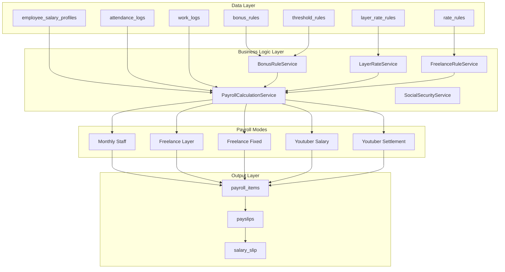
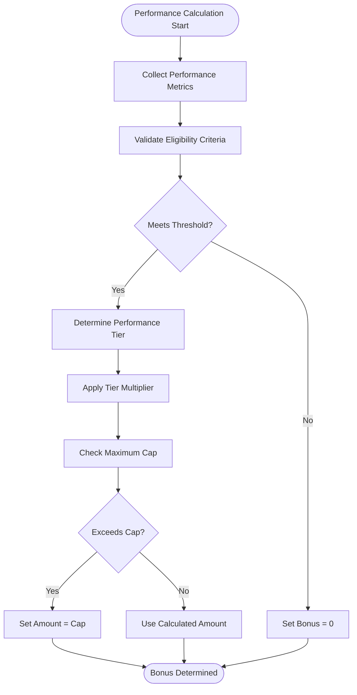
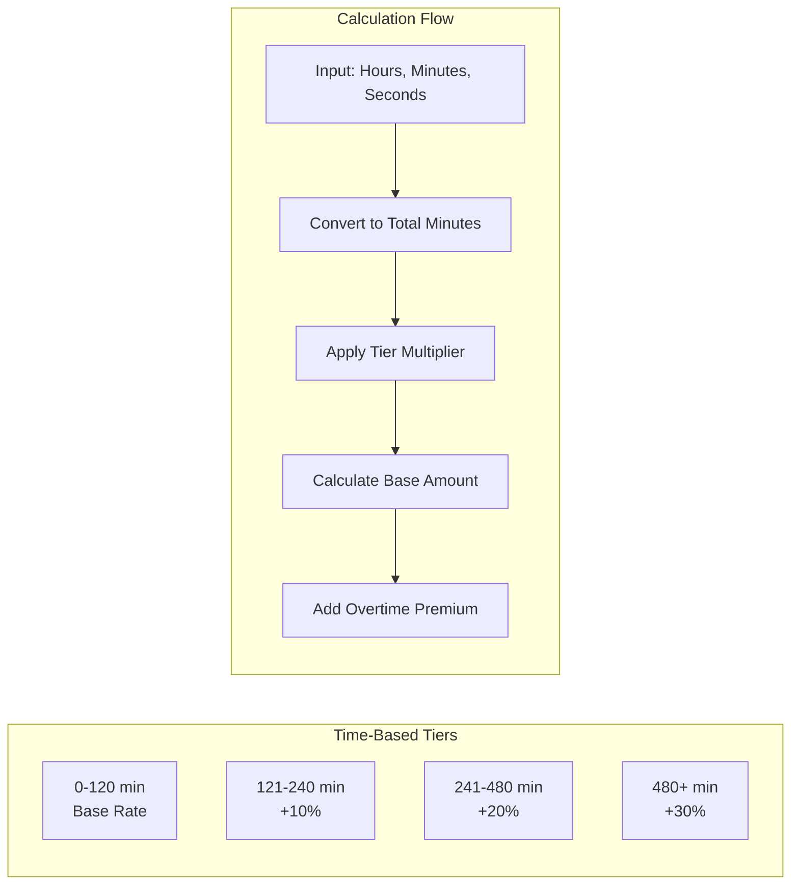
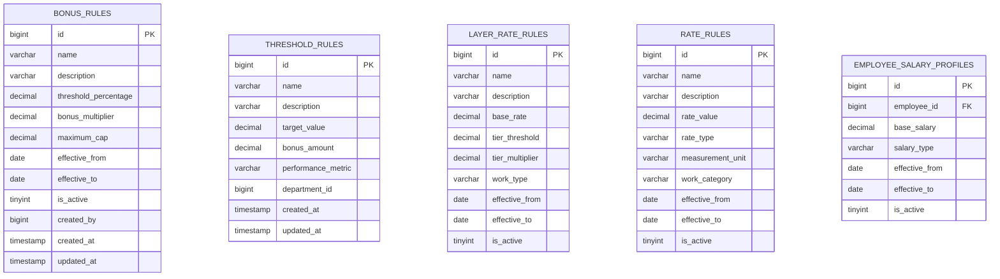
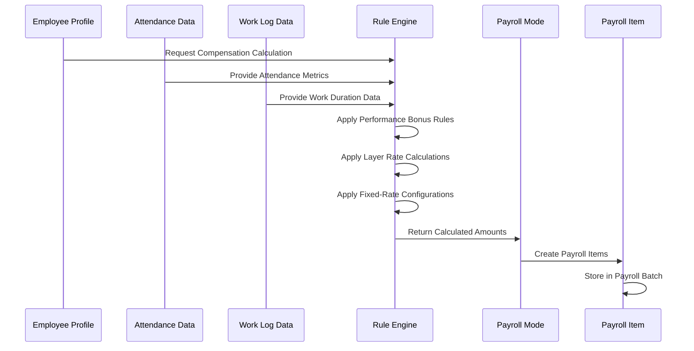
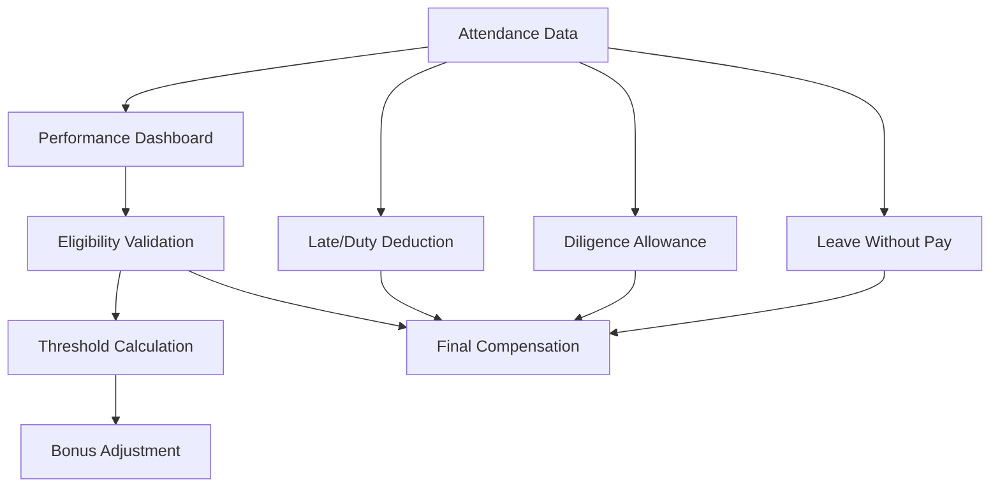
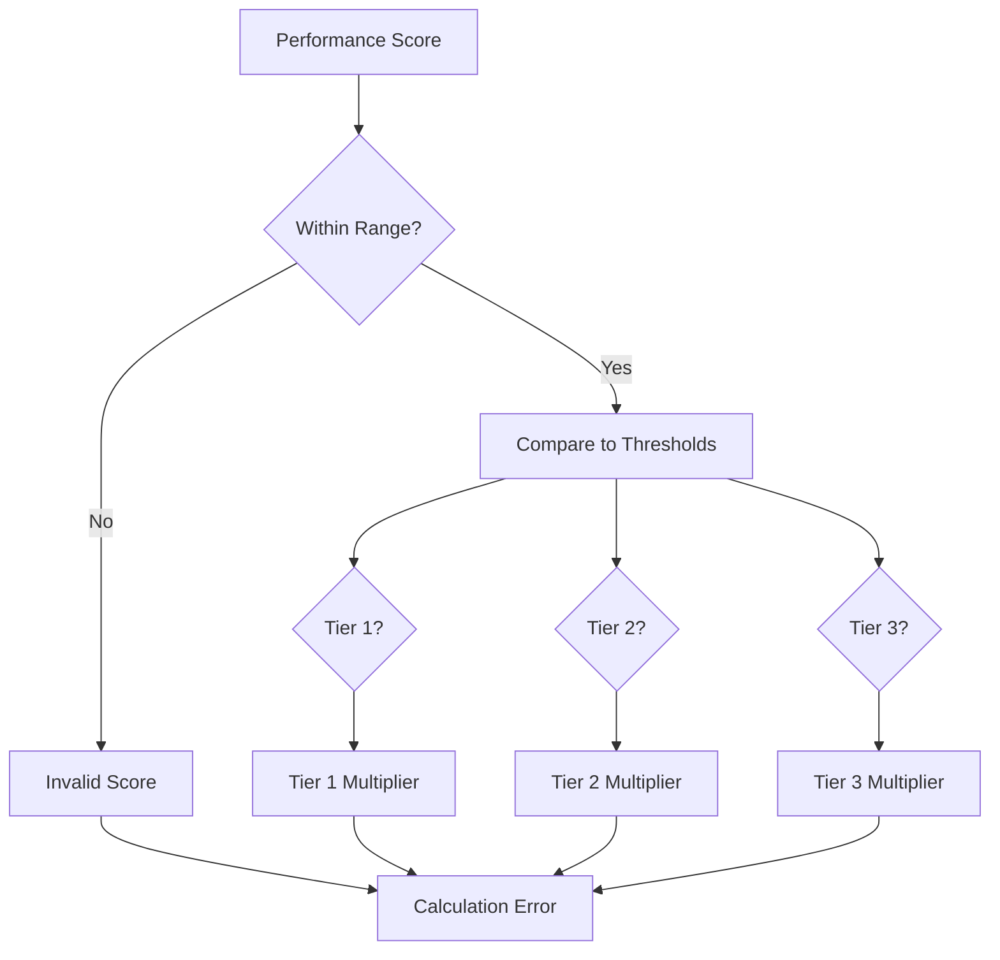

# Compensation Rules

<cite>
**Referenced Files in This Document**
- [AGENTS.md](file://AGENTS.md)
</cite>

## Table of Contents
1. [Introduction](#introduction)
2. [System Architecture](#system-architecture)
3. [Core Compensation Types](#core-compensation-types)
4. [Performance Bonus Rules](#performance-bonus-rules)
5. [Layer Rate Calculation Rules](#layer-rate-calculation-rules)
6. [Fixed-Rate Compensation Rules](#fixed-rate-compensation-rules)
7. [Rule Configuration](#rule-configuration)
8. [Integration with Payroll Modes](#integration-with-payroll-modes)
9. [Attendance and Performance Data Integration](#attendance-and-performance-data-integration)
10. [Calculation Formulas](#calculation-formulas)
11. [Best Practices](#best-practices)
12. [Troubleshooting Guide](#troubleshooting-guide)
13. [Conclusion](#conclusion)

## Introduction

The xHR Payroll & Finance System implements a comprehensive compensation rules framework designed to replace traditional Excel-based payroll calculations with a configurable, rule-driven approach. This system supports multiple compensation types including monthly staff, freelance work, and specialized talent arrangements while maintaining auditability and dynamic configuration capabilities.

The compensation rules system is built around configurable business rules stored in database tables, allowing organizations to modify payroll calculations without code changes. The system emphasizes separation of concerns, with distinct rule sets for different payroll modes and work types.

## System Architecture

The compensation rules system follows a modular architecture with clear separation between data storage, business logic, and presentation layers:



**Diagram sources**
- [AGENTS.md:121-150](file://AGENTS.md#L121-L150)
- [AGENTS.md:387-417](file://AGENTS.md#L387-L417)

## Core Compensation Types

The system supports six primary payroll modes, each with distinct compensation calculation approaches:

### Monthly Staff Mode
Standard salaried employees with fixed monthly compensation plus performance-based bonuses and various allowances.

### Freelance Layer Mode
Independent contractors paid based on time worked with tiered rate structures that increase efficiency incentives.

### Freelance Fixed Mode
Flat-rate payments for specific deliverables or services with predetermined compensation amounts.

### Youtuber Salary Mode
Content creators with monthly salary structures similar to traditional staff but with specialized talent management features.

### Youtuber Settlement Mode
Revenue-based compensation for content creators where net pay equals total income minus expenses.

### Custom Hybrid Mode
Flexible combinations of the above modes for complex employment arrangements.

**Section sources**
- [AGENTS.md:123-131](file://AGENTS.md#L123-L131)
- [AGENTS.md:196-221](file://AGENTS.md#L196-L221)

## Performance Bonus Rules

Performance bonuses represent a critical component of the compensation system, designed to motivate productivity and achievement of organizational goals.

### Threshold-Based Bonus Structure

The performance bonus system operates on configurable threshold rules that determine bonus eligibility and payout amounts:



**Diagram sources**
- [AGENTS.md:440-444](file://AGENTS.md#L440-L444)
- [AGENTS.md:438-506](file://AGENTS.md#L438-L506)

### Eligibility Criteria

Performance bonus eligibility requires meeting specific threshold conditions that vary by employee type and organizational policy. The system validates multiple factors including:

- Performance score thresholds
- Attendance requirements
- Service length criteria
- Department-specific conditions
- Individual achievement metrics

### Tier Structure Implementation

The tier system provides graduated bonus payouts based on performance achievement levels:

| Performance Level | Threshold | Bonus Multiplier | Description |
|-------------------|-----------|------------------|-------------|
| Tier 1 | 80-89% | 0.5x | Meets expectations |
| Tier 2 | 90-99% | 1.0x | Exceeds expectations |
| Tier 3 | 100%+ | 1.5x | Outstanding performance |

### Configuration Requirements

Performance bonus rules require careful configuration of:
- Threshold percentages for each tier
- Maximum bonus caps per employee category
- Eligibility criteria by department or position
- Effective date ranges for rule application
- Audit trail for rule modifications

**Section sources**
- [AGENTS.md:438-506](file://AGENTS.md#L438-L506)
- [AGENTS.md:641](file://AGENTS.md#L641)

## Layer Rate Calculation Rules

The freelance layer rate system provides efficient compensation for time-based work with progressive rate structures that incentivize productivity.

### Minute-Based Calculation Formula

The layer rate system calculates compensation based on precise time measurements with mathematical precision:

```
Total Duration = Minutes + (Seconds / 60)
Amount = Total Duration × Rate Per Minute
```

### Rate Tier Structure

The system implements tiered rate structures that increase compensation efficiency:



**Diagram sources**
- [AGENTS.md:472-476](file://AGENTS.md#L472-L476)

### Amount Determination Process

The amount calculation process ensures fair compensation while maintaining cost control:

1. **Time Input Validation**: Verify hours, minutes, and seconds fall within acceptable ranges
2. **Duration Conversion**: Convert all time inputs to standardized minute measurements
3. **Tier Application**: Apply appropriate rate multiplier based on accumulated time
4. **Premium Calculation**: Add overtime premiums for extended work periods
5. **Minimum Guarantee**: Ensure minimum compensation for partial hours worked

### Rate Configuration Management

Layer rates require flexible configuration for different work types and skill levels:

- Base rates per work type
- Tier threshold definitions
- Overtime premium percentages
- Minimum guarantee amounts
- Effective date management

**Section sources**
- [AGENTS.md:472-476](file://AGENTS.md#L472-L476)
- [AGENTS.md:404-405](file://AGENTS.md#L404-L405)

## Fixed-Rate Compensation Rules

Fixed-rate compensation provides straightforward payment structures for predetermined deliverables or services.

### Quantity-Based Calculation

Fixed-rate compensation operates on simple multiplication principles:

```
Amount = Quantity × Fixed Rate
```

### Work Type Variations

Different work types require specific fixed-rate configurations:

| Work Type | Measurement Unit | Typical Rate Range | Notes |
|-----------|------------------|-------------------|-------|
| Content Creation | Per video | $50-500 | Varies by complexity |
| Translation | Per word | $0.05-0.25 | Based on language pair |
| Design | Per project | $200-2000 | Includes revisions |
| Consulting | Per hour | $50-500 | Experience-based |
| Maintenance | Per task | $25-200 | Complexity-dependent |

### Configuration Flexibility

Fixed-rate systems accommodate various business scenarios:

- **Volume Discounts**: Lower rates for bulk orders
- **Quality Premiums**: Higher rates for premium deliverables
- **Urgency Premiums**: Additional charges for expedited work
- **Revisions Policy**: Clear limits on free revision quantities

**Section sources**
- [AGENTS.md:477-480](file://AGENTS.md#L477-L480)

## Rule Configuration

The compensation rules system provides extensive configuration capabilities through dedicated database tables and management interfaces.

### Database Schema Structure

The system utilizes specialized tables for each rule type:



**Diagram sources**
- [AGENTS.md:387-417](file://AGENTS.md#L387-L417)

### Configuration Management Features

The rule management interface provides comprehensive control over compensation calculations:

- **Effective Date Management**: Rules can be scheduled for future activation
- **Hierarchical Organization**: Rules organized by department, position, or skill level
- **Audit Trail**: Complete history of rule modifications
- **Validation System**: Automatic validation of rule conflicts and inconsistencies
- **Preview Functionality**: Test calculations before rule activation

### Rule Interdependencies

The system manages complex relationships between different rule types:

- Performance bonus rules may depend on attendance thresholds
- Layer rate rules may vary by work type and skill level
- Fixed-rate rules may include volume discounts or premium surcharges
- Social security contributions integrate with all compensation types

**Section sources**
- [AGENTS.md:344-353](file://AGENTS.md#L344-L353)
- [AGENTS.md:387-417](file://AGENTS.md#L387-L417)

## Integration with Payroll Modes

The compensation rules system seamlessly integrates with all supported payroll modes, ensuring consistent calculation logic across different employment types.

### Mode-Specific Integration Points

Each payroll mode applies compensation rules differently:



**Diagram sources**
- [AGENTS.md:123-131](file://AGENTS.md#L123-L131)
- [AGENTS.md:438-506](file://AGENTS.md#L438-L506)

### Cross-Mode Data Sharing

Certain compensation elements can be shared across payroll modes:

- **Performance Metrics**: Attendance and productivity data
- **Skill Ratings**: Professional competency levels
- **Seniority Factors**: Years of service calculations
- **Department Allocations**: Cost center assignments

### Mode-Specific Adjustments

Each payroll mode may require special adjustments:

- **Monthly Staff**: Pro-rated calculations for partial months
- **Freelancers**: Self-employed contribution considerations
- **Youtubers**: Revenue sharing and expense management
- **Hybrid**: Combination of multiple calculation methods

**Section sources**
- [AGENTS.md:123-131](file://AGENTS.md#L123-L131)
- [AGENTS.md:438-506](file://AGENTS.md#L438-L506)

## Attendance and Performance Data Integration

The compensation rules system maintains tight integration with attendance and performance data to ensure fair and accurate compensation calculations.

### Attendance Data Utilization

Attendance information directly impacts compensation through multiple mechanisms:



**Diagram sources**
- [AGENTS.md:322-337](file://AGENTS.md#L322-L337)
- [AGENTS.md:446-450](file://AGENTS.md#L446-L450)

### Performance Metric Collection

The system collects comprehensive performance data:

- **Attendance Tracking**: Check-in/out times, lateness, early departures
- **Work Quality Metrics**: Task completion rates, error frequencies
- **Productivity Indicators**: Output volumes, efficiency ratios
- **Behavioral Assessments**: Team collaboration, initiative scores

### Real-Time Calculation Updates

Compensation calculations update automatically when attendance or performance data changes:

1. **Event Detection**: System monitors data modifications
2. **Rule Re-evaluation**: Applies updated metrics to existing calculations
3. **Recalculation Trigger**: Updates affected payroll items
4. **Audit Logging**: Records all calculation changes

### Data Validation and Quality Assurance

The system implements robust validation for attendance and performance data:

- **Time Range Validation**: Ensures logical work duration
- **Pattern Recognition**: Detects unusual attendance patterns
- **Cross-Reference Validation**: Verifies consistency across data sources
- **Exception Handling**: Manages missing or conflicting data gracefully

**Section sources**
- [AGENTS.md:322-337](file://AGENTS.md#L322-L337)
- [AGENTS.md:446-450](file://AGENTS.md#L446-L450)

## Calculation Formulas

The compensation rules system employs precise mathematical formulas for all calculation types, ensuring consistency and transparency.

### Performance Bonus Formula

```
Bonus = MIN(Maximum_Cap, Target_Amount × Bonus_Multiplier)
```

Where:
- **Target_Amount** = Actual performance metric value
- **Bonus_Multiplier** = Tier-specific multiplier
- **Maximum_Cap** = Pre-configured cap amount

### Layer Rate Calculation

```
Total_Time_Minutes = Hours × 60 + Minutes + (Seconds / 60)
Tier_Multiplier = f(Total_Time_Minutes)
Amount = Total_Time_Minutes × Base_Rate × Tier_Multiplier
```

### Fixed-Rate Calculation

```
Amount = Quantity × Fixed_Rate ± Premiums
```

### Net Pay Calculation

```
Gross_Pay = Sum(Base_Salary, Bonuses, Overtime, Allowances)
Deductions = Sum(Cash_Advance, Late_Deductions, LWOP, SSO)
Net_Pay = Gross_Pay - Deductions
```

### Tier Determination Logic



**Diagram sources**
- [AGENTS.md:440-444](file://AGENTS.md#L440-L444)
- [AGENTS.md:472-476](file://AGENTS.md#L472-L476)

## Best Practices

The compensation rules system incorporates industry best practices for payroll management and compliance.

### Rule Design Principles

- **Transparency**: All calculations should be clearly documented and understandable
- **Consistency**: Same rules apply across similar situations and employees
- **Flexibility**: Rules can be modified without disrupting existing calculations
- **Auditability**: Complete trail of all rule changes and calculations
- **Scalability**: System can handle increasing complexity and data volume

### Data Management Standards

- **Precision**: Monetary calculations use appropriate decimal places
- **Validation**: Input validation prevents calculation errors
- **Backup**: Regular backups of rule configurations and historical data
- **Access Control**: Secure access to sensitive compensation data
- **Compliance**: Adherence to local labor laws and regulations

### Performance Optimization

- **Indexing**: Proper database indexing for frequently accessed rule data
- **Caching**: Strategic caching of frequently used rule configurations
- **Batch Processing**: Efficient batch processing for large-scale calculations
- **Monitoring**: Continuous monitoring of calculation performance and accuracy

### User Experience Guidelines

- **Intuitive Interfaces**: User-friendly interfaces for rule management
- **Real-time Feedback**: Immediate feedback on rule changes and calculations
- **Help Systems**: Comprehensive help and documentation for all features
- **Training Resources**: Training materials for administrators and users

**Section sources**
- [AGENTS.md:196-221](file://AGENTS.md#L196-L221)
- [AGENTS.md:598-620](file://AGENTS.md#L598-L620)

## Troubleshooting Guide

Common issues and their solutions when working with the compensation rules system.

### Calculation Errors

**Issue**: Incorrect bonus amounts despite meeting threshold requirements
**Solution**: 
1. Verify threshold rule configuration
2. Check employee eligibility criteria
3. Review effective date ranges
4. Confirm attendance data accuracy

**Issue**: Layer rate calculations showing unexpected results
**Solution**:
1. Validate tier threshold definitions
2. Check rate configuration accuracy
3. Verify time input formatting
4. Review tier application logic

### Data Integration Problems

**Issue**: Attendance data not affecting performance calculations
**Solution**:
1. Confirm data synchronization between systems
2. Check rule dependencies and precedence
3. Verify data format compatibility
4. Review audit logs for processing errors

### Configuration Issues

**Issue**: New rules not taking effect immediately
**Solution**:
1. Verify effective date settings
2. Check rule activation status
3. Confirm rule precedence order
4. Review batch processing schedules

### Performance Problems

**Issue**: Slow calculation processing during peak periods
**Solution**:
1. Optimize database queries and indexes
2. Implement caching strategies
3. Review rule complexity and dependencies
4. Consider batch processing optimization

**Section sources**
- [AGENTS.md:576-595](file://AGENTS.md#L576-L595)
- [AGENTS.md:612-619](file://AGENTS.md#L612-L619)

## Conclusion

The compensation rules system provides a comprehensive, configurable solution for modern payroll management. By separating business logic from presentation and maintaining strict auditability, the system enables organizations to adapt their compensation strategies quickly while ensuring compliance and fairness.

The modular architecture supports multiple payroll modes while maintaining consistency in calculation logic. The rule-driven approach eliminates hardcoded values and enables dynamic adaptation to changing business requirements.

Key benefits include:
- **Flexibility**: Easy modification of compensation rules without code changes
- **Transparency**: Clear calculation logic and audit trails
- **Scalability**: Support for growing organizations and complex compensation structures
- **Compliance**: Built-in adherence to regulatory requirements
- **Integration**: Seamless connection with attendance and performance systems

The system represents a significant advancement over traditional spreadsheet-based approaches, providing the foundation for modern, efficient payroll management while maintaining the flexibility needed for diverse organizational structures.