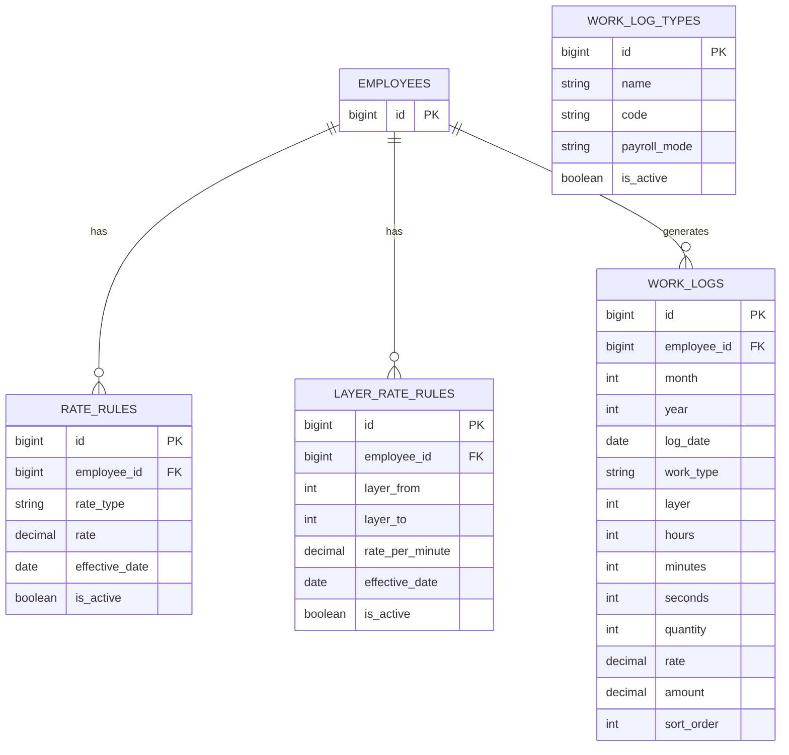
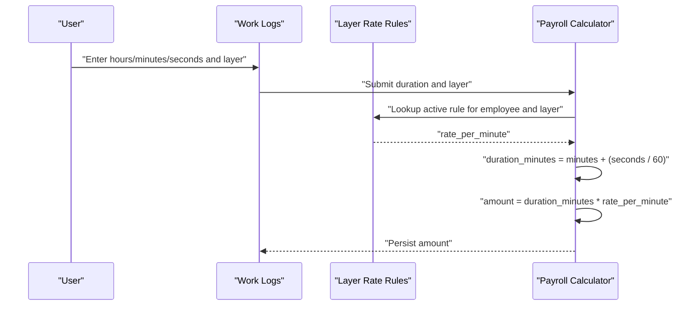
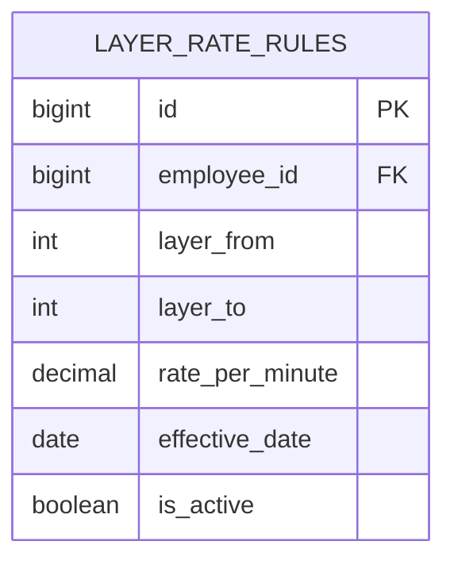
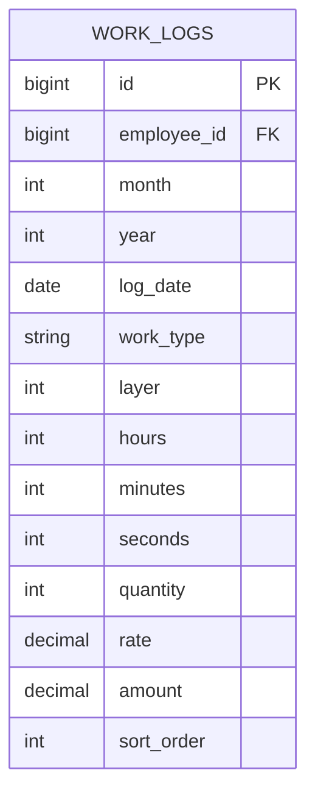
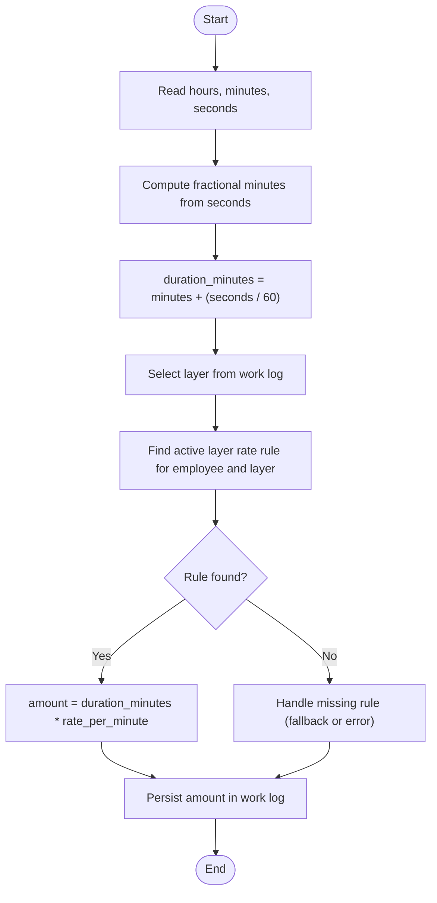
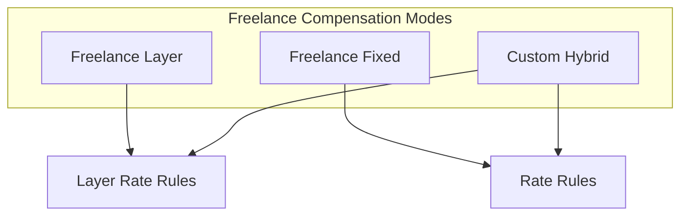
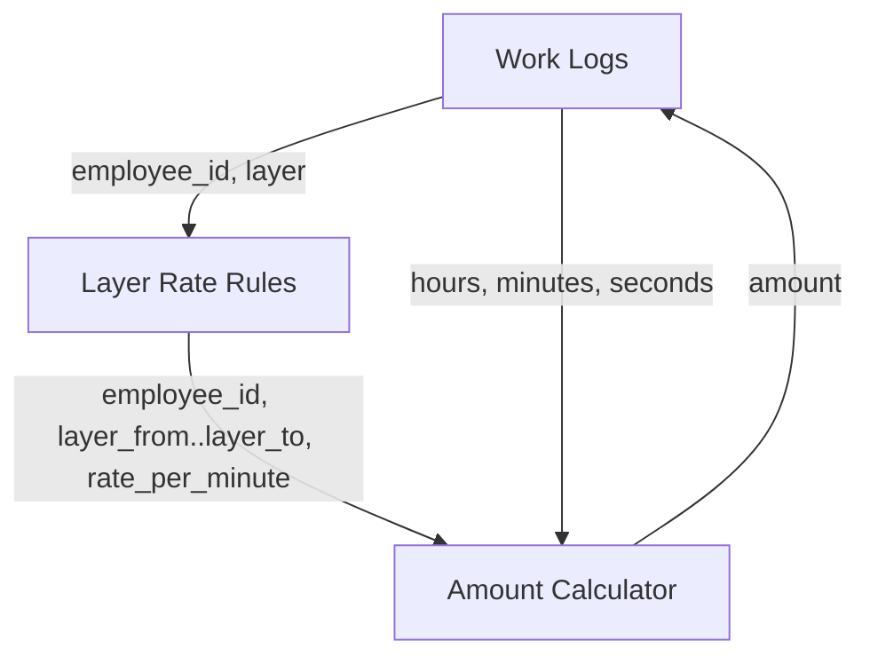

# Layer Rate Calculation Rules

<cite>
**Referenced Files in This Document**
- [AGENTS.md](file://AGENTS.md)
- [create_rules_config_tables.php](file://database/migrations/0001_01_01_000008_create_rules_config_tables.php)
- [create_attendance_worklogs_tables.php](file://database/migrations/0001_01_01_000006_create_attendance_worklogs_tables.php)
</cite>

## Table of Contents
1. [Introduction](#introduction)
2. [Project Structure](#project-structure)
3. [Core Components](#core-components)
4. [Architecture Overview](#architecture-overview)
5. [Detailed Component Analysis](#detailed-component-analysis)
6. [Dependency Analysis](#dependency-analysis)
7. [Performance Considerations](#performance-considerations)
8. [Troubleshooting Guide](#troubleshooting-guide)
9. [Conclusion](#conclusion)

## Introduction
This document explains the layer rate calculation rules used in freelance compensation within the xHR Payroll & Finance System. It covers the minute-based calculation methodology, rate tiers, progressive pricing structures, and amount determination algorithms. It also documents how to configure layer rates, integrate with work logs, and interact with other freelance compensation components such as fixed-rate alternatives and hybrid calculation methods.

## Project Structure
The layer rate system is defined by two core database schemas:
- Rate rules: Defines fixed and hourly rates for employees.
- Layer rate rules: Defines tiered minute-based rates with layer boundaries.

These tables are complemented by the work log schema, which captures duration and quantity for freelance tasks and supports the layer rate calculation.

**Diagram sources**
- [create_rules_config_tables.php:11-35](file://database/migrations/0001_01_01_000008_create_rules_config_tables.php#L11-L35)
- [create_attendance_worklogs_tables.php:40-60](file://database/migrations/0001_01_01_000006_create_attendance_worklogs_tables.php#L40-L60)

**Section sources**
- [create_rules_config_tables.php:11-35](file://database/migrations/0001_01_01_000008_create_rules_config_tables.php#L11-L35)
- [create_attendance_worklogs_tables.php:40-60](file://database/migrations/0001_01_01_000006_create_attendance_worklogs_tables.php#L40-L60)

## Core Components
- Layer rate configuration: Stores per-minute rates grouped into layers with inclusive boundaries. Each rule is effective on a specific date and can be activated or deactivated.
- Work log integration: Captures duration (hours, minutes, seconds) and optional layer number for freelance tasks. The system computes amounts using layer rate rules and duration.
- Amount computation: Uses minute-based duration and applies the applicable rate per minute from the active layer rule.

Key configuration and calculation rules are documented in the business rules section.

**Section sources**
- [AGENTS.md:472-476](file://AGENTS.md#L472-L476)
- [create_rules_config_tables.php:23-35](file://database/migrations/0001_01_01_000008_create_rules_config_tables.php#L23-L35)
- [create_attendance_worklogs_tables.php:40-60](file://database/migrations/0001_01_01_000006_create_attendance_worklogs_tables.php#L40-L60)

## Architecture Overview
The layer rate calculation pipeline integrates work log entries with active layer rate rules to compute payable amounts. The process converts duration to minutes, selects the appropriate layer rule, and multiplies by the per-minute rate.

**Diagram sources**
- [AGENTS.md:472-476](file://AGENTS.md#L472-L476)
- [create_rules_config_tables.php:23-35](file://database/migrations/0001_01_01_000008_create_rules_config_tables.php#L23-L35)
- [create_attendance_worklogs_tables.php:40-60](file://database/migrations/0001_01_01_000006_create_attendance_worklogs_tables.php#L40-L60)

## Detailed Component Analysis

### Layer Rate Configuration
Layer rate rules define:
- Employee association
- Layer boundaries (inclusive range)
- Per-minute rate
- Effective date and activation status

- Layer boundaries: The inclusive range [layer_from, layer_to] determines which layer a work log’s layer value falls into.
- Per-minute rate: Applied to computed duration in minutes to derive the amount.
- Activation: Only active rules contribute to calculations.

**Diagram sources**
- [create_rules_config_tables.php:23-35](file://database/migrations/0001_01_01_000008_create_rules_config_tables.php#L23-L35)

**Section sources**
- [create_rules_config_tables.php:23-35](file://database/migrations/0001_01_01_000008_create_rules_config_tables.php#L23-L35)

### Work Log Integration and Duration-Based Billing
Work logs capture:
- Date and time frame (month/year/log_date)
- Work type and layer
- Duration in hours, minutes, seconds
- Optional quantity and rate
- Computed amount

- Duration conversion: Total duration is expressed in minutes using minutes plus fractional part from seconds.
- Amount derivation: Multiplies duration in minutes by the applicable rate per minute from the selected layer rule.

**Diagram sources**
- [create_attendance_worklogs_tables.php:40-60](file://database/migrations/0001_01_01_000006_create_attendance_worklogs_tables.php#L40-L60)

**Section sources**
- [create_attendance_worklogs_tables.php:40-60](file://database/migrations/0001_01_01_000006_create_attendance_worklogs_tables.php#L40-L60)
- [AGENTS.md:472-476](file://AGENTS.md#L472-L476)

### Amount Determination Algorithm
The algorithm converts raw duration to minutes and computes the payable amount using the applicable layer rule.

**Diagram sources**
- [AGENTS.md:472-476](file://AGENTS.md#L472-L476)
- [create_rules_config_tables.php:23-35](file://database/migrations/0001_01_01_000008_create_rules_config_tables.php#L23-L35)
- [create_attendance_worklogs_tables.php:40-60](file://database/migrations/0001_01_01_000006_create_attendance_worklogs_tables.php#L40-L60)

**Section sources**
- [AGENTS.md:472-476](file://AGENTS.md#L472-L476)

### Relationship to Other Freelance Compensation Components
- Fixed-rate alternative: A separate fixed-rate calculation exists for freelance tasks that do not require tiered rates.
- Hybrid calculation methods: The system supports hybrid modes where layer rates can be combined with other components.

**Diagram sources**
- [AGENTS.md:472-480](file://AGENTS.md#L472-L480)
- [create_rules_config_tables.php:11-21](file://database/migrations/0001_01_01_000008_create_rules_config_tables.php#L11-L21)

**Section sources**
- [AGENTS.md:472-480](file://AGENTS.md#L472-L480)

## Dependency Analysis
Layer rate calculation depends on:
- Active layer rate rules for the employee and the specific layer
- Work log duration fields (hours, minutes, seconds)
- Effective date and activation flags

**Diagram sources**
- [create_rules_config_tables.php:23-35](file://database/migrations/0001_01_01_000008_create_rules_config_tables.php#L23-L35)
- [create_attendance_worklogs_tables.php:40-60](file://database/migrations/0001_01_01_000006_create_attendance_worklogs_tables.php#L40-L60)

**Section sources**
- [create_rules_config_tables.php:23-35](file://database/migrations/0001_01_01_000008_create_rules_config_tables.php#L23-L35)
- [create_attendance_worklogs_tables.php:40-60](file://database/migrations/0001_01_01_000006_create_attendance_worklogs_tables.php#L40-L60)

## Performance Considerations
- Indexing: Composite indexes on employee_id and is_active for layer rate rules improve lookup performance during calculation.
- Decimal precision: Use appropriate precision for rates and amounts to avoid rounding errors in financial computations.
- Batch processing: When calculating for many work logs, batch queries and minimize repeated lookups.

[No sources needed since this section provides general guidance]

## Troubleshooting Guide
Common issues and resolutions:
- No active layer rule found: Verify that an active rule exists for the employee and the specified layer range.
- Incorrect amount: Confirm that the duration was converted to minutes correctly and that the applicable rate per minute matches the intended tier.
- Inactive rule: Ensure the rule is marked active and effective on or before the work log date.
- Missing layer: Ensure the work log specifies a layer that corresponds to a configured layer rule.

**Section sources**
- [create_rules_config_tables.php:23-35](file://database/migrations/0001_01_01_000008_create_rules_config_tables.php#L23-L35)
- [create_attendance_worklogs_tables.php:40-60](file://database/migrations/0001_01_01_000006_create_attendance_worklogs_tables.php#L40-L60)

## Conclusion
The layer rate calculation system provides a flexible, rule-driven framework for freelance compensation. By configuring layer rate rules and capturing accurate duration in work logs, the system computes amounts using a straightforward minute-based formula. This design supports progressive pricing, easy maintenance, and integration with other compensation components.