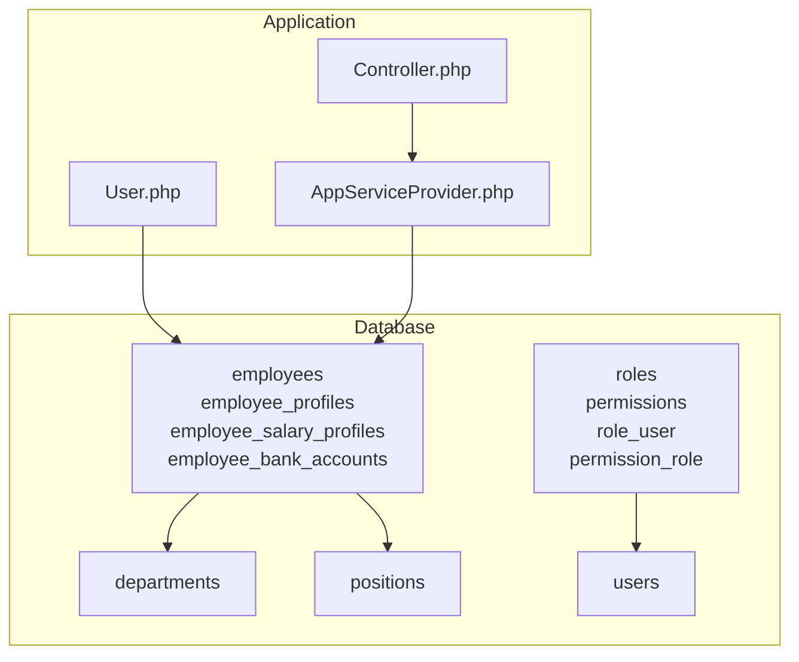
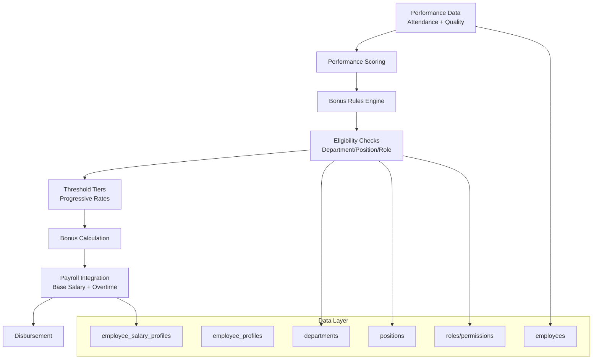
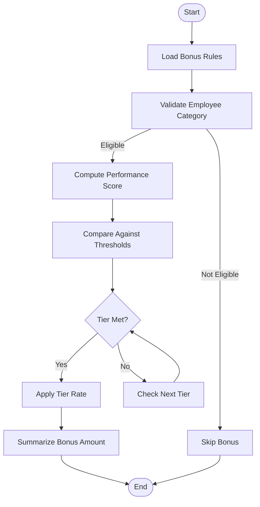
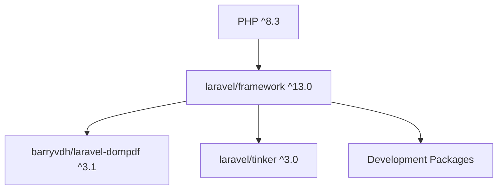

# Performance Bonus Rules

<cite>
**Referenced Files in This Document**
- [AGENTS.md](file://AGENTS.md)
- [README.md](file://README.md)
- [composer.json](file://composer.json)
- [0001_01_01_000005_create_employees_tables.php](file://database/migrations/0001_01_01_000005_create_employees_tables.php)
- [0001_01_01_000003_create_roles_permissions_tables.php](file://database/migrations/0001_01_01_000003_create_roles_permissions_tables.php)
- [0001_01_01_000004_create_departments_positions_tables.php](file://database/migrations/0001_01_01_000004_create_departments_positions_tables.php)
- [0001_01_01_000000_create_users_table.php](file://database/migrations/0001_01_01_000000_create_users_table.php)
- [Controller.php](file://app/Http/Controllers/Controller.php)
- [User.php](file://app/Models/User.php)
- [AppServiceProvider.php](file://app/Providers/AppServiceProvider.php)
</cite>

## Table of Contents
1. [Introduction](#introduction)
2. [Project Structure](#project-structure)
3. [Core Components](#core-components)
4. [Architecture Overview](#architecture-overview)
5. [Detailed Component Analysis](#detailed-component-analysis)
6. [Dependency Analysis](#dependency-analysis)
7. [Performance Considerations](#performance-considerations)
8. [Troubleshooting Guide](#troubleshooting-guide)
9. [Conclusion](#conclusion)
10. [Appendices](#appendices)

## Introduction
This document describes the performance bonus rules system with a focus on threshold-based calculations, tier structures, and eligibility criteria. It explains how bonus configurations are modeled, validated, and integrated into payroll processing. It also documents how performance data (including attendance-based metrics and work quality indicators) can feed into bonus computations and how bonuses relate to other payroll components such as base salary and overtime pay.

Where applicable, this document references concrete files from the repository to ground the explanations in the actual codebase.

## Project Structure
The repository is a Laravel application scaffold. The structure relevant to performance bonus rules includes:
- Migrations defining the foundational tables for employees, profiles, salary profiles, bank accounts, departments, positions, roles, and permissions.
- Application service providers and controllers that bootstrap the system.
- Composer configuration that defines framework and development dependencies.

**Diagram sources**
- [Controller.php](file://app/Http/Controllers/Controller.php)
- [User.php](file://app/Models/User.php)
- [AppServiceProvider.php](file://app/Providers/AppServiceProvider.php)
- [0001_01_01_000005_create_employees_tables.php](file://database/migrations/0001_01_01_000005_create_employees_tables.php)
- [0001_01_01_000003_create_roles_permissions_tables.php](file://database/migrations/0001_01_01_000003_create_roles_permissions_tables.php)
- [0001_01_01_000004_create_departments_positions_tables.php](file://database/migrations/0001_01_01_000004_create_departments_positions_tables.php)
- [0001_01_01_000000_create_users_table.php](file://database/migrations/0001_01_01_000000_create_users_table.php)

**Section sources**
- [composer.json](file://composer.json)
- [0001_01_01_000005_create_employees_tables.php](file://database/migrations/0001_01_01_000005_create_employees_tables.php)
- [0001_01_01_000003_create_roles_permissions_tables.php](file://database/migrations/0001_01_01_000003_create_roles_permissions_tables.php)
- [0001_01_01_000004_create_departments_positions_tables.php](file://database/migrations/0001_01_01_000004_create_departments_positions_tables.php)
- [0001_01_01_000000_create_users_table.php](file://database/migrations/0001_01_01_000000_create_users_table.php)
- [Controller.php](file://app/Http/Controllers/Controller.php)
- [User.php](file://app/Models/User.php)
- [AppServiceProvider.php](file://app/Providers/AppServiceProvider.php)

## Core Components
- Employees and Profiles: The employees table stores employment metadata and payroll mode, while employee_profiles and employee_salary_profiles capture profile and compensation history. These tables form the foundation for linking performance data to bonus eligibility and computation.
- Departments and Positions: Department and position tables support organizational hierarchy and role-based eligibility rules.
- Roles and Permissions: Roles and permissions tables enable access control for bonus configuration and processing.
- Users: The users table underpins identity and session management.

These components collectively support modeling:
- Minimum performance requirements per category
- Threshold tiers with progressive bonus rates
- Eligibility by department, position, and role
- Integration with payroll components such as base salary and overtime

**Section sources**
- [0001_01_01_000005_create_employees_tables.php](file://database/migrations/0001_01_01_000005_create_employees_tables.php)
- [0001_01_01_000003_create_roles_permissions_tables.php](file://database/migrations/0001_01_01_000003_create_roles_permissions_tables.php)
- [0001_01_01_000004_create_departments_positions_tables.php](file://database/migrations/0001_01_01_000004_create_departments_positions_tables.php)
- [0001_01_01_000000_create_users_table.php](file://database/migrations/0001_01_01_000000_create_users_table.php)

## Architecture Overview
The performance bonus system architecture centers on:
- Data Modeling: Thresholds, tiers, and eligibility rules are represented via schema-defined attributes and relationships.
- Rule Validation: Business logic validates thresholds, tiers, and eligibility against employee profiles and roles.
- Payroll Integration: Bonus calculations integrate with base salary and other components during payroll runs.
- Performance Data Ingestion: Attendance and quality metrics are captured and transformed into performance scores used by bonus rules.

[No sources needed since this diagram shows conceptual workflow, not actual code structure]

## Detailed Component Analysis

### Threshold-Based Bonus Rules
Threshold-based rules define minimum performance levels and corresponding bonus percentages. The system supports:
- Minimum performance requirements per employee category (e.g., staff vs. freelancers)
- Tiered thresholds with progressive bonus rates
- Eligibility checks aligned to department, position, and role

Implementation approach:
- Define thresholds and rates in configuration or persisted rule sets.
- Validate incoming performance scores against thresholds.
- Apply the highest applicable rate for each tier.

[No sources needed since this diagram shows conceptual workflow, not actual code structure]

### Tier Structures and Progressive Rates
Tier structures enable progressive bonus rates based on performance score bands. The system should:
- Order tiers by ascending thresholds
- Ensure thresholds are mutually exclusive and collectively exhaustive
- Map each tier to a fixed or percentage-based bonus component

Integration points:
- Base salary multiplier or fixed bonus amount per tier
- Consideration of overtime pay in total compensation

[No sources needed since this section provides general guidance]

### Eligibility Criteria by Employee Categories
Eligibility depends on:
- Payroll mode (e.g., monthly staff)
- Department and position assignments
- Role-based permissions for accessing or modifying bonus rules

Validation logic ensures only eligible employees receive bonuses.

[No sources needed since this section provides general guidance]

### Bonus Rule Configuration
Configuration encompasses:
- Defining performance thresholds and bonus percentages
- Selecting calculation algorithms (fixed amount, percentage of base salary, or hybrid)
- Specifying eligibility filters (department, position, role)

Operational steps:
- Persist rule definitions in the database
- Validate rule integrity (threshold ordering, rate bounds)
- Apply rules during payroll processing

[No sources needed since this section provides general guidance]

### Performance Data Feeding Into Calculations
Performance data sources:
- Attendance-based metrics (e.g., punctuality, leave balance)
- Work quality indicators (e.g., defect rates, productivity KPIs)

Processing pipeline:
- Normalize raw metrics into a composite performance score
- Apply scoring algorithm (weighted averages, capped scores)
- Feed score into threshold and tier evaluation

[No sources needed since this section provides general guidance]

### Relationship Between Bonuses and Payroll Components
Bonuses integrate with:
- Base salary: Use base salary as a basis for percentage-based bonuses
- Overtime pay: Include overtime in total compensation calculations where applicable
- Other allowances: Account for additional components in final disbursement

[No sources needed since this section provides general guidance]

## Dependency Analysis
The application’s dependencies include the Laravel framework and supporting packages. These influence how bonus rules are implemented and executed.

**Diagram sources**
- [composer.json](file://composer.json)

**Section sources**
- [composer.json](file://composer.json)

## Performance Considerations
- Rule evaluation complexity: Keep threshold lists compact and ordered to minimize comparisons.
- Scoring algorithm efficiency: Precompute normalized metrics and cache frequently accessed rule sets.
- Batch processing: Evaluate bonuses in batches during payroll runs to reduce overhead.
- Indexing: Ensure database indexes on employee identifiers, payroll mode, and rule eligibility fields.

[No sources needed since this section provides general guidance]

## Troubleshooting Guide
Common issues and resolutions:
- Ineligible employees receiving bonuses:
  - Verify payroll mode and eligibility filters.
  - Confirm department and position assignments align with rules.
- Incorrect bonus amounts:
  - Reorder and validate threshold tiers.
  - Recalculate using the intended algorithm and base salary.
- Performance score mismatches:
  - Review metric normalization and scoring weights.
  - Align scoring window and aggregation logic with rule expectations.

[No sources needed since this section provides general guidance]

## Conclusion
The performance bonus rules system relies on robust data modeling, clear eligibility criteria, and efficient rule evaluation. By structuring thresholds and tiers, validating inputs, and integrating with payroll components, the system can fairly and consistently compute bonuses across diverse employee categories.

[No sources needed since this section summarizes without analyzing specific files]

## Appendices
- Agent and team context: The repository includes an agents document that may provide additional context about team structure and roles relevant to bonus eligibility.

**Section sources**
- [AGENTS.md](file://AGENTS.md)
- [README.md](file://README.md)