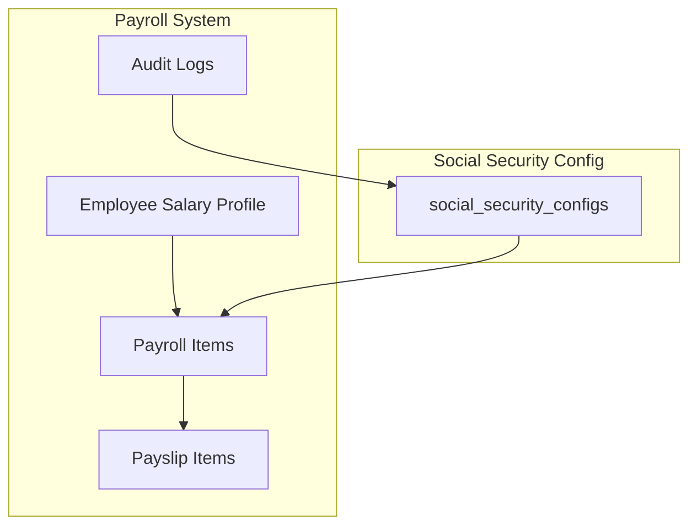
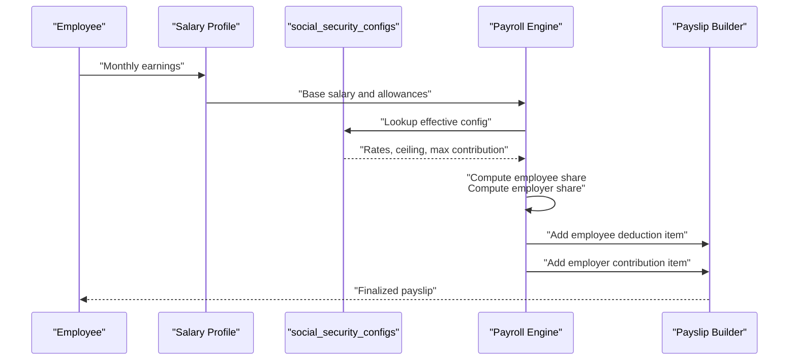
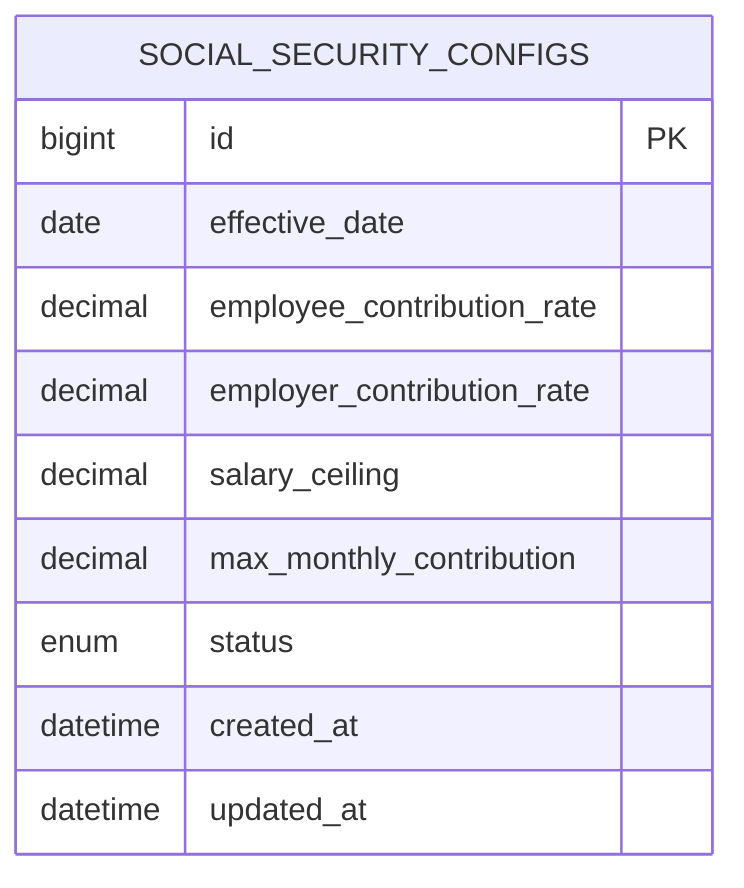
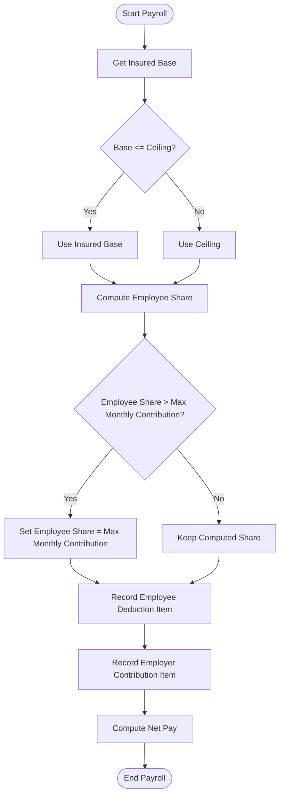
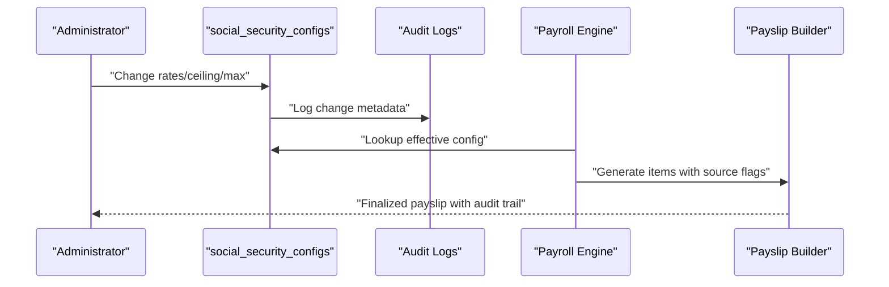
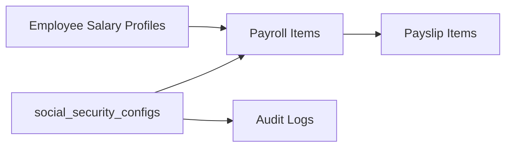

# Social Security Configuration

<cite>
**Referenced Files in This Document**
- [AGENTS.md](file://AGENTS.md)
</cite>

## Table of Contents
1. [Introduction](#introduction)
2. [Project Structure](#project-structure)
3. [Core Components](#core-components)
4. [Architecture Overview](#architecture-overview)
5. [Detailed Component Analysis](#detailed-component-analysis)
6. [Dependency Analysis](#dependency-analysis)
7. [Performance Considerations](#performance-considerations)
8. [Troubleshooting Guide](#troubleshooting-guide)
9. [Conclusion](#conclusion)
10. [Appendices](#appendices)

## Introduction
This document describes the Thailand-specific social security configuration model and operational guidelines for the xHR Payroll & Finance System. It focuses on how configurable rates and limits are defined, how effective dates govern rule changes, and how the system integrates with payroll calculations to compute employee and employer contributions. It also outlines compliance and audit requirements for maintaining accurate and traceable social security settings.

## Project Structure
The repository provides a specification and design guide that defines the social security configuration table, supported fields, and integration points with payroll and audit systems. The relevant artifacts include:
- A dedicated configuration table for Thailand social security settings
- Business rules governing calculation inputs (employee/employer contribution rates, salary ceiling, and maximum monthly contribution)
- Audit and compliance requirements for rule changes

**Diagram sources**
- [AGENTS.md:407-408](file://AGENTS.md#L407-L408)
- [AGENTS.md:442-444](file://AGENTS.md#L442-L444)
- [AGENTS.md:488-496](file://AGENTS.md#L488-L496)
- [AGENTS.md:593-594](file://AGENTS.md#L593-L594)

**Section sources**
- [AGENTS.md:407-408](file://AGENTS.md#L407-L408)
- [AGENTS.md:442-444](file://AGENTS.md#L442-L444)
- [AGENTS.md:488-496](file://AGENTS.md#L488-L496)
- [AGENTS.md:593-594](file://AGENTS.md#L593-L594)

## Core Components
The Thailand social security configuration is governed by a set of configurable parameters and effective-date-based change management. The core components are:
- Employee contribution rate: percentage applied to the insured base to compute the employee’s share
- Employer contribution rate: percentage applied to the insured base to compute the employer’s share
- Salary ceiling: maximum insured base subject to social security contributions
- Maximum monthly contribution: cap on the total contribution amount per month

These parameters are stored and managed in the social security configuration table and are referenced during payroll calculation to derive the employee portion recorded as a deduction and the employer portion recorded as a separate item.

**Section sources**
- [AGENTS.md:488-496](file://AGENTS.md#L488-L496)
- [AGENTS.md:442-444](file://AGENTS.md#L442-L444)
- [AGENTS.md:407-408](file://AGENTS.md#L407-L408)

## Architecture Overview
The Thailand social security configuration integrates with the payroll engine and payslip generation pipeline. Effective dates control which configuration applies to a given payroll period. The system enforces that contributions are computed from the insured base up to the salary ceiling, capped by the maximum monthly contribution, and recorded consistently across income and deduction buckets.

**Diagram sources**
- [AGENTS.md:442-444](file://AGENTS.md#L442-L444)
- [AGENTS.md:488-496](file://AGENTS.md#L488-L496)
- [AGENTS.md:407-408](file://AGENTS.md#L407-L408)

## Detailed Component Analysis

### Thailand Social Security Configuration Table
The configuration table stores Thailand-specific social security parameters and supports effective date management to ensure historical accuracy and compliance. The table is designed to:
- Store employee and employer contribution rates
- Define the salary ceiling and maximum monthly contribution
- Track effective date transitions for rule changes
- Support auditability and compliance reporting

**Diagram sources**
- [AGENTS.md:407-408](file://AGENTS.md#L407-L408)
- [AGENTS.md:488-496](file://AGENTS.md#L488-L496)

**Section sources**
- [AGENTS.md:407-408](file://AGENTS.md#L407-L408)
- [AGENTS.md:488-496](file://AGENTS.md#L488-L496)

### Payroll Calculation Integration
The payroll engine references the effective social security configuration to compute:
- Employee share: derived from the insured base up to the ceiling, capped by the maximum monthly contribution
- Employer share: derived similarly but recorded as an employer liability item
- Deduction item: the employee’s share is included in the total deduction computation for net pay

**Diagram sources**
- [AGENTS.md:442-444](file://AGENTS.md#L442-L444)
- [AGENTS.md:488-496](file://AGENTS.md#L488-L496)

**Section sources**
- [AGENTS.md:442-444](file://AGENTS.md#L442-L444)
- [AGENTS.md:488-496](file://AGENTS.md#L488-L496)

### Effective Date Management
Effective date management ensures that social security configurations apply only from their effective date forward. This mechanism supports:
- Historical accuracy for prior periods
- Controlled rollouts of rule changes
- Auditability of when and why changes occurred

Best practices:
- Always specify an effective date when adding or modifying a configuration
- Maintain chronological order of configurations
- Avoid overlapping effective dates unless intentional and documented

**Section sources**
- [AGENTS.md:488-490](file://AGENTS.md#L488-L490)

### Compliance and Audit Requirements
Compliance and audit requirements for Thailand social security settings include:
- Logging all changes to social security configurations with who, what, when, old/new values, and reason
- Maintaining audit logs for rule changes and their impact on payroll items
- Ensuring payslip snapshots capture the exact configuration used for finalization
- Verifying that employee and employer shares are recorded consistently across income and deduction buckets

**Diagram sources**
- [AGENTS.md:593-594](file://AGENTS.md#L593-L594)
- [AGENTS.md:407-408](file://AGENTS.md#L407-L408)

**Section sources**
- [AGENTS.md:593-594](file://AGENTS.md#L593-L594)
- [AGENTS.md:407-408](file://AGENTS.md#L407-L408)

## Dependency Analysis
The Thailand social security configuration depends on:
- Employee salary profiles to establish the insured base
- Payroll items to record employee and employer contributions
- Audit logs to track configuration changes
- Payslip items to present final computed values

**Diagram sources**
- [AGENTS.md:407-408](file://AGENTS.md#L407-L408)
- [AGENTS.md:442-444](file://AGENTS.md#L442-L444)
- [AGENTS.md:593-594](file://AGENTS.md#L593-L594)

**Section sources**
- [AGENTS.md:407-408](file://AGENTS.md#L407-L408)
- [AGENTS.md:442-444](file://AGENTS.md#L442-L444)
- [AGENTS.md:593-594](file://AGENTS.md#L593-L594)

## Performance Considerations
- Keep the number of active effective configurations reasonable to avoid complex lookups
- Index effective_date and status for efficient retrieval
- Cache frequently accessed configurations per payroll batch to reduce repeated queries
- Validate configuration ranges (rates, ceiling, max contribution) to prevent expensive reprocessing

## Troubleshooting Guide
Common issues and resolutions:
- Incorrect employee deduction: Verify the insured base does not exceed the ceiling and that the computed share does not surpass the maximum monthly contribution
- Missing employer contribution: Confirm the employer contribution item exists and is not overridden manually
- Audit discrepancies: Review audit logs for the last change to the configuration and confirm the effective date alignment
- Payroll variance after rule change: Re-run payroll for affected periods to reconcile differences

**Section sources**
- [AGENTS.md:488-496](file://AGENTS.md#L488-L496)
- [AGENTS.md:593-594](file://AGENTS.md#L593-L594)

## Conclusion
The Thailand social security configuration is a rule-driven, auditable component integrated into the payroll system. By leveraging effective date management, configurable rates and limits, and strict audit logging, the system ensures compliance, transparency, and accurate computation of employee and employer contributions across payslips.

## Appendices

### Configuration Fields Summary
- Employee contribution rate: percentage applied to the insured base
- Employer contribution rate: percentage applied to the insured base
- Salary ceiling: maximum insured base for contributions
- Maximum monthly contribution: cap on total contribution per month

**Section sources**
- [AGENTS.md:488-496](file://AGENTS.md#L488-L496)