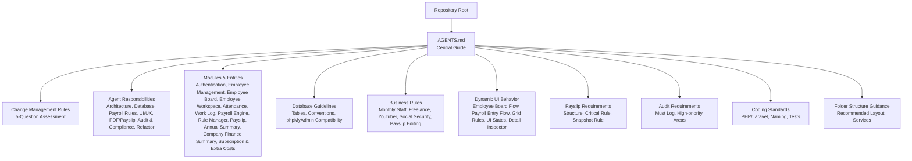
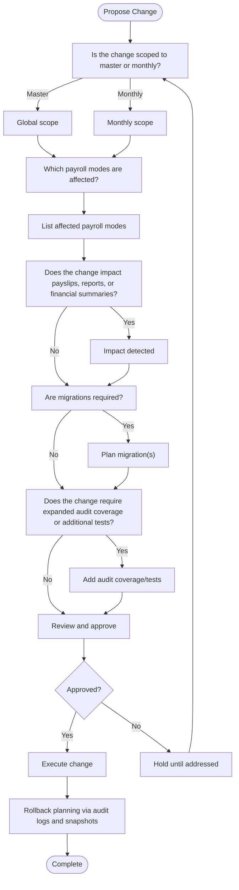
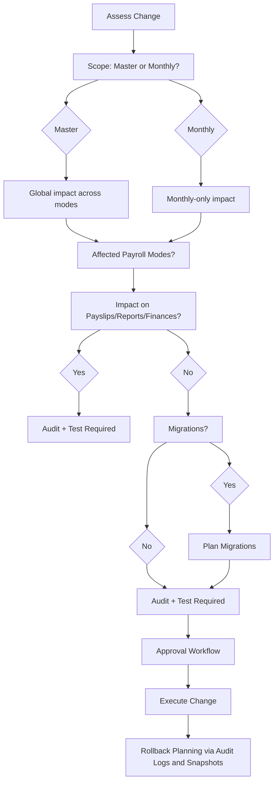
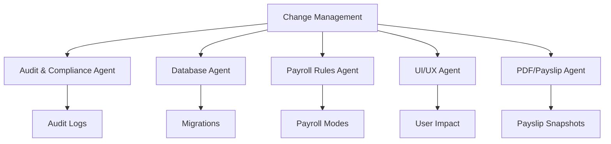

# Change Management Process

<cite>
**Referenced Files in This Document**
- [AGENTS.md](file://AGENTS.md)
</cite>

## Table of Contents
1. [Introduction](#introduction)
2. [Project Structure](#project-structure)
3. [Core Components](#core-components)
4. [Architecture Overview](#architecture-overview)
5. [Detailed Component Analysis](#detailed-component-analysis)
6. [Dependency Analysis](#dependency-analysis)
7. [Performance Considerations](#performance-considerations)
8. [Troubleshooting Guide](#troubleshooting-guide)
9. [Conclusion](#conclusion)
10. [Appendices](#appendices)

## Introduction
This document defines the change management process and development workflow for the xHR Payroll & Finance System. It formalizes the five-question assessment framework for evaluating system changes, outlines approval and risk assessment procedures, and establishes rollback planning, emergency change handling, hotfix procedures, regression testing requirements, version control practices, release management, and stakeholder communication.

## Project Structure
The repository contains a single, authoritative guide that documents the system’s design principles, responsibilities of agents, modules, database guidelines, business rules, dynamic UI behavior, payslip requirements, audit requirements, coding standards, folder structure guidance, change management rules, anti-patterns, deliverables, and definition of done. This central document serves as the single source of truth for change decisions and development practices.

**Diagram sources**
- [AGENTS.md](file://AGENTS.md)

**Section sources**
- [AGENTS.md](file://AGENTS.md)

## Core Components
This section focuses on the change management framework and related development practices defined in the repository.

- Five-question assessment framework for evaluating system changes:
  - Is the change scoped to master or monthly?
  - Which payroll modes are affected?
  - Does the change impact payslips, reports, or financial summaries?
  - Are migrations required?
  - Does the change require expanded audit coverage or additional tests?

- Approval and risk assessment:
  - Changes must be evaluated against the five-question framework.
  - If any question cannot be answered confidently, the change must not be merged without further review.

- Rollback planning:
  - Audit logs capture who changed what, when, and why.
  - Snapshot rules preserve finalized payslip data for historical integrity.
  - Soft deletes and status columns support reversible modifications where applicable.

- Emergency changes and hotfixes:
  - The repository emphasizes auditability and controlled editing; emergency changes should still follow documented audit and approval steps.
  - Hotfixes should minimize scope, include targeted tests, and update audit coverage accordingly.

- Regression testing:
  - Testing minimum deliverables include payroll mode calculations, SSO calculations, layer rate tests, payslip snapshot tests, and audit logging tests.

- Version control and release management:
  - Migrations and seed data are part of the minimum deliverables.
  - Releases should include project structure, database schema, migrations, seed data, model relationships, services, rule manager, UI, payslip builder, audit logs, annual summary, and company finance summary.

- Stakeholder communication:
  - The repository does not define explicit communication procedures; however, the audit trail and snapshot rules provide transparency for stakeholders.

**Section sources**
- [AGENTS.md](file://AGENTS.md)

## Architecture Overview
The change management process integrates with the system’s architecture through the following mechanisms:
- Master vs monthly scope determines whether changes propagate globally or are constrained to a specific month.
- Payroll mode coverage ensures changes are validated across all supported modes.
- Impact on payslips, reports, and financial summaries triggers audit and testing requirements.
- Migration requirements ensure database schema updates are tracked and reversible.
- Audit and test coverage guarantees traceability and quality.

**Diagram sources**
- [AGENTS.md](file://AGENTS.md)

## Detailed Component Analysis
This section analyzes the five-question assessment framework and related processes in detail.

### Five-Question Assessment Framework
- Purpose: Ensure every change is evaluated systematically for scope, impact, and safety.
- Scope determination:
  - Master scope affects global configurations and rules.
  - Monthly scope limits changes to a specific payroll cycle.
- Payroll mode coverage:
  - Supported modes include monthly staff, freelance layer, freelance fixed, youtuber salary, youtuber settlement, and custom hybrid.
  - Changes affecting rules or data structures must be validated across all impacted modes.
- Impact on payslips, reports, and finances:
  - Payroll engine calculations, payslip generation, and financial summaries must remain accurate.
  - Snapshot rules preserve finalized payslips for audit and compliance.
- Migration requirements:
  - Database schema changes must be captured via migrations and seed data.
  - phpMyAdmin compatibility and shared hosting constraints must be considered.
- Audit and test coverage:
  - Must-log fields include actor, entity, field, old/new values, action, timestamp, and optional reason.
  - High-priority audit areas include salary profiles, payroll item amounts, payslip finalize/unfinalize, rule changes, and module toggle changes.

**Diagram sources**
- [AGENTS.md](file://AGENTS.md)

**Section sources**
- [AGENTS.md](file://AGENTS.md)

### Approval Workflow and Risk Assessment Procedures
- Approval gate: If any of the five questions cannot be answered confidently, the change must not be merged without further review.
- Risk assessment:
  - Evaluate scope, payroll mode coverage, impact on payslips/reports/finances, migration requirements, and audit/test coverage.
  - Document rationale and evidence for each decision.
- Rollback planning:
  - Maintain audit logs with full traceability.
  - Preserve payslip snapshots for historical integrity.
  - Use soft deletes and status columns where appropriate to enable reversals.

**Section sources**
- [AGENTS.md](file://AGENTS.md)

### Emergency Changes, Hotfix Procedures, and Regression Testing
- Emergency changes:
  - Even under pressure, follow the five-question assessment and approval workflow.
  - Limit scope to the minimal necessary change.
- Hotfix procedures:
  - Targeted fixes with focused tests.
  - Update audit coverage to reflect the change.
- Regression testing:
  - Minimum deliverables include payroll mode calculation tests, SSO calculation tests, layer rate tests, payslip snapshot tests, and audit logging tests.

**Section sources**
- [AGENTS.md](file://AGENTS.md)

### Version Control Practices, Release Management, and Stakeholder Communication
- Version control practices:
  - Track database schema changes via migrations and seed data.
  - Maintain commit messages that reference audit logs and test coverage.
- Release management:
  - Minimum deliverables include project structure, database schema, migrations, seed data, model relationships, payroll services, rule manager, employee workspace UI, payslip builder + PDF, audit logs, annual summary, and company finance summary.
- Stakeholder communication:
  - The repository does not define explicit communication procedures; however, audit logs and snapshot rules provide transparency for stakeholders.

**Section sources**
- [AGENTS.md](file://AGENTS.md)

## Dependency Analysis
The change management process depends on several subsystems:
- Audit and compliance agent for maintaining audit logs and rollback capability.
- Database agent for designing schema, migrations, and phpMyAdmin compatibility.
- Payroll rules agent for validating changes across payroll modes and ensuring rule-driven logic.
- UI/UX agent for ensuring user-visible impacts are understood and tested.
- PDF/payslip agent for preserving payslip snapshots and ensuring PDF integrity.

**Diagram sources**
- [AGENTS.md](file://AGENTS.md)

**Section sources**
- [AGENTS.md](file://AGENTS.md)

## Performance Considerations
- Audit logs and snapshot preservation add overhead; ensure indexing and status columns are optimized for query performance.
- Migration planning should minimize downtime and consider phpMyAdmin compatibility constraints.
- Regression tests should be efficient and targeted to reduce CI/CD pipeline time.

[No sources needed since this section provides general guidance]

## Troubleshooting Guide
Common issues and resolutions:
- Change not approved:
  - Re-evaluate the five-question framework and gather missing evidence or approvals.
- Audit gaps:
  - Add audit coverage for the affected entity and ensure logging captures who, what, when, and why.
- Migration conflicts:
  - Review migrations and seed data; ensure phpMyAdmin compatibility and shared hosting constraints are met.
- Regression failures:
  - Run targeted tests for payroll modes, SSO calculations, layer rates, payslip snapshots, and audit logging.

**Section sources**
- [AGENTS.md](file://AGENTS.md)

## Conclusion
The change management process outlined in the repository provides a robust framework for evaluating, approving, and executing system changes while maintaining auditability, safety, and traceability. By consistently applying the five-question assessment, following approval and risk assessment procedures, planning for rollback, and adhering to version control and release practices, teams can ensure reliable and transparent evolution of the xHR Payroll & Finance System.

[No sources needed since this section summarizes without analyzing specific files]

## Appendices
- Minimum deliverables checklist:
  - Project structure
  - Database schema
  - Migrations
  - Seed data
  - Model relationships
  - Payroll services
  - Rule manager
  - Employee workspace UI
  - Payslip builder + PDF
  - Audit logs
  - Annual summary
  - Company finance summary

**Section sources**
- [AGENTS.md](file://AGENTS.md)