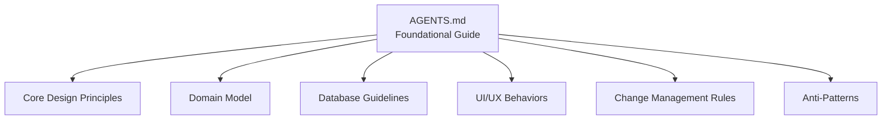
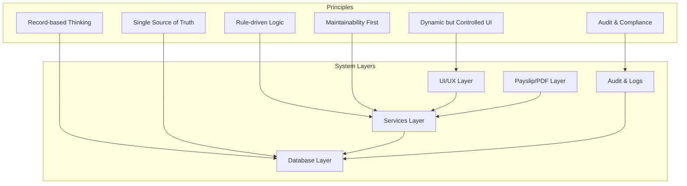
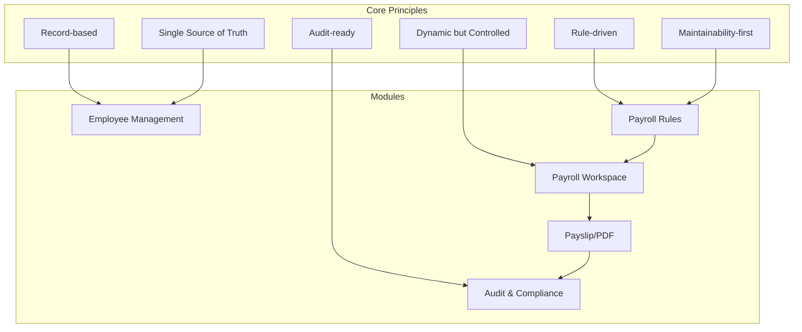

# Core Design Principles

<cite>
**Referenced Files in This Document**
- [AGENTS.md](file://AGENTS.md)
</cite>

## Table of Contents
1. [Introduction](#introduction)
2. [Project Structure](#project-structure)
3. [Core Components](#core-components)
4. [Architecture Overview](#architecture-overview)
5. [Detailed Component Analysis](#detailed-component-analysis)
6. [Dependency Analysis](#dependency-analysis)
7. [Performance Considerations](#performance-considerations)
8. [Troubleshooting Guide](#troubleshooting-guide)
9. [Conclusion](#conclusion)

## Introduction
This document explains the six fundamental design principles that guide the xHR Payroll & Finance System development. These principles prevent common Excel-related anti-patterns and ensure system integrity through structured, maintainable, and auditable engineering practices. The principles are:
- Record-based thinking over cell-based Excel logic
- Single source of truth for all data
- Rule-driven instead of hardcoded business logic
- Dynamic but controlled editing interface
- Maintainability-first approach
- Audit-ability and compliance-ready foundation

These principles are documented comprehensively in the project’s foundational guide and are reflected across the domain model, database design guidelines, UI behavior expectations, and operational workflows.

## Project Structure
The repository currently contains a single foundational document that defines the system’s principles, domain model, and operational constraints. The document serves as the contract for development and ensures alignment across all agents (roles) involved in building and maintaining the system.

**Diagram sources**
- [AGENTS.md:34-100](file://AGENTS.md#L34-L100)
- [AGENTS.md:121-151](file://AGENTS.md#L121-L151)
- [AGENTS.md:385-436](file://AGENTS.md#L385-L436)
- [AGENTS.md:508-547](file://AGENTS.md#L508-L547)
- [AGENTS.md:650-661](file://AGENTS.md#L650-L661)
- [AGENTS.md:663-673](file://AGENTS.md#L663-L673)

**Section sources**
- [AGENTS.md:1-721](file://AGENTS.md#L1-L721)

## Core Components
The six core design principles are defined and explained in the foundational guide. Each principle includes:
- Statement of intent
- Implementation guidance
- Examples of anti-patterns to avoid
- Expected outcomes and benefits

Key principle statements and their locations:
- Record-based thinking over cell-based Excel logic: [AGENTS.md:36-48](file://AGENTS.md#L36-L48)
- Single source of truth for all data: [AGENTS.md:49-60](file://AGENTS.md#L49-L60)
- Rule-driven instead of hardcoded business logic: [AGENTS.md:61-74](file://AGENTS.md#L61-L74)
- Dynamic but controlled editing interface: [AGENTS.md:75-91](file://AGENTS.md#L75-L91)
- Maintainability-first approach: [AGENTS.md:92-99](file://AGENTS.md#L92-L99)

**Section sources**
- [AGENTS.md:36-99](file://AGENTS.md#L36-L99)

## Architecture Overview
The principles collectively define an architecture that:
- Stores all logic and data as records in the database
- Enforces a single authoritative source for each data type
- Encapsulates business rules in configuration tables
- Provides a spreadsheet-like UI with strict backend controls
- Prioritizes long-term maintainability and auditability

**Diagram sources**
- [AGENTS.md:36-99](file://AGENTS.md#L36-L99)
- [AGENTS.md:153-283](file://AGENTS.md#L153-L283)
- [AGENTS.md:508-547](file://AGENTS.md#L508-L547)
- [AGENTS.md:576-596](file://AGENTS.md#L576-L596)

## Detailed Component Analysis

### Principle 1: Record-based Thinking over Cell-based Excel Logic
- Purpose: Replace spreadsheet-centric thinking with persistent, relational records.
- Implementation:
  - Store all values as rows in tables with explicit identifiers (e.g., employee_id, payroll_batch_id, payroll_item_type, work_log_id).
  - Avoid referencing positions like B33, X22, jan!X62.
  - Build calculations and validations around record relationships rather than cell offsets.
- Database design implications:
  - Use normalized schemas with explicit foreign keys and composite keys where needed.
  - Prefer descriptive identifiers over positional references.
- UI behavior patterns:
  - Grid editing should operate on rows with explicit row IDs and types.
  - Inline edits should update persisted records, not transient spreadsheet cells.
- Development workflow impacts:
  - Business logic moves from views/controllers to services and repositories.
  - Testing focuses on record transitions and derived calculations.
- Anti-pattern prevention:
  - Prevents reliance on arbitrary cell positions that break when rows are inserted or deleted.
  - Ensures deterministic, repeatable calculations across environments.

Concrete examples from the system:
- Use of employee_id and payroll_item_type as identifiers instead of cell addresses.
- Requirement to avoid using spreadsheet positions as data sources.

**Section sources**
- [AGENTS.md:36-48](file://AGENTS.md#L36-L48)

### Principle 2: Single Source of Truth
- Purpose: Maintain one authoritative source for each data category to eliminate inconsistencies.
- Implementation:
  - Define canonical sources for each data type (e.g., employees, employee_profiles, employee_salary_profiles, rate_rules, layer_rate_rules, payroll_items, payslips, company_monthly_summaries).
- Database design implications:
  - Establish clear ownership of data categories and enforce referential integrity.
  - Avoid duplicating authoritative data across unrelated tables.
- UI behavior patterns:
  - When editing, always reflect values from the single source.
  - Disallow editing of derived or secondary copies.
- Development workflow impacts:
  - Changes propagate consistently across modules that depend on the canonical source.
  - Audit becomes simpler because all modifications originate from one place.
- Anti-pattern prevention:
  - Prevents divergent data states caused by multiple sources of truth.

Concrete examples from the system:
- Canonical sources table: [AGENTS.md:52-59](file://AGENTS.md#L52-L59)

**Section sources**
- [AGENTS.md:49-60](file://AGENTS.md#L49-L60)

### Principle 3: Rule-driven Instead of Hardcoded Business Logic
- Purpose: Encapsulate business rules in configuration tables so they can be changed without code deployments.
- Implementation:
  - Store formulas and thresholds in dedicated tables (e.g., rate_rules, layer_rate_rules, bonus_rules, threshold_rules, social_security_configs).
  - Avoid embedding critical logic in views or controllers.
- Database design implications:
  - Add rule tables with effective dates, statuses, and metadata to support versioning and audits.
- UI behavior patterns:
  - Rule manager screens allow authorized users to adjust parameters.
  - Calculations recompute automatically when rules change.
- Development workflow impacts:
  - Reduces risk of breaking changes by moving logic out of code.
  - Enables non-technical stakeholders to manage certain aspects of the system.
- Anti-pattern prevention:
  - Prevents “magic numbers” and hardcoded values that become outdated.

Concrete examples from the system:
- Rule categories: [AGENTS.md:65-74](file://AGENTS.md#L65-L74)
- Example rule definitions: [AGENTS.md:440-497](file://AGENTS.md#L440-L497)

**Section sources**
- [AGENTS.md:61-74](file://AGENTS.md#L61-L74)
- [AGENTS.md:440-497](file://AGENTS.md#L440-L497)

### Principle 4: Dynamic but Controlled Editing Interface
- Purpose: Provide a spreadsheet-like user experience while enforcing backend controls and auditability.
- Implementation:
  - Allow inline editing, adding/removing/duplicating rows, and instant recalculation.
  - Enforce source flags (auto, manual, override, master), audit logs, permissions, and validation.
- Database design implications:
  - Track provenance of values and maintain snapshots for finalized items.
- UI behavior patterns:
  - Show field states (locked, auto, manual, override, from_master, rule_applied, draft, finalized).
  - Provide detail inspector to show source, formula/rule, and audit history.
- Development workflow impacts:
  - UI updates trigger backend recalculations and logging.
  - Controls prevent unauthorized or inconsistent changes.
- Anti-pattern prevention:
  - Prevents uncontrolled spreadsheets that lack audit trails or governance.

Concrete examples from the system:
- UI states: [AGENTS.md:529-538](file://AGENTS.md#L529-L538)
- Detail inspector behavior: [AGENTS.md:539-546](file://AGENTS.md#L539-L546)

**Section sources**
- [AGENTS.md:75-91](file://AGENTS.md#L75-L91)
- [AGENTS.md:529-546](file://AGENTS.md#L529-L546)

### Principle 5: Maintainability-first Approach
- Purpose: Ensure the system remains easy to extend and modify over time.
- Implementation:
  - Enable adding new payroll modes, rules, toggles, and reports without major refactoring.
  - Support changing ceilings, slip formats, and configurations dynamically.
- Database design implications:
  - Use extensible schemas and enums-as-configurations where appropriate.
- UI behavior patterns:
  - Provide modular screens and consistent navigation across modules.
- Development workflow impacts:
  - Favor small, focused services and clear separation of concerns.
  - Reduce duplication and promote reuse.
- Anti-pattern prevention:
  - Prevents accumulation of technical debt and monolithic code.

Concrete examples from the system:
- Supported payroll modes: [AGENTS.md:124-131](file://AGENTS.md#L124-L131)
- Maintainability goals: [AGENTS.md:94-98](file://AGENTS.md#L94-L98)

**Section sources**
- [AGENTS.md:92-99](file://AGENTS.md#L92-L99)
- [AGENTS.md:124-131](file://AGENTS.md#L124-L131)

### Principle 6: Audit-ability and Compliance-ready Foundation
- Purpose: Capture all meaningful changes for transparency, traceability, and compliance.
- Implementation:
  - Log who, what entity, what field, old/new values, action, timestamp, and optional reason.
  - Focus audit on high-risk areas: salary profiles, payroll items, payslip finalize/unfinalize, rule changes, module toggles, SSO config changes.
- Database design implications:
  - Maintain audit logs with sufficient metadata for reconstruction.
- UI behavior patterns:
  - Display audit timelines and allow drill-down into changes.
- Development workflow impacts:
  - Enforce mandatory audit for sensitive operations.
  - Provide rollback capability where feasible.
- Anti-pattern prevention:
  - Prevents silent changes and lack of accountability.

Concrete examples from the system:
- Audit logging requirements: [AGENTS.md:578-587](file://AGENTS.md#L578-L587)
- High-priority audit areas: [AGENTS.md:589-594](file://AGENTS.md#L589-L594)

**Section sources**
- [AGENTS.md:576-596](file://AGENTS.md#L576-L596)

## Dependency Analysis
The principles create dependencies across layers and modules:

**Diagram sources**
- [AGENTS.md:36-99](file://AGENTS.md#L36-L99)
- [AGENTS.md:153-283](file://AGENTS.md#L153-L283)
- [AGENTS.md:576-596](file://AGENTS.md#L576-L596)

**Section sources**
- [AGENTS.md:36-99](file://AGENTS.md#L36-L99)
- [AGENTS.md:153-283](file://AGENTS.md#L153-L283)
- [AGENTS.md:576-596](file://AGENTS.md#L576-L596)

## Performance Considerations
- Prefer normalized schemas with appropriate indexing to support frequent recalculations and reporting.
- Use batch operations for mass edits to reduce redundant recalculations.
- Cache frequently accessed rule sets and configuration tables to minimize repeated reads.
- Ensure audit logs are indexed for quick lookups during compliance reviews.

[No sources needed since this section provides general guidance]

## Troubleshooting Guide
Common issues and resolutions aligned with the principles:
- Symptom: Values change unexpectedly after inserting rows
  - Cause: Cell-based logic still referenced
  - Resolution: Switch to record-based identifiers and recalculation via services
- Symptom: Conflicting values across modules
  - Cause: Multiple sources of truth
  - Resolution: Enforce single source of truth and disallow editing of derived copies
- Symptom: Hard-to-track changes
  - Cause: No audit logging
  - Resolution: Implement mandatory audit logs with required fields
- Symptom: Inconsistent rule behavior
  - Cause: Hardcoded logic
  - Resolution: Move rules to configuration tables and rebuild UI to reflect changes

**Section sources**
- [AGENTS.md:663-673](file://AGENTS.md#L663-L673)
- [AGENTS.md:578-587](file://AGENTS.md#L578-L587)

## Conclusion
The six design principles form the foundation of the xHR system, ensuring it behaves like a modern spreadsheet while maintaining the reliability, traceability, and extensibility of a production-grade system. By adhering to record-based thinking, single sources of truth, rule-driven logic, controlled dynamic editing, maintainability-first practices, and robust auditability, the system avoids Excel-related pitfalls and scales effectively for real-world payroll and finance operations.