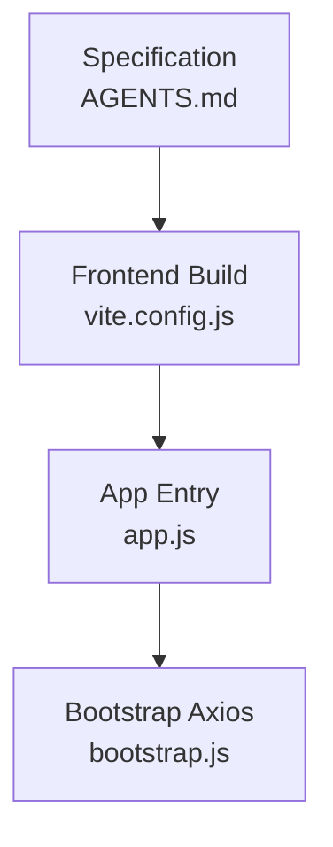
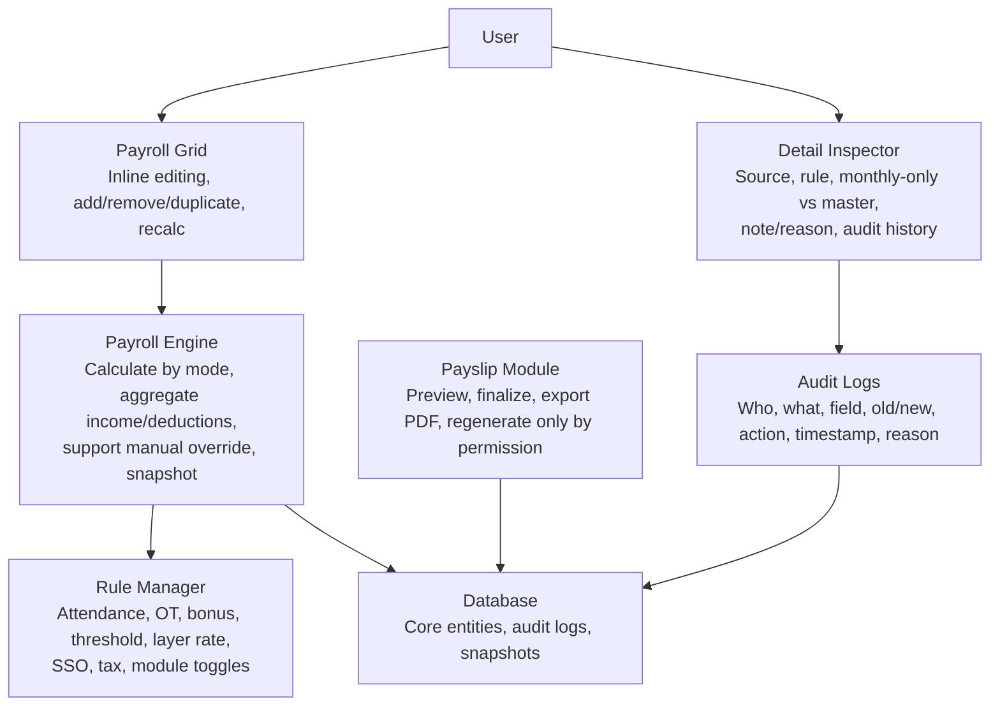
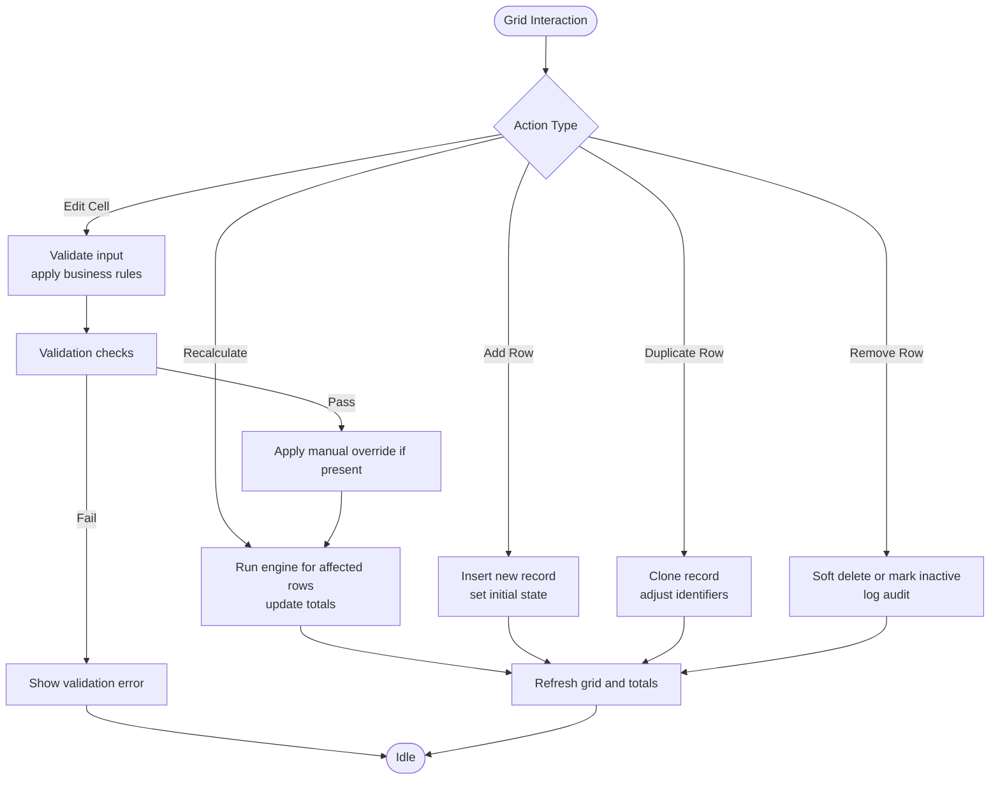
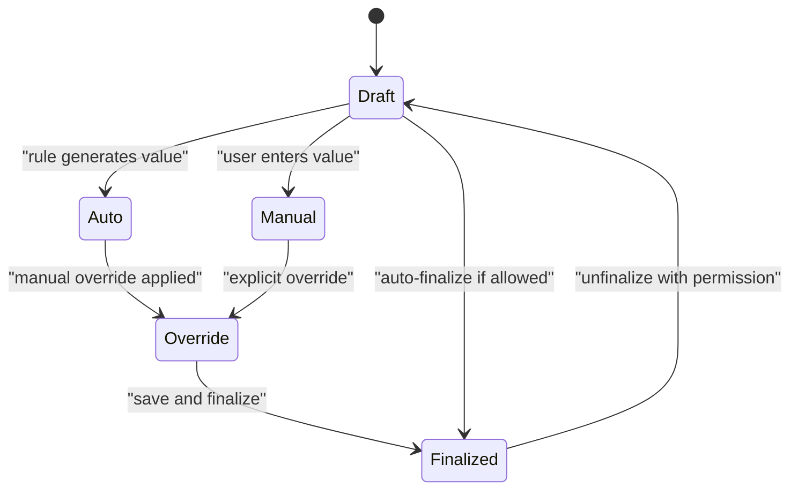
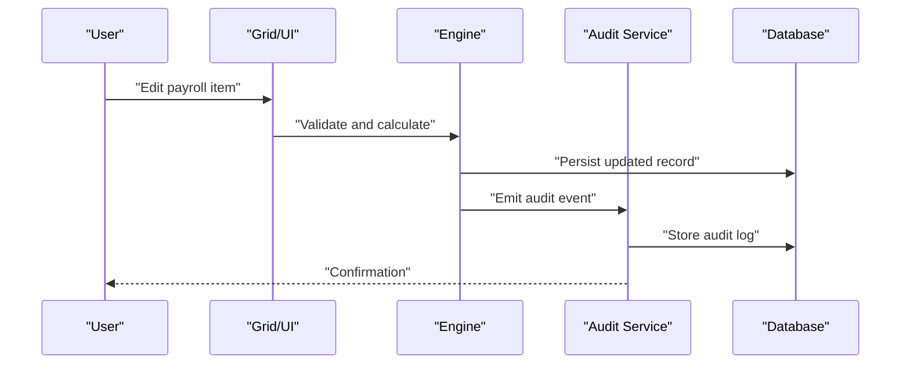
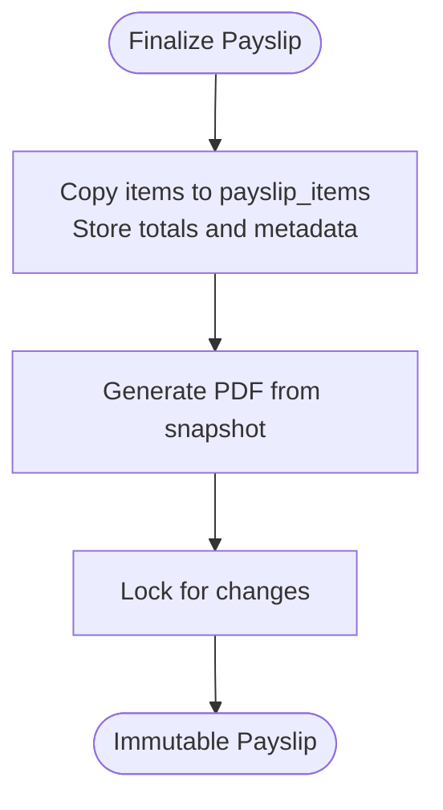
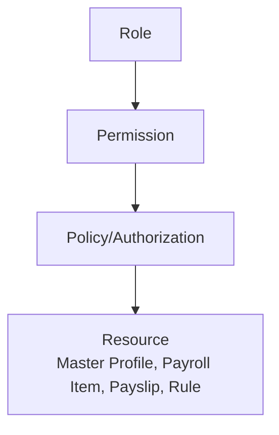
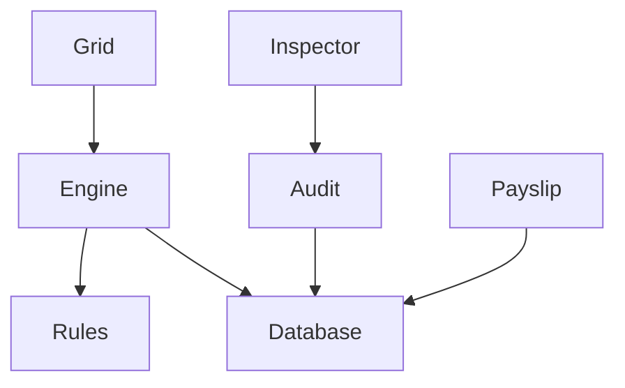

# Dynamic but Controlled Editing Interface

<cite>
**Referenced Files in This Document**
- [AGENTS.md](file://AGENTS.md)
- [app.js](file://laravel-temp/resources/js/app.js)
- [bootstrap.js](file://laravel-temp/resources/js/bootstrap.js)
- [vite.config.js](file://laravel-temp/vite.config.js)
</cite>

## Table of Contents
1. [Introduction](#introduction)
2. [Project Structure](#project-structure)
3. [Core Components](#core-components)
4. [Architecture Overview](#architecture-overview)
5. [Detailed Component Analysis](#detailed-component-analysis)
6. [Dependency Analysis](#dependency-analysis)
7. [Performance Considerations](#performance-considerations)
8. [Troubleshooting Guide](#troubleshooting-guide)
9. [Conclusion](#conclusion)
10. [Appendices](#appendices)

## Introduction
This document defines a dynamic but controlled editing interface that delivers an Excel-like user experience while enforcing strict system controls. It specifies supported editing behaviors (inline editing, row addition/removal/duplication, instant recalculation), mandatory controls (source flags, audit logging, permission control, validation), and implementation patterns for building spreadsheet-like interfaces that maintain data integrity and traceability.

## Project Structure
The repository provides a comprehensive specification for the payroll and finance system. While the current workspace includes only the specification document and minimal frontend build configuration, the specification outlines the full system design, UI behaviors, and backend requirements.

**Diagram sources**
- [AGENTS.md](file://AGENTS.md)
- [vite.config.js](file://laravel-temp/vite.config.js)
- [app.js](file://laravel-temp/resources/js/app.js)
- [bootstrap.js](file://laravel-temp/resources/js/bootstrap.js)

**Section sources**
- [AGENTS.md](file://AGENTS.md)
- [vite.config.js](file://laravel-temp/vite.config.js)
- [app.js](file://laravel-temp/resources/js/app.js)
- [bootstrap.js](file://laravel-temp/resources/js/bootstrap.js)

## Core Components
This section maps the specification to the core components required for dynamic but controlled editing.

- Supported editing behaviors
  - Inline editing
  - Add/remove/duplicate rows
  - Instant recalculation
- Mandatory controls
  - Source flags: auto, manual, override, master
  - Audit logging
  - Permission control
  - Validation
- UI states and inspector
  - Field states: locked, auto, manual, override, from_master, rule_applied, draft, finalized
  - Detail inspector: source visibility, formula/rule source, monthly-only vs master, note/reason, audit history

Implementation patterns derived from the specification:
- Record-based, not cell-based: all logic and state stored as records in the database
- Single source of truth: centralized authoritative data sources
- Rule-driven, not hardcoded: formulas and rules stored in configuration tables
- Maintainability first: modular services and clear separation of concerns

**Section sources**
- [AGENTS.md](file://AGENTS.md)

## Architecture Overview
The system architecture balances a familiar spreadsheet UI with robust backend controls. The specification prescribes:
- A main payroll grid supporting add/remove/duplicate, inline editing, dropdowns, auto calculation, manual override, and recalculation
- A detail inspector for each row with source visibility, rule source, monthly-only vs master indicators, note/reason, and audit history
- A payslip module with preview, finalize, and PDF export from a snapshot
- Audit logging capturing who, what, field, old/new values, action, timestamp, and optional reason

**Diagram sources**
- [AGENTS.md](file://AGENTS.md)

**Section sources**
- [AGENTS.md](file://AGENTS.md)

## Detailed Component Analysis

### Dynamic Grid Behaviors
The main payroll grid supports:
- Add/remove/duplicate rows
- Inline editing with dropdowns for type/category
- Auto amount calculation and manual override
- Instant recalculation and source badges
- Row selection for the detail inspector

**Diagram sources**
- [AGENTS.md](file://AGENTS.md)

**Section sources**
- [AGENTS.md](file://AGENTS.md)

### Source Flags and State Management
Each field or row maintains explicit state to ensure traceability:
- locked: protected from changes
- auto: value generated by rules
- manual: user-entered value
- override: intentional deviation from auto value
- from_master: inherited from master profile
- rule_applied: indicates rule-derived value
- draft/finalized: lifecycle state

**Diagram sources**
- [AGENTS.md](file://AGENTS.md)

**Section sources**
- [AGENTS.md](file://AGENTS.md)

### Audit Logging Workflow
Every significant change triggers an audit log capturing:
- Actor (who)
- Entity and field (what)
- Old and new values
- Action performed
- Timestamp
- Optional reason

**Diagram sources**
- [AGENTS.md](file://AGENTS.md)

**Section sources**
- [AGENTS.md](file://AGENTS.md)

### Payslip Generation and Snapshot Rule
Finalization creates a snapshot of items and totals for immutable PDF generation:
- Copy items to payslip_items
- Store totals and rendering metadata
- PDF references snapshot, not live calculations

**Diagram sources**
- [AGENTS.md](file://AGENTS.md)

**Section sources**
- [AGENTS.md](file://AGENTS.md)

### Permission Control Patterns
Permission control ensures only authorized users can:
- Edit master profiles
- Override auto-generated values
- Finalize payslips
- Change rules or module toggles

**Diagram sources**
- [AGENTS.md](file://AGENTS.md)

**Section sources**
- [AGENTS.md](file://AGENTS.md)

## Dependency Analysis
The specification defines clear dependencies among components:
- Grid depends on Engine for recalculation
- Engine depends on Rules for formulas
- Inspector depends on Audit for history
- Payslip depends on Database snapshots
- Audit depends on Database for storage

**Diagram sources**
- [AGENTS.md](file://AGENTS.md)

**Section sources**
- [AGENTS.md](file://AGENTS.md)

## Performance Considerations
- Minimize recalculations by batching updates and limiting scope to affected rows
- Use indexed database queries for audit lookups and rule retrievals
- Debounce user input for inline edits to reduce server load
- Cache frequently accessed rule configurations
- Optimize PDF generation by referencing immutable snapshots

## Troubleshooting Guide
Common issues and resolutions:
- Unexpected recalculation loops: verify override flags and rule dependencies
- Audit gaps: confirm audit hooks are triggered for all write operations
- Permission denials: review role-to-permission mappings and policy enforcement
- Stale totals: ensure recalculation runs after batch edits
- PDF inconsistencies: verify snapshot capture during finalize

**Section sources**
- [AGENTS.md](file://AGENTS.md)

## Conclusion
By combining spreadsheet-like interactions with strict backend controls—record-based storage, single source of truth, rule-driven computation, comprehensive audit logging, permission enforcement, and validation—the system achieves both usability and integrity. The specification provides a blueprint for implementing dynamic but controlled editing that scales safely and remains maintainable over time.

## Appendices

### Implementation Examples (by reference)
- Frontend build configuration for asset pipeline and hot reload
  - [vite.config.js](file://laravel-temp/vite.config.js)
- Application bootstrap for HTTP client initialization
  - [bootstrap.js](file://laravel-temp/resources/js/bootstrap.js)
- Application entry point wiring
  - [app.js](file://laravel-temp/resources/js/app.js)

**Section sources**
- [vite.config.js](file://laravel-temp/vite.config.js)
- [bootstrap.js](file://laravel-temp/resources/js/bootstrap.js)
- [app.js](file://laravel-temp/resources/js/app.js)