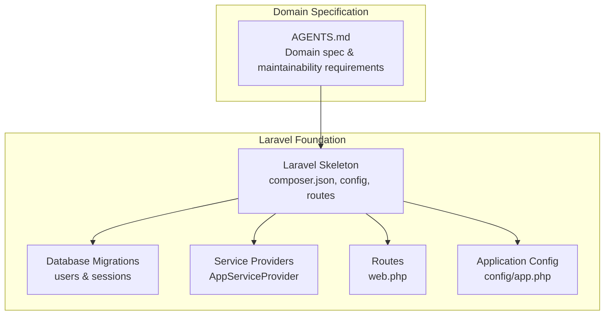
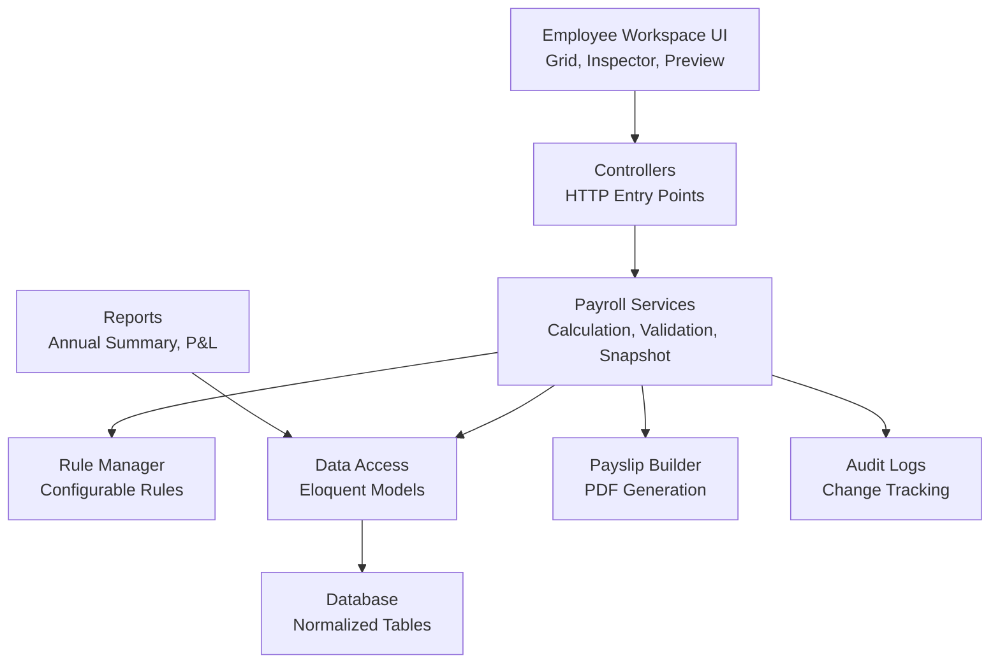
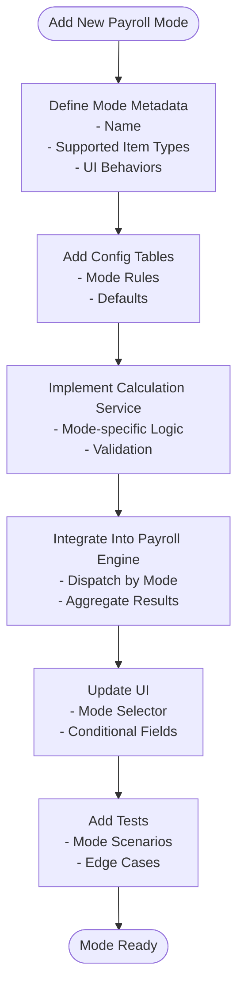
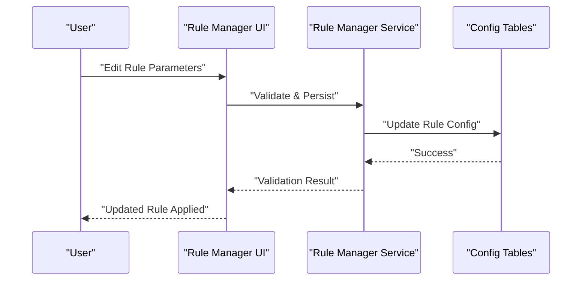
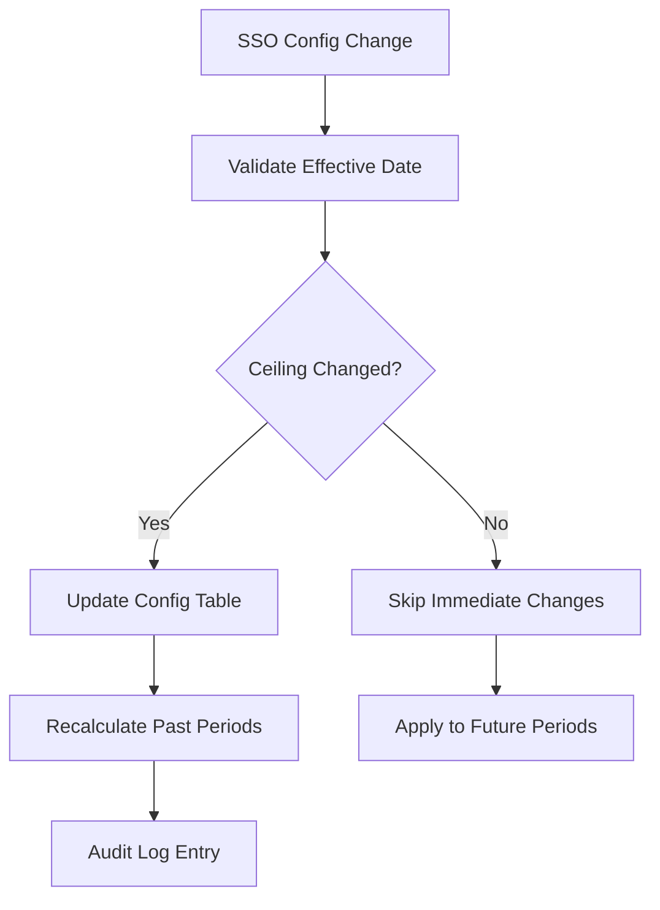
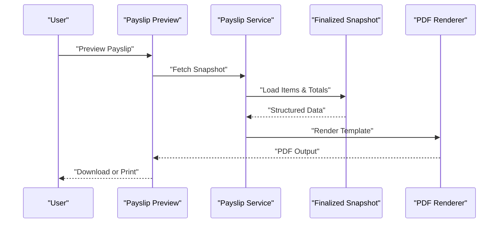
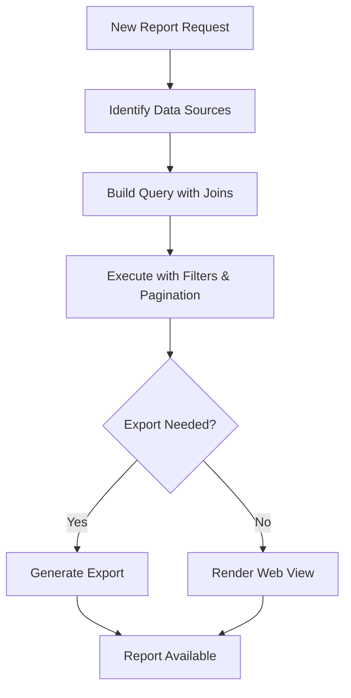
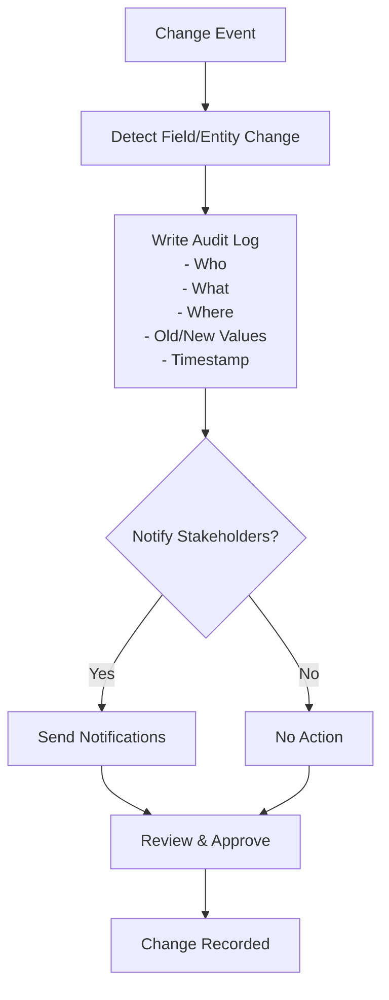
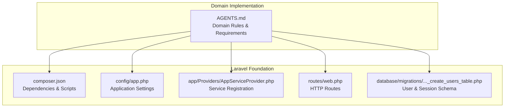

# Maintainability First Approach

<cite>
**Referenced Files in This Document**
- [AGENTS.md](file://AGENTS.md)
- [composer.json](file://composer.json)
- [config/app.php](file://config/app.php)
- [app/Providers/AppServiceProvider.php](file://app/Providers/AppServiceProvider.php)
- [routes/web.php](file://routes/web.php)
- [database/migrations/0001_01_01_000000_create_users_table.php](file://database/migrations/0001_01_01_000000_create_users_table.php)
</cite>

## Table of Contents
1. [Introduction](#introduction)
2. [Project Structure](#project-structure)
3. [Core Components](#core-components)
4. [Architecture Overview](#architecture-overview)
5. [Detailed Component Analysis](#detailed-component-analysis)
6. [Dependency Analysis](#dependency-analysis)
7. [Performance Considerations](#performance-considerations)
8. [Troubleshooting Guide](#troubleshooting-guide)
9. [Conclusion](#conclusion)
10. [Appendices](#appendices)

## Introduction
This document presents a maintainability-first approach for the xHR Payroll & Finance System, emphasizing future extensibility and system improvement. The approach centers on rule-driven design, single source of truth, dynamic yet controlled editing, and modular service architecture. It provides practical guidance for implementing enhancements such as adding new payroll modes, introducing new rules, modifying social security ceilings, customizing payslip formats, and adding new reports. The document maps these requirements to architectural patterns and design decisions that reduce technical debt and accelerate evolution.

## Project Structure
The repository contains a Laravel skeleton and a comprehensive domain specification. The Laravel structure provides a foundation for building maintainable modules, while AGENTS.md defines the payroll domain, rules, and extensibility requirements.

**Diagram sources**
- [AGENTS.md](file://AGENTS.md)
- [composer.json](file://composer.json)
- [config/app.php](file://config/app.php)
- [app/Providers/AppServiceProvider.php](file://app/Providers/AppServiceProvider.php)
- [routes/web.php](file://routes/web.php)
- [database/migrations/0001_01_01_000000_create_users_table.php](file://database/migrations/0001_01_01_000000_create_users_table.php)

**Section sources**
- [AGENTS.md](file://AGENTS.md)
- [composer.json](file://composer.json)
- [config/app.php](file://config/app.php)
- [app/Providers/AppServiceProvider.php](file://app/Providers/AppServiceProvider.php)
- [routes/web.php](file://routes/web.php)
- [database/migrations/0001_01_01_000000_create_users_table.php](file://database/migrations/0001_01_01_000000_create_users_table.php)

## Core Components
The maintainability-first approach is anchored by the following core components derived from the domain specification:

- Payroll Modes: A rule-driven taxonomy supporting multiple employment types, enabling modular calculation engines per mode.
- Rule Manager: Centralized configuration for business rules (OT, allowances, thresholds, layer rates, SSO, taxes, module toggles).
- Payroll Engine: A modular calculation pipeline that aggregates income and deductions per payroll mode.
- Payslip Builder: A deterministic renderer that produces standardized payslips from validated snapshots.
- Audit & Compliance: Structured logging capturing all meaningful changes for traceability and rollback capability.
- Reports: Pluggable reporting modules that consume normalized data sources.

These components collectively enforce:
- Single Source of Truth: All calculations and outputs derive from normalized records.
- Dynamic but Controlled Editing: Inline editing with validation, source flags, and audit trails.
- Extensibility: New payroll modes, rules, and reports are added through configuration and modular services.

**Section sources**
- [AGENTS.md](file://AGENTS.md)

## Architecture Overview
The maintainability-first architecture emphasizes separation of concerns, rule-driven computation, and pluggable modules. The system is designed around a layered pattern with clear boundaries between presentation, services, and persistence.

Key architectural principles:
- Service Layer: Business logic encapsulated in cohesive services (e.g., PayrollCalculationService, SocialSecurityService, PayslipService).
- Rule-Driven Design: Business formulas and policies stored in configuration tables to avoid hardcoded logic.
- Auditability: Every significant change is logged with context (who, what, where, old/new values).
- Pluggable Modules: New payroll modes and reports are introduced via configuration and minimal code changes.

**Diagram sources**
- [AGENTS.md](file://AGENTS.md)

## Detailed Component Analysis

### Payroll Modes: Extensibility Through Configuration
The system supports multiple payroll modes, each with distinct calculation rules. Extending the system with a new payroll mode follows a repeatable pattern:
- Define mode metadata and supported item types.
- Add a calculation module that implements the mode-specific logic.
- Wire the mode into the payroll engine and expose configuration controls.
- Provide UI affordances for mode selection and data entry.

Benefits:
- Encourages reuse of shared services (e.g., attendance, work logs).
- Reduces duplication by centralizing common validations and audits.
- Simplifies regression testing with focused scenarios per mode.

**Section sources**
- [AGENTS.md](file://AGENTS.md)

### Rule Manager: Dynamic Business Logic
Rules are stored in configuration tables and evaluated at runtime. This enables:
- Adding new rules without code changes.
- Adjusting parameters (thresholds, rates, ceilings) dynamically.
- Enforcing interdependencies and validation across rules.

Guidelines:
- Keep rule definitions explicit and auditable.
- Separate rule evaluation from persistence to support caching and performance tuning.
- Provide UI indicators for rule dependencies and conflicts.

**Section sources**
- [AGENTS.md](file://AGENTS.md)

### Social Security Ceilings: Configurable Parameters
Social security parameters (rates, salary ceiling, max monthly contribution) are configured rather than hardcoded. To modify ceilings:
- Update the Social Security configuration table.
- Trigger recalculations for affected periods.
- Validate compliance with regulatory changes.

Best Practices:
- Store effective dates alongside values to support historical accuracy.
- Segment recalculations by batch to minimize performance impact.
- Notify stakeholders of changes via audit trails.

**Section sources**
- [AGENTS.md](file://AGENTS.md)

### Payslip Formats: Modular Rendering
Payslips are rendered from validated snapshots, ensuring consistency and auditability. To customize formats:
- Define template metadata and layout rules.
- Implement a renderer that consumes structured data.
- Support multi-language content and branding.

Guidelines:
- Treat payslip rendering as a pure function of snapshot data.
- Separate layout from logic for easier maintenance.
- Preserve original rendering metadata for compliance.

**Section sources**
- [AGENTS.md](file://AGENTS.md)

### Reports: Pluggable Data Views
Reports consume normalized data sources and are designed to be added or modified independently. To introduce a new report:
- Identify the required data sources and joins.
- Build a report service with pagination and filtering.
- Expose endpoints and export capabilities.

Guidelines:
- Use read-only queries optimized with indexes.
- Cache frequently accessed aggregates when appropriate.
- Provide drill-down capabilities and audit linkage.

**Section sources**
- [AGENTS.md](file://AGENTS.md)

### Audit & Compliance: Traceability and Rollback
Every meaningful change is captured in audit logs with sufficient context for traceability. This supports:
- Root cause analysis after changes.
- Compliance reporting and internal audits.
- Controlled rollbacks when necessary.

Guidelines:
- Enforce mandatory reasons for sensitive changes.
- Index audit logs for efficient querying.
- Integrate with role-based permissions for access control.

**Section sources**
- [AGENTS.md](file://AGENTS.md)

## Dependency Analysis
The maintainability-first approach relies on clear dependency boundaries and loose coupling between modules. The Laravel skeleton provides a stable foundation, while the domain specification defines the business boundaries.

Observations:
- Dependencies are primarily from domain specification to implementation artifacts.
- Laravel’s PSR-4 autoloading and service providers support modular registration.
- Database migrations define the canonical schema for normalized data.

**Diagram sources**
- [composer.json](file://composer.json)
- [config/app.php](file://config/app.php)
- [app/Providers/AppServiceProvider.php](file://app/Providers/AppServiceProvider.php)
- [routes/web.php](file://routes/web.php)
- [database/migrations/0001_01_01_000000_create_users_table.php](file://database/migrations/0001_01_01_000000_create_users_table.php)
- [AGENTS.md](file://AGENTS.md)

**Section sources**
- [composer.json](file://composer.json)
- [config/app.php](file://config/app.php)
- [app/Providers/AppServiceProvider.php](file://app/Providers/AppServiceProvider.php)
- [routes/web.php](file://routes/web.php)
- [database/migrations/0001_01_01_000000_create_users_table.php](file://database/migrations/0001_01_01_000000_create_users_table.php)
- [AGENTS.md](file://AGENTS.md)

## Performance Considerations
- Normalize data to reduce duplication and improve query performance.
- Use indexed foreign keys and appropriate data types for monetary and temporal fields.
- Batch recalculations for payroll modes and SSO adjustments to minimize load spikes.
- Cache frequently accessed rule sets and report aggregates with invalidation strategies.
- Employ pagination and server-side filtering for large datasets in grids and reports.

## Troubleshooting Guide
Common issues and resolutions aligned with maintainability-first practices:
- Hardcoded values causing inconsistencies: Replace with configurable rules and re-run recalculations.
- Audit gaps preventing change tracing: Implement comprehensive logging and review policies.
- Performance regressions after adding features: Profile queries, add indexes, and refactor heavy computations into background jobs.
- UI inconsistencies after rule updates: Validate rule dependencies and refresh cached data.

**Section sources**
- [AGENTS.md](file://AGENTS.md)

## Conclusion
The maintainability-first approach establishes a robust foundation for evolving the xHR Payroll & Finance System. By embracing rule-driven design, single source of truth, and modular services, the system supports rapid extension—adding payroll modes, rules, and reports—while minimizing technical debt. Adhering to the documented patterns ensures long-term stability, traceability, and ease of maintenance.

## Appendices
- Recommended folder structure and service names are outlined in the domain specification to guide implementation consistency.
- Change management rules provide a checklist for evaluating the impact of modifications across payroll modes, payslips, reports, and financial summaries.

**Section sources**
- [AGENTS.md](file://AGENTS.md)