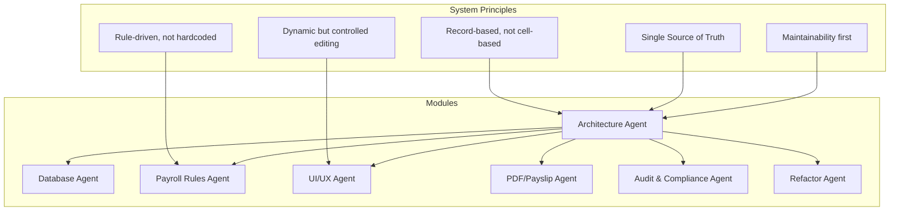
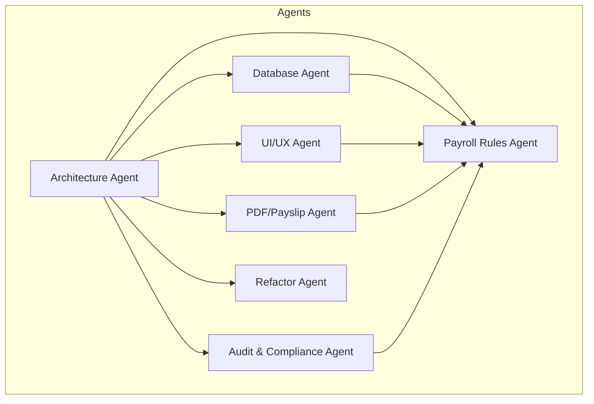
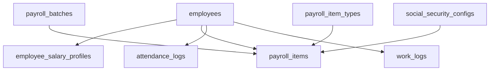

# Record-based Thinking Over Cell-based Excel Logic

<cite>
**Referenced Files in This Document**
- [AGENTS.md](file://AGENTS.md)
</cite>

## Table of Contents
1. [Introduction](#introduction)
2. [Project Structure](#project-structure)
3. [Core Components](#core-components)
4. [Architecture Overview](#architecture-overview)
5. [Detailed Component Analysis](#detailed-component-analysis)
6. [Dependency Analysis](#dependency-analysis)
7. [Performance Considerations](#performance-considerations)
8. [Troubleshooting Guide](#troubleshooting-guide)
9. [Conclusion](#conclusion)
10. [Appendices](#appendices)

## Introduction
This document explains the record-based thinking principle that eliminates Excel spreadsheet anti-patterns in the payroll and finance system. It demonstrates why cell-based positioning logic (for example, B33, X22, jan!X62) must be replaced with proper database records such as employee_id, payroll_batch_id, and payroll_item_type. It documents the implementation impact on database design, including proper table relationships and foreign key usage, and provides concrete examples of transforming Excel references into structured records. Finally, it offers anti-pattern prevention guidance with before/after examples that prevent data integrity issues and maintain system scalability.

## Project Structure
The system is designed around a PHP-first, MySQL-friendly architecture with dynamic data entry and rule-driven computation. The repository defines a comprehensive set of design principles, database guidelines, and module responsibilities that enforce record-based thinking and eliminate reliance on cell positions.

Key aspects:
- Core design principles emphasize record-based logic and single source of truth.
- Database guidelines define naming conventions, data types, and foreign key patterns.
- Module responsibilities clarify roles for architecture, database, payroll rules, UI/UX, PDF/payslip, audit/compliance, and refactor agents.
- Business rules and UI behaviors define how payroll calculations and user interactions are modeled as records.

**Section sources**
- [AGENTS.md:34-100](file://AGENTS.md#L34-L100)
- [AGENTS.md:153-284](file://AGENTS.md#L153-L284)

## Core Components
The core components are defined by the system’s design principles and module responsibilities. They collectively enforce record-based thinking and ensure that all logic and data are grounded in database records rather than spreadsheet cell positions.

- Record-based, not cell-based: All logic must be expressed as records and relationships, not cell references.
- Single Source of Truth: Each data category has a canonical source table.
- Rule-driven, not hardcoded: Business formulas and thresholds live in configuration tables.
- Dynamic but controlled editing: The UI mimics spreadsheets but enforces structure and audit.
- Maintainability first: Extensibility is built into the design from the start.

Examples of canonical data categories and their sources:
- Employee profile: employees / employee_profiles
- Base salary: employee_salary_profiles
- Rate configuration: rate_rules / layer_rate_rules
- Monthly payroll items: payroll_items
- Payslip: payslips + payslip_items
- Company monthly finance: company_monthly_summaries

**Section sources**
- [AGENTS.md:36-60](file://AGENTS.md#L36-L60)
- [AGENTS.md:121-150](file://AGENTS.md#L121-L150)

## Architecture Overview
The architecture separates concerns among agents, each responsible for a distinct aspect of the system. The Database Agent designs schema, foreign keys, and data types aligned with record-based thinking. The Payroll Rules Agent defines configurable rules that replace hardcoded formulas. The UI/UX Agent ensures a spreadsheet-like experience while preserving backend structure and auditability.

**Section sources**
- [AGENTS.md:158-283](file://AGENTS.md#L158-L283)

## Detailed Component Analysis

### Record-based Thinking vs. Cell-based Excel Logic
- Problem: Cell-based logic relies on absolute or relative cell positions (for example, B33, X22, jan!X62). This creates brittle references that break when rows or sheets shift, leading to data integrity issues and maintenance nightmares.
- Solution: Replace cell references with explicit identifiers and relationships. Use record identifiers such as employee_id, payroll_batch_id, and payroll_item_type to unambiguously identify and join data.

Concrete transformation examples:
- From: “Cell B33 contains the base salary for employee 123.”
  To: “Row in employee_salary_profiles has employee_id = 123 and base_salary = value.”
- From: “Cell X22 equals jan!X62 plus fee.”
  To: “Row in payroll_items has payroll_batch_id = batch_jan and payroll_item_type = fee, linked to employee_id = 123.”
- From: “Cell jan!X62 holds the overtime amount.”
  To: “Row in payroll_items has payroll_item_type = overtime and amount = computed_value.”

Benefits:
- Deterministic joins and queries.
- Auditability and traceability of data origins.
- Scalability across many employees and months.
- Prevents accidental overwrites and cascading errors.

**Section sources**
- [AGENTS.md:36-47](file://AGENTS.md#L36-L47)

### Database Design Impact: Proper Table Relationships and Foreign Keys
- Naming conventions: plural snake_case for tables; primary key named id; foreign keys named <entity>_id; status flags status/is_active; dates *_date; durations *_minutes or *_seconds; amounts decimal(12,2); percentages consistent decimals.
- Foreign keys: Use unsignedBigInteger/bigint unsigned for main FKs; avoid enums that limit future configuration; include timestamps, status columns, soft deletes where appropriate, and audit references.
- phpMyAdmin compatibility: keep schema readable, avoid exotic DB features, ensure migrations remain functional, and keep basic queries debuggable.

Recommended minimal tables:
- users, roles, permissions
- employees, employee_profiles, employee_salary_profiles, employee_bank_accounts
- departments, positions
- payroll_batches, payroll_items, payroll_item_types
- attendance_logs, work_logs, work_log_types
- rate_rules, layer_rate_rules, bonus_rules, threshold_rules, social_security_configs
- expense_claims, company_revenues, company_expenses, subscription_costs
- payslips, payslip_items
- module_toggles, audit_logs

**Section sources**
- [AGENTS.md:385-435](file://AGENTS.md#L385-L435)

### Implementation Patterns: Transforming Excel References to Records
- Replace sheet-scoped references with cross-sheet joins via foreign keys. For example, payroll_item_type links to payroll_item_types; employee_id links to employees; payroll_batch_id links to payroll_batches.
- Normalize repetitive cell-based computations into rule tables. For example, OT rules, diligence allowance thresholds, and layer rates are stored in dedicated tables and referenced by payroll_item_type or payroll_mode.
- Enforce state and source tracking for editable fields. Use flags like auto, manual, override, master to indicate origin and control editing.

Example mapping:
- Cell reference: jan!X62
  - Becomes: a row in payroll_items with payroll_item_type and amount, linked to payroll_batch_id and employee_id.
- Cell reference: B33
  - Becomes: a row in employee_salary_profiles with base_salary and effective_from_date, linked to employee_id.
- Cell reference: X22
  - Becomes: a row in payroll_items with payroll_item_type = fee and amount, linked to payroll_batch_id and employee_id.

**Section sources**
- [AGENTS.md:418-427](file://AGENTS.md#L418-L427)
- [AGENTS.md:387-417](file://AGENTS.md#L387-L417)

### Anti-pattern Prevention Guidance: Before/After Examples
Common Excel anti-patterns and their record-based replacements:

- Anti-pattern: Using cell positions to compute totals.
  - Before: SUM(B33, X22, jan!X62)
  - After: Aggregate payroll_items grouped by payroll_batch_id and employee_id, joining with payroll_item_types to classify income and deductions.

- Anti-pattern: Copying formulas across rows by dragging cell references.
  - Before: Dragging a formula that references B33 and X22 across multiple employees.
  - After: Insert one row per employee in payroll_items with explicit employee_id and payroll_item_type; compute amounts via rule engine and store results.

- Anti-pattern: Hardcoding magic numbers in formulas.
  - Before: Using a hardcoded SSO ceiling in a formula.
  - After: Store SSO configuration in social_security_configs with effective_from_date; select the applicable rule by date.

- Anti-pattern: Editing totals by adjusting base salary in place.
  - Before: Changing base salary in a cell to reduce net pay.
  - After: Create a separate deduction item with payroll_item_type = late_deduction or lwop_deduction; keep base_salary immutable and track changes via audit logs.

- Anti-pattern: Using sheet names as namespaces for data.
  - Before: jan!X62
  - After: Use payroll_batch_id to namespace items; link payroll_items to payroll_batches and employees.

These transformations ensure:
- Data integrity: Explicit relationships and constraints.
- Auditability: Every change is logged with who, what, when, and why.
- Scalability: Queries and joins remain efficient with proper indexing and normalized schema.

**Section sources**
- [AGENTS.md:663-672](file://AGENTS.md#L663-L672)
- [AGENTS.md:488-505](file://AGENTS.md#L488-L505)

### Business Rules and Payroll Modes
The system supports multiple payroll modes, each with its own calculation rules. These rules are stored in configuration tables and referenced by payroll_item_type and payroll_mode, replacing hardcoded formulas.

Supported payroll modes:
- monthly_staff
- freelance_layer
- freelance_fixed
- youtuber_salary
- youtuber_settlement
- custom_hybrid

Representative rules:
- Monthly staff: total_income = base_salary + overtime_pay + diligence_allowance + performance_bonus + other_income; total_deduction = cash_advance + late_deduction + lwop_deduction + social_security_employee + other_deduction; net_pay = total_income - total_deduction
- Freelance layer: duration_minutes = minute + (second / 60); amount = duration_minutes * rate_per_minute
- Freelance fixed: amount = quantity * fixed_rate
- Youtuber settlement: net = total_income - total_expense
- Social Security (Thailand): configurable rates and ceilings by effective date

**Section sources**
- [AGENTS.md:123-131](file://AGENTS.md#L123-L131)
- [AGENTS.md:440-497](file://AGENTS.md#L440-L497)

### Audit and Compliance
The system mandates comprehensive audit logging for high-priority areas:
- Employee salary profile changes
- Payroll item amount edits
- Payslip finalize/unfinalize actions
- Rule changes
- Module toggle changes
- Social Security configuration changes

Audit logs capture who, what entity, what field, old value, new value, action, timestamp, and optional reason. This ensures traceability and supports rollback capability.

**Section sources**
- [AGENTS.md:576-595](file://AGENTS.md#L576-L595)

### UI Behavior and State Tracking
The UI mirrors spreadsheet behavior while enforcing record-based state:
- Employee Board flow: Login -> Dashboard -> Employee Board -> Click Employee
- Payroll entry flow: Employee Workspace -> Edit Grid -> Recalculate -> Preview Slip -> Save -> Finalize
- Grid supports add/remove/duplicate rows, inline editing, dropdowns, auto calculation, manual override, and recalculation
- Field states: locked, auto, manual, override, from_master, rule_applied, draft, finalized
- Detail Inspector shows source, formula/rule source, monthly-only vs master, notes/reasons, and audit history

**Section sources**
- [AGENTS.md:510-546](file://AGENTS.md#L510-L546)

## Dependency Analysis
The system’s design enforces clear dependencies among agents and modules, ensuring that database relationships and rule configurations underpin all logic.

**Diagram sources**
- [AGENTS.md:387-417](file://AGENTS.md#L387-L417)

**Section sources**
- [AGENTS.md:387-417](file://AGENTS.md#L387-L417)

## Performance Considerations
- Index foreign keys and frequently queried columns (for example, employee_id, payroll_batch_id, payroll_item_type).
- Use decimal types for monetary fields to avoid floating-point precision issues.
- Prefer normalized schemas to reduce duplication and improve query performance.
- Keep rule tables small and indexed; cache frequently accessed configurations.
- Use transactions for bulk updates to payroll_items to maintain consistency.

[No sources needed since this section provides general guidance]

## Troubleshooting Guide
Common issues and resolutions grounded in record-based thinking:

- Symptom: Payroll totals differ after editing a cell.
  - Cause: Cell-based logic was changed without updating related records.
  - Resolution: Ensure edits update the correct payroll_items rows with explicit employee_id and payroll_item_type; re-run the payroll engine; verify audit logs.

- Symptom: Reports show inconsistent SSO amounts.
  - Cause: Hardcoded SSO ceiling in a formula.
  - Resolution: Update social_security_configs with the correct effective date and rule; recompute affected batches.

- Symptom: Overtime not calculated for freelancers.
  - Cause: Missing work_log entries or incorrect work_log_type.
  - Resolution: Insert work_logs with correct date, work_type, qty/minutes/seconds, layer, rate, and amount; link to employee_id and payroll_batch_id.

- Symptom: Payslip PDF shows outdated values.
  - Cause: PDF rendered from live UI instead of snapshot.
  - Resolution: Finalize payslips to copy items to payslip_items and store totals; render PDF from finalized snapshot.

**Section sources**
- [AGENTS.md:562-573](file://AGENTS.md#L562-L573)
- [AGENTS.md:488-497](file://AGENTS.md#L488-L497)
- [AGENTS.md:330-337](file://AGENTS.md#L330-L337)

## Conclusion
Adopting record-based thinking eliminates the fragility of cell-based Excel logic by grounding all computations and references in explicit database records and relationships. This approach improves data integrity, auditability, and scalability. By replacing cell positions with identifiers like employee_id, payroll_batch_id, and payroll_item_type, and by storing business rules in configuration tables, the system achieves a spreadsheet-like user experience backed by a robust, maintainable architecture.

[No sources needed since this section summarizes without analyzing specific files]

## Appendices

### Appendix A: Example Transformation Matrix
- Cell reference: B33
  - Record: employee_salary_profiles.employee_id, base_salary
- Cell reference: X22
  - Record: payroll_items.payroll_item_type = fee, amount
- Cell reference: jan!X62
  - Record: payroll_items.payroll_batch_id, payroll_item_type, amount

**Section sources**
- [AGENTS.md:36-47](file://AGENTS.md#L36-L47)