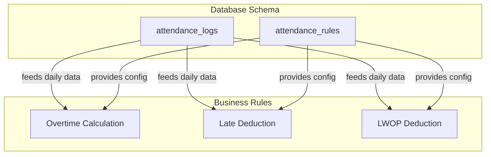
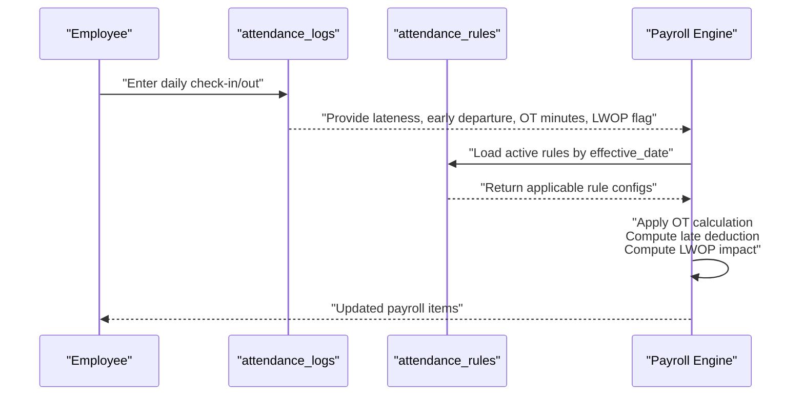
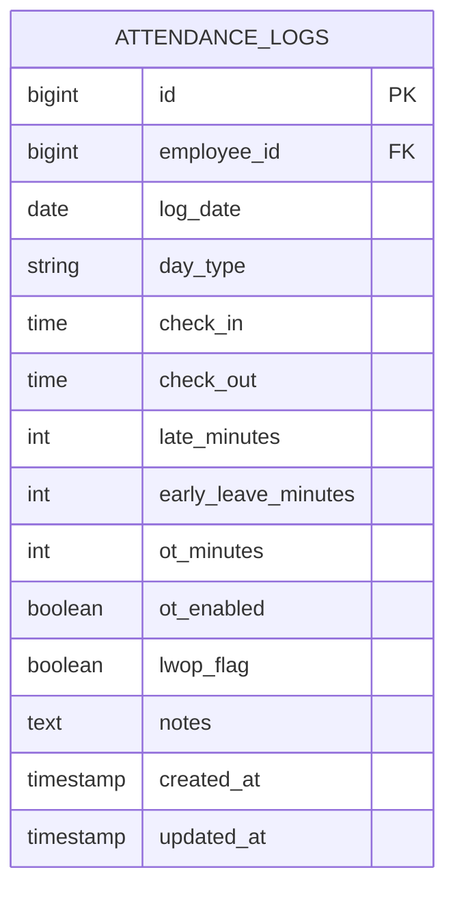
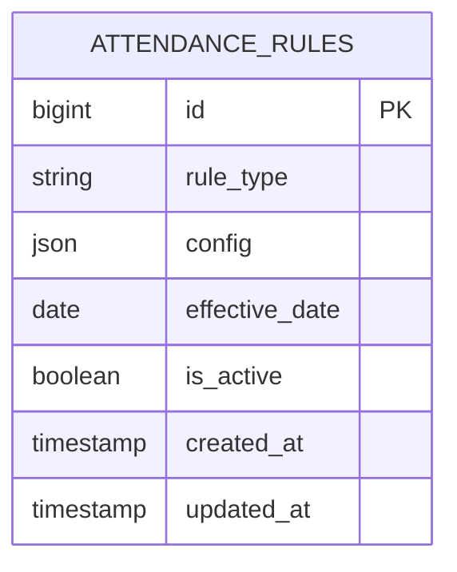
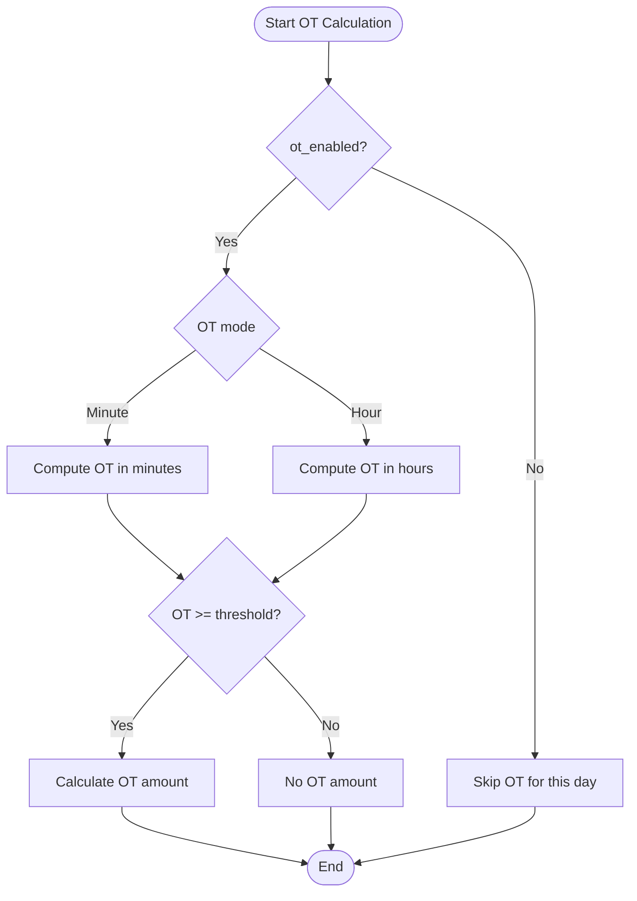
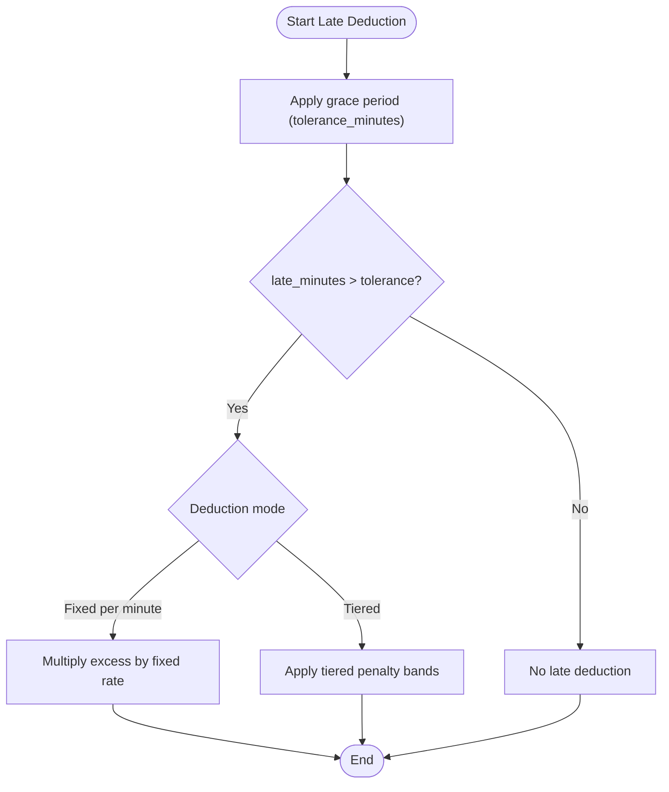
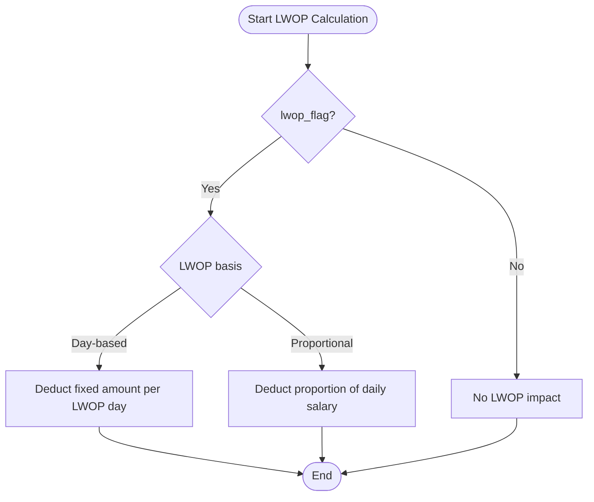
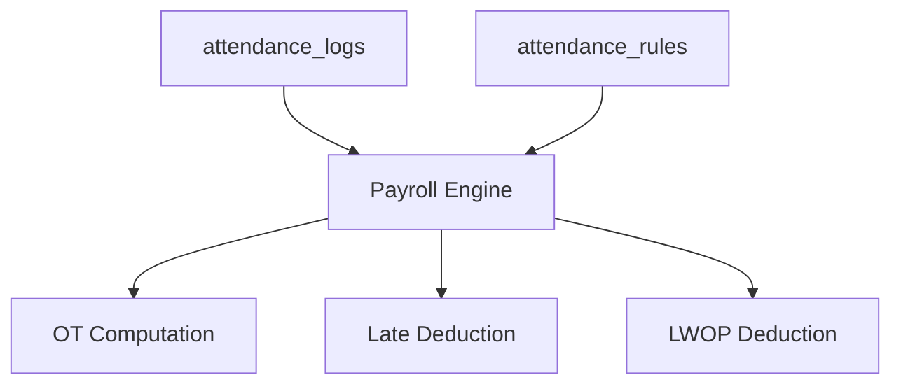

# Attendance and Deduction Rules

<cite>
**Referenced Files in This Document**
- [0001_01_01_000006_create_attendance_worklogs_tables.php](file://database/migrations/0001_01_01_000006_create_attendance_worklogs_tables.php)
- [0001_01_01_000008_create_rules_config_tables.php](file://database/migrations/0001_01_01_000008_create_rules_config_tables.php)
- [AGENTS.md](file://AGENTS.md)
</cite>

## Table of Contents
1. [Introduction](#introduction)
2. [Project Structure](#project-structure)
3. [Core Components](#core-components)
4. [Architecture Overview](#architecture-overview)
5. [Detailed Component Analysis](#detailed-component-analysis)
6. [Dependency Analysis](#dependency-analysis)
7. [Performance Considerations](#performance-considerations)
8. [Troubleshooting Guide](#troubleshooting-guide)
9. [Conclusion](#conclusion)

## Introduction
This document explains the attendance and deduction rules configuration for the payroll system. It focuses on:
- Overtime (OT) calculation rules
- Late deduction rules
- Leave Without Pay (LWOP) rules

It details the structure of attendance rules, including the fields rule_type and config, and how these rules integrate with the attendance_log system. It also outlines validation approaches that ensure rules align with actual attendance data.

## Project Structure
The relevant components for attendance and deduction rules are defined in database migrations and documented in the project’s agent guide. The key elements are:
- Attendance log table storing daily check-in/out, lateness, early departure, OT minutes, and LWOP flags
- Rules table for configurable attendance rules with flexible JSON configuration
- Supporting documentation that describes supported rule categories and calculation modes

**Diagram sources**
- [0001_01_01_000006_create_attendance_worklogs_tables.php:11-29](file://database/migrations/0001_01_01_000006_create_attendance_worklogs_tables.php#L11-L29)
- [0001_01_01_000008_create_rules_config_tables.php:71-78](file://database/migrations/0001_01_01_000008_create_rules_config_tables.php#L71-L78)

**Section sources**
- [0001_01_01_000006_create_attendance_worklogs_tables.php:11-29](file://database/migrations/0001_01_01_000006_create_attendance_worklogs_tables.php#L11-L29)
- [0001_01_01_000008_create_rules_config_tables.php:71-78](file://database/migrations/0001_01_01_000008_create_rules_config_tables.php#L71-L78)
- [AGENTS.md:438-471](file://AGENTS.md#L438-L471)

## Core Components
This section documents the structure and purpose of the attendance rules and related data.

- Attendance Logs
  - Purpose: Stores daily attendance records per employee, including check-in/out times, computed lateness and early departure in minutes, OT minutes, and LWOP flags.
  - Key fields include employee_id, log_date, check_in, check_out, late_minutes, early_leave_minutes, ot_minutes, ot_enabled, lwop_flag, and day_type.
  - Indexes and constraints ensure uniqueness per employee per day and efficient date-based queries.

- Attendance Rules
  - Purpose: Centralized configuration for attendance-related rules with flexible JSON config.
  - Fields:
    - rule_type: categorizes the rule (e.g., late_deduction, ot_rate, diligence, grace_period)
    - config: JSON payload containing rule-specific parameters
    - effective_date: applies rule from a given date
    - is_active: enables or disables the rule
  - This design allows dynamic configuration of OT calculation modes, late deduction tiers, LWOP basis, and grace periods.

- Supported Rule Categories (as documented)
  - Overtime (OT): supports minute-based OT, hour-based OT, minimum thresholds, and requires an enable flag.
  - Late Deduction: supports fixed-per-minute, tiered penalties, and grace period.
  - LWOP: supports day-based deduction and proportional salary deduction.

**Section sources**
- [0001_01_01_000006_create_attendance_worklogs_tables.php:11-29](file://database/migrations/0001_01_01_000006_create_attendance_worklogs_tables.php#L11-L29)
- [0001_01_01_000008_create_rules_config_tables.php:71-78](file://database/migrations/0001_01_01_000008_create_rules_config_tables.php#L71-L78)
- [AGENTS.md:454-471](file://AGENTS.md#L454-L471)

## Architecture Overview
The system integrates attendance logs with configurable rules to compute OT, late deductions, and LWOP impacts during payroll processing.

**Diagram sources**
- [0001_01_01_000006_create_attendance_worklogs_tables.php:11-29](file://database/migrations/0001_01_01_000006_create_attendance_worklogs_tables.php#L11-L29)
- [0001_01_01_000008_create_rules_config_tables.php:71-78](file://database/migrations/0001_01_01_000008_create_rules_config_tables.php#L71-L78)

## Detailed Component Analysis

### Attendance Logs Data Model
The attendance_logs table captures the raw daily attendance data used by rules.

**Diagram sources**
- [0001_01_01_000006_create_attendance_worklogs_tables.php:11-29](file://database/migrations/0001_01_01_000006_create_attendance_worklogs_tables.php#L11-L29)

**Section sources**
- [0001_01_01_000006_create_attendance_worklogs_tables.php:11-29](file://database/migrations/0001_01_01_000006_create_attendance_worklogs_tables.php#L11-L29)

### Attendance Rules Data Model
The attendance_rules table stores flexible configurations for attendance-related policies.

- rule_type values include late_deduction, ot_rate, diligence, grace_period.
- config holds rule-specific parameters as JSON; examples include:
  - Overtime calculation method (minute-based, hour-based, threshold)
  - Late tolerance minutes and deduction per minute or tiered amounts
  - LWOP calculation basis (day-based vs. proportional salary)

**Diagram sources**
- [0001_01_01_000008_create_rules_config_tables.php:71-78](file://database/migrations/0001_01_01_000008_create_rules_config_tables.php#L71-L78)

**Section sources**
- [0001_01_01_000008_create_rules_config_tables.php:71-78](file://database/migrations/0001_01_01_000008_create_rules_config_tables.php#L71-L78)
- [AGENTS.md:454-471](file://AGENTS.md#L454-L471)

### Overtime (OT) Calculation Rules
Supported modes:
- Minute-based OT
- Hour-based OT
- Minimum threshold before OT applies
- Requires an enable flag to activate OT computation

Integration:
- The attendance_logs table stores ot_minutes and ot_enabled per day.
- The attendance_rules table supplies the calculation method and thresholds via config.

**Diagram sources**
- [0001_01_01_000006_create_attendance_worklogs_tables.php:20-21](file://database/migrations/0001_01_01_000006_create_attendance_worklogs_tables.php#L20-L21)
- [0001_01_01_000008_create_rules_config_tables.php:71-78](file://database/migrations/0001_01_01_000008_create_rules_config_tables.php#L71-L78)
- [AGENTS.md:454-460](file://AGENTS.md#L454-L460)

**Section sources**
- [0001_01_01_000006_create_attendance_worklogs_tables.php:20-21](file://database/migrations/0001_01_01_000006_create_attendance_worklogs_tables.php#L20-L21)
- [0001_01_01_000008_create_rules_config_tables.php:71-78](file://database/migrations/0001_01_01_000008_create_rules_config_tables.php#L71-L78)
- [AGENTS.md:454-460](file://AGENTS.md#L454-L460)

### Late Deduction Rules
Supported modes:
- Fixed per minute
- Tiered penalties
- Grace period (tolerance minutes)

Integration:
- The attendance_logs table stores late_minutes per day.
- The attendance_rules table supplies tolerance and deduction configuration via config.

**Diagram sources**
- [0001_01_01_000006_create_attendance_worklogs_tables.php](file://database/migrations/0001_01_01_000006_create_attendance_worklogs_tables.php#L18)
- [0001_01_01_000008_create_rules_config_tables.php:71-78](file://database/migrations/0001_01_01_000008_create_rules_config_tables.php#L71-L78)
- [AGENTS.md:461-466](file://AGENTS.md#L461-L466)

**Section sources**
- [0001_01_01_000006_create_attendance_worklogs_tables.php](file://database/migrations/0001_01_01_000006_create_attendance_worklogs_tables.php#L18)
- [0001_01_01_000008_create_rules_config_tables.php:71-78](file://database/migrations/0001_01_01_000008_create_rules_config_tables.php#L71-L78)
- [AGENTS.md:461-466](file://AGENTS.md#L461-L466)

### LWOP (Leave Without Pay) Rules
Supported modes:
- Day-based deduction
- Proportional salary deduction

Integration:
- The attendance_logs table marks LWOP days via lwop_flag.
- The attendance_rules table defines the LWOP calculation basis via config.

**Diagram sources**
- [0001_01_01_000006_create_attendance_worklogs_tables.php](file://database/migrations/0001_01_01_000006_create_attendance_worklogs_tables.php#L22)
- [0001_01_01_000008_create_rules_config_tables.php:71-78](file://database/migrations/0001_01_01_000008_create_rules_config_tables.php#L71-L78)
- [AGENTS.md:467-471](file://AGENTS.md#L467-L471)

**Section sources**
- [0001_01_01_000006_create_attendance_worklogs_tables.php](file://database/migrations/0001_01_01_000006_create_attendance_worklogs_tables.php#L22)
- [0001_01_01_000008_create_rules_config_tables.php:71-78](file://database/migrations/0001_01_01_000008_create_rules_config_tables.php#L71-L78)
- [AGENTS.md:467-471](file://AGENTS.md#L467-L471)

### Example Scenarios and Configurations
Note: The following examples describe typical configurations. Replace the placeholders with actual values in the config JSON stored in attendance_rules.config.

- Minute-based OT
  - rule_type: ot_rate
  - config: include calculation method (minute-based), minimum threshold (minutes), and OT rate parameters
  - Integration: ot_enabled and ot_minutes from attendance_logs drive computation

- Tiered Penalties
  - rule_type: late_deduction
  - config: include tolerance_minutes, tier definitions (e.g., bands with rates), and optional fixed per minute fallback

- Proportional Salary Deductions
  - rule_type: lwop
  - config: include basis (proportional), daily salary fraction, and rounding policy

Validation against attendance data:
- Ensure effective_date boundaries apply the correct rule version
- Verify that ot_enabled is true before computing OT amounts
- Confirm that late_minutes exceed tolerance_minutes for deductions
- Confirm that lwop_flag is set for LWOP days

**Section sources**
- [0001_01_01_000006_create_attendance_worklogs_tables.php:18-22](file://database/migrations/0001_01_01_000006_create_attendance_worklogs_tables.php#L18-L22)
- [0001_01_01_000008_create_rules_config_tables.php:71-78](file://database/migrations/0001_01_01_000008_create_rules_config_tables.php#L71-L78)
- [AGENTS.md:454-471](file://AGENTS.md#L454-L471)

## Dependency Analysis
The following diagram shows how attendance_logs feeds data into the rule engine, which uses attendance_rules to compute OT, late deductions, and LWOP.

**Diagram sources**
- [0001_01_01_000006_create_attendance_worklogs_tables.php:11-29](file://database/migrations/0001_01_01_000006_create_attendance_worklogs_tables.php#L11-L29)
- [0001_01_01_000008_create_rules_config_tables.php:71-78](file://database/migrations/0001_01_01_000008_create_rules_config_tables.php#L71-L78)

**Section sources**
- [0001_01_01_000006_create_attendance_worklogs_tables.php:11-29](file://database/migrations/0001_01_01_000006_create_attendance_worklogs_tables.php#L11-L29)
- [0001_01_01_000008_create_rules_config_tables.php:71-78](file://database/migrations/0001_01_01_000008_create_rules_config_tables.php#L71-L78)

## Performance Considerations
- Indexing
  - attendance_logs: unique(employee_id, log_date) and index(log_date) optimize daily lookups and prevent duplicates.
- Effective date management
  - Keep rule versions minimal and prune inactive rules to reduce query scans.
- JSON config parsing
  - Parse and cache frequently used rule parameters to avoid repeated JSON deserialization overhead.
- Batch processing
  - Aggregate daily logs per employee before applying rules to minimize repeated reads.

[No sources needed since this section provides general guidance]

## Troubleshooting Guide
Common issues and resolutions:
- OT not calculated
  - Verify ot_enabled is true and ot_minutes exceeds the configured threshold.
  - Confirm the rule_type is ot_rate and the rule is active on or before the log_date.
- Unexpected late deduction
  - Check tolerance_minutes and ensure late_minutes exceed the grace period.
  - Validate tier definitions if using tiered penalties.
- LWOP not deducted
  - Confirm lwop_flag is set for the affected days.
  - Verify the LWOP rule basis matches the intended calculation (day-based or proportional).

Validation checklist:
- Ensure effective_date boundaries are respected for each rule.
- Confirm unique constraint on (employee_id, log_date) prevents duplicate entries.
- Cross-check computed values against expected outcomes using sample attendance datasets.

**Section sources**
- [0001_01_01_000006_create_attendance_worklogs_tables.php:18-22](file://database/migrations/0001_01_01_000006_create_attendance_worklogs_tables.php#L18-L22)
- [0001_01_01_000008_create_rules_config_tables.php:71-78](file://database/migrations/0001_01_01_000008_create_rules_config_tables.php#L71-L78)

## Conclusion
The attendance and deduction rules are modeled with a flexible JSON configuration approach in attendance_rules, while attendance_logs provides the daily data feed. This separation enables dynamic, rule-driven computation of OT, late deductions, and LWOP, ensuring accurate payroll outcomes aligned with actual attendance records.

[No sources needed since this section summarizes without analyzing specific files]