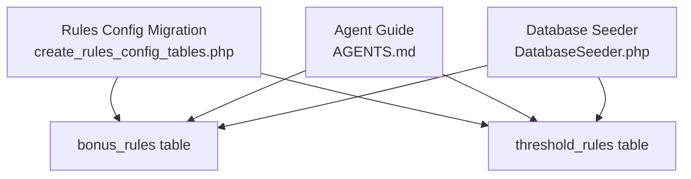
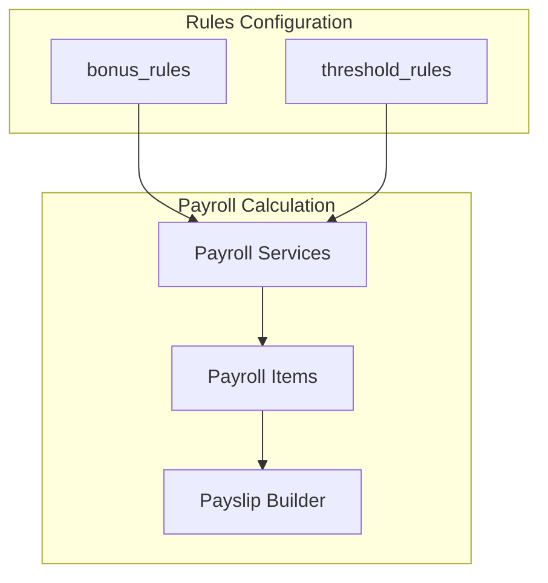
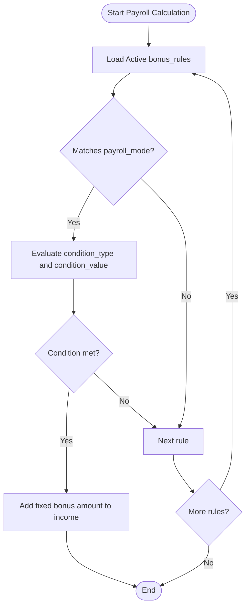
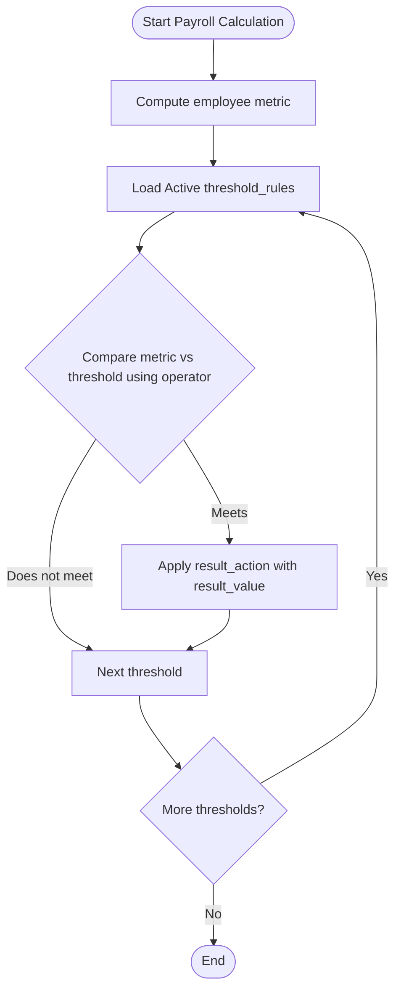
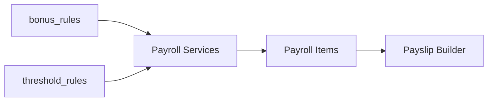

# Bonus and Threshold Rules

<cite>
**Referenced Files in This Document**
- [AGENTS.md](file://AGENTS.md)
- [create_rules_config_tables.php](file://database/migrations/0001_01_01_000008_create_rules_config_tables.php)
- [DatabaseSeeder.php](file://database/seeders/DatabaseSeeder.php)
</cite>

## Table of Contents
1. [Introduction](#introduction)
2. [Project Structure](#project-structure)
3. [Core Components](#core-components)
4. [Architecture Overview](#architecture-overview)
5. [Detailed Component Analysis](#detailed-component-analysis)
6. [Dependency Analysis](#dependency-analysis)
7. [Performance Considerations](#performance-considerations)
8. [Troubleshooting Guide](#troubleshooting-guide)
9. [Conclusion](#conclusion)

## Introduction
This document explains the configuration tables for bonus and threshold rules used by the payroll system. It describes the schema of bonus_rules and threshold_rules, how they are intended to be used for performance-based bonuses, and how they integrate with the broader payroll calculation process. It also provides practical configuration examples for tiered bonuses, percentage-based bonuses, and fixed-amount bonuses, along with guidance on applying these rules during payroll calculation.

## Project Structure
The relevant schema for bonus and threshold rules is defined in the rules configuration migration. Supporting documentation and guidelines are provided in the project’s agent guide.

**Diagram sources**
- [create_rules_config_tables.php:37-58](file://database/migrations/0001_01_01_000008_create_rules_config_tables.php#L37-L58)
- [AGENTS.md:438-505](file://AGENTS.md#L438-L505)
- [DatabaseSeeder.php:16-24](file://database/seeders/DatabaseSeeder.php#L16-L24)

**Section sources**
- [create_rules_config_tables.php:37-58](file://database/migrations/0001_01_01_000008_create_rules_config_tables.php#L37-L58)
- [AGENTS.md:438-505](file://AGENTS.md#L438-L505)
- [DatabaseSeeder.php:16-24](file://database/seeders/DatabaseSeeder.php#L16-L24)

## Core Components
This section documents the two configuration tables that govern bonus and threshold-based payroll adjustments.

- bonus_rules
  - Purpose: Define performance-based bonus configurations applicable to employees or payroll modes.
  - Key fields:
    - name: Human-readable identifier for the rule.
    - payroll_mode: Optional payroll mode constraint (e.g., monthly_staff).
    - condition_type: Type of condition (e.g., performance, attendance, custom).
    - condition_value: Value or metric associated with the condition.
    - amount: Monetary amount for the bonus.
    - is_active: Boolean flag to enable/disable the rule.
    - timestamps: Created and updated timestamps.
  - Notes: The migration defines a decimal amount field suitable for fixed bonus amounts.

- threshold_rules
  - Purpose: Define threshold conditions based on metrics and actions to apply income adjustments.
  - Key fields:
    - name: Human-readable identifier for the rule.
    - metric: Metric to evaluate (e.g., total_hours, ot_hours, late_count).
    - operator: Comparison operator (>=, <=, =, >, <).
    - threshold_value: Threshold value for the metric.
    - result_action: Action to take when the threshold is met (e.g., add_income, add_deduction, set_value).
    - result_value: Value used by the action (e.g., bonus percentage or fixed amount).
    - is_active: Boolean flag to enable/disable the rule.
    - timestamps: Created and updated timestamps.

**Section sources**
- [create_rules_config_tables.php:37-58](file://database/migrations/0001_01_01_000008_create_rules_config_tables.php#L37-L58)
- [AGENTS.md:438-505](file://AGENTS.md#L438-L505)

## Architecture Overview
The bonus and threshold rule tables are part of the centralized rules configuration subsystem. They are designed to be decoupled from payroll calculation logic so that business rules can be adjusted without changing code. Payroll services would evaluate these rules against employee performance metrics and apply the appropriate adjustments during payslip generation.

[No sources needed since this diagram shows conceptual workflow, not actual code structure]

## Detailed Component Analysis

### bonus_rules
- Structure and purpose
  - Stores fixed bonus configurations linked to optional payroll modes and conditions.
  - Supports enabling/disabling via is_active.
- Typical use cases
  - Fixed-amount bonuses for exceptional performance.
  - Mode-specific bonuses (e.g., monthly_staff).
  - Conditional bonuses tied to specific criteria via condition_type and condition_value.

- Applying bonus_rules during payroll
  - During payslip generation, payroll services select applicable bonus_rules based on payroll_mode and employee conditions.
  - The amount field is added as a bonus income item to the employee’s payslip.

[No sources needed since this diagram shows conceptual workflow, not actual code structure]

### threshold_rules
- Structure and purpose
  - Defines metric thresholds with operators and actions.
  - Supports three actions: add_income, add_deduction, set_value.
- Typical use cases
  - Percentage-based bonuses: set result_action to add_income and result_value to a percentage.
  - Fixed-amount bonuses: set result_action to add_income and result_value to a fixed amount.
  - Tiered thresholds: multiple threshold_rules chained to apply increasing bonuses as metrics improve.

- Applying threshold_rules during payroll
  - Payroll services compute the employee’s metric (e.g., total_hours, ot_hours, late_count).
  - Compare the metric against each active threshold_rule using the operator.
  - Apply the action (add_income/add_deduction/set_value) with result_value to the payslip.

[No sources needed since this diagram shows conceptual workflow, not actual code structure]

### Example Configurations
Below are example configurations for different performance scenarios. These examples illustrate how to configure bonus_rules and threshold_rules to achieve desired outcomes.

- Tiered bonuses
  - Configure multiple threshold_rules with ascending threshold_value and increasing result_value to reward higher performance.
  - Example: Three tiers for total_hours with thresholds at 160, 180, and 200 hours, awarding 5%, 10%, and 15% of base salary respectively.

- Percentage-based bonuses
  - Set result_action to add_income and result_value to a percentage (e.g., 5.00 for 5%).
  - Example: For ot_hours exceeding a minimum threshold, add income equal to result_value percent of base salary.

- Fixed amount bonuses
  - Set result_action to add_income and result_value to a fixed amount (e.g., 1000.00).
  - Example: Award a fixed bonus for perfect attendance (zero late_count and zero lwop_days).

- Fixed-amount bonuses via bonus_rules
  - Use bonus_rules with amount set to the fixed bonus value.
  - Example: A one-time performance bonus of 2000.00 for meeting KPI targets.

[No sources needed since this section provides conceptual examples]

## Dependency Analysis
- Internal dependencies
  - bonus_rules and threshold_rules are independent configuration tables.
  - Payroll services depend on these tables to determine bonus and adjustment values.
- External dependencies
  - Payroll calculation depends on performance metrics computed elsewhere in the system.
  - Payslip builder consumes the income and deduction items generated by rule evaluation.

[No sources needed since this diagram shows conceptual relationships, not specific code structure]

## Performance Considerations
- Keep threshold_rules minimal and ordered to reduce comparisons during payroll calculation.
- Use is_active to disable unused rules rather than deleting them.
- Prefer numeric metrics that are precomputed to avoid expensive recalculations in rule evaluation.

[No sources needed since this section provides general guidance]

## Troubleshooting Guide
- Rule not applied
  - Verify is_active is true for the rule.
  - Confirm payroll_mode matches the employee’s payroll mode.
  - Ensure condition_type and condition_value align with available metrics and logic.
- Incorrect bonus amount
  - For threshold_rules, confirm operator and threshold_value are correct.
  - For percentage-based bonuses, ensure result_value is expressed as a percentage value appropriate for the calculation.
- Duplicate or conflicting rules
  - Review multiple threshold_rules for overlapping metrics and operators.
  - Use clear rule names to track their purpose.

[No sources needed since this section provides general guidance]

## Conclusion
The bonus_rules and threshold_rules tables provide a flexible, rule-driven mechanism for configuring performance-based bonuses and metric-based adjustments. By structuring rules clearly and applying them consistently during payroll calculation, organizations can tailor compensation dynamically to align with business goals while maintaining auditability and maintainability.