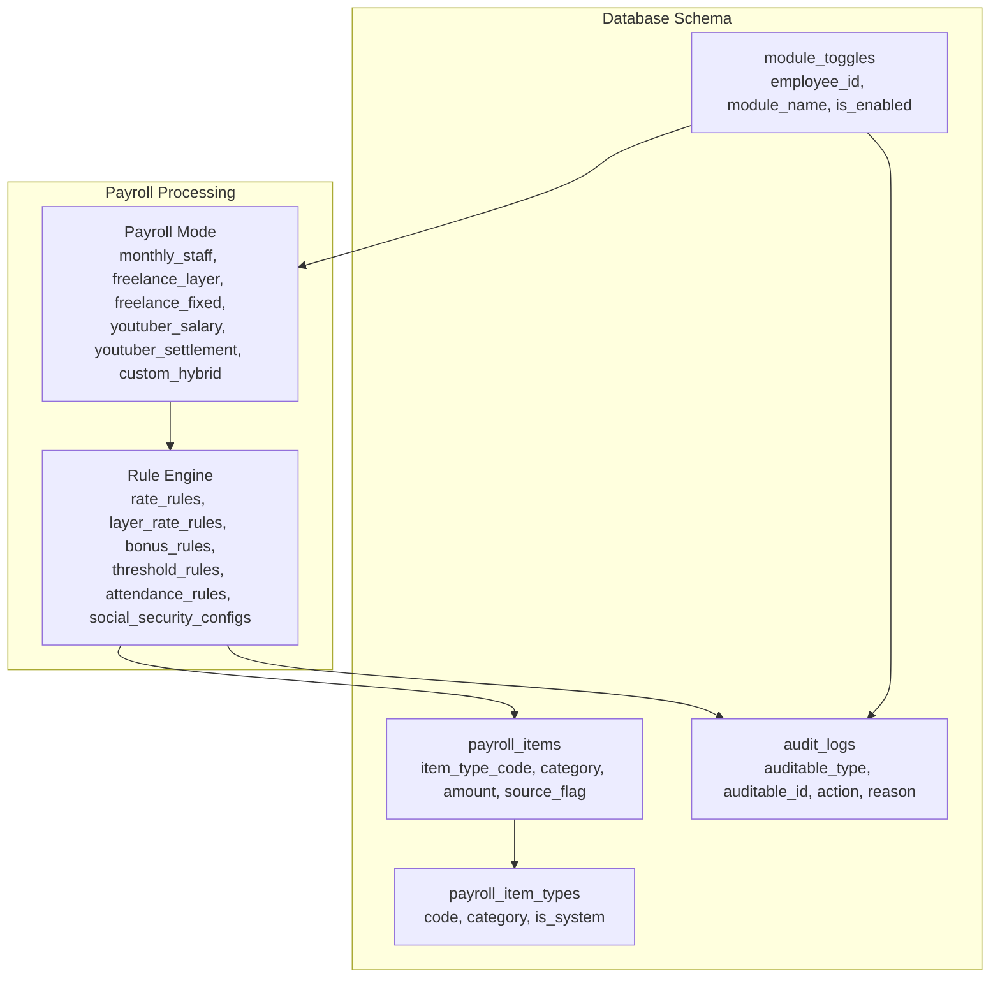
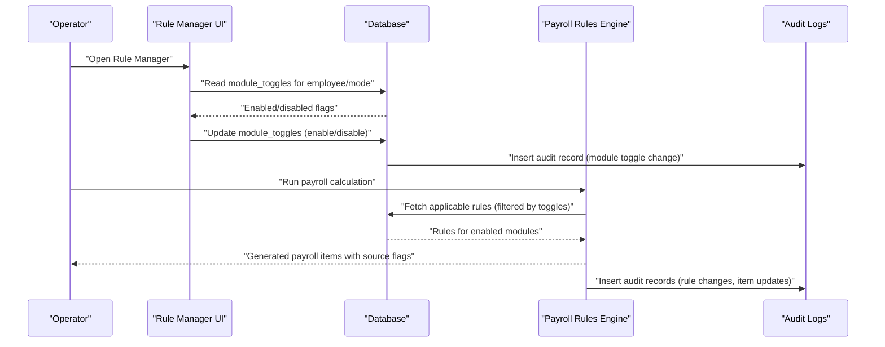
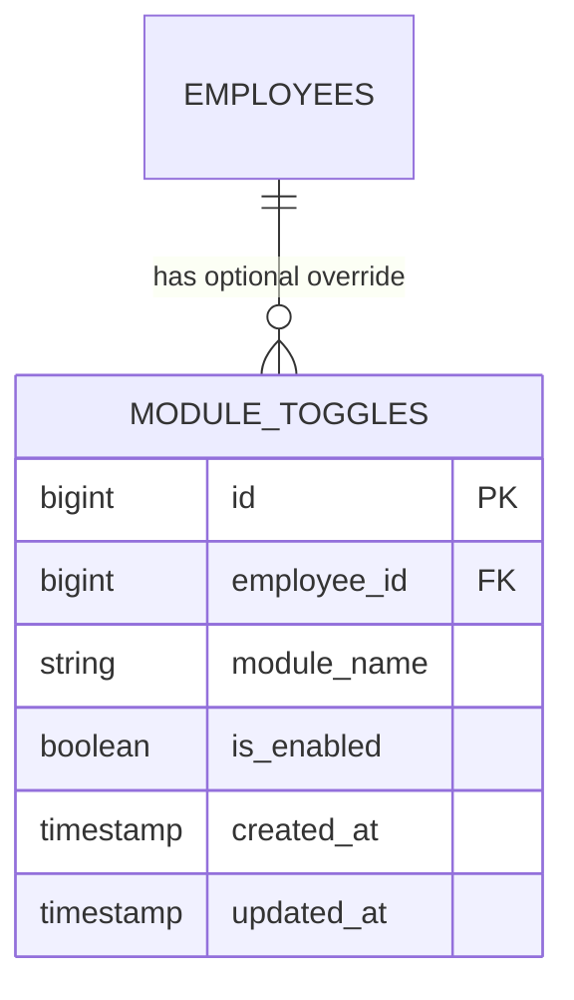
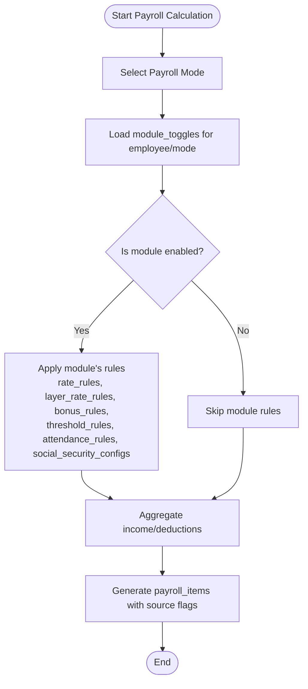
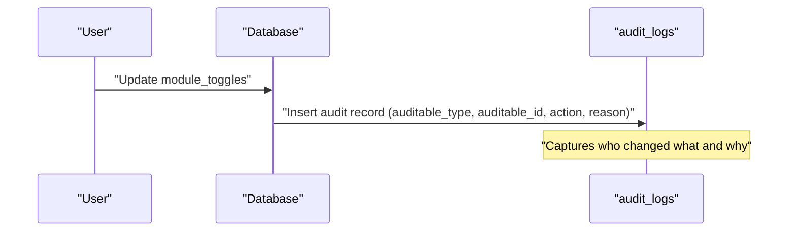
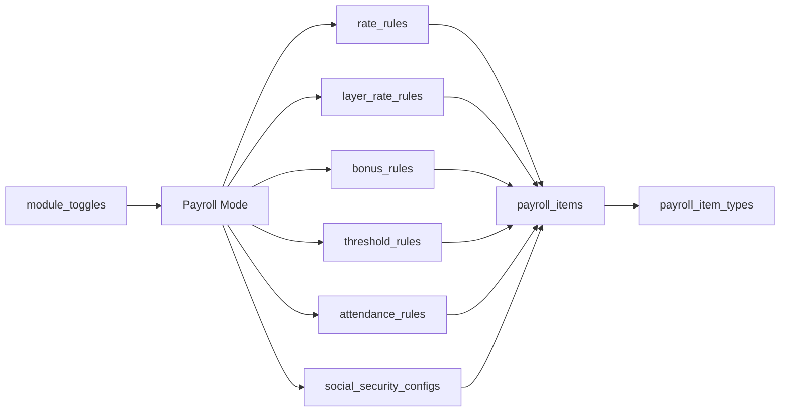

# Module Toggle and System Configuration Rules

<cite>
**Referenced Files in This Document**
- [create_rules_config_tables.php](file://database/migrations/0001_01_01_000008_create_rules_config_tables.php)
- [AGENTS.md](file://AGENTS.md)
- [create_audit_logs_table.php](file://database/migrations/0001_01_01_000011_create_audit_logs_table.php)
- [create_payroll_tables.php](file://database/migrations/0001_01_01_000007_create_payroll_tables.php)
- [logging.php](file://config/logging.php)
</cite>

## Table of Contents
1. [Introduction](#introduction)
2. [Project Structure](#project-structure)
3. [Core Components](#core-components)
4. [Architecture Overview](#architecture-overview)
5. [Detailed Component Analysis](#detailed-component-analysis)
6. [Dependency Analysis](#dependency-analysis)
7. [Performance Considerations](#performance-considerations)
8. [Troubleshooting Guide](#troubleshooting-guide)
9. [Conclusion](#conclusion)

## Introduction
This document explains the module_toggles table and system-wide configuration rules that govern feature availability and system behavior. It focuses on how module toggles control payroll modes, influence rule application across different payroll modes, and integrate with audit logging and system-wide settings. The goal is to help operators configure and troubleshoot payroll systems while maintaining auditability and flexibility.

## Project Structure
The payroll system is designed around rule-driven configuration stored in database tables. The module_toggles table enables or disables features per employee or globally, while other rule tables define behavior for rates, bonuses, thresholds, attendance, and social security. Audit logging captures changes for compliance and traceability.

**Diagram sources**
- [create_rules_config_tables.php:80-89](file://database/migrations/0001_01_01_000008_create_rules_config_tables.php#L80-L89)
- [create_payroll_tables.php:11-51](file://database/migrations/0001_01_01_000007_create_payroll_tables.php#L11-L51)
- [create_audit_logs_table.php:11-26](file://database/migrations/0001_01_01_000011_create_audit_logs_table.php#L11-L26)

**Section sources**
- [create_rules_config_tables.php:80-89](file://database/migrations/0001_01_01_000008_create_rules_config_tables.php#L80-L89)
- [AGENTS.md:286-353](file://AGENTS.md#L286-L353)
- [create_payroll_tables.php:11-51](file://database/migrations/0001_01_01_000007_create_payroll_tables.php#L11-L51)
- [create_audit_logs_table.php:11-26](file://database/migrations/0001_01_01_000011_create_audit_logs_table.php#L11-L26)

## Core Components
- module_toggles: Stores per-employee or global feature flags used to enable/disable modules affecting payroll processing.
- Payroll modes: Distinct calculation contexts (monthly_staff, freelance_layer, freelance_fixed, youtuber_salary, youtuber_settlement, custom_hybrid) that apply different sets of rules.
- Rule tables: Define configurable behavior for rates, layer rates, bonuses, thresholds, attendance, and social security.
- Audit logs: Capture changes to rules and module toggles for compliance and traceability.

Key characteristics of module_toggles:
- Composite unique key: (employee_id, module_name) ensures one setting per employee per module.
- Optional employee_id allows global defaults when null.
- Boolean is_enabled controls whether a module contributes to payroll calculations.

Impact on payroll processing:
- Enabling a module allows its associated rules to participate in computation.
- Disabling a module excludes its rules from affecting amounts, categories, or flags.
- Per-employee overrides can fine-tune behavior across payroll modes.

**Section sources**
- [create_rules_config_tables.php:80-89](file://database/migrations/0001_01_01_000008_create_rules_config_tables.php#L80-L89)
- [AGENTS.md:123-130](file://AGENTS.md#L123-L130)
- [AGENTS.md:440-444](file://AGENTS.md#L440-L444)
- [create_audit_logs_table.php:11-26](file://database/migrations/0001_01_01_000011_create_audit_logs_table.php#L11-L26)

## Architecture Overview
The system applies module-specific rules during payroll calculation. Module toggles gate whether those rules contribute to income or deduction items. Audit logs track all changes for compliance.

**Diagram sources**
- [create_rules_config_tables.php:80-89](file://database/migrations/0001_01_01_000008_create_rules_config_tables.php#L80-L89)
- [create_audit_logs_table.php:11-26](file://database/migrations/0001_01_01_000011_create_audit_logs_table.php#L11-L26)
- [create_payroll_tables.php:35-51](file://database/migrations/0001_01_01_000007_create_payroll_tables.php#L35-L51)

## Detailed Component Analysis

### Module Toggles Table
Structure and constraints:
- id: Auto-increment primary key
- employee_id: Nullable foreign key to employees; null indicates global/default behavior
- module_name: String identifier for the module
- is_enabled: Boolean flag controlling module participation
- timestamps: Created/updated tracking

Unique constraint: (employee_id, module_name) ensures one toggle per employee per module.

**Diagram sources**
- [create_rules_config_tables.php:80-89](file://database/migrations/0001_01_01_000008_create_rules_config_tables.php#L80-L89)

**Section sources**
- [create_rules_config_tables.php:80-89](file://database/migrations/0001_01_01_000008_create_rules_config_tables.php#L80-L89)

### Payroll Modes and Rule Application
Supported payroll modes include monthly_staff, freelance_layer, freelance_fixed, youtuber_salary, youtuber_settlement, and custom_hybrid. Each mode determines which rules are considered during calculation.

**Diagram sources**
- [AGENTS.md:123-130](file://AGENTS.md#L123-L130)
- [create_rules_config_tables.php:80-89](file://database/migrations/0001_01_01_000008_create_rules_config_tables.php#L80-L89)

**Section sources**
- [AGENTS.md:123-130](file://AGENTS.md#L123-L130)
- [AGENTS.md:196-221](file://AGENTS.md#L196-L221)

### Examples of Rule Configuration Using Module Toggles
Below are practical examples of configuring module toggles to control system behavior. Replace placeholders with actual module names and payroll modes as defined in your system.

- Enabling a payroll mode module:
  - Set is_enabled = true for the target payroll mode in module_toggles.
  - Ensure employee_id aligns with the intended employee or leave null for global defaults.
  - Impact: Rules from that mode become active in payroll calculations.

- Disabling a payroll mode module:
  - Set is_enabled = false for the target payroll mode.
  - Effect: Associated rules are excluded from computation.

- Controlling audit logging:
  - Changes to module_toggles are captured in audit_logs with auditable_type referencing the toggles table and auditable_id pointing to the toggle record.
  - Use action values to distinguish create/update/delete/finalize/unfinalize events as appropriate.

- Managing system-wide settings:
  - Use employee_id = null to define global defaults for module availability.
  - Override per-employee by setting employee_id to a specific employee.

Note: The examples above describe configuration intent and audit behavior derived from the schema and documentation. Specific module names and payroll modes should be validated against your deployment.

**Section sources**
- [create_rules_config_tables.php:80-89](file://database/migrations/0001_01_01_000008_create_rules_config_tables.php#L80-L89)
- [create_audit_logs_table.php:11-26](file://database/migrations/0001_01_01_000011_create_audit_logs_table.php#L11-L26)
- [AGENTS.md:576-596](file://AGENTS.md#L576-L596)

### Audit Logging Integration
Module toggle changes and rule modifications are recorded in audit_logs with:
- auditable_type: Model class (e.g., the toggles table)
- auditable_id: Primary key of the affected record
- action: Operation performed (e.g., update)
- reason: Optional justification for the change
- Timestamps: Creation time for traceability

**Diagram sources**
- [create_audit_logs_table.php:11-26](file://database/migrations/0001_01_01_000011_create_audit_logs_table.php#L11-L26)

**Section sources**
- [AGENTS.md:576-596](file://AGENTS.md#L576-L596)
- [create_audit_logs_table.php:11-26](file://database/migrations/0001_01_01_000011_create_audit_logs_table.php#L11-L26)

## Dependency Analysis
Module toggles influence rule application across payroll modes. The following diagram shows how toggles connect to rule tables and payroll items.

**Diagram sources**
- [create_rules_config_tables.php:80-89](file://database/migrations/0001_01_01_000008_create_rules_config_tables.php#L80-L89)
- [create_payroll_tables.php:11-51](file://database/migrations/0001_01_01_000007_create_payroll_tables.php#L11-L51)

**Section sources**
- [create_rules_config_tables.php:80-89](file://database/migrations/0001_01_01_000008_create_rules_config_tables.php#L80-L89)
- [create_payroll_tables.php:11-51](file://database/migrations/0001_01_01_000007_create_payroll_tables.php#L11-L51)

## Performance Considerations
- Indexes and constraints:
  - Unique composite index on (employee_id, module_name) optimizes lookups for per-employee overrides.
  - Foreign keys ensure referential integrity with employees and enforce cascading deletes.
- Rule filtering:
  - Pre-filter rules by module_toggles to minimize database queries and computation.
- Audit overhead:
  - Keep audit logs normalized and indexed by auditable_type and auditable_id for efficient reporting.

[No sources needed since this section provides general guidance]

## Troubleshooting Guide
Common issues and resolutions:
- Unexpected absence of module items in payroll:
  - Verify module_toggles.is_enabled is true for the relevant payroll mode and employee.
  - Confirm module_name matches the expected module identifier.
- Conflicts between global and per-employee settings:
  - Check for duplicate entries with employee_id null versus specific employee_id.
  - Resolve by removing conflicting rows or adjusting scope.
- Audit gaps:
  - Ensure audit_logs are being populated for module toggle changes and rule updates.
  - Review logging configuration for proper channel and level settings.

Relevant configuration references:
- Audit logging channels and levels are defined in the logging configuration.
- Audit log schema supports indexing and foreign key relationships for reliable querying.

**Section sources**
- [logging.php:1-113](file://config/logging.php#L1-L113)
- [create_audit_logs_table.php:11-26](file://database/migrations/0001_01_01_000011_create_audit_logs_table.php#L11-L26)

## Conclusion
Module toggles provide a flexible mechanism to control feature availability and system behavior across payroll modes. By combining per-employee overrides with global defaults, operators can tailor rule application to specific contexts while maintaining auditability. Proper configuration of module_toggles, rule tables, and audit logging ensures predictable and compliant payroll processing.