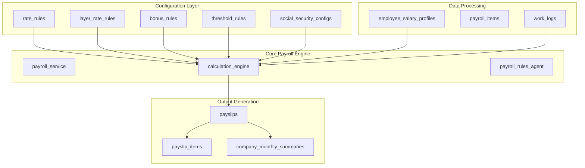
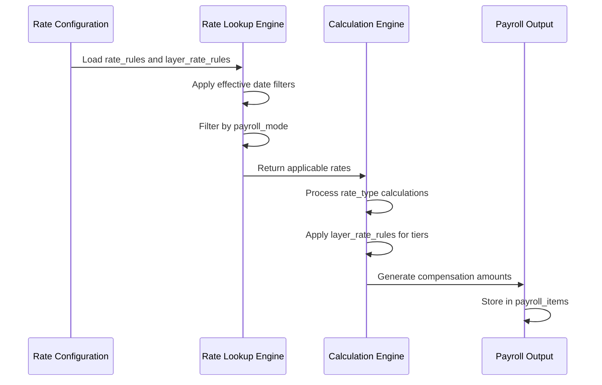
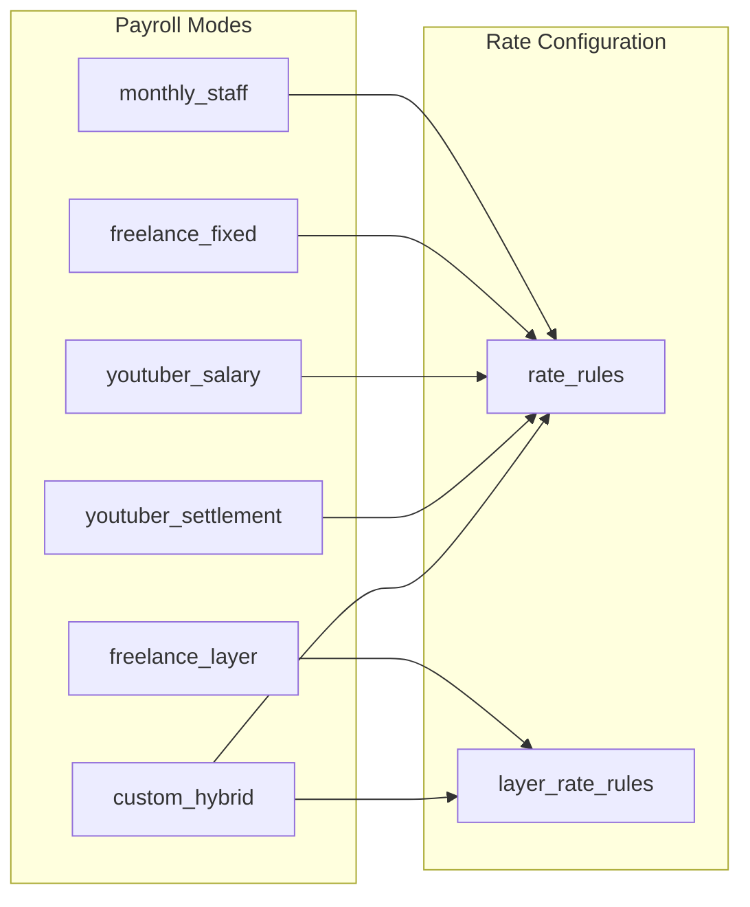
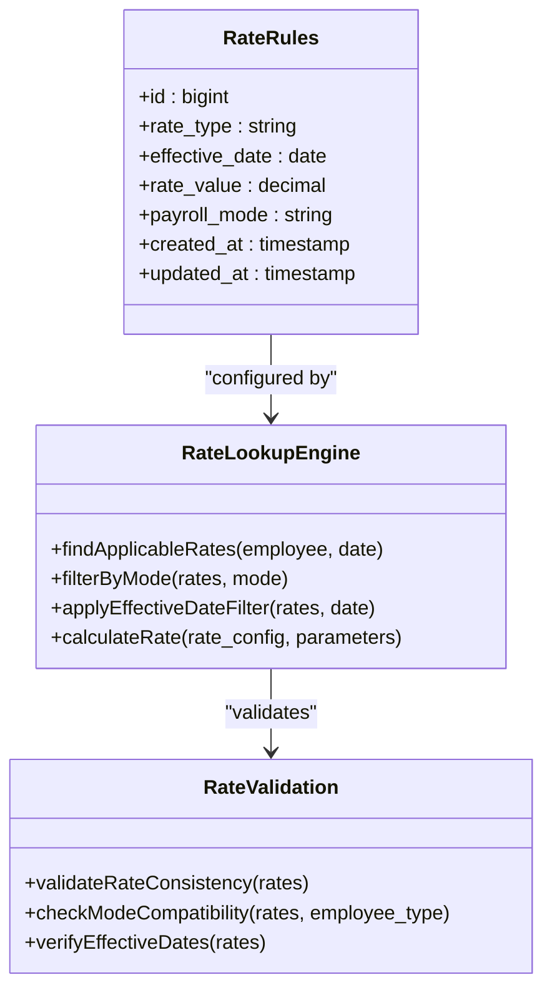
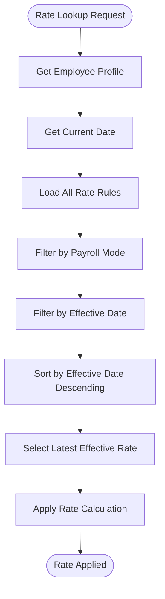
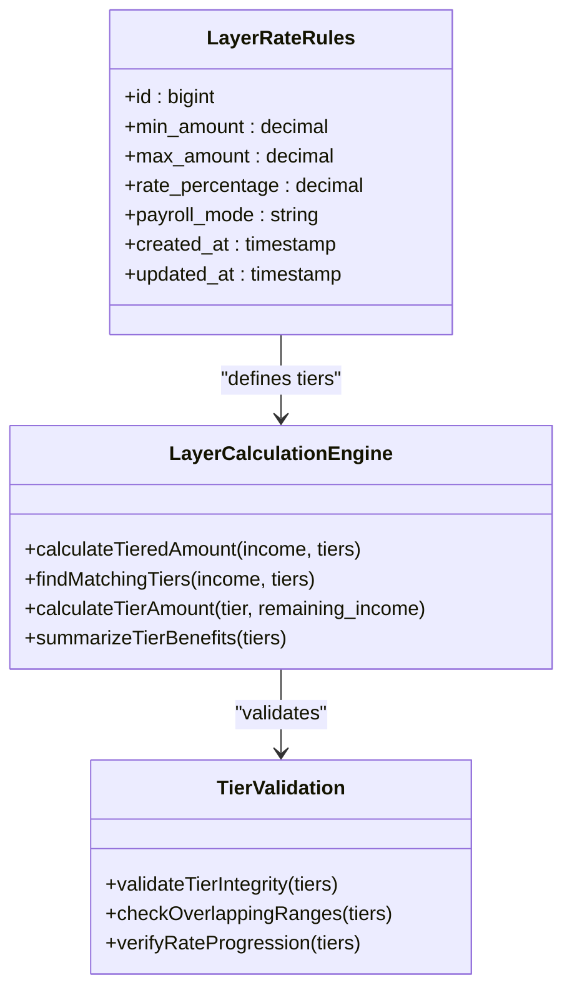
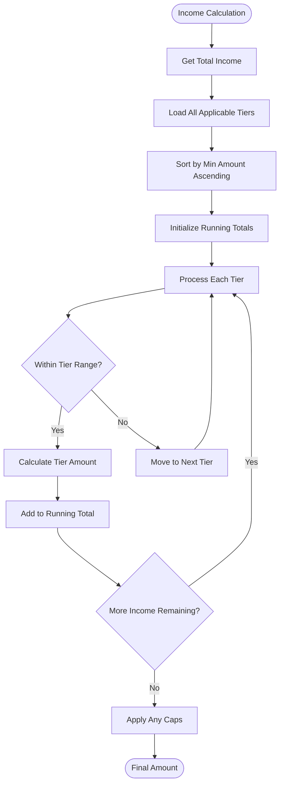
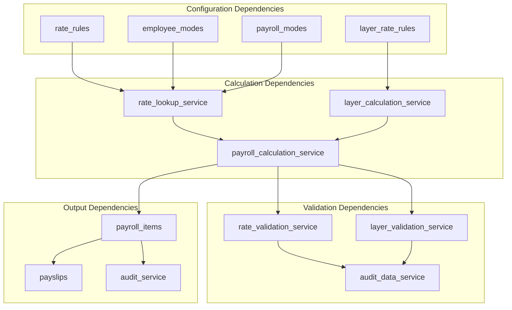
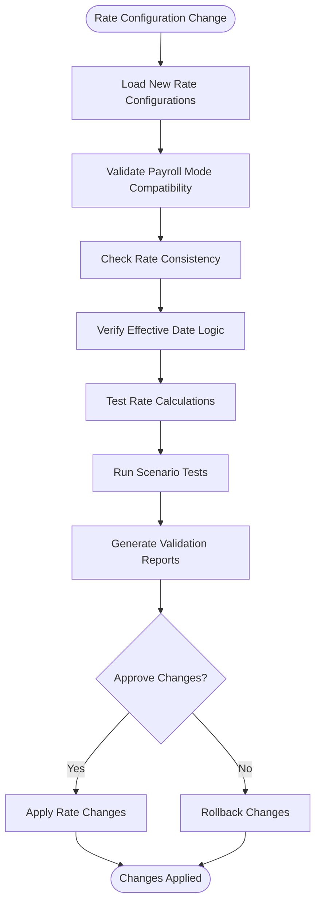

# Rate and Layer Rate Rules

<cite>
**Referenced Files in This Document**
- [AGENTS.md](file://AGENTS.md)
</cite>

## Table of Contents
1. [Introduction](#introduction)
2. [Project Structure](#project-structure)
3. [Core Components](#core-components)
4. [Architecture Overview](#architecture-overview)
5. [Detailed Component Analysis](#detailed-component-analysis)
6. [Dependency Analysis](#dependency-analysis)
7. [Performance Considerations](#performance-considerations)
8. [Troubleshooting Guide](#troubleshooting-guide)
9. [Conclusion](#conclusion)

## Introduction
This document provides comprehensive documentation for the rate_rules and layer_rate_rules configuration tables that handle compensation calculations in the xHR Payroll & Finance System. These tables form the foundation of the system's rule-driven compensation engine, supporting multiple payroll modes including monthly_staff, freelance_layer, and custom_hybrid configurations.

The system follows a rule-driven architecture where compensation formulas and rates are stored as configuration data rather than hardcoded logic, enabling dynamic adjustment of pay structures without code modifications.

## Project Structure
The xHR Payroll & Finance System is structured around several key components that work together to process employee compensation:

**Diagram sources**
- [AGENTS.md:404-405](file://AGENTS.md#L404-L405)
- [AGENTS.md:438-487](file://AGENTS.md#L438-L487)

**Section sources**
- [AGENTS.md:438-487](file://AGENTS.md#L438-L487)
- [AGENTS.md:385-435](file://AGENTS.md#L385-L435)

## Core Components

### Rate Rules Configuration
The rate_rules table serves as the primary configuration mechanism for compensation rates across different payroll modes. It enables flexible rate management through effective date-based rate application and payroll mode targeting.

#### Rate Rules Structure
The rate_rules table maintains rate configurations with the following key characteristics:

- **Rate Type System**: Supports different rate calculation methodologies
- **Effective Date Management**: Ensures proper rate application over time
- **Payroll Mode Targeting**: Enables mode-specific rate configurations
- **Decimal Precision**: Monetary values stored with appropriate precision

#### Layer Rate Rules Configuration
The layer_rate_rules table implements tiered compensation structures with graduated rates based on performance thresholds:

- **Tiered Rate System**: Progressive rate application based on achievement levels
- **Amount Thresholds**: Defines minimum and maximum thresholds for each rate tier
- **Percentage Calculations**: Implements graduated rate percentages per tier
- **Cumulative Application**: Supports tiered calculations across multiple thresholds

**Section sources**
- [AGENTS.md:404-405](file://AGENTS.md#L404-L405)
- [AGENTS.md:438-487](file://AGENTS.md#L438-L487)

## Architecture Overview

### Compensation Calculation Architecture
The rate_rules and layer_rate_rules tables integrate with the broader payroll system through a structured calculation pipeline:

**Diagram sources**
- [AGENTS.md:438-487](file://AGENTS.md#L438-L487)
- [AGENTS.md:404-405](file://AGENTS.md#L404-L405)

### Payroll Mode Integration
The system supports multiple payroll modes, each with specific rate configuration requirements:

**Diagram sources**
- [AGENTS.md:123-132](file://AGENTS.md#L123-L132)
- [AGENTS.md:404-405](file://AGENTS.md#L404-L405)

**Section sources**
- [AGENTS.md:123-132](file://AGENTS.md#L123-L132)
- [AGENTS.md:438-487](file://AGENTS.md#L438-L487)

## Detailed Component Analysis

### Rate Rules Table Analysis

#### Structure and Fields
The rate_rules table provides a flexible framework for compensation rate management:

**Diagram sources**
- [AGENTS.md:404](file://AGENTS.md#L404)
- [AGENTS.md:438-487](file://AGENTS.md#L438-L487)

#### Rate Types and Applications
The system supports various rate types for different compensation scenarios:

| Rate Type | Purpose | Example Usage | Calculation Method |
|-----------|---------|---------------|-------------------|
| hourly_rate | Hourly wage calculation | Standard employment | Base rate × hours worked |
| daily_rate | Daily compensation | Shift workers | Daily rate × days worked |
| monthly_rate | Fixed monthly payment | Salaried employees | Fixed monthly amount |
| commission_rate | Performance-based payment | Sales personnel | Sales volume × commission % |
| overtime_multiplier | Overtime premium | After standard hours | Base rate × multiplier |

#### Effective Date Management
The effective_date field ensures proper rate application over time:

**Diagram sources**
- [AGENTS.md:438-487](file://AGENTS.md#L438-L487)

**Section sources**
- [AGENTS.md:404](file://AGENTS.md#L404)
- [AGENTS.md:438-487](file://AGENTS.md#L438-L487)

### Layer Rate Rules Analysis

#### Tiered Structure Implementation
The layer_rate_rules table implements sophisticated tiered compensation systems:

**Diagram sources**
- [AGENTS.md:405](file://AGENTS.md#L405)
- [AGENTS.md:472-476](file://AGENTS.md#L472-L476)

#### Tier Configuration Parameters
Each tier in the layer_rate_rules table contains specific parameters:

| Field | Data Type | Description | Example Value |
|-------|-----------|-------------|---------------|
| min_amount | decimal(12,2) | Minimum threshold for tier applicability | 0.00 |
| max_amount | decimal(12,2) | Maximum threshold for tier applicability | 10000.00 |
| rate_percentage | decimal(5,2) | Percentage rate applied within tier | 15.00 |
| payroll_mode | string | Target payroll mode for tier | freelance_layer |
| effective_date | date | Date when tier becomes effective | 2024-01-01 |

#### Layer Calculation Algorithm
The tiered calculation process follows a progressive approach:

**Diagram sources**
- [AGENTS.md:472-476](file://AGENTS.md#L472-L476)

**Section sources**
- [AGENTS.md:405](file://AGENTS.md#L405)
- [AGENTS.md:472-476](file://AGENTS.md#L472-L476)

### Payroll Mode Configuration Examples

#### Monthly Staff Configuration
For monthly_staff payroll mode, rate_rules typically define base salary components and allowances:

| Rate Type | Effective Date | Rate Value | Payroll Mode | Description |
|-----------|----------------|------------|--------------|-------------|
| monthly_rate | 2024-01-01 | 45000.00 | monthly_staff | Base monthly salary |
| diligence_allowance | 2024-01-01 | 500.00 | monthly_staff | Attendance bonus |
| performance_threshold | 2024-01-01 | 80.00 | monthly_staff | Performance target % |

#### Freelance Layer Configuration
For freelance_layer payroll mode, layer_rate_rules defines tiered compensation:

| Min Amount | Max Amount | Rate Percentage | Payroll Mode | Description |
|------------|------------|-----------------|--------------|-------------|
| 0.00 | 10000.00 | 15.00 | freelance_layer | Basic tier |
| 10000.01 | 25000.00 | 20.00 | freelance_layer | Intermediate tier |
| 25000.01 | 50000.00 | 25.00 | freelance_layer | Premium tier |
| 50000.01 | 999999.99 | 30.00 | freelance_layer | Executive tier |

#### Custom Hybrid Configuration
For custom_hybrid payroll mode, both rate_rules and layer_rate_rules can be applied:

| Rate Type | Effective Date | Rate Value | Payroll Mode | Description |
|-----------|----------------|------------|--------------|-------------|
| hourly_rate | 2024-01-01 | 150.00 | custom_hybrid | Hourly component |
| monthly_rate | 2024-01-01 | 20000.00 | custom_hybrid | Monthly component |

**Section sources**
- [AGENTS.md:123-132](file://AGENTS.md#L123-L132)
- [AGENTS.md:472-476](file://AGENTS.md#L472-L476)

## Dependency Analysis

### Rate Configuration Dependencies
The rate_rules and layer_rate_rules tables depend on several system components:

**Diagram sources**
- [AGENTS.md:438-487](file://AGENTS.md#L438-L487)
- [AGENTS.md:576-595](file://AGENTS.md#L576-L595)

### Rate Consistency Validation
The system implements comprehensive validation to ensure rate consistency across different employee types:

**Diagram sources**
- [AGENTS.md:196-221](file://AGENTS.md#L196-L221)

**Section sources**
- [AGENTS.md:438-487](file://AGENTS.md#L438-L487)
- [AGENTS.md:196-221](file://AGENTS.md#L196-L221)

## Performance Considerations

### Rate Lookup Optimization
The rate lookup system implements several optimization strategies:

- **Index Strategy**: Proper indexing on effective_date, payroll_mode, and rate_type fields
- **Caching Mechanisms**: Caching of frequently accessed rate configurations
- **Batch Processing**: Efficient batch processing of rate calculations
- **Memory Management**: Optimized memory usage for large rate datasets

### Calculation Performance
Layer rate calculations benefit from:

- **Early Termination**: Stopping tier processing when income falls below minimum thresholds
- **Progressive Calculation**: Calculating tiers progressively to minimize computational overhead
- **Range Optimization**: Efficient range checking for tier applicability
- **Precision Management**: Balanced decimal precision for optimal performance

## Troubleshooting Guide

### Common Rate Configuration Issues
Several common issues can arise with rate configuration:

#### Rate Lookup Failures
- **Issue**: Rates not applying correctly for specific dates
- **Cause**: Incorrect effective_date filtering or overlapping rate configurations
- **Solution**: Verify effective_date ordering and ensure proper date filtering logic

#### Tier Calculation Errors
- **Issue**: Incorrect tier calculations for income amounts
- **Cause**: Overlapping tier ranges or incorrect rate percentages
- **Solution**: Validate tier ranges and ensure proper tier progression

#### Payroll Mode Compatibility
- **Issue**: Rates not applying to specific payroll modes
- **Cause**: Incorrect payroll_mode filtering or missing mode configurations
- **Solution**: Verify payroll_mode assignments and ensure proper mode targeting

### Validation and Audit
The system includes comprehensive validation and audit capabilities:

- **Rate Consistency Checks**: Automated validation of rate configurations
- **Audit Logging**: Complete audit trail of rate configuration changes
- **Exception Handling**: Robust error handling for invalid rate configurations
- **Recovery Mechanisms**: Automatic rollback of invalid rate changes

**Section sources**
- [AGENTS.md:576-595](file://AGENTS.md#L576-L595)
- [AGENTS.md:196-221](file://AGENTS.md#L196-L221)

## Conclusion

The rate_rules and layer_rate_rules configuration tables form the cornerstone of the xHR Payroll & Finance System's rule-driven compensation architecture. Through their flexible design and comprehensive validation mechanisms, they enable dynamic compensation management across multiple payroll modes while maintaining data integrity and audit compliance.

The system's implementation of tiered rate structures and effective date management provides the flexibility required for modern payroll processing, while the rule-driven approach ensures that compensation calculations remain configurable without requiring code modifications. This architecture supports the system's core principle of being "dynamic but controlled," enabling organizations to adapt their compensation structures as business requirements evolve.

The comprehensive validation and audit capabilities ensure that rate configurations remain consistent and reliable, while the performance optimizations support efficient processing of large-scale payroll calculations. Together, these components provide a robust foundation for automated compensation management in diverse organizational environments.