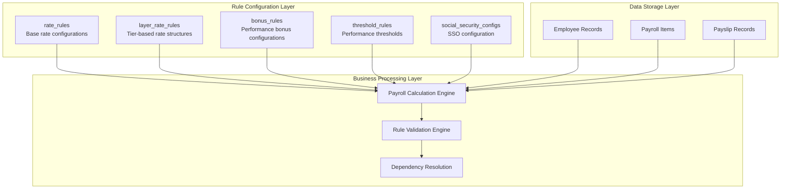
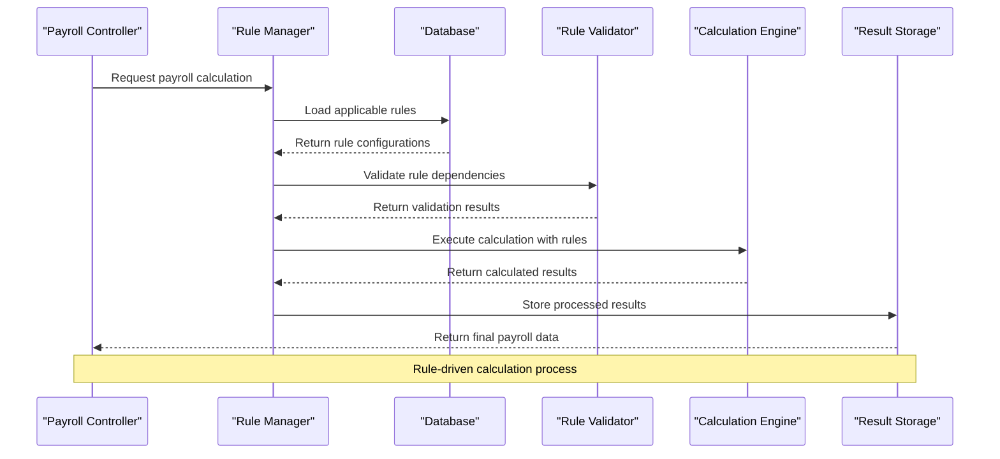
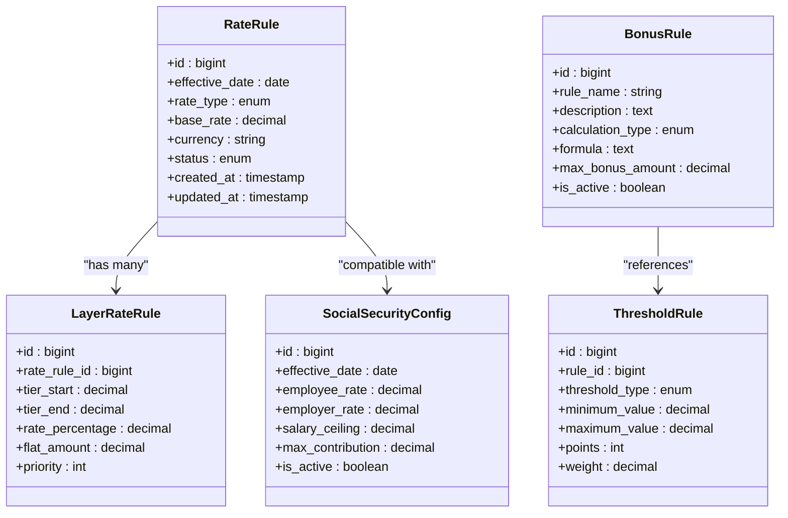
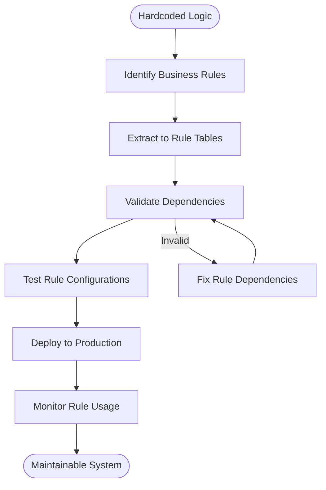
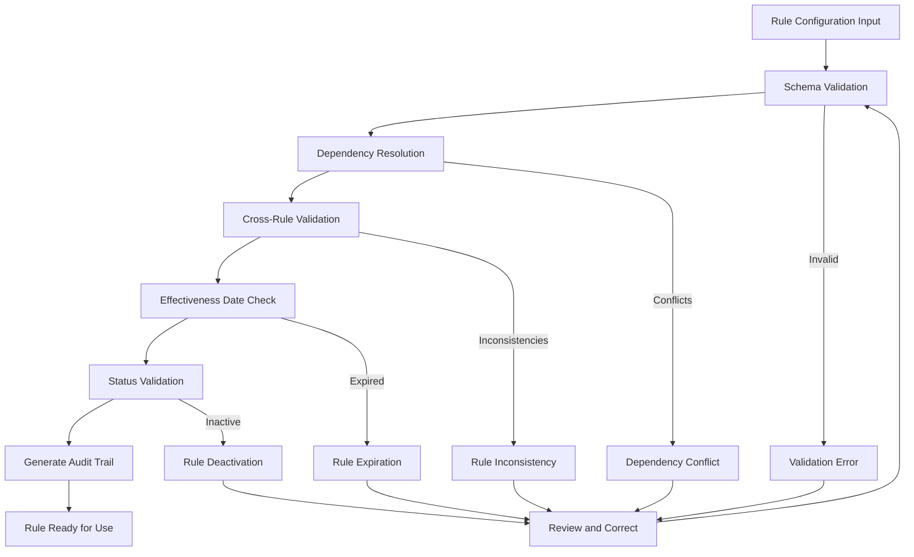
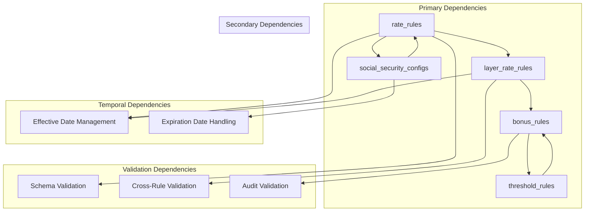

# Rule-driven Instead of Hardcoded Business Logic

<cite>
**Referenced Files in This Document**
- [AGENTS.md](file://AGENTS.md)
</cite>

## Table of Contents
1. [Introduction](#introduction)
2. [Project Structure](#project-structure)
3. [Core Components](#core-components)
4. [Architecture Overview](#architecture-overview)
5. [Detailed Component Analysis](#detailed-component-analysis)
6. [Dependency Analysis](#dependency-analysis)
7. [Performance Considerations](#performance-considerations)
8. [Troubleshooting Guide](#troubleshooting-guide)
9. [Conclusion](#conclusion)

## Introduction

The xHR Payroll & Finance System represents a paradigm shift from traditional spreadsheet-based payroll management to a modern, rule-driven architecture. This system eliminates hardcoded business logic by replacing it with configurable rules stored in database tables, enabling dynamic business rule management while maintaining system integrity and auditability.

The core philosophy centers on six fundamental principles: PHP-first development, MySQL/phpMyAdmin compatibility, dynamic data entry, rule-driven architecture, auditability, and easy maintainability. These principles guide every aspect of the system design, from database schema to business logic implementation.

## Project Structure

The system follows a structured approach to rule management through dedicated configuration tables that serve as the single source of truth for all business logic. The architecture separates concerns between data storage, rule configuration, and business processing.

**Diagram sources**
- [AGENTS.md:387-417](file://AGENTS.md#L387-L417)
- [AGENTS.md:438-506](file://AGENTS.md#L438-L506)

**Section sources**
- [AGENTS.md:34-100](file://AGENTS.md#L34-L100)
- [AGENTS.md:387-435](file://AGENTS.md#L387-L435)

## Core Components

The rule-driven architecture consists of five primary rule configuration tables that replace hardcoded business logic throughout the system:

### Rate Rules Configuration
The `rate_rules` table serves as the foundation for all rate-based calculations, storing base rates and rate structures that can be dynamically adjusted without code modifications.

### Layer Rate Rules Configuration
The `layer_rate_rules` table manages tier-based rate structures, enabling complex rate calculations with multiple tiers and breakpoints that adapt to changing business requirements.

### Bonus Rules Configuration
The `bonus_rules` table centralizes all performance-based bonus configurations, allowing for flexible bonus structures that can be modified independently of the core calculation engine.

### Threshold Rules Configuration
The `threshold_rules` table defines performance thresholds and criteria for various payroll components, enabling dynamic adjustment of performance-based calculations.

### Social Security Configuration
The `social_security_configs` table manages Thailand-specific social security calculations with configurable rates, ceilings, and effective dates, eliminating hardcoded legal values.

**Section sources**
- [AGENTS.md:403-408](file://AGENTS.md#L403-L408)
- [AGENTS.md:488-497](file://AGENTS.md#L488-L497)

## Architecture Overview

The rule-driven architecture transforms traditional hardcoded business logic into configurable rule systems through a sophisticated dependency resolution mechanism.

**Diagram sources**
- [AGENTS.md:196-221](file://AGENTS.md#L196-L221)
- [AGENTS.md:338-343](file://AGENTS.md#L338-L343)

The architecture ensures that business logic extraction follows strict guidelines: no hardcoded formulas in views or controllers, centralized rule management, and comprehensive validation of rule dependencies before execution.

**Section sources**
- [AGENTS.md:61-74](file://AGENTS.md#L61-L74)
- [AGENTS.md:196-221](file://AGENTS.md#L196-L221)

## Detailed Component Analysis

### Rule Configuration Tables

Each rule configuration table serves a specific business function while maintaining interoperability through standardized interfaces and validation mechanisms.

**Diagram sources**
- [AGENTS.md:403-408](file://AGENTS.md#L403-L408)
- [AGENTS.md:488-497](file://AGENTS.md#L488-L497)

### Transformation from Hardcoded to Configurable Rules

The system demonstrates a clear methodology for transforming hardcoded business logic into database-configurable rules:

#### Before: Hardcoded Formula
Traditional approaches embed business logic directly in controllers and views, making modifications difficult and error-prone.

#### After: Configurable Rule System
Business logic is extracted into rule configuration tables with validation, dependency management, and audit capabilities.

**Diagram sources**
- [AGENTS.md:61-74](file://AGENTS.md#L61-L74)
- [AGENTS.md:196-221](file://AGENTS.md#L196-L221)

**Section sources**
- [AGENTS.md:438-506](file://AGENTS.md#L438-L506)
- [AGENTS.md:61-74](file://AGENTS.md#L61-L74)

### Rule Validation and Dependency Management

The system implements comprehensive validation mechanisms to ensure rule integrity and prevent conflicts between different rule configurations.

**Diagram sources**
- [AGENTS.md:196-221](file://AGENTS.md#L196-L221)
- [AGENTS.md:578-595](file://AGENTS.md#L578-L595)

**Section sources**
- [AGENTS.md:196-221](file://AGENTS.md#L196-L221)
- [AGENTS.md:578-595](file://AGENTS.md#L578-L595)

## Dependency Analysis

The rule-driven architecture creates a complex web of dependencies that must be carefully managed to ensure system stability and maintainability.

**Diagram sources**
- [AGENTS.md:403-408](file://AGENTS.md#L403-L408)
- [AGENTS.md:196-221](file://AGENTS.md#L196-L221)

The dependency management system ensures that rule changes don't break existing functionality while allowing for flexible business rule modifications.

**Section sources**
- [AGENTS.md:196-221](file://AGENTS.md#L196-L221)
- [AGENTS.md:403-408](file://AGENTS.md#L403-L408)

## Performance Considerations

The rule-driven architecture introduces several performance considerations that must be addressed to maintain system responsiveness:

### Rule Caching Strategies
- Implement rule caching mechanisms to reduce database queries
- Use cache invalidation strategies for rule updates
- Apply time-based caching for frequently accessed rules

### Query Optimization
- Design efficient database queries for rule retrieval
- Implement proper indexing on rule configuration tables
- Optimize rule dependency resolution queries

### Memory Management
- Implement memory-efficient rule loading mechanisms
- Use lazy loading for complex rule hierarchies
- Manage rule object lifecycle effectively

## Troubleshooting Guide

Common issues in rule-driven systems and their solutions:

### Rule Validation Failures
- **Symptom**: Rules fail validation during deployment
- **Solution**: Check rule dependencies and effectiveness dates
- **Prevention**: Implement comprehensive pre-deployment validation

### Performance Degradation
- **Symptom**: Slow rule processing times
- **Solution**: Implement rule caching and optimize database queries
- **Prevention**: Monitor rule processing performance regularly

### Rule Conflicts
- **Symptom**: Inconsistent rule behavior across different contexts
- **Solution**: Review rule precedence and dependency resolution
- **Prevention**: Establish clear rule conflict resolution policies

**Section sources**
- [AGENTS.md:663-672](file://AGENTS.md#L663-L672)
- [AGENTS.md:578-595](file://AGENTS.md#L578-L595)

## Conclusion

The rule-driven development approach transforms traditional payroll systems from rigid, hardcoded applications into flexible, configurable platforms. By replacing hardcoded business logic with database-configurable rules, the xHR Payroll & Finance System achieves:

- **Enhanced Maintainability**: Business rules can be modified without code changes
- **Improved Flexibility**: Rapid adaptation to changing business requirements
- **Better Auditability**: Comprehensive tracking of rule changes and their impacts
- **Reduced Technical Debt**: Elimination of scattered business logic throughout the codebase
- **Scalable Architecture**: Support for complex rule hierarchies and dependencies

The implementation of rate_rules, layer_rate_rules, bonus_rules, threshold_rules, and social_security_configs creates a robust foundation for dynamic business rule management while maintaining system integrity and compliance requirements.

This approach represents the future of enterprise payroll systems, providing the balance between flexibility and control that modern organizations require for sustainable growth and adaptation.