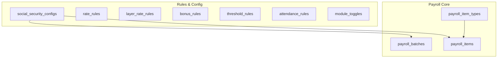
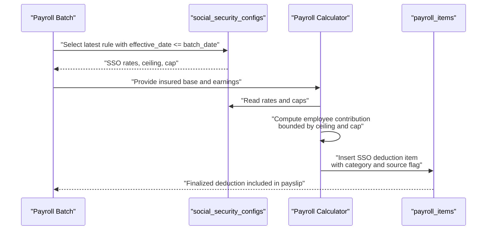
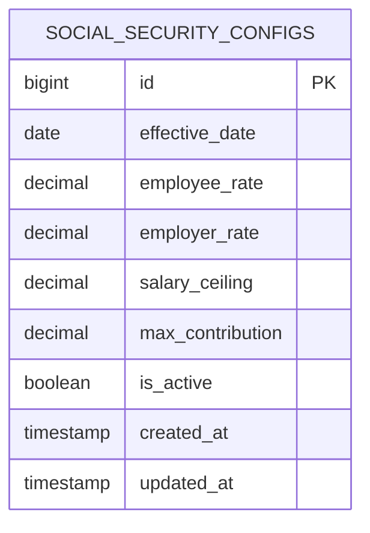
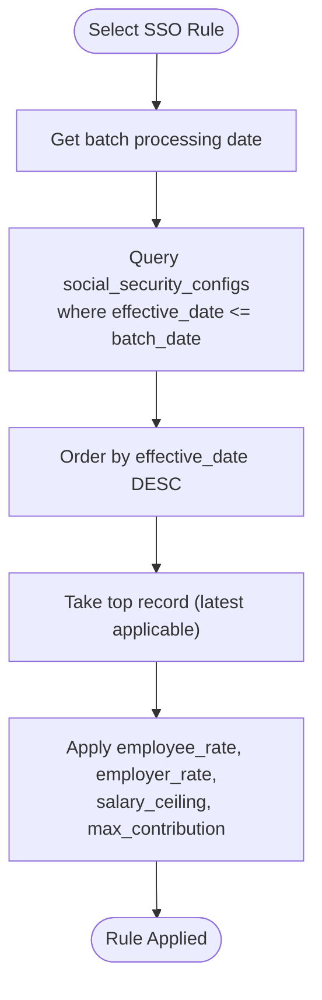
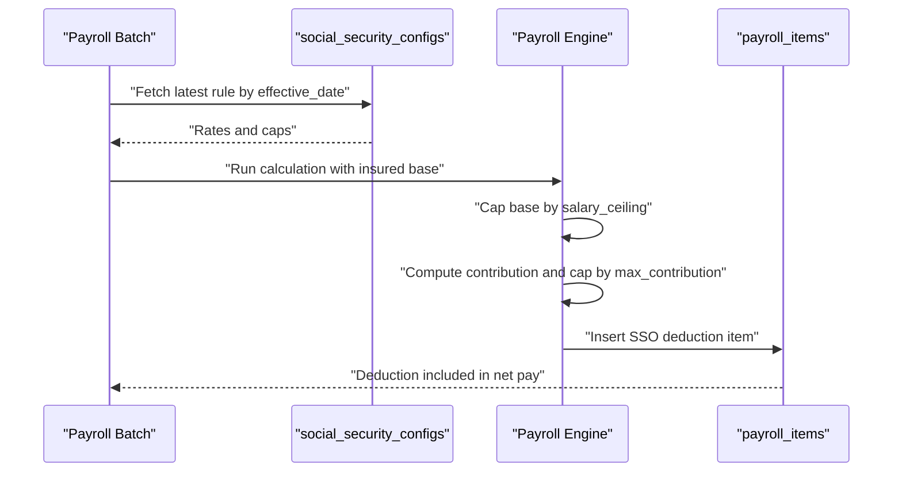
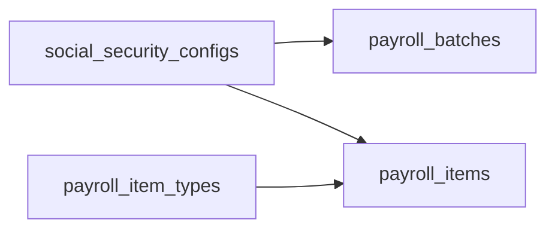

# Social Security Configuration Rules

<cite>
**Referenced Files in This Document**
- [AGENTS.md](file://AGENTS.md)
- [0001_01_01_000008_create_rules_config_tables.php](file://database/migrations/0001_01_01_000008_create_rules_config_tables.php)
- [0001_01_01_000007_create_payroll_tables.php](file://database/migrations/0001_01_01_000007_create_payroll_tables.php)
</cite>

## Table of Contents
1. [Introduction](#introduction)
2. [Project Structure](#project-structure)
3. [Core Components](#core-components)
4. [Architecture Overview](#architecture-overview)
5. [Detailed Component Analysis](#detailed-component-analysis)
6. [Dependency Analysis](#dependency-analysis)
7. [Performance Considerations](#performance-considerations)
8. [Troubleshooting Guide](#troubleshooting-guide)
9. [Conclusion](#conclusion)

## Introduction
This document explains the social_security_configs table and Thailand social security compliance rules within the payroll system. It covers the configuration structure, temporal rule management via effective_date, and how the system integrates with the payroll calculation engine to compute employee-side SSO deductions accurately. The design emphasizes dynamic, rule-driven configuration over hardcoded values, enabling compliance with changing regulations and internal policies.

## Project Structure
The repository defines the social_security_configs table alongside payroll and rule-related tables. The migration files establish the schema and relationships that support Thailand-specific SSO configuration and payroll itemization.

**Diagram sources**
- [0001_01_01_000007_create_payroll_tables.php:11-51](file://database/migrations/0001_01_01_000007_create_payroll_tables.php#L11-L51)
- [0001_01_01_000008_create_rules_config_tables.php:60-69](file://database/migrations/0001_01_01_000008_create_rules_config_tables.php#L60-L69)

**Section sources**
- [0001_01_01_000007_create_payroll_tables.php:11-51](file://database/migrations/0001_01_01_000007_create_payroll_tables.php#L11-L51)
- [0001_01_01_000008_create_rules_config_tables.php:60-69](file://database/migrations/0001_01_01_000008_create_rules_config_tables.php#L60-L69)

## Core Components
The social_security_configs table stores Thailand SSO configuration parameters with temporal applicability:

- effective_date: Determines which rule applies for a given payroll period.
- employee_rate: Percentage rate applied to the insured base for employee contribution.
- employer_rate: Percentage rate applied to the insured base for employer contribution.
- salary_ceiling: Maximum insured base subject to SSO calculations.
- max_contribution: Cap on the monthly contribution amount.
- is_active: Enables or disables the rule for selection logic.

These fields align with the payroll system’s business rules for Thailand social security and ensure compliance through configurable, auditable settings.

**Section sources**
- [0001_01_01_000008_create_rules_config_tables.php:60-69](file://database/migrations/0001_01_01_000008_create_rules_config_tables.php#L60-L69)
- [AGENTS.md:488-497](file://AGENTS.md#L488-L497)

## Architecture Overview
The Thailand SSO configuration integrates with the payroll calculation pipeline as follows:

- Rule selection: The system selects the applicable social_security_configs record based on effective_date relative to the payroll batch period.
- Base determination: The insured base is derived from the employee’s earnings subject to SSO, bounded by salary_ceiling.
- Contribution computation: Employee and employer contributions are computed using employee_rate and employer_rate against the insured base, capped by max_contribution.
- Payroll itemization: The employee-side contribution is recorded as a deduction item in payroll_items with appropriate categorization and source_flag.

**Diagram sources**
- [0001_01_01_000008_create_rules_config_tables.php:60-69](file://database/migrations/0001_01_01_000008_create_rules_config_tables.php#L60-L69)
- [0001_01_01_000007_create_payroll_tables.php:35-51](file://database/migrations/0001_01_01_000007_create_payroll_tables.php#L35-L51)
- [AGENTS.md:488-497](file://AGENTS.md#L488-L497)

## Detailed Component Analysis

### Table Definition and Fields
The social_security_configs table schema supports Thailand SSO configuration with precise numeric types and defaults aligned to typical regulatory parameters.

**Diagram sources**
- [0001_01_01_000008_create_rules_config_tables.php:60-69](file://database/migrations/0001_01_01_000008_create_rules_config_tables.php#L60-L69)

**Section sources**
- [0001_01_01_000008_create_rules_config_tables.php:60-69](file://database/migrations/0001_01_01_000008_create_rules_config_tables.php#L60-L69)

### Rule Selection Logic
Temporal applicability is managed by effective_date. For a given payroll batch, the system selects the most recent rule whose effective_date is less than or equal to the batch’s processing date. This ensures historical accuracy and forward-looking updates without ambiguity.

**Diagram sources**
- [0001_01_01_000008_create_rules_config_tables.php:60-69](file://database/migrations/0001_01_01_000008_create_rules_config_tables.php#L60-L69)

**Section sources**
- [0001_01_01_000008_create_rules_config_tables.php:60-69](file://database/migrations/0001_01_01_000008_create_rules_config_tables.php#L60-L69)

### Compliance and Payroll Integration
The payroll system treats SSO as a deduction item. The employee contribution is computed from the insured base, bounded by salary_ceiling and max_contribution, then inserted into payroll_items with category and source_flag to reflect rule-driven generation.

**Diagram sources**
- [0001_01_01_000007_create_payroll_tables.php:35-51](file://database/migrations/0001_01_01_000007_create_payroll_tables.php#L35-L51)
- [0001_01_01_000008_create_rules_config_tables.php:60-69](file://database/migrations/0001_01_01_000008_create_rules_config_tables.php#L60-L69)
- [AGENTS.md:440-446](file://AGENTS.md#L440-L446)

**Section sources**
- [0001_01_01_000007_create_payroll_tables.php:35-51](file://database/migrations/0001_01_01_000007_create_payroll_tables.php#L35-L51)
- [AGENTS.md:440-446](file://AGENTS.md#L440-L446)

### Example Configuration Scenarios
Below are representative scenarios illustrating how rules can be configured over time. These examples demonstrate temporal changes and boundary conditions without exposing specific code.

- Scenario A: Initial rule
  - effective_date: 2020-01-01
  - employee_rate: 5.00%
  - employer_rate: 5.00%
  - salary_ceiling: 15000.00
  - max_contribution: 750.00

- Scenario B: Rate change mid-year
  - effective_date: 2023-07-01
  - employee_rate: 5.00%
  - employer_rate: 5.00%
  - salary_ceiling: 16000.00
  - max_contribution: 800.00

- Scenario C: Cap adjustment
  - effective_date: 2024-01-01
  - employee_rate: 5.00%
  - employer_rate: 5.00%
  - salary_ceiling: 16000.00
  - max_contribution: 800.00

- Scenario D: Future-dated rule
  - effective_date: 2025-01-01
  - employee_rate: 5.00%
  - employer_rate: 5.00%
  - salary_ceiling: 17000.00
  - max_contribution: 850.00

Notes:
- For any given payroll period, the system selects the latest rule with an effective_date on or before the batch date.
- salary_ceiling and max_contribution define the maximum deductible amount and the upper bound for the insured base.
- Changes take effect only on or after their effective_date, ensuring historical accuracy.

**Section sources**
- [0001_01_01_000008_create_rules_config_tables.php:60-69](file://database/migrations/0001_01_01_000008_create_rules_config_tables.php#L60-L69)
- [AGENTS.md:488-497](file://AGENTS.md#L488-L497)

## Dependency Analysis
The social_security_configs table participates in the following relationships:

- Payroll batches: Rules are selected per batch based on effective_date.
- Payroll items: The computed employee contribution becomes a deduction item in the payslip.
- Payroll item types: Deduction categorization is governed by payroll_item_types.

**Diagram sources**
- [0001_01_01_000007_create_payroll_tables.php:22-51](file://database/migrations/0001_01_01_000007_create_payroll_tables.php#L22-L51)
- [0001_01_01_000008_create_rules_config_tables.php:60-69](file://database/migrations/0001_01_01_000008_create_rules_config_tables.php#L60-L69)

**Section sources**
- [0001_01_01_000007_create_payroll_tables.php:22-51](file://database/migrations/0001_01_01_000007_create_payroll_tables.php#L22-L51)
- [0001_01_01_000008_create_rules_config_tables.php:60-69](file://database/migrations/0001_01_01_000008_create_rules_config_tables.php#L60-L69)

## Performance Considerations
- Indexing: Add an index on (effective_date, is_active) to accelerate rule selection for a given batch date.
- Partitioning: Consider partitioning social_security_configs by effective_date for very large histories.
- Caching: Cache the latest rule per batch date to reduce repeated lookups during mass processing.
- Decimal precision: Use consistent precision across calculations to avoid rounding discrepancies.

## Troubleshooting Guide
Common issues and resolutions:

- No rule selected for a batch date
  - Verify that at least one social_security_configs record exists with effective_date <= batch date.
  - Confirm is_active is true for the intended rule.

- Incorrect contribution amount
  - Check that the insured base does not exceed salary_ceiling.
  - Ensure max_contribution caps the computed amount.

- Historical mismatch
  - Confirm the effective_date ordering and selection logic.
  - Validate that future-dated rules do not apply retroactively.

- Payroll item classification
  - Ensure the SSO deduction item is categorized as a deduction and marked appropriately in source_flag.

**Section sources**
- [0001_01_01_000008_create_rules_config_tables.php:60-69](file://database/migrations/0001_01_01_000008_create_rules_config_tables.php#L60-L69)
- [0001_01_01_000007_create_payroll_tables.php:35-51](file://database/migrations/0001_01_01_000007_create_payroll_tables.php#L35-L51)
- [AGENTS.md:488-497](file://AGENTS.md#L488-L497)

## Conclusion
The social_security_configs table provides a robust, rule-driven mechanism for Thailand social security compliance. By leveraging effective_date, percentage rates, salary ceilings, and contribution caps, the system supports accurate SSO deduction calculations across time and maintains auditability and flexibility for policy changes.