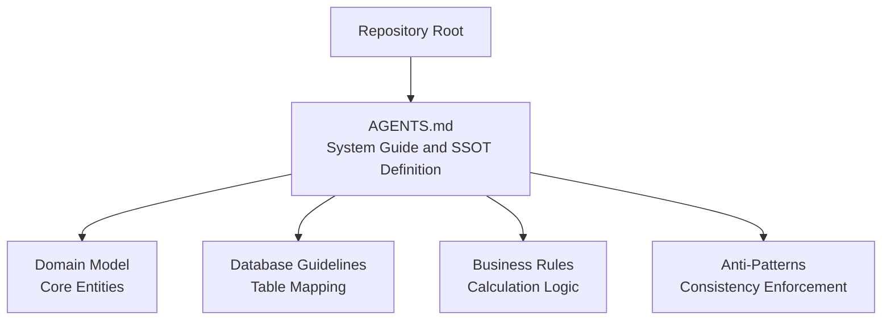
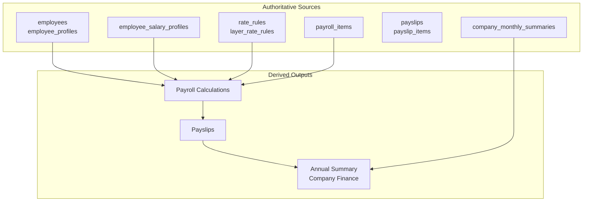
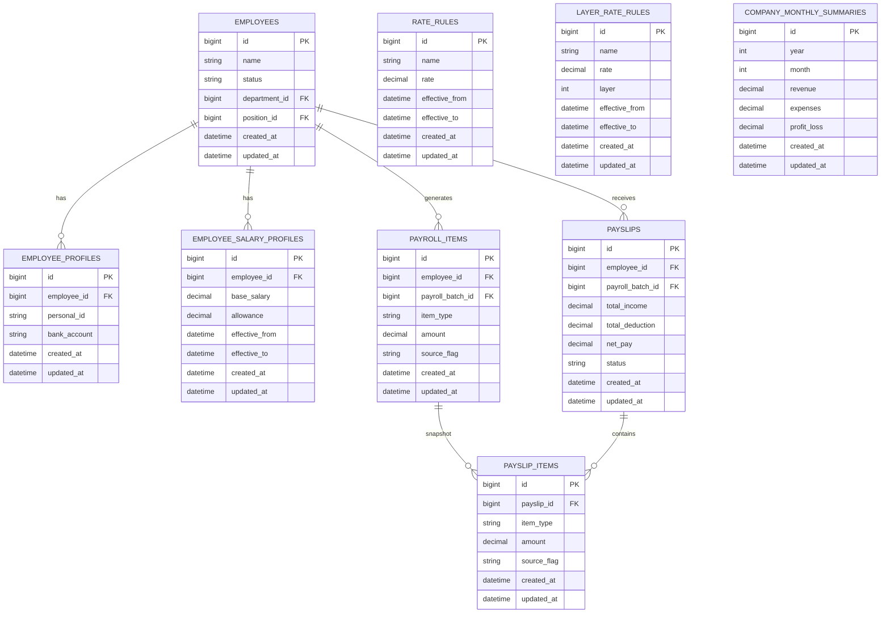
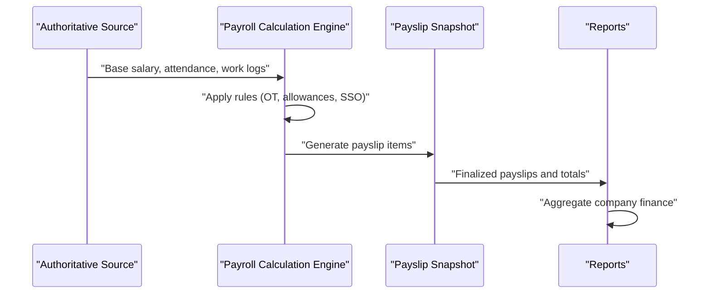
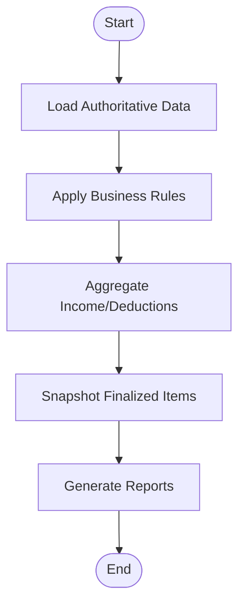
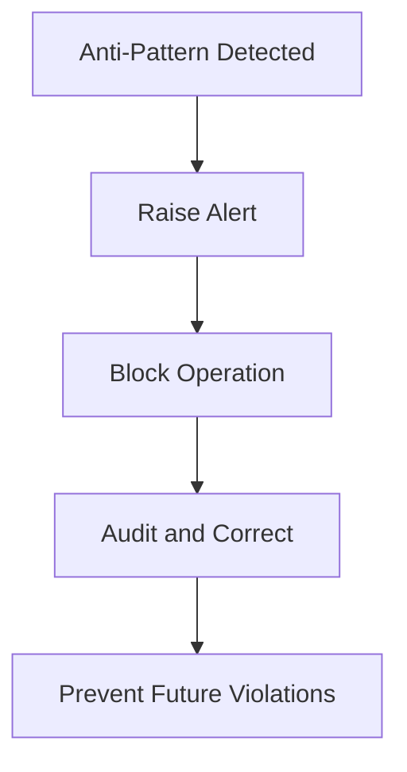
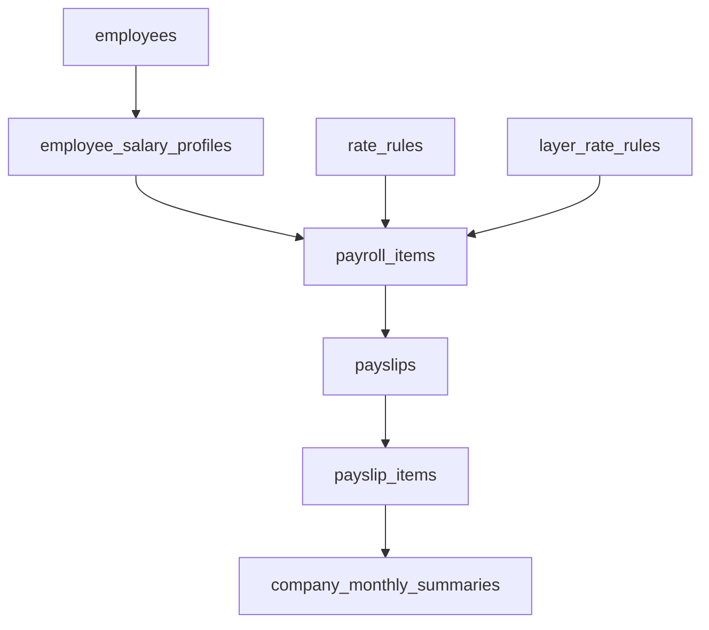

# Single Source of Truth Principle

<cite>
**Referenced Files in This Document**
- [AGENTS.md](file://AGENTS.md)
</cite>

## Table of Contents
1. [Introduction](#introduction)
2. [Project Structure](#project-structure)
3. [Core Components](#core-components)
4. [Architecture Overview](#architecture-overview)
5. [Detailed Component Analysis](#detailed-component-analysis)
6. [Dependency Analysis](#dependency-analysis)
7. [Performance Considerations](#performance-considerations)
8. [Troubleshooting Guide](#troubleshooting-guide)
9. [Conclusion](#conclusion)

## Introduction
This document establishes the Single Source of Truth (SSOT) principle for the xHR Payroll & Finance System. It defines authoritative data locations for all major entities, explains database table mappings, and demonstrates how each business entity maintains its master record. It also outlines implementation examples for proper data flow from authoritative sources to derived calculations and reports, and details anti-patterns to avoid to ensure data consistency across the entire system.

## Project Structure
The repository contains a single comprehensive guide that defines the SSOT principle, domain model, database guidelines, and business rules. The guide serves as the single source of truth for the system’s design and implementation.

**Section sources**
- [AGENTS.md:1-721](file://AGENTS.md#L1-L721)

## Core Components
The SSOT principle identifies authoritative data locations for each major business entity. These locations serve as the master records from which all derived calculations and reports are produced.

- Employee Profile: authoritative in employees and employee_profiles
- Base Salary: authoritative in employee_salary_profiles
- Rate Configurations: authoritative in rate_rules and layer_rate_rules
- Monthly Payroll Items: authoritative in payroll_items
- Payslips: authoritative in payslips and payslip_items
- Company Monthly Finance: authoritative in company_monthly_summaries

These authoritative sources ensure that downstream calculations and reports are consistent and traceable.

**Section sources**
- [AGENTS.md:49-60](file://AGENTS.md#L49-L60)

## Architecture Overview
The SSOT architecture enforces a strict hierarchy where authoritative data sources feed into derived results. The system avoids duplicating data sources and centralizes business logic in rule-driven configurations.

**Diagram sources**
- [AGENTS.md:49-60](file://AGENTS.md#L49-L60)
- [AGENTS.md:387-417](file://AGENTS.md#L387-L417)

## Detailed Component Analysis

### Authoritative Data Locations and Master Records
Each business entity maintains a master record in a dedicated authoritative table. This ensures that all downstream calculations and reports derive from a single, trusted source.

- Employees and Employee Profiles
  - Master record maintained in employees and employee_profiles
  - Supports payroll mode assignment, personal details, and employment status
- Base Salary Profiles
  - Master record maintained in employee_salary_profiles
  - Stores monthly salary components and allowances
- Rate Configurations
  - Master records maintained in rate_rules and layer_rate_rules
  - Defines rates for freelance and layered billing
- Monthly Payroll Items
  - Master record maintained in payroll_items
  - Aggregates income and deduction items per employee per month
- Payslips and Payslip Items
  - Master records maintained in payslips and payslip_items
  - Snapshot of finalized payroll items and totals
- Company Monthly Finance
  - Master record maintained in company_monthly_summaries
  - Consolidates revenue, expenses, and profit/loss

**Diagram sources**
- [AGENTS.md:387-417](file://AGENTS.md#L387-L417)

**Section sources**
- [AGENTS.md:49-60](file://AGENTS.md#L49-L60)
- [AGENTS.md:387-417](file://AGENTS.md#L387-L417)

### Data Flow from Authoritative Sources to Derived Calculations and Reports
The system enforces a strict data flow from authoritative sources to derived outputs. This ensures that all calculations and reports are consistent and traceable.

**Diagram sources**
- [AGENTS.md:49-60](file://AGENTS.md#L49-L60)
- [AGENTS.md:438-506](file://AGENTS.md#L438-L506)

**Section sources**
- [AGENTS.md:49-60](file://AGENTS.md#L49-L60)
- [AGENTS.md:438-506](file://AGENTS.md#L438-L506)

### Implementation Examples
The following examples illustrate how to implement proper data flow from authoritative sources to derived outputs.

- Monthly Staff Payroll
  - Source: employees, employee_salary_profiles, attendance_logs, payroll_items
  - Calculation: sum base_salary, overtime_pay, diligence_allowance, performance_bonus, other_income; subtract cash_advance, late_deduction, lwop_deduction, social_security_employee, other_deduction
  - Output: payslips and payslip_items
- Freelance Layer Billing
  - Source: work_logs, layer_rate_rules
  - Calculation: duration_minutes * rate_per_minute
  - Output: payroll_items aggregated into payslips
- Company Finance Summary
  - Source: company_monthly_summaries
  - Calculation: revenue minus expenses equals profit/loss
  - Output: consolidated financial reports

**Diagram sources**
- [AGENTS.md:438-506](file://AGENTS.md#L438-L506)
- [AGENTS.md:387-417](file://AGENTS.md#L387-L417)

**Section sources**
- [AGENTS.md:438-506](file://AGENTS.md#L438-L506)
- [AGENTS.md:387-417](file://AGENTS.md#L387-L417)

### Anti-Patterns and Consistency Enforcement
To ensure data consistency, the system strictly prohibits anti-patterns that introduce duplicate or inconsistent data sources.

- Avoid Cell-Based Thinking
  - Do not reference positions like B33 or X22; all logic must be record-based
- Avoid Hardcoded Values
  - Do not hardcode legal values; keep all configurable values in rules tables
- Avoid Copying Logic Across Services
  - Centralize business logic in rule-driven services
- Avoid Using Names as Keys
  - Use structured identifiers for referential integrity
- Avoid Treat Reports as Truth
  - Do not treat report pages as authoritative data sources
- Avoid Rendering PDFs Without Snapshots
  - Always render PDFs from finalized snapshots
- Avoid Hiding Manual Overrides
  - Ensure transparency of manual overrides

**Diagram sources**
- [AGENTS.md:663-672](file://AGENTS.md#L663-L672)

**Section sources**
- [AGENTS.md:663-672](file://AGENTS.md#L663-L672)

## Dependency Analysis
The SSOT principle creates clear dependencies among authoritative sources and derived outputs. The following diagram illustrates these dependencies.

**Diagram sources**
- [AGENTS.md:387-417](file://AGENTS.md#L387-L417)
- [AGENTS.md:49-60](file://AGENTS.md#L49-L60)

**Section sources**
- [AGENTS.md:387-417](file://AGENTS.md#L387-L417)
- [AGENTS.md:49-60](file://AGENTS.md#L49-L60)

## Performance Considerations
- Maintain referential integrity with foreign keys and indexes
- Use decimal types for monetary fields to prevent precision errors
- Prefer rule-driven configurations over hardcoded values for scalability
- Ensure audit logs capture sufficient context for traceability

## Troubleshooting Guide
Common issues and resolutions aligned with the SSOT principle:

- Duplicate Data Sources
  - Symptom: Inconsistent calculations across reports
  - Resolution: Enforce single authoritative source per entity; remove duplicates
- Hardcoded Values
  - Symptom: Rules not updating across payroll modes
  - Resolution: Move values to rate_rules and layer_rate_rules
- Hidden Manual Overrides
  - Symptom: Discrepancies between payroll items and payslips
  - Resolution: Ensure all overrides are visible and audited
- Report as Source of Truth
  - Symptom: Data inconsistencies when editing report rows
  - Resolution: Treat report pages as derived outputs, not authoritative sources

**Section sources**
- [AGENTS.md:663-672](file://AGENTS.md#L663-L672)
- [AGENTS.md:576-595](file://AGENTS.md#L576-L595)

## Conclusion
The Single Source of Truth principle is fundamental to the xHR Payroll & Finance System. By establishing authoritative data locations for employees, salary profiles, rate configurations, payroll items, payslips, and company finances, the system ensures consistent, traceable, and maintainable calculations and reports. Adhering to the defined anti-patterns and implementing the recommended data flow prevents duplication and preserves data integrity across the entire system.