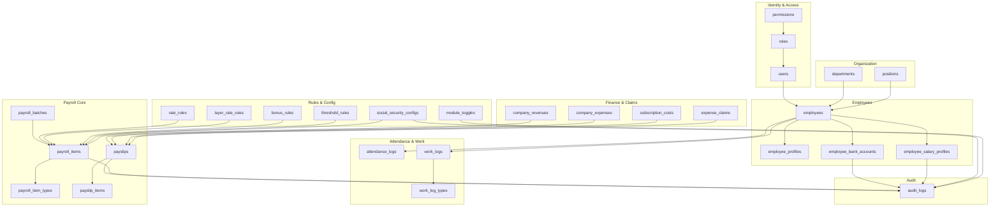
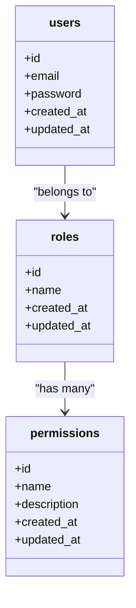
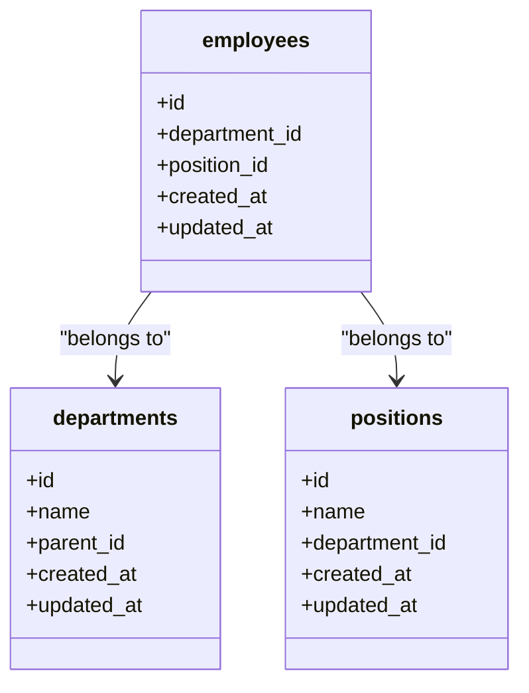
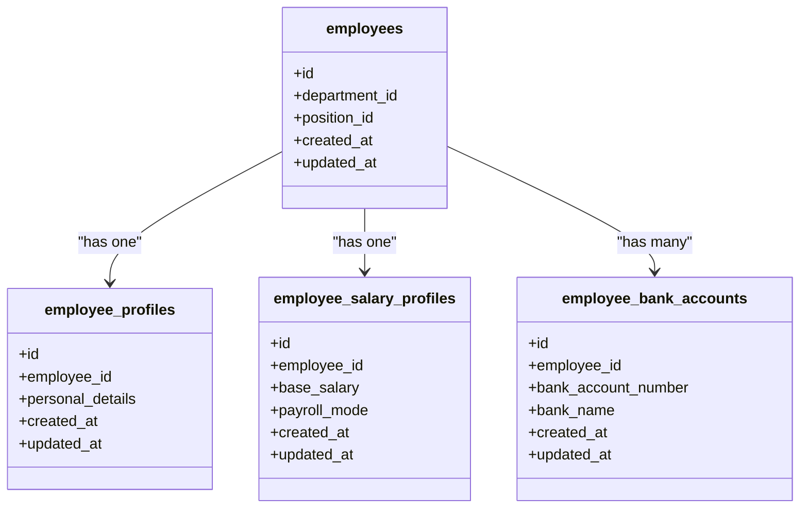
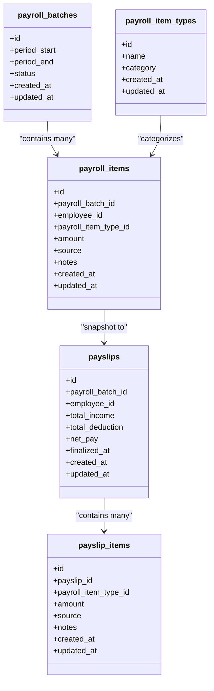
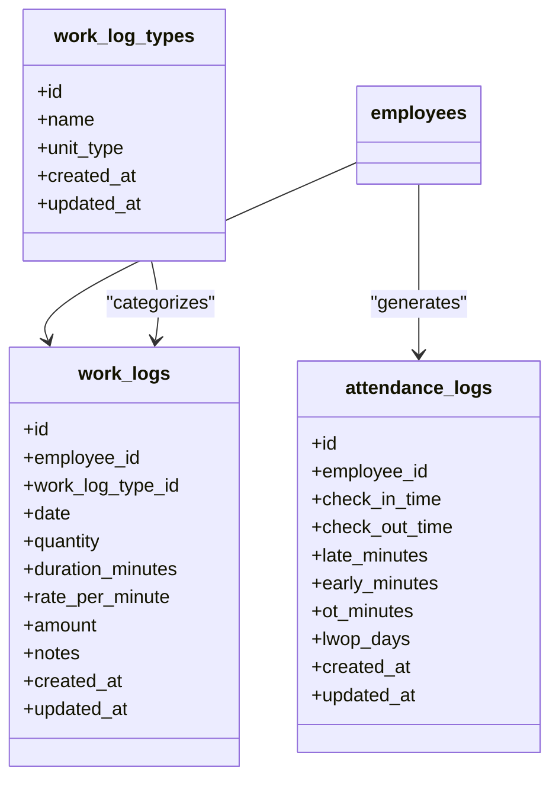
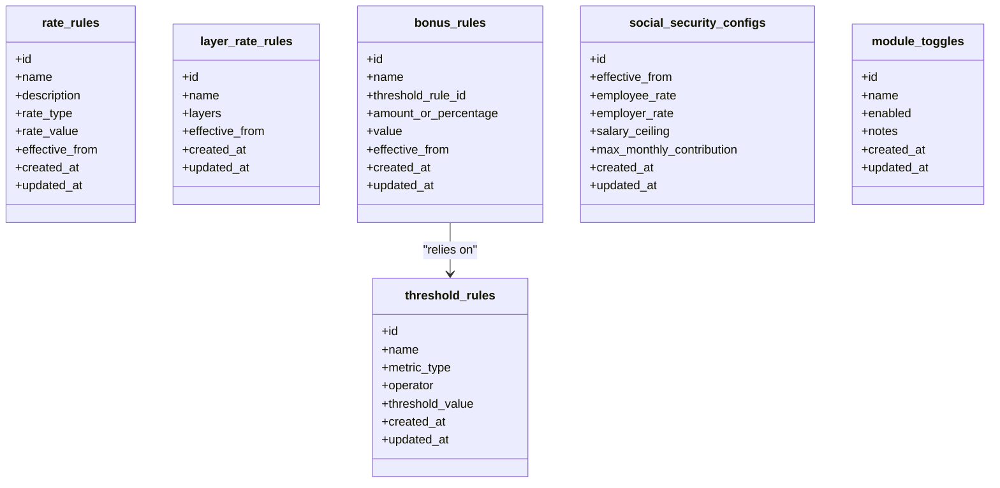
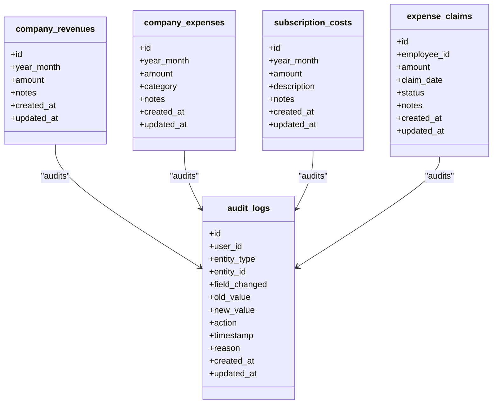
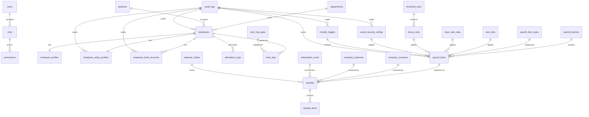

# Core Table Structure and Relationships

<cite>
**Referenced Files in This Document**
- [AGENTS.md](file://AGENTS.md)
</cite>

## Table of Contents
1. [Introduction](#introduction)
2. [Project Structure](#project-structure)
3. [Core Components](#core-components)
4. [Architecture Overview](#architecture-overview)
5. [Detailed Component Analysis](#detailed-component-analysis)
6. [Dependency Analysis](#dependency-analysis)
7. [Performance Considerations](#performance-considerations)
8. [Troubleshooting Guide](#troubleshooting-guide)
9. [Conclusion](#conclusion)

## Introduction
This document describes the core database table structure and entity relationships for the hrX payroll system. It consolidates the suggested tables, naming conventions, and design principles from the project’s guidance document. It focuses on the foundational entities required to model employees, payroll batches, attendance/work logs, configurable rules, payslips, company finances, and audit trails. Where applicable, it outlines foreign key relationships, referential integrity expectations, and join patterns essential for payroll processing.

## Project Structure
The hrX payroll system is designed around a record-based, rule-driven architecture with strong emphasis on auditability and maintainability. The guidance document specifies a set of core tables and conventions that define the minimal schema footprint and naming standards.

Key characteristics:
- Table names use plural snake_case.
- Primary key is id.
- Foreign keys follow the pattern <entity>_id.
- Monetary fields use decimal precision suitable for currency.
- Durations use integer minutes or seconds.
- Status flags use status and is_active.
- Timestamps and audit references are required.

These conventions apply across the suggested tables and inform how entities relate to one another.

**Section sources**
- [AGENTS.md:418-427](file://AGENTS.md#L418-L427)

## Core Components
The following tables are explicitly suggested as the minimal set for the hrX payroll system. They represent the core entities required to manage users, roles, permissions, employees, payroll batches, attendance/work logs, configurable rules, payslips, company finances, module toggles, and audit logs.

- users
- roles
- permissions
- employees
- employee_profiles
- employee_salary_profiles
- employee_bank_accounts
- departments
- positions
- payroll_batches
- payroll_items
- payroll_item_types
- attendance_logs
- work_logs
- work_log_types
- rate_rules
- layer_rate_rules
- bonus_rules
- threshold_rules
- social_security_configs
- expense_claims
- company_revenues
- company_expenses
- subscription_costs
- payslips
- payslip_items
- module_toggles
- audit_logs

These tables collectively support:
- Employee lifecycle and profile management
- Payroll batch creation and itemization
- Attendance and work log capture
- Configurable rules for rates, bonuses, thresholds, and social security
- Payslip generation and auditing
- Company financial summaries and cost tracking

**Section sources**
- [AGENTS.md:387-417](file://AGENTS.md#L387-L417)

## Architecture Overview
The hrX payroll system organizes data around a central employee-centric model. Payroll batches aggregate items derived from attendance and work logs, governed by configurable rules. Payslips snapshot finalized payroll items and totals. Company financial records track revenues and expenses, including subscription costs. Audit logs capture all significant changes for compliance and traceability.

**Diagram sources**
- [AGENTS.md:387-417](file://AGENTS.md#L387-L417)

## Detailed Component Analysis

### Identity and Access Management
- users: Stores user accounts with authentication credentials and metadata.
- roles: Defines roles that group permissions.
- permissions: Enumerates granular permissions; roles link to permissions.

Typical relationships:
- users belongs to roles.
- roles have many permissions.

**Diagram sources**
- [AGENTS.md:387-417](file://AGENTS.md#L387-L417)

**Section sources**
- [AGENTS.md:387-417](file://AGENTS.md#L387-L417)

### Organization
- departments: Department hierarchy and metadata.
- positions: Job positions linked to departments.

Typical relationships:
- employees belong to departments and positions.

**Diagram sources**
- [AGENTS.md:387-417](file://AGENTS.md#L387-L417)

**Section sources**
- [AGENTS.md:387-417](file://AGENTS.md#L387-L417)

### Employees and Profiles
- employees: Core employee record.
- employee_profiles: Personal and demographic details.
- employee_salary_profiles: Base salary and payroll mode configuration.
- employee_bank_accounts: Bank account details for payouts.

Typical relationships:
- employees have one profile and one salary profile.
- employees have many bank accounts (historical).

**Diagram sources**
- [AGENTS.md:387-417](file://AGENTS.md#L387-L417)

**Section sources**
- [AGENTS.md:387-417](file://AGENTS.md#L387-L417)

### Payroll Batches and Items
- payroll_batches: Monthly or periodic payroll runs.
- payroll_item_types: Categories/types of payroll items (income/deduction).
- payroll_items: Line items generated per employee per batch.
- payslips: Finalized payroll snapshots.
- payslip_items: Items copied from payroll_items upon finalization.

Typical relationships:
- payroll_batches contain many payroll_items.
- payroll_items belong to payroll_batches and payroll_item_types.
- payslips snapshot payroll_items and totals.

**Diagram sources**
- [AGENTS.md:387-417](file://AGENTS.md#L387-L417)

**Section sources**
- [AGENTS.md:387-417](file://AGENTS.md#L387-L417)

### Attendance and Work Logs
- attendance_logs: Daily check-in/out and derived metrics (late, early, OT).
- work_logs: Work performed for freelancers or hybrid modes.
- work_log_types: Types/categories of work logs.

Typical relationships:
- employees generate attendance_logs.
- employees generate work_logs categorized by work_log_types.
- Payroll items can reference work_logs or attendance_logs as sources.

**Diagram sources**
- [AGENTS.md:387-417](file://AGENTS.md#L387-L417)

**Section sources**
- [AGENTS.md:387-417](file://AGENTS.md#L387-L417)

### Rules and Configurations
- rate_rules: Standard rate configurations for income items.
- layer_rate_rules: Tiered rate formulas for freelancers.
- bonus_rules: Performance or attendance-based bonus rules.
- threshold_rules: Thresholds for eligibility and caps.
- social_security_configs: Social security parameters effective by date.
- module_toggles: Feature flags controlling payroll modes and features.

Typical relationships:
- Payroll items reference applicable rules to compute amounts.
- Rules are versioned or effective-date-aware via configs.

**Diagram sources**
- [AGENTS.md:387-417](file://AGENTS.md#L387-L417)

**Section sources**
- [AGENTS.md:387-417](file://AGENTS.md#L387-L417)

### Finance, Claims, and Auditing
- company_revenues: Monthly revenue entries.
- company_expenses: Monthly expense entries.
- subscription_costs: Recurring subscription costs.
- expense_claims: Employee expense claims tracked separately.
- audit_logs: Audit trail for sensitive changes.

Typical relationships:
- Financial entries feed company summaries.
- Expense claims integrate with payslips where applicable.
- Audit logs capture changes across all entities.

**Diagram sources**
- [AGENTS.md:387-417](file://AGENTS.md#L387-L417)

**Section sources**
- [AGENTS.md:387-417](file://AGENTS.md#L387-L417)

## Dependency Analysis
The following diagram highlights the primary foreign key relationships and referential integrity expectations across core payroll entities. These relationships are derived from the naming conventions and entity suggestions.

**Diagram sources**
- [AGENTS.md:387-417](file://AGENTS.md#L387-L417)

**Section sources**
- [AGENTS.md:387-417](file://AGENTS.md#L387-L417)

## Performance Considerations
- Indexing: Add indexes on frequently filtered or joined columns such as employee_id, payroll_batch_id, year_month, and effective_from.
- Partitioning: Consider partitioning payroll_items and payslips by payroll_batch_id or year_month for large datasets.
- Denormalization: Store computed totals in payslips and payroll_batches to reduce runtime aggregation.
- Soft Deletes: Apply soft deletes selectively to entities where historical auditability is required.
- Decimal Precision: Use decimal(12,2) or wider for monetary fields to prevent rounding errors.
- Duration Storage: Store durations as integers (minutes/seconds) to simplify calculations and indexing.

[No sources needed since this section provides general guidance]

## Troubleshooting Guide
Common issues and resolutions:
- Missing foreign keys: Ensure all tables follow the naming convention <entity>_id for foreign keys and that referential integrity is enforced.
- Audit gaps: Verify that audit_logs capture changes to sensitive entities (employee_salary_profiles, payroll_items, payslips, rules, module toggles).
- Inconsistent totals: Confirm that payslips snapshot finalized payroll_items and that recalculations are triggered on rule or item changes.
- Duplicate or missing payslips: Check that payslips are keyed by payroll_batch_id and employee_id and that finalization sets a finalized_at timestamp.
- Rule applicability: Validate that rate_rules, layer_rate_rules, and social_security_configs are effective for the relevant periods.

**Section sources**
- [AGENTS.md:576-596](file://AGENTS.md#L576-L596)

## Conclusion
The hrX payroll system’s core schema centers on a robust, rule-driven model with clear entity relationships and strong auditability. By adhering to the suggested tables, naming conventions, and referential integrity expectations, developers can implement a maintainable and scalable payroll solution. The diagrams and relationships outlined here provide a blueprint for building the database schema, migrations, and application logic aligned with the project’s design principles.