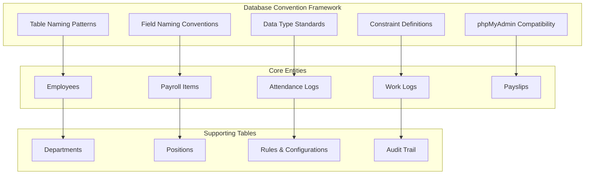
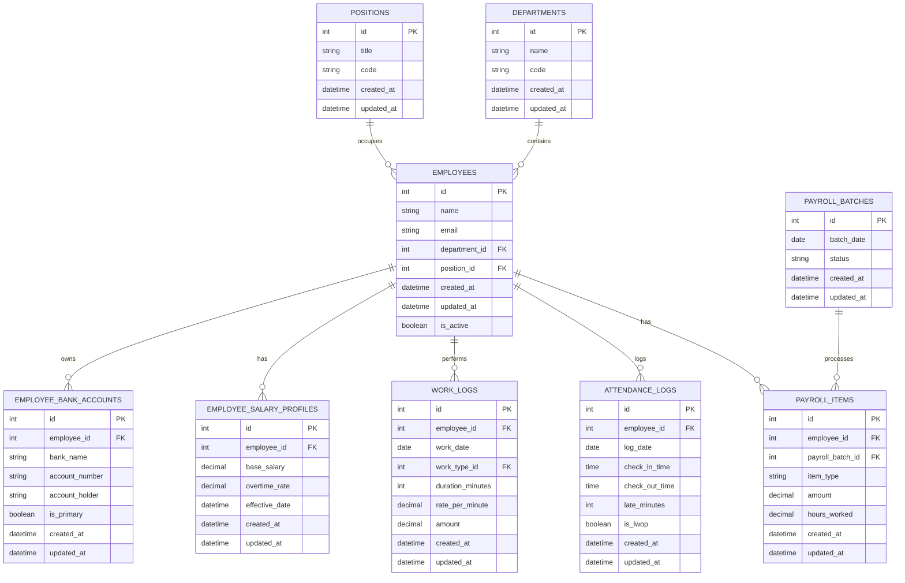
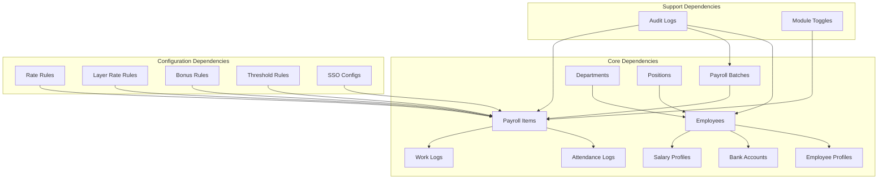

# Database Conventions and Standards

<cite>
**Referenced Files in This Document**
- [AGENTS.md](file://AGENTS.md)
</cite>

## Table of Contents
1. [Introduction](#introduction)
2. [Project Structure](#project-structure)
3. [Core Components](#core-components)
4. [Architecture Overview](#architecture-overview)
5. [Detailed Component Analysis](#detailed-component-analysis)
6. [Dependency Analysis](#dependency-analysis)
7. [Performance Considerations](#performance-considerations)
8. [Troubleshooting Guide](#troubleshooting-guide)
9. [Conclusion](#conclusion)

## Introduction

This document defines the comprehensive database naming conventions and standards used in the hrX payroll system. The system follows strict database design principles to ensure maintainability, scalability, and compatibility with phpMyAdmin and shared hosting environments. These conventions establish a consistent foundation for all database schema designs, ensuring that the payroll system remains robust, auditable, and easy to extend.

The hrX payroll system is designed as a PHP-first, MySQL/phpMyAdmin-friendly application that replaces traditional Excel-based payroll management with a structured, rule-driven database system. The database conventions outlined here serve as the foundation for all schema designs and ensure consistency across the entire system.

## Project Structure

The database conventions are organized around several key principles that guide the design and implementation of the payroll system's data architecture:



**Diagram sources**
- [AGENTS.md:385-436](file://AGENTS.md#L385-L436)

The system maintains a clear separation between core payroll entities and supporting infrastructure tables, ensuring that the database design remains organized and maintainable.

**Section sources**
- [AGENTS.md:385-436](file://AGENTS.md#L385-L436)

## Core Components

### Table Naming Patterns

The hrX payroll system employs a consistent table naming convention that promotes readability and maintainability:

- **Table Names**: Use plural snake_case format (e.g., `employees`, `payroll_items`, `attendance_logs`)
- **Entity Consistency**: All table names represent plural forms of their corresponding entities
- **Readability Priority**: Names are chosen for clarity and ease of understanding

This naming convention ensures that database tables are immediately recognizable and follow industry-standard practices for relational database design.

### Primary Key Conventions

All tables in the hrX system follow a standardized primary key approach:

- **Primary Key Field**: `id` (auto-incrementing integer)
- **Data Type**: Standard integer with auto-increment
- **Uniqueness**: Guaranteed unique identifier for each record
- **Consistency**: Applied uniformly across all tables

The `id` field serves as the universal primary key, simplifying joins and maintaining referential integrity throughout the system.

### Foreign Key Naming

Foreign key relationships follow a strict naming convention that clearly indicates relationships:

- **Naming Pattern**: `<entity>_id` (e.g., `employee_id`, `payroll_batch_id`, `department_id`)
- **Reference Clarity**: The `_id` suffix immediately identifies foreign key relationships
- **Entity Mapping**: The entity name corresponds to the referenced table
- **Consistency**: Applied uniformly across all foreign key relationships

This convention eliminates ambiguity in database relationships and makes schema understanding straightforward for developers and database administrators.

### Status Flags and Boolean Fields

Status management follows a dual-field approach for maximum flexibility:

- **Primary Status**: `status` (text field for status values)
- **Active Flag**: `is_active` (boolean flag for quick filtering)
- **Standard Values**: Use consistent status values across the system
- **Default Values**: Define sensible defaults for new records

This dual approach provides both human-readable status information and efficient boolean filtering capabilities.

### Date Field Conventions

Date handling follows standardized patterns for temporal data:

- **Date Fields**: Use `*_date` suffix (e.g., `birth_date`, `hire_date`, `payment_date`)
- **Precision**: Store dates without time components for calendar-based data
- **Consistency**: Apply uniform date field naming across all entities
- **Validation**: Implement appropriate date validation at the application level

### Duration Field Naming

Time-based calculations use standardized duration fields:

- **Minutes**: `*_minutes` suffix (e.g., `overtime_minutes`, `work_minutes`)
- **Seconds**: `*_seconds` suffix for precise timing (e.g., `processing_seconds`)
- **Integer Storage**: Store durations as integers for calculation efficiency
- **Unit Consistency**: Choose appropriate units based on precision requirements

### Monetary Field Precision

Financial data requires precise decimal representation:

- **Amount Fields**: `decimal(12,2)` precision
- **Currency Storage**: Store amounts in smallest currency units (kopecks, satoshis)
- **Calculation Accuracy**: Prevent floating-point precision errors
- **Display Formatting**: Handle currency formatting at the presentation layer

### Percentage Field Standards

Percentage calculations follow standardized approaches:

- **Decimal Format**: `decimal(5,2)` precision for percentages
- **Fraction Representation**: Store as decimals (0.15 for 15%) rather than whole numbers
- **Consistent Scale**: Maintain uniform percentage scale across the system
- **Calculation Flexibility**: Enable mathematical operations on percentage values

**Section sources**
- [AGENTS.md:418-427](file://AGENTS.md#L418-L427)

## Architecture Overview

The database architecture follows a normalized design that balances normalization benefits with practical query performance needs:



**Diagram sources**
- [AGENTS.md:388-416](file://AGENTS.md#L388-L416)

This architecture ensures that payroll data flows logically through the system while maintaining referential integrity and supporting complex business rules.

## Detailed Component Analysis

### Data Type Selection Criteria

The hrX system employs carefully selected data types to balance storage efficiency with functional requirements:

```mermaid
flowchart TD
A[Field Type Selection] --> B{Data Category}
B --> C[Text Fields]
B --> D[Numeric Fields]
B --> E[Temporal Fields]
B --> F[Boolean Fields]
C --> C1[string for names, emails]
C --> C2[text for descriptions]
C --> C3[long_text for comments]
D --> D1[decimal(12,2) for money]
D --> D2[decimal(5,2) for percentages]
D --> D3[int for counts, minutes]
D --> D4[bigint unsigned for IDs]
E --> E1[date for birth, hire]
E --> E2[datetime for audit trails]
E --> E3[time for work hours]
F --> F1[boolean for active flags]
```

**Diagram sources**
- [AGENTS.md:184-189](file://AGENTS.md#L184-L189)

### Indexing Strategies

The system implements strategic indexing to optimize query performance:

- **Primary Keys**: Automatically indexed by database engine
- **Foreign Keys**: Explicitly indexed for join performance
- **Frequently Queried Fields**: Indexed for common search operations
- **Composite Indexes**: Used for multi-column query filters
- **Unique Constraints**: Enforced where data uniqueness is required

### Constraint Naming Conventions

Database constraints follow standardized naming patterns:

- **Primary Key Constraints**: `PRIMARY` (default naming)
- **Foreign Key Constraints**: `FK_table_field` format
- **Unique Constraints**: `UK_table_field` format
- **Check Constraints**: `CK_table_field_condition` format
- **Index Names**: `IX_table_field` format

These naming conventions ensure that database objects are easily identifiable and maintainable.

### Migration-Friendly Design Principles

The database design incorporates principles that facilitate smooth migrations:

- **Backward Compatibility**: New fields are added as nullable with defaults
- **Schema Evolution**: Changes are designed to minimize downtime
- **Data Integrity**: Constraints ensure data quality during migrations
- **Rollback Capability**: Migrations include rollback procedures
- **Testing Strategy**: Migration testing is integrated into deployment process

### Shared Hosting Constraints

The system accommodates shared hosting limitations:

- **Storage Limits**: Efficient data types minimize storage requirements
- **Connection Limits**: Optimized queries reduce connection usage
- **Memory Constraints**: Batch processing handles large datasets
- **Feature Availability**: Uses widely supported SQL features
- **Backup Compatibility**: Schema design supports standard backup tools

**Section sources**
- [AGENTS.md:184-195](file://AGENTS.md#L184-L195)

## Dependency Analysis

The database conventions create a well-structured dependency hierarchy:



**Diagram sources**
- [AGENTS.md:392-416](file://AGENTS.md#L392-L416)

This dependency structure ensures that core payroll functionality remains cohesive while allowing for flexible configuration and extension.

## Performance Considerations

The database conventions incorporate several performance optimization strategies:

- **Normalized Design**: Reduces data redundancy and storage requirements
- **Efficient Joins**: Foreign key relationships enable fast join operations
- **Selective Indexing**: Strategic indexing minimizes query overhead
- **Data Type Efficiency**: Appropriate data types optimize storage and computation
- **Query Optimization**: Consistent naming facilitates query optimization

## Troubleshooting Guide

Common database issues and their resolutions:

### Naming Convention Violations
- **Problem**: Mixed naming conventions within the same project
- **Solution**: Establish naming convention enforcement through code reviews and automated checks
- **Prevention**: Use database documentation and naming convention guidelines

### Performance Issues
- **Problem**: Slow query performance on large datasets
- **Solution**: Review indexing strategy and query patterns
- **Prevention**: Monitor query performance and optimize accordingly

### Migration Failures
- **Problem**: Migration scripts fail during deployment
- **Solution**: Test migrations in staging environment before production deployment
- **Prevention**: Include rollback procedures and comprehensive testing

### Data Integrity Problems
- **Problem**: Referential integrity violations or orphaned records
- **Solution**: Review foreign key constraints and cascading rules
- **Prevention**: Implement proper validation and constraint checking

**Section sources**
- [AGENTS.md:428-435](file://AGENTS.md#L428-L435)

## Conclusion

The hrX payroll system's database conventions provide a comprehensive foundation for building a robust, maintainable, and scalable payroll management solution. These conventions ensure consistency across the entire system while accommodating the specific requirements of payroll processing, including complex calculations, regulatory compliance, and audit trail requirements.

The standardized approach to table naming, field conventions, data types, and constraints creates a predictable development environment that facilitates team collaboration and long-term system maintenance. By following these conventions, developers can build reliable payroll functionality that meets the needs of modern organizations while remaining compatible with various deployment environments.

The emphasis on phpMyAdmin compatibility and shared hosting constraints ensures that the system can be deployed in diverse environments without sacrificing functionality or performance. The migration-friendly design principles support continuous evolution of the system as business requirements change over time.