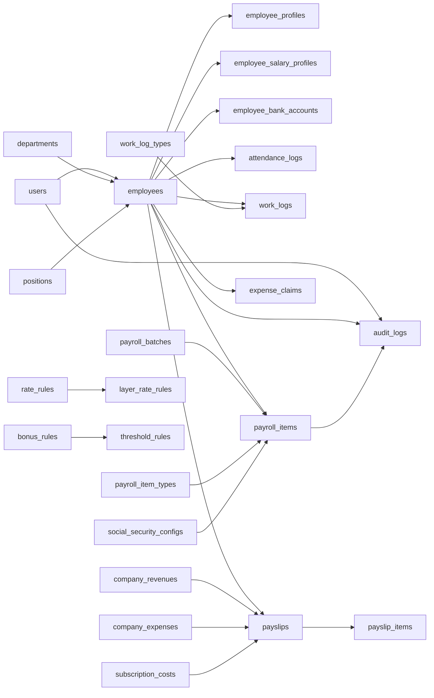

# Database Schema and Design

<cite>
**Referenced Files in This Document**
- [AGENTS.md](file://AGENTS.md)
</cite>

## Table of Contents
1. [Introduction](#introduction)
2. [Project Structure](#project-structure)
3. [Core Components](#core-components)
4. [Architecture Overview](#architecture-overview)
5. [Detailed Component Analysis](#detailed-component-analysis)
6. [Dependency Analysis](#dependency-analysis)
7. [Performance Considerations](#performance-considerations)
8. [Troubleshooting Guide](#troubleshooting-guide)
9. [Conclusion](#conclusion)
10. [Appendices](#appendices)

## Introduction
This document provides comprehensive database schema and design guidance for the xHR Payroll & Finance System. It consolidates the official database conventions, naming standards, data types, indexing strategies, foreign key relationships, phpMyAdmin compatibility requirements, migration strategies, and schema evolution patterns as defined in the project’s authoritative guide. It also outlines audit trail implementation, soft delete patterns, and data retention considerations aligned with the system’s rule-driven, record-based, and maintainability-first philosophy.

## Project Structure
The repository defines a clear set of database tables and conventions that underpin the payroll and finance system. The structure emphasizes plural snake_case table names, explicit foreign key naming, and standardized field naming for dates, durations, amounts, and statuses. The system is designed to be MySQL/phpMyAdmin-friendly, with migrations and seeders organized under a conventional Laravel-style layout.

```mermaid
graph TB
subgraph "Core Entities"
users["users"]
roles["roles"]
permissions["permissions"]
employees["employees"]
employee_profiles["employee_profiles"]
employee_salary_profiles["employee_salary_profiles"]
employee_bank_accounts["employee_bank_accounts"]
departments["departments"]
positions["positions"]
end
subgraph "Payroll & Attendance"
payroll_batches["payroll_batches"]
payroll_items["payroll_items"]
payroll_item_types["payroll_item_types"]
attendance_logs["attendance_logs"]
work_logs["work_logs"]
work_log_types["work_log_types"]
end
subgraph "Rules & Config"
rate_rules["rate_rules"]
layer_rate_rules["layer_rate_rules"]
bonus_rules["bonus_rules"]
threshold_rules["threshold_rules"]
social_security_configs["social_security_configs"]
module_toggles["module_toggles"]
end
subgraph "Finance & Claims"
expense_claims["expense_claims"]
company_revenues["company_revenues"]
company_expenses["company_expenses"]
subscription_costs["subscription_costs"]
end
subgraph "Outputs & Audit"
payslips["payslips"]
payslip_items["payslip_items"]
audit_logs["audit_logs"]
end
users --> employees
employees --> employee_profiles
employees --> employee_salary_profiles
employees --> employee_bank_accounts
employees --> departments
employees --> positions
employees --> payroll_items
payroll_batches --> payroll_items
payroll_items --> payroll_item_types
employees --> attendance_logs
employees --> work_logs
work_logs --> work_log_types
rate_rules --> layer_rate_rules
bonus_rules --> threshold_rules
social_security_configs --> payroll_items
company_revenues --> payslips
company_expenses --> payslips
subscription_costs --> payslips
payslips --> payslip_items
payslips --> audit_logs
payroll_items --> audit_logs
```

**Diagram sources**
- [AGENTS.md:387-416](file://AGENTS.md#L387-L416)
- [AGENTS.md:418-426](file://AGENTS.md#L418-L426)

**Section sources**
- [AGENTS.md:387-435](file://AGENTS.md#L387-L435)
- [AGENTS.md:622-646](file://AGENTS.md#L622-L646)

## Core Components
This section documents the minimal set of tables required by the system, along with their responsibilities and typical relationships. These tables collectively support employee management, payroll computation, attendance tracking, work logging, rule configuration, financial summaries, payslip generation, and auditability.

- Users and Access Control
  - users: Authenticates agents and stores credentials.
  - roles: Defines role sets for access control.
  - permissions: Grants granular permission bits.

- Employee and Profile Tables
  - employees: Core employee records.
  - employee_profiles: Personal and demographic details.
  - employee_salary_profiles: Base salary and payroll mode assignments.
  - employee_bank_accounts: Bank account details for payouts.

- Organization and Classification
  - departments: Department taxonomy.
  - positions: Position taxonomy.

- Payroll and Attendance
  - payroll_batches: Batch-level grouping for payroll runs.
  - payroll_items: Line items for each payroll run.
  - payroll_item_types: Type taxonomy for income/deduction items.
  - attendance_logs: Daily check-in/out and derived metrics.
  - work_logs: Work entries for freelancers and hybrid modes.
  - work_log_types: Type taxonomy for work logs.

- Rules and Configuration
  - rate_rules: General rate configurations.
  - layer_rate_rules: Tiered rate rules for layered pay.
  - bonus_rules: Performance and bonus thresholds.
  - threshold_rules: Threshold-based calculations.
  - social_security_configs: Thailand SSO configuration with effective dates.
  - module_toggles: Feature flags for modules.

- Finance and Claims
  - expense_claims: Expense claims and approvals.
  - company_revenues: Revenue records.
  - company_expenses: Expense records.
  - subscription_costs: Recurring cost records.

- Outputs and Audit
  - payslips: Payslip headers and metadata.
  - payslip_items: Snapshot of computed items upon finalization.
  - audit_logs: Full audit trail for changes.

**Section sources**
- [AGENTS.md:387-416](file://AGENTS.md#L387-L416)
- [AGENTS.md:418-426](file://AGENTS.md#L418-L426)

## Architecture Overview
The database architecture follows a normalized, relational design with explicit foreign keys and consistent naming conventions. It prioritizes:
- Record-based storage over cell-based assumptions.
- Single source of truth for core entities.
- Rule-driven computation stored in dedicated configuration tables.
- Auditability and maintainability through explicit audit logs and soft deletes.

```mermaid
erDiagram
USERS {
bigint id PK
string name
string email UK
string password
timestamps created_at
timestamps updated_at
timestamps deleted_at
}
ROLES {
bigint id PK
string name
timestamps created_at
timestamps updated_at
timestamps deleted_at
}
PERMISSIONS {
bigint id PK
string name
timestamps created_at
timestamps updated_at
timestamps deleted_at
}
EMPLOYEES {
bigint id PK
string external_id
bigint department_id FK
bigint position_id FK
enum payroll_mode
timestamps created_at
timestamps updated_at
timestamps deleted_at
}
EMPLOYEE_PROFILES {
bigint id PK
bigint employee_id FK
string personal_id
string phone
timestamps created_at
timestamps updated_at
timestamps deleted_at
}
EMPLOYEE_SALARY_PROFILES {
bigint id PK
bigint employee_id FK
decimal base_salary
timestamps created_at
timestamps updated_at
timestamps deleted_at
}
EMPLOYEE_BANK_ACCOUNTS {
bigint id PK
bigint employee_id FK
string bank_name
string account_number
timestamps created_at
timestamps updated_at
timestamps deleted_at
}
DEPARTMENTS {
bigint id PK
string name
timestamps created_at
timestamps updated_at
timestamps deleted_at
}
POSITIONS {
bigint id PK
string name
timestamps created_at
timestamps updated_at
timestamps deleted_at
}
PAYROLL_BATCHES {
bigint id PK
date period_start
date period_end
enum status
timestamps created_at
timestamps updated_at
timestamps deleted_at
}
PAYROLL_ITEM_TYPES {
bigint id PK
string code
string name
enum category
timestamps created_at
timestamps updated_at
timestamps deleted_at
}
PAYROLL_ITEMS {
bigint id PK
bigint payroll_batch_id FK
bigint employee_id FK
bigint payroll_item_type_id FK
decimal amount
enum source_flag
timestamps created_at
timestamps updated_at
timestamps deleted_at
}
ATTENDANCE_LOGS {
bigint id PK
bigint employee_id FK
date log_date
int check_in_minutes
int check_out_minutes
int late_minutes
int early_leave_minutes
timestamps created_at
timestamps updated_at
timestamps deleted_at
}
WORK_LOG_TYPES {
bigint id PK
string code
string name
timestamps created_at
timestamps updated_at
timestamps deleted_at
}
WORK_LOGS {
bigint id PK
bigint employee_id FK
bigint work_log_type_id FK
date work_date
int duration_minutes
decimal rate_per_minute
decimal amount
timestamps created_at
timestamps updated_at
timestamps deleted_at
}
RATE_RULES {
bigint id PK
string name
timestamps effective_from
timestamps effective_to
timestamps created_at
timestamps updated_at
timestamps deleted_at
}
LAYER_RATE_RULES {
bigint id PK
bigint rate_rule_id FK
decimal threshold_min
decimal threshold_max
decimal rate_multiplier
timestamps created_at
timestamps updated_at
timestamps deleted_at
}
BONUS_RULES {
bigint id PK
string name
timestamps effective_from
timestamps effective_to
timestamps created_at
timestamps updated_at
timestamps deleted_at
}
THRESHOLD_RULES {
bigint id PK
bigint bonus_rule_id FK
decimal threshold_min
decimal threshold_value
timestamps created_at
timestamps updated_at
timestamps deleted_at
}
SOCIAL_SECURITY_CONFIGS {
bigint id PK
decimal employee_rate
decimal employer_rate
decimal salary_ceiling
decimal max_monthly_contribution
timestamps effective_from
timestamps effective_to
timestamps created_at
timestamps updated_at
timestamps deleted_at
}
EXPENSE_CLAIMS {
bigint id PK
bigint employee_id FK
decimal amount
enum status
timestamps created_at
timestamps updated_at
timestamps deleted_at
}
COMPANY_REVENUES {
bigint id PK
decimal amount
date revenue_date
timestamps created_at
timestamps updated_at
timestamps deleted_at
}
COMPANY_EXPENSES {
bigint id PK
decimal amount
date expense_date
timestamps created_at
timestamps updated_at
timestamps deleted_at
}
SUBSCRIPTION_COSTS {
bigint id PK
decimal amount
date billing_cycle_start
timestamps created_at
timestamps updated_at
timestamps deleted_at
}
PAYSLIPS {
bigint id PK
bigint employee_id FK
bigint payroll_batch_id FK
date issue_date
decimal total_income
decimal total_deduction
decimal net_pay
enum status
timestamps created_at
timestamps updated_at
timestamps deleted_at
}
PAYSLIP_ITEMS {
bigint id PK
bigint payslip_id FK
bigint payroll_item_type_id FK
decimal amount
enum source_flag
timestamps created_at
timestamps updated_at
timestamps deleted_at
}
MODULE_TOGGLES {
bigint id PK
string module_name
boolean enabled
timestamps created_at
timestamps updated_at
timestamps deleted_at
}
AUDIT_LOGS {
bigint id PK
bigint actor_user_id FK
string entity_name
bigint entity_id
string field_name
text old_value
text new_value
string action
timestamps timestamp
timestamps created_at
timestamps updated_at
timestamps deleted_at
}
USERS ||--o{ EMPLOYEES : "assigned_to"
EMPLOYEES ||--o{ EMPLOYEE_PROFILES : "has_one"
EMPLOYEES ||--o{ EMPLOYEE_SALARY_PROFILES : "has_one"
EMPLOYEES ||--o{ EMPLOYEE_BANK_ACCOUNTS : "has_one"
EMPLOYEES ||--o{ ATTENDANCE_LOGS : "logs"
EMPLOYEES ||--o{ WORK_LOGS : "generates"
EMPLOYEES ||--o{ PAYROLL_ITEMS : "included_in"
EMPLOYEES ||--o{ EXPENSE_CLAIMS : "submits"
EMPLOYEES ||--o{ PAYSLIPS : "generates"
DEPARTMENTS ||--o{ EMPLOYEES : "contains"
POSITIONS ||--o{ EMPLOYEES : "occupies"
PAYROLL_BATCHES ||--o{ PAYROLL_ITEMS : "contains"
PAYROLL_ITEM_TYPES ||--o{ PAYROLL_ITEMS : "categorizes"
WORK_LOG_TYPES ||--o{ WORK_LOGS : "categorizes"
RATE_RULES ||--o{ LAYER_RATE_RULES : "defines"
BONUS_RULES ||--o{ THRESHOLD_RULES : "defines"
PAYSLIPS ||--o{ PAYSLIP_ITEMS : "snapshots"
USERS ||--o{ AUDIT_LOGS : "performed"
```

**Diagram sources**
- [AGENTS.md:387-416](file://AGENTS.md#L387-L416)
- [AGENTS.md:418-426](file://AGENTS.md#L418-L426)

## Detailed Component Analysis

### Naming Standards and Field Conventions
- Table names: plural snake_case.
- Primary keys: id.
- Foreign keys: <entity>_id.
- Status flags: status, is_active.
- Dates: *_date.
- Durations: *_minutes or *_seconds.
- Amount fields: decimal(12,2) or wider as needed.
- Percentage fields: decimal(5,2) or consistent fractional representation.

These conventions ensure readability, consistency, and compatibility with phpMyAdmin and shared hosting environments.

**Section sources**
- [AGENTS.md:418-426](file://AGENTS.md#L418-L426)

### Data Types and Precision
- Monetary fields: decimal(12,2) or larger precision depending on scale.
- Percentages: decimal(5,2) or consistent fractional representation across the system.
- Time durations: integer minutes or seconds.
- Enumerations: avoid rigid enums; prefer lookup tables for extensibility.

**Section sources**
- [AGENTS.md:184-188](file://AGENTS.md#L184-L188)
- [AGENTS.md:424-426](file://AGENTS.md#L424-L426)

### Indexing Strategies
- Primary keys: implicit index on id.
- Foreign keys: explicit indexes on <entity>_id for frequent joins.
- Composite indexes: on frequently filtered columns such as employee_id and log_date.
- Unique constraints: on identifiers like email (users), external_id (employees), and unique codes for rule categories.

Note: Specific index definitions are not provided here; implement indexes based on query patterns observed during development.

**Section sources**
- [AGENTS.md:177-188](file://AGENTS.md#L177-L188)

### Foreign Key Relationships
- Employees link to profiles, salary profiles, bank accounts, departments, positions, payroll items, attendance logs, work logs, expense claims, and payslips.
- Payroll batches link to payroll items.
- Payroll items link to payroll item types.
- Work logs link to work log types.
- Rate rules define layer rate rules.
- Bonus rules define threshold rules.
- Payslips snapshot payroll items and link to payslips.

**Section sources**
- [AGENTS.md:387-416](file://AGENTS.md#L387-L416)

### phpMyAdmin Compatibility
- Field names should be readable and descriptive.
- Avoid advanced DB features that are unavailable on shared hosting.
- Ensure migrations remain functional and queries can be debugged in phpMyAdmin.

**Section sources**
- [AGENTS.md:428-434](file://AGENTS.md#L428-L434)

### Migration Strategies and Schema Evolution
- Use Laravel-style migrations under database/migrations and seeders under database/seeders.
- Apply change management rules: evaluate impact on master vs monthly, affected payroll modes, payslips/reports/finance summaries, necessity of new migrations, and audit/test coverage updates.
- Maintain backward compatibility where possible; version rule configurations with effective_from/effective_to.

**Section sources**
- [AGENTS.md:632-634](file://AGENTS.md#L632-L634)
- [AGENTS.md:650-660](file://AGENTS.md#L650-L660)

### Audit Trail Implementation
- Audit logs capture who, what entity, what field, old value, new value, action, timestamp, and optional reason.
- High-priority audit areas include employee salary profile changes, payroll item amounts, payslip finalize/unfinalize, rule changes, module toggle changes, and SSO config changes.
- Include audit references in entities where applicable.

**Section sources**
- [AGENTS.md:576-595](file://AGENTS.md#L576-L595)
- [AGENTS.md:257-271](file://AGENTS.md#L257-L271)

### Soft Delete Patterns
- Soft deletes are recommended for entities where historical context is valuable (e.g., users, roles, permissions, employees, payroll items, payslips).
- Deleted rows should still be queryable via dedicated scopes or views to preserve auditability.

**Section sources**
- [AGENTS.md:190-194](file://AGENTS.md#L190-L194)

### Data Retention Policies
- Effective date-based rule configurations (e.g., social security) imply retention of historical configurations.
- Maintain long-term audit logs for compliance; consider archiving older logs if storage grows large.

**Section sources**
- [AGENTS.md:488-497](file://AGENTS.md#L488-L497)
- [AGENTS.md:576-595](file://AGENTS.md#L576-L595)

### Sample Data Structures
Below are representative structures for key entities. Replace with actual column definitions as per your ORM/migration framework.

- Users
  - id, name, email, password, timestamps, deleted_at

- Roles
  - id, name, timestamps, deleted_at

- Permissions
  - id, name, timestamps, deleted_at

- Employees
  - id, external_id, department_id, position_id, payroll_mode, timestamps, deleted_at

- Employee Profiles
  - id, employee_id, personal_id, phone, timestamps, deleted_at

- Employee Salary Profiles
  - id, employee_id, base_salary, timestamps, deleted_at

- Employee Bank Accounts
  - id, employee_id, bank_name, account_number, timestamps, deleted_at

- Departments
  - id, name, timestamps, deleted_at

- Positions
  - id, name, timestamps, deleted_at

- Payroll Batches
  - id, period_start, period_end, status, timestamps, deleted_at

- Payroll Item Types
  - id, code, name, category, timestamps, deleted_at

- Payroll Items
  - id, payroll_batch_id, employee_id, payroll_item_type_id, amount, source_flag, timestamps, deleted_at

- Attendance Logs
  - id, employee_id, log_date, check_in_minutes, check_out_minutes, late_minutes, early_leave_minutes, timestamps, deleted_at

- Work Log Types
  - id, code, name, timestamps, deleted_at

- Work Logs
  - id, employee_id, work_log_type_id, work_date, duration_minutes, rate_per_minute, amount, timestamps, deleted_at

- Rate Rules
  - id, name, effective_from, effective_to, timestamps, deleted_at

- Layer Rate Rules
  - id, rate_rule_id, threshold_min, threshold_max, rate_multiplier, timestamps, deleted_at

- Bonus Rules
  - id, name, effective_from, effective_to, timestamps, deleted_at

- Threshold Rules
  - id, bonus_rule_id, threshold_min, threshold_value, timestamps, deleted_at

- Social Security Configs
  - id, employee_rate, employer_rate, salary_ceiling, max_monthly_contribution, effective_from, effective_to, timestamps, deleted_at

- Expense Claims
  - id, employee_id, amount, status, timestamps, deleted_at

- Company Revenues
  - id, amount, revenue_date, timestamps, deleted_at

- Company Expenses
  - id, amount, expense_date, timestamps, deleted_at

- Subscription Costs
  - id, amount, billing_cycle_start, timestamps, deleted_at

- Payslips
  - id, employee_id, payroll_batch_id, issue_date, total_income, total_deduction, net_pay, status, timestamps, deleted_at

- Payslip Items
  - id, payslip_id, payroll_item_type_id, amount, source_flag, timestamps, deleted_at

- Module Toggles
  - id, module_name, enabled, timestamps, deleted_at

- Audit Logs
  - id, actor_user_id, entity_name, entity_id, field_name, old_value, new_value, action, timestamp, timestamps, deleted_at

**Section sources**
- [AGENTS.md:387-416](file://AGENTS.md#L387-L416)
- [AGENTS.md:418-426](file://AGENTS.md#L418-L426)

## Dependency Analysis
The following diagram highlights key dependencies among major entities, focusing on foreign key relationships and module toggles.

**Diagram sources**
- [AGENTS.md:387-416](file://AGENTS.md#L387-L416)

**Section sources**
- [AGENTS.md:387-416](file://AGENTS.md#L387-L416)

## Performance Considerations
- Normalize carefully: join-heavy queries benefit from proper indexing on foreign keys and composite indexes on frequently filtered columns.
- Use pagination and limit clauses for large datasets (e.g., audit logs, payslips).
- Store computed snapshots (e.g., payslip_items) to avoid recalculating on demand.
- Prefer decimal arithmetic for monetary values to prevent floating-point errors.
- Monitor slow queries in phpMyAdmin and add indexes as needed.

[No sources needed since this section provides general guidance]

## Troubleshooting Guide
- phpMyAdmin Debugging
  - Ensure field names are readable and descriptive.
  - Keep migrations compatible with shared hosting constraints.
  - Validate basic queries and joins in phpMyAdmin before integrating with application logic.

- Audit Logging
  - Confirm that audit logs capture all required fields: actor, entity, field, old/new values, action, timestamp, and optional reason.
  - Verify high-priority audit areas are covered (salary profile, payroll item amounts, payslip finalize/unfinalize, rule/module/SO config changes).

- Soft Deletes
  - Implement scopes or views to include deleted rows when necessary for reporting or audits.
  - Ensure foreign key cascades align with intended retention policy.

**Section sources**
- [AGENTS.md:428-434](file://AGENTS.md#L428-L434)
- [AGENTS.md:576-595](file://AGENTS.md#L576-L595)
- [AGENTS.md:190-194](file://AGENTS.md#L190-L194)

## Conclusion
This schema and design guide consolidates the authoritative conventions and requirements for the xHR Payroll & Finance System. By adhering to plural snake_case naming, explicit foreign keys, standardized field conventions, and robust auditability, the system achieves maintainability, scalability, and phpMyAdmin compatibility. Migration strategies, soft delete patterns, and retention policies ensure long-term operability and compliance.

[No sources needed since this section summarizes without analyzing specific files]

## Appendices

### Appendix A: Business Rules Mapping to Schema
- Monthly Staff: base_salary, overtime_pay, diligence_allowance, performance_bonus, other_income, cash_advance, late_deduction, lwop_deduction, social_security_employee, other_deduction.
- Freelance Layer: duration_minutes, rate_per_minute, amount.
- Freelance Fixed: quantity, fixed_rate, amount.
- Youtuber Salary/Settlement: total_income, total_expense, net.
- Social Security (Thailand): employee_rate, employer_rate, salary_ceiling, max_monthly_contribution, effective_from/effective_to.

**Section sources**
- [AGENTS.md:440-497](file://AGENTS.md#L440-L497)

### Appendix B: UI/UX Implications for Data Entry
- Inline editing, add/remove/duplicate rows, instant recalculation, and state badges (locked, auto, manual, override, from_master, rule_applied, draft, finalized) require stable, auditable data structures with clear source flags and snapshot semantics.

**Section sources**
- [AGENTS.md:508-546](file://AGENTS.md#L508-L546)