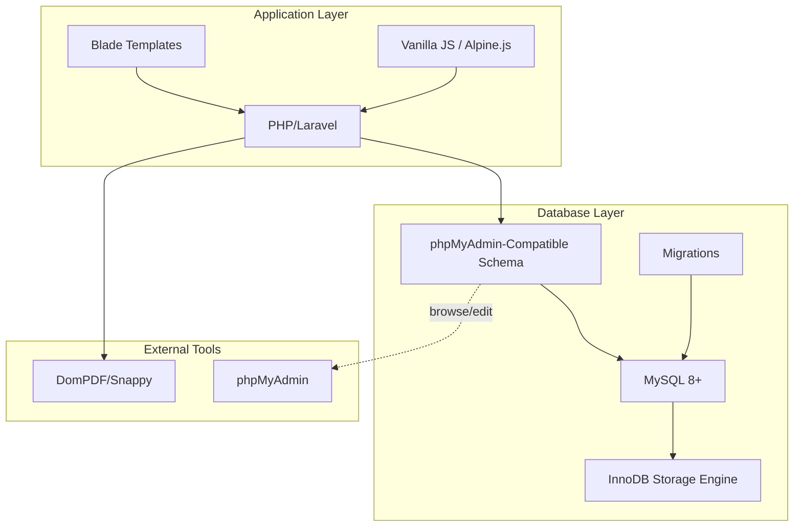
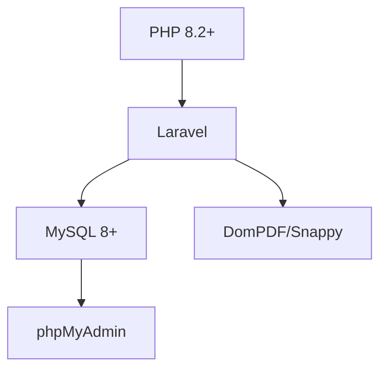

# phpMyAdmin Compatibility and Shared Hosting

<cite>
**Referenced Files in This Document**
- [AGENTS.md](file://AGENTS.md)
</cite>

## Table of Contents
1. [Introduction](#introduction)
2. [Project Structure](#project-structure)
3. [Core Components](#core-components)
4. [Architecture Overview](#architecture-overview)
5. [Detailed Component Analysis](#detailed-component-analysis)
6. [Dependency Analysis](#dependency-analysis)
7. [Performance Considerations](#performance-considerations)
8. [Troubleshooting Guide](#troubleshooting-guide)
9. [Conclusion](#conclusion)
10. [Appendices](#appendices)

## Introduction
This document explains phpMyAdmin compatibility requirements and shared hosting considerations for the hrX payroll system database. It focuses on design principles that ensure easy table viewing, readable field names, and basic query debugging capabilities. It also documents limitations and constraints commonly found in shared hosting environments, including MySQL version compatibility (8+), storage engine requirements, and feature restrictions. Migration compatibility, schema evolution patterns, and database administration best practices are covered, along with troubleshooting guides for common phpMyAdmin issues, query optimization tips for shared hosting, backup/restore procedures, performance considerations, indexing strategies, and maintenance tasks suitable for shared hosting.

## Project Structure
The repository provides a comprehensive development contract and system guide that defines the database design philosophy and operational constraints. The guide emphasizes:
- PHP-first architecture with MySQL/phpMyAdmin-friendly schema
- Record-based design over cell-based spreadsheets
- Single source of truth for core entities
- Rule-driven logic stored in configuration tables
- Dynamic but controlled editing with auditability
- Maintainability-first approach for future enhancements

These principles directly inform phpMyAdmin compatibility and shared hosting readiness.

**Section sources**
- [AGENTS.md:23-31](file://AGENTS.md#L23-L31)
- [AGENTS.md:34-99](file://AGENTS.md#L34-L99)
- [AGENTS.md:102-118](file://AGENTS.md#L102-L118)

## Core Components
The database design and conventions are explicitly documented to ensure phpMyAdmin usability and shared hosting compatibility. Key guidelines include:
- Table naming conventions: plural snake_case
- Primary key naming: id
- Foreign key naming: <entity>_id
- Status flags: status, is_active
- Date and duration fields: *_date, *_minutes, *_seconds
- Monetary and percentage fields: decimal precision aligned across the system
- phpMyAdmin compatibility: easy table browsing, readable field names, minimal reliance on advanced DB features, migration compatibility, and basic query debugging support

These conventions ensure that phpMyAdmin users can navigate and inspect data effectively, while maintaining compatibility with shared hosting environments that often restrict advanced MySQL features.

**Section sources**
- [AGENTS.md:418-427](file://AGENTS.md#L418-L427)
- [AGENTS.md:428-435](file://AGENTS.md#L428-L435)

## Architecture Overview
The system’s architecture is designed around:
- PHP-first backend with Laravel preferred
- MySQL 8+ requirement
- phpMyAdmin-compatible schema
- Lightweight frontend stack (Blade + vanilla JS / Alpine.js)
- PDF generation via DomPDF or Snappy

Shared hosting constraints typically include:
- MySQL version limits (often 5.7 or 8+ depending on provider)
- Storage engine availability (InnoDB is widely supported)
- Feature restrictions (no JSON virtual columns, limited partitioning, restricted privileges)
- Resource quotas (CPU, memory, disk IO)

To align with these constraints, the schema and migrations must:
- Avoid advanced MySQL features not available in shared hosting
- Use InnoDB-compliant constructs
- Keep migrations idempotent and reversible
- Prefer explicit indexes over generated columns

[No sources needed since this diagram shows conceptual workflow, not actual code structure]

## Detailed Component Analysis

### Database Conventions and phpMyAdmin Compatibility
- Naming conventions: plural snake_case for tables; id for primary keys; <entity>_id for foreign keys; status and is_active for flags; *_date, *_minutes, *_seconds for temporal/duration fields; decimal precision for money and percentages.
- phpMyAdmin compatibility: easy table viewing, readable field names, minimal advanced DB features, migration compatibility, and basic query debugging support.
- These conventions ensure phpMyAdmin users can:
  - Quickly scan tables and join data
  - Understand column semantics without consulting documentation
  - Run simple SELECT, JOIN, and WHERE queries for debugging
  - Maintain schema evolution via migrations without breaking phpMyAdmin navigation

**Section sources**
- [AGENTS.md:418-427](file://AGENTS.md#L418-L427)
- [AGENTS.md:428-435](file://AGENTS.md#L428-L435)

### Shared Hosting Limitations and Constraints
Common shared hosting constraints impacting database design:
- MySQL version: Many hosts run MySQL 5.7; newer features require MySQL 8+. The system targets MySQL 8+.
- Storage engines: InnoDB is widely supported; MyISAM is often disabled or discouraged.
- Advanced features: JSON virtual columns, generated columns, partitioning, and certain window functions may be unavailable or restricted.
- Privileges: Limited administrative privileges; cannot create triggers or events without host support.
- Resource limits: CPU and memory caps; long-running queries may be terminated.

Implications for schema design:
- Avoid JSON virtual/generated columns
- Prefer explicit indexes and simple joins over complex features
- Keep migrations reversible and idempotent
- Use InnoDB for ACID compliance and foreign key support

**Section sources**
- [AGENTS.md:104-108](file://AGENTS.md#L104-L108)

### Migration Compatibility and Schema Evolution
Recommended patterns:
- Use Laravel migrations for schema changes
- Keep migrations idempotent and reversible
- Add indexes explicitly; do not rely on implicit ones
- Use unsigned integers for foreign keys to reduce storage and improve join performance
- Normalize to third normal form where practical; denormalization should be justified and documented
- Version-lock schema changes to ensure phpMyAdmin remains usable during upgrades

Benefits:
- Controlled evolution of schema
- Minimal downtime during upgrades
- Consistent behavior across environments

**Section sources**
- [AGENTS.md:175-195](file://AGENTS.md#L175-L195)
- [AGENTS.md:428-435](file://AGENTS.md#L428-L435)

### Database Administration Best Practices
- Indexing strategy:
  - Add indexes on foreign keys and frequently filtered/sorted columns
  - Use composite indexes for multi-column filters
  - Monitor slow queries and add targeted indexes
- Data types:
  - Use decimal for monetary values with appropriate precision
  - Use integer minutes/seconds for durations
  - Avoid enums; prefer lookup tables for extensible configurations
- Auditing:
  - Track changes via audit logs with who, what, when, old/new values
  - Focus audit on high-risk areas (salary profiles, payroll items, rule changes)
- Maintenance:
  - Regularly optimize tables and update statistics
  - Archive historical data to keep active tables lean
  - Back up regularly and test restore procedures

**Section sources**
- [AGENTS.md:175-195](file://AGENTS.md#L175-L195)
- [AGENTS.md:576-595](file://AGENTS.md#L576-L595)

### Troubleshooting Guides for phpMyAdmin
Common issues and resolutions:
- Slow table browsing:
  - Ensure indexes exist on join and filter columns
  - Avoid SELECT *; select only required columns
  - Use LIMIT for exploratory queries
- Query errors:
  - Verify MySQL version compatibility
  - Replace unsupported features with compatible alternatives
  - Confirm InnoDB availability and correct engine usage
- Migration failures:
  - Review migration logs and rollbacks
  - Ensure idempotency and correct order of operations
- Permission errors:
  - Confirm user privileges for DDL/DML operations
  - Request elevated privileges from host if necessary

**Section sources**
- [AGENTS.md:104-108](file://AGENTS.md#L104-L108)
- [AGENTS.md:428-435](file://AGENTS.md#L428-L435)

### Query Optimization for Shared Hosting
- Use EXPLAIN to analyze query plans
- Prefer INNER JOINs over correlated subqueries
- Limit result sets with WHERE clauses and LIMIT
- Avoid expensive functions in WHERE clauses
- Use covering indexes for frequent queries
- Batch updates and inserts to reduce overhead

**Section sources**
- [AGENTS.md:428-435](file://AGENTS.md#L428-L435)

### Backup and Restore Procedures
Recommended steps:
- Full database dump with mysqldump or phpMyAdmin export
- Compress dumps for storage efficiency
- Store offsite backups encrypted
- Test restore procedures periodically
- Automate backups with cron jobs or host-provided tools

**Section sources**
- [AGENTS.md:428-435](file://AGENTS.md#L428-L435)

## Dependency Analysis
The system’s dependencies are primarily:
- PHP 8.2+ runtime
- Laravel framework (preferred)
- MySQL 8+ database
- phpMyAdmin for database administration
- DomPDF/Snappy for PDF generation

[No sources needed since this diagram shows conceptual workflow, not actual code structure]

## Performance Considerations
- Choose InnoDB for strong consistency and foreign key support
- Use unsigned integers for foreign keys to save space and speed joins
- Apply decimal precision consistently for monetary fields
- Keep indexes lean and purpose-built
- Monitor slow queries and add targeted indexes
- Archive historical data to keep active tables small

**Section sources**
- [AGENTS.md:184-189](file://AGENTS.md#L184-L189)
- [AGENTS.md:418-427](file://AGENTS.md#L418-L427)

## Troubleshooting Guide
- phpMyAdmin slow queries:
  - Use EXPLAIN to identify missing indexes
  - Rewrite queries to avoid functions in WHERE clauses
  - Limit result sets with WHERE and LIMIT
- Migration issues:
  - Ensure migrations are idempotent and reversible
  - Check MySQL version and engine support
- Shared hosting limitations:
  - Avoid advanced MySQL features not available on shared plans
  - Confirm privileges for DDL/DML operations
- Audit and compliance:
  - Maintain audit logs for sensitive changes
  - Track rule and module toggle modifications

**Section sources**
- [AGENTS.md:104-108](file://AGENTS.md#L104-L108)
- [AGENTS.md:428-435](file://AGENTS.md#L428-L435)
- [AGENTS.md:576-595](file://AGENTS.md#L576-L595)

## Conclusion
The hrX payroll system is designed with phpMyAdmin compatibility and shared hosting constraints in mind. By adhering to clear naming conventions, using InnoDB, keeping migrations idempotent, and avoiding advanced MySQL features not universally available, the system remains maintainable, auditable, and operable across diverse hosting environments. The guidelines provided here ensure smooth database administration, reliable schema evolution, and efficient troubleshooting.

## Appendices
- Minimum deliverables include project structure, database schema, migrations, seed data, model relationships, payroll services, rule manager, employee workspace UI, payslip builder + PDF, audit logs, annual summary, and company finance summary.
- Definition of done covers adding employees, assigning payroll modes, calculating various payroll modes, generating payslips, viewing summaries, maintaining audit logs, and ensuring future extensibility.

**Section sources**
- [AGENTS.md:675-709](file://AGENTS.md#L675-L709)