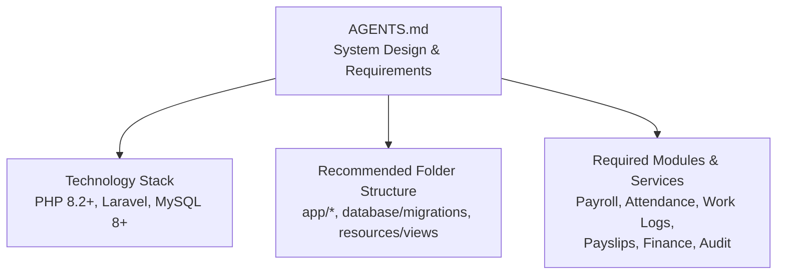
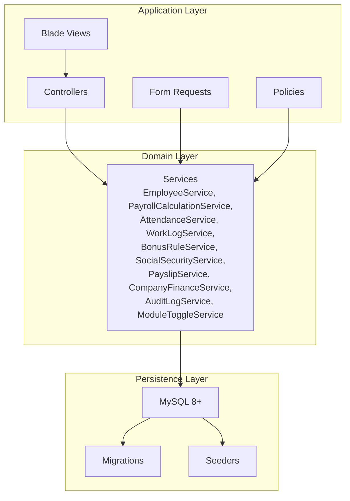
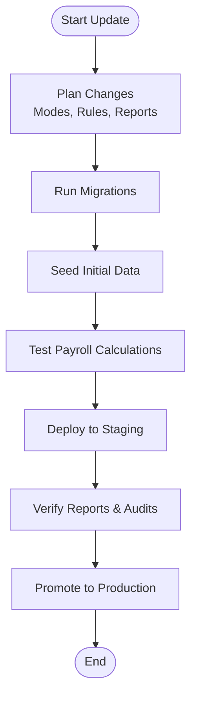
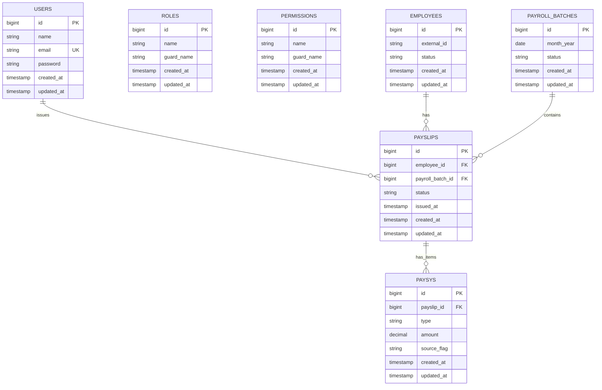
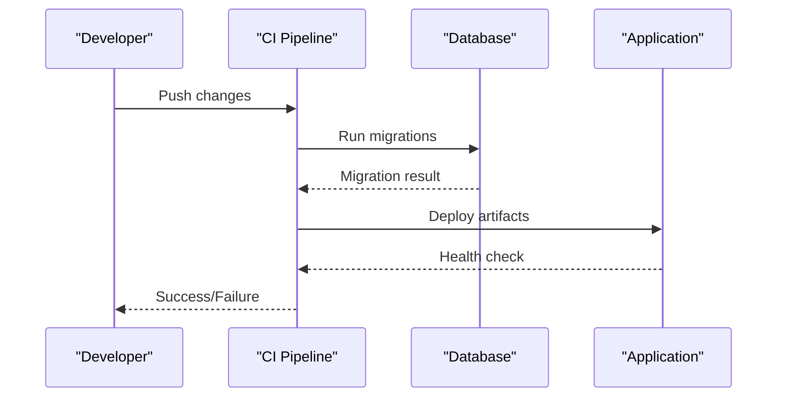
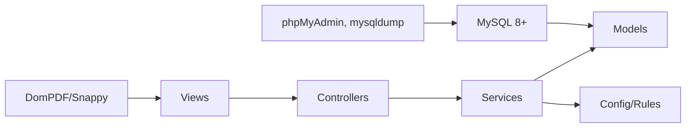

# Deployment and Maintenance

<cite>
**Referenced Files in This Document**
- [AGENTS.md](file://AGENTS.md)
</cite>

## Table of Contents
1. [Introduction](#introduction)
2. [Project Structure](#project-structure)
3. [Core Components](#core-components)
4. [Architecture Overview](#architecture-overview)
5. [Detailed Component Analysis](#detailed-component-analysis)
6. [Dependency Analysis](#dependency-analysis)
7. [Performance Considerations](#performance-considerations)
8. [Troubleshooting Guide](#troubleshooting-guide)
9. [Conclusion](#conclusion)
10. [Appendices](#appendices)

## Introduction
This document provides comprehensive deployment and maintenance procedures for the xHR Payroll & Finance System. It consolidates system requirements, installation steps, configuration management, migration and update procedures, database schema management, backup strategies, performance optimization, monitoring, troubleshooting, maintenance tasks, security updates, and deployment automation and rollback practices. The guidance is derived from the repository’s development contract and system design documents.

## Project Structure
The repository contains a single development contract and system design document that defines the technology stack, architecture constraints, and operational expectations. The document outlines the recommended folder structure aligned with Laravel conventions and the required modules and services for payroll operations.

**Diagram sources**
- [AGENTS.md:102-118](file://AGENTS.md#L102-L118)
- [AGENTS.md:622-647](file://AGENTS.md#L622-L647)
- [AGENTS.md:286-382](file://AGENTS.md#L286-L382)

**Section sources**
- [AGENTS.md:102-118](file://AGENTS.md#L102-L118)
- [AGENTS.md:622-647](file://AGENTS.md#L622-L647)
- [AGENTS.md:286-382](file://AGENTS.md#L286-L382)

## Core Components
- Technology stack and constraints:
  - PHP 8.2+ and Laravel preferred
  - MySQL 8+
  - phpMyAdmin-compatible schema
  - Blade + lightweight JavaScript (Alpine.js)
  - PDF generation via DomPDF or Snappy
- Database schema and conventions:
  - phpMyAdmin-friendly schema design
  - Recommended data types and constraints
  - Timestamps, status flags, soft deletes, and audit references
- Core modules and services:
  - Authentication, Employee Management, Employee Board, Employee Workspace
  - Attendance, Work Log, Payroll Engine, Rule Manager
  - Payslip, Annual Summary, Company Finance, Subscription & Extra Costs
  - Audit Logging and Compliance
- Coding standards and anti-patterns:
  - Service classes for business logic, minimal controllers, validation via FormRequest or service validation
  - Transactions for critical operations, avoid God Classes
  - Anti-patterns include cell-based logic, hardcoded values, and report-as-source-of-truth

**Section sources**
- [AGENTS.md:102-118](file://AGENTS.md#L102-L118)
- [AGENTS.md:385-435](file://AGENTS.md#L385-L435)
- [AGENTS.md:286-382](file://AGENTS.md#L286-L382)
- [AGENTS.md:598-620](file://AGENTS.md#L598-L620)
- [AGENTS.md:663-672](file://AGENTS.md#L663-L672)

## Architecture Overview
The system follows a PHP-first, Laravel-based architecture with a MySQL backend and phpMyAdmin-compatible schema. The design emphasizes rule-driven calculations, dynamic data entry, auditability, and maintainability. The recommended folder structure aligns with Laravel conventions, separating models, services, actions, enums/support, controllers, requests, policies, views, migrations, and seeders.

**Diagram sources**
- [AGENTS.md:622-647](file://AGENTS.md#L622-L647)
- [AGENTS.md:385-435](file://AGENTS.md#L385-L435)

**Section sources**
- [AGENTS.md:622-647](file://AGENTS.md#L622-L647)
- [AGENTS.md:385-435](file://AGENTS.md#L385-L435)

## Detailed Component Analysis

### System Requirements and Environment Setup
- PHP runtime: 8.2 or higher
- Framework: Laravel (preferred)
- Database: MySQL 8+
- Web UI: Blade + lightweight JavaScript (Alpine.js)
- PDF generation: DomPDF or Snappy
- Hosting: phpMyAdmin-compatible schema and shared hosting considerations

Environment prerequisites:
- Composer for dependency management
- Node.js/npm for asset compilation (as typical in Laravel)
- MySQL client tools for schema management and backups
- PHP extensions required by Laravel and MySQL drivers

**Section sources**
- [AGENTS.md:102-118](file://AGENTS.md#L102-L118)

### Installation Procedures
- Provision environment:
  - Install PHP 8.2+, Composer, MySQL 8+, and web server (Apache/Nginx)
  - Configure PHP extensions required by Laravel and MySQL drivers
  - Set up a MySQL user and database for the application
- Clone repository and install dependencies:
  - Run Composer install to fetch PHP dependencies
  - Run npm ci and build assets if applicable
- Configure application:
  - Copy environment file (.env) and set database credentials, app key, and storage paths
  - Set application key and cache configuration
- Database initialization:
  - Run database migrations to create schema
  - Seed initial data if seeders are provided
- Web server configuration:
  - Point document root to public directory
  - Enable URL rewriting and set proper permissions

Note: The repository does not include installation scripts or environment provisioning files. Follow standard Laravel installation practices and adapt to your hosting environment.

**Section sources**
- [AGENTS.md:102-118](file://AGENTS.md#L102-L118)

### Configuration Management
- Environment variables:
  - Database connection (host, port, database, username, password)
  - Application key, environment, debug mode
  - Storage and session configuration
  - PDF engine selection (DomPDF/Snappy)
- phpMyAdmin compatibility:
  - Ensure schema readability and basic query support
  - Keep migrations compatible with shared hosting constraints
- Audit and compliance:
  - Enable audit logging for sensitive changes
  - Track rule/module toggles and configuration changes

**Section sources**
- [AGENTS.md:102-118](file://AGENTS.md#L102-L118)
- [AGENTS.md:385-435](file://AGENTS.md#L385-L435)
- [AGENTS.md:576-595](file://AGENTS.md#L576-L595)

### Migration and Update Procedures
- Schema design:
  - Use unsigned big integers for foreign keys
  - Use decimal types for monetary fields
  - Prefer integer minutes/seconds for durations
  - Avoid rigid enums; favor extensible configurations
- Migrations:
  - Keep migrations compatible with phpMyAdmin and shared hosting
  - Ensure migrations remain idempotent and reversible
- Updates:
  - Plan updates around payroll modes and rule changes
  - Validate interdependencies before applying changes
  - Use transactions for critical updates

**Diagram sources**
- [AGENTS.md:385-435](file://AGENTS.md#L385-L435)
- [AGENTS.md:650-660](file://AGENTS.md#L650-L660)

**Section sources**
- [AGENTS.md:385-435](file://AGENTS.md#L385-L435)
- [AGENTS.md:650-660](file://AGENTS.md#L650-L660)

### Database Schema Management
- Core entities and suggested tables:
  - Users, Roles, Permissions
  - Employees, Profiles, Salary Profiles, Bank Accounts
  - Departments, Positions
  - Payroll Batches, Items, Item Types
  - Attendance Logs, Work Logs, Work Log Types
  - Rate Rules, Layer Rate Rules, Bonus Rules, Threshold Rules
  - Social Security Configs
  - Expense Claims, Company Revenues, Company Expenses, Subscription Costs
  - Payslips, Payslip Items
  - Module Toggles, Audit Logs
- Conventions:
  - Plural snake_case table names, primary key id, foreign keys <entity>_id
  - Status flags status/is_active, dates *_date, durations *_minutes/*_seconds
  - Monetary fields decimal(12,2)+, percentages consistent decimals
- phpMyAdmin compatibility:
  - Maintain readable field names
  - Ensure migrations and basic queries are supported

**Diagram sources**
- [AGENTS.md:387-416](file://AGENTS.md#L387-L416)

**Section sources**
- [AGENTS.md:387-416](file://AGENTS.md#L387-L416)
- [AGENTS.md:418-427](file://AGENTS.md#L418-L427)
- [AGENTS.md:428-435](file://AGENTS.md#L428-L435)

### Data Backup Strategies
- Database backups:
  - Use logical backups (mysqldump) for schema and data
  - Schedule regular incremental/full backups
  - Store backups offsite or in secure cloud storage
- Configuration backups:
  - Version-control environment files and configuration changes
  - Maintain separate production and staging configurations
- Audit trail:
  - Retain audit logs for compliance and recovery
  - Archive historical payroll snapshots and payslips

**Section sources**
- [AGENTS.md:576-595](file://AGENTS.md#L576-L595)

### Performance Optimization Guidelines
- Database:
  - Use appropriate indexes on foreign keys and frequently queried columns
  - Normalize to reduce redundancy; denormalize selectively for reporting
  - Monitor slow queries and optimize joins
- Application:
  - Use service classes for business logic and keep controllers thin
  - Leverage caching for rule configs and static lists
  - Minimize N+1 queries; eager-load relationships
- Frontend:
  - Lightweight JavaScript for dynamic grids; minimize DOM manipulation
  - Debounce real-time calculations to reduce load
- PDF generation:
  - Batch PDF generation during off-peak hours
  - Cache rendered PDF metadata when feasible

**Section sources**
- [AGENTS.md:598-620](file://AGENTS.md#L598-L620)
- [AGENTS.md:385-435](file://AGENTS.md#L385-L435)

### Monitoring Requirements
- Health checks:
  - Database connectivity and replication lag
  - Application response time and error rates
- Audit and compliance:
  - Monitor audit log writes and retention
  - Alert on unauthorized configuration changes
- Payroll integrity:
  - Validate totals and rule application after batch runs
  - Track payslip generation and distribution

**Section sources**
- [AGENTS.md:576-595](file://AGENTS.md#L576-L595)

### Troubleshooting Common Issues
- Database schema errors:
  - Ensure migrations are compatible with phpMyAdmin and shared hosting
  - Verify data types and constraints match conventions
- Payroll calculation discrepancies:
  - Confirm rule configurations and effective dates
  - Validate manual overrides and source flags
- PDF generation failures:
  - Check DomPDF/Snappy configuration and memory limits
  - Regenerate from finalized snapshot data only
- Audit gaps:
  - Verify audit logging is enabled and configured
  - Review audit coverage for high-priority areas

**Section sources**
- [AGENTS.md:385-435](file://AGENTS.md#L385-L435)
- [AGENTS.md:567-573](file://AGENTS.md#L567-L573)
- [AGENTS.md:576-595](file://AGENTS.md#L576-L595)

### Maintenance Procedures
- Regular tasks:
  - Apply security patches to PHP, Laravel, and MySQL
  - Rotate application keys and secrets
  - Clean temporary files and caches
- Schema maintenance:
  - Add indexes for new queries
  - Deprecate unused columns after migration
- Rule maintenance:
  - Review and update rule configurations periodically
  - Validate thresholds and rates for current regulations

**Section sources**
- [AGENTS.md:102-118](file://AGENTS.md#L102-L118)
- [AGENTS.md:488-497](file://AGENTS.md#L488-L497)

### Security Updates
- Keep PHP, Laravel, and MySQL versions up-to-date
- Review and apply security advisories regularly
- Enforce strong passwords, two-factor authentication, and least privilege access
- Limit database user privileges to application needs

**Section sources**
- [AGENTS.md:102-118](file://AGENTS.md#L102-L118)

### System Health Monitoring
- Metrics to track:
  - Database query performance and connection pool usage
  - Application throughput and latency
  - Audit log write rates and retention
- Alerts:
  - Notify on failed migrations, audit failures, and PDF generation errors
  - Monitor disk space and backup completion

**Section sources**
- [AGENTS.md:576-595](file://AGENTS.md#L576-L595)

### Deployment Automation and Rollback Procedures
- Automation:
  - Use CI/CD pipelines to run migrations and tests
  - Automate asset builds and environment configuration
- Rollback:
  - Maintain backward-compatible migrations
  - Keep recent database snapshots for quick restoration
  - Use feature flags for risky changes

**Diagram sources**
- [AGENTS.md:650-660](file://AGENTS.md#L650-L660)

**Section sources**
- [AGENTS.md:650-660](file://AGENTS.md#L650-L660)

## Dependency Analysis
- Internal dependencies:
  - Controllers depend on Services for business logic
  - Services depend on Models and configuration
  - Views depend on Controllers and Services for data
- External dependencies:
  - Laravel framework and ecosystem
  - MySQL 8+ and drivers
  - phpMyAdmin-compatible schema and tools
  - PDF generation libraries (DomPDF/Snappy)

**Diagram sources**
- [AGENTS.md:622-647](file://AGENTS.md#L622-L647)
- [AGENTS.md:385-435](file://AGENTS.md#L385-L435)

**Section sources**
- [AGENTS.md:622-647](file://AGENTS.md#L622-L647)
- [AGENTS.md:385-435](file://AGENTS.md#L385-L435)

## Performance Considerations
- Optimize database queries and indexing
- Use caching for rule configurations and static lists
- Minimize heavy computations in views; delegate to services
- Batch process PDF generation and limit concurrent jobs
- Monitor and scale database connections and application servers

[No sources needed since this section provides general guidance]

## Troubleshooting Guide
- Payroll calculation mismatches:
  - Verify rule configurations and effective dates
  - Check manual overrides and source flags
- Database schema issues:
  - Confirm migrations compatibility with phpMyAdmin and shared hosting
  - Validate data types and constraints
- PDF generation problems:
  - Check library configuration and resource limits
  - Rebuild from finalized snapshot data
- Audit gaps:
  - Ensure audit logging is enabled and monitored

**Section sources**
- [AGENTS.md:385-435](file://AGENTS.md#L385-L435)
- [AGENTS.md:567-573](file://AGENTS.md#L567-L573)
- [AGENTS.md:576-595](file://AGENTS.md#L576-L595)

## Conclusion
The xHR Payroll & Finance System is designed for maintainability, auditability, and scalability within a PHP/Laravel/MySQL stack. By adhering to the repository’s guidelines—schema conventions, service-oriented architecture, rule-driven logic, and robust auditing—you can deploy, operate, and evolve the system reliably. Use the procedures outlined here to manage installations, migrations, backups, performance, monitoring, and rollbacks effectively.

[No sources needed since this section summarizes without analyzing specific files]

## Appendices
- Minimum deliverables checklist:
  - Project structure, database schema, migrations, seed data
  - Model relationships, payroll services, rule manager
  - Employee workspace UI, payslip builder + PDF, audit logs
  - Annual summary, company finance summary

**Section sources**
- [AGENTS.md:675-691](file://AGENTS.md#L675-L691)