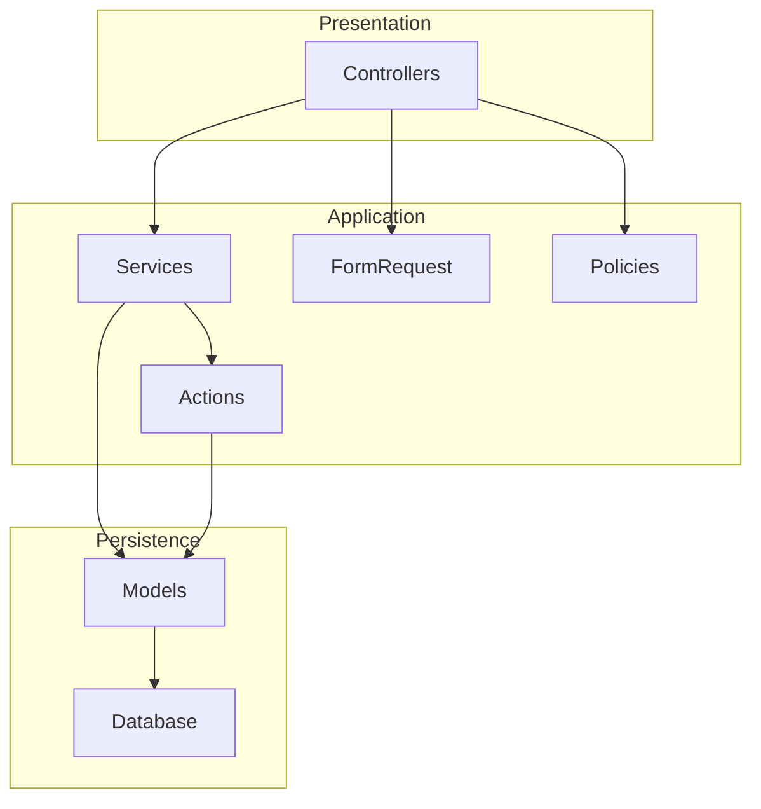
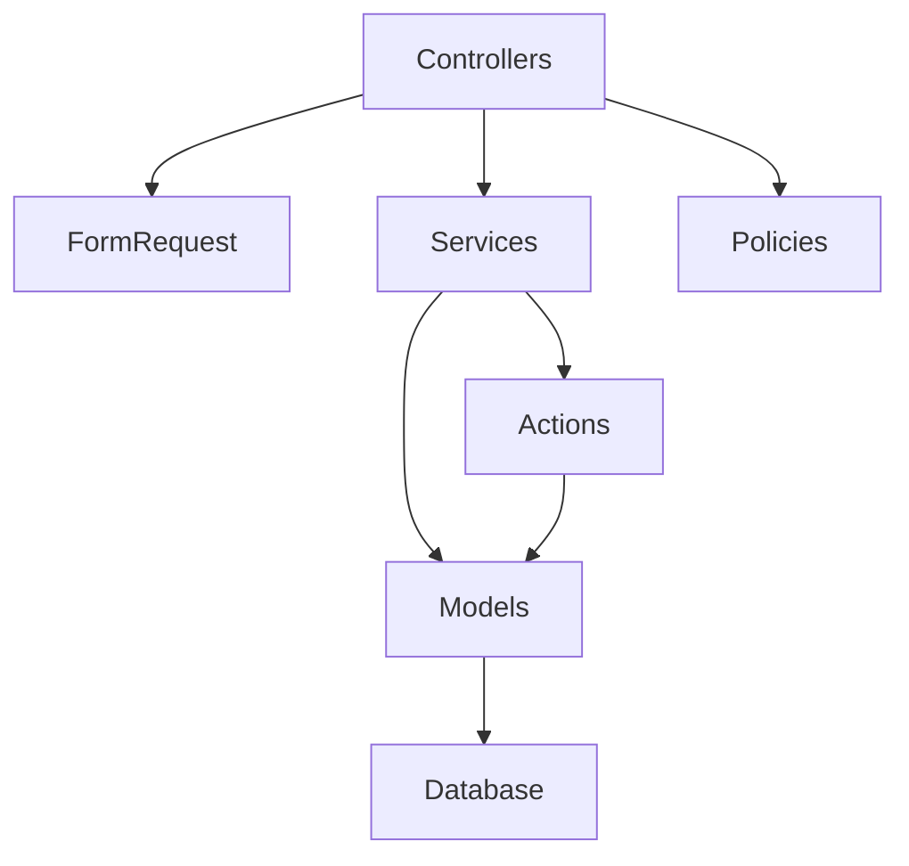

# Coding Standards

<cite>
**Referenced Files in This Document**
- [AGENTS.md](file://AGENTS.md)
</cite>

## Table of Contents
1. [Introduction](#introduction)
2. [Project Structure](#project-structure)
3. [Core Components](#core-components)
4. [Architecture Overview](#architecture-overview)
5. [Detailed Component Analysis](#detailed-component-analysis)
6. [Dependency Analysis](#dependency-analysis)
7. [Performance Considerations](#performance-considerations)
8. [Troubleshooting Guide](#troubleshooting-guide)
9. [Conclusion](#conclusion)
10. [Appendices](#appendices)

## Introduction
This document defines comprehensive coding standards for PHP/Laravel development within the xHR Payroll & Finance System. It consolidates the established guidelines from the project’s authoritative guide, focusing on service class organization, controller design principles, validation approaches using FormRequest, transaction management best practices, naming conventions, separation of concerns, and team collaboration standards. The goal is to ensure code readability, maintainability, and scalability while aligning with the system’s rule-driven, dynamic, and audit-friendly architecture.

## Project Structure
The recommended Laravel folder structure is aligned with the project’s guidance, emphasizing clear separation of concerns and modular organization:
- app/Models
- app/Services
- app/Actions
- app/Enums or app/Support
- app/Http/Controllers
- app/Http/Requests
- app/Policies
- resources/views
- database/migrations
- database/seeders

Suggested service-layer components include:
- EmployeeService
- PayrollCalculationService
- AttendanceService
- WorkLogService
- BonusRuleService
- SocialSecurityService
- PayslipService
- CompanyFinanceService
- AuditLogService
- ModuleToggleService

These services encapsulate business logic and coordinate with models, requests, and policies to keep controllers thin and focused on HTTP concerns.

**Section sources**
- [AGENTS.md:623-647](file://AGENTS.md#L623-L647)

## Core Components
This section outlines the foundational principles for building robust Laravel applications within the xHR system.

- Service classes for business logic: Encapsulate domain logic in dedicated services to promote reuse, testability, and separation of concerns.
- Thin controllers: Controllers should orchestrate requests, delegate validation to FormRequest, and delegate business logic to services. They should avoid heavy computation and persistence logic.
- Validation via FormRequest: Centralize validation in FormRequest classes to keep controllers clean and ensure consistent validation behavior across endpoints.
- Transaction management: Wrap critical operations in database transactions to maintain data consistency and atomicity.
- Avoid God Classes: Prevent monolithic classes by decomposing responsibilities into focused services and actions.
- Separation of concerns: Keep models for persistence, services for business logic, controllers for HTTP orchestration, and policies for authorization.

These principles are explicitly stated in the project’s coding standards and folder structure guidance.

**Section sources**
- [AGENTS.md:599-606](file://AGENTS.md#L599-L606)
- [AGENTS.md:623-647](file://AGENTS.md#L623-L647)

## Architecture Overview
The system architecture emphasizes a layered approach:
- Presentation: Controllers handle HTTP requests and responses.
- Application: Services encapsulate business logic and coordinate domain operations.
- Persistence: Models manage database interactions and relationships.
- Validation: FormRequest classes enforce input validation.
- Authorization: Policies govern access control.
- Infrastructure: Migrations and seeders manage schema and initial data.

[No sources needed since this diagram shows conceptual workflow, not actual code structure]

## Detailed Component Analysis

### Service Class Organization Patterns
- Purpose: Encapsulate business logic and domain operations to keep controllers thin and models focused on persistence.
- Responsibilities:
  - Orchestrate domain workflows
  - Coordinate with models and repositories
  - Apply business rules and validations
  - Manage transactions for critical operations
  - Return structured results or throw explicit exceptions
- Example services (as suggested):
  - EmployeeService
  - PayrollCalculationService
  - AttendanceService
  - WorkLogService
  - BonusRuleService
  - SocialSecurityService
  - PayslipService
  - CompanyFinanceService
  - AuditLogService
  - ModuleToggleService

Anti-patterns to avoid:
- Copying logic across multiple services
- Embedding validation or persistence logic inside services
- Creating overly large services that violate single-responsibility principle

**Section sources**
- [AGENTS.md:636-646](file://AGENTS.md#L636-L646)
- [AGENTS.md:663-672](file://AGENTS.md#L663-L672)

### Controller Design Principles
- Thin controllers: Controllers should focus on routing, request parsing, response formatting, and delegating business logic to services.
- Delegation to FormRequest: Use FormRequest for validation to centralize validation rules and keep controllers clean.
- Error handling: Convert exceptions to appropriate HTTP responses; avoid exposing internal errors to clients.
- Authorization: Use policies to enforce access control and keep controllers free of authorization logic.

Anti-patterns to avoid:
- Business logic in controllers
- Direct database queries in controllers
- Hardcoded values or magic numbers in controllers

**Section sources**
- [AGENTS.md:600-606](file://AGENTS.md#L600-L606)
- [AGENTS.md:663-672](file://AGENTS.md#L663-L672)

### Validation Approaches Using FormRequest
- Centralize validation: Define validation rules in FormRequest classes to ensure consistent behavior across endpoints.
- Reuse validation logic: Share FormRequest classes across multiple controllers or routes.
- Clear error messages: Provide meaningful error messages to aid debugging and user feedback.
- Request shaping: Use FormRequest to normalize and transform incoming data before passing to services.

Anti-patterns to avoid:
- Inline validation in controllers
- Duplicated validation logic across controllers
- Ignoring validation failures

**Section sources**
- [AGENTS.md:600-606](file://AGENTS.md#L600-L606)
- [AGENTS.md:663-672](file://AGENTS.md#L663-L672)

### Transaction Management Best Practices
- Atomic operations: Wrap critical business operations in database transactions to ensure data consistency.
- Rollback on failure: Ensure that exceptions trigger rollbacks and that partial updates are not committed.
- Nested transactions: Be cautious with nested transactions; prefer single top-level transaction per operation.
- Long-running transactions: Minimize transaction scope to reduce locking and improve concurrency.

Anti-patterns to avoid:
- Partial commits
- Long-held locks
- Ignoring transaction failures

**Section sources**
- [AGENTS.md:600-606](file://AGENTS.md#L600-L606)
- [AGENTS.md:663-672](file://AGENTS.md#L663-L672)

### Naming Conventions
- Class names: Use domain-aligned names that clearly describe the service or component (e.g., PayrollCalculationService).
- Methods: Use action-oriented names that express intent (e.g., calculateNetPay, applyBonusRule).
- Constants: Group constants into enum-like classes or configuration arrays for clarity and reusability.

Anti-patterns to avoid:
- Ambiguous or cryptic names
- Mixing naming styles within the same module
- Using names that imply implementation details rather than responsibilities

**Section sources**
- [AGENTS.md:607-611](file://AGENTS.md#L607-L611)

### Code Organization Principles
- Separation of concerns: Keep models for persistence, services for business logic, controllers for HTTP orchestration, and policies for authorization.
- Avoid God Classes: Decompose large classes into smaller, focused services and actions.
- Service layer architecture: Build a clear service layer that coordinates domain operations and delegates to models and repositories.

Anti-patterns to avoid:
- Monolithic controllers or services
- Tight coupling between layers
- Violating single-responsibility principle

**Section sources**
- [AGENTS.md:600-606](file://AGENTS.md#L600-L606)
- [AGENTS.md:663-672](file://AGENTS.md#L663-L672)

### Examples of Well-Structured Laravel Components
- Controllers: Thin orchestrators that delegate to services and use FormRequest for validation.
- Services: Focused business logic components (e.g., PayrollCalculationService, PayslipService).
- Requests: FormRequest classes that define validation rules and normalization.
- Policies: Authorization logic for domain actions.
- Models: Data access and relationships with minimal business logic.

Anti-patterns to avoid:
- Business logic in controllers
- Direct database queries in controllers
- Hardcoded values or magic numbers
- Copying logic across services

**Section sources**
- [AGENTS.md:623-647](file://AGENTS.md#L623-L647)
- [AGENTS.md:663-672](file://AGENTS.md#L663-L672)

## Dependency Analysis
The following conceptual dependency graph illustrates how components interact within the Laravel architecture:

[No sources needed since this diagram shows conceptual relationships, not specific code files]

## Performance Considerations
- Keep controllers thin to minimize overhead and improve responsiveness.
- Use batch operations and eager loading to reduce database round trips.
- Prefer read-only queries for reporting and avoid long-running write transactions.
- Cache frequently accessed configuration and rule sets to reduce repeated reads.
- Use pagination for large datasets to avoid memory pressure.

[No sources needed since this section provides general guidance]

## Troubleshooting Guide
Common issues and resolutions:
- Validation failures: Ensure FormRequest classes are used consistently and that error messages are surfaced appropriately.
- Transaction failures: Wrap critical operations in transactions and handle exceptions to trigger rollbacks.
- Authorization errors: Use policies to enforce access control and return appropriate HTTP responses.
- Performance bottlenecks: Profile slow queries, optimize joins, and consider caching strategies.

Anti-patterns to watch for:
- Business logic in controllers
- Direct database queries in controllers
- Hardcoded values or magic numbers
- Copying logic across services

**Section sources**
- [AGENTS.md:600-606](file://AGENTS.md#L600-L606)
- [AGENTS.md:663-672](file://AGENTS.md#L663-L672)

## Conclusion
By adhering to the coding standards outlined here—service-centric architecture, thin controllers, centralized validation via FormRequest, disciplined transaction management, and consistent naming conventions—you will build a maintainable, scalable, and collaborative Laravel application that aligns with the xHR Payroll & Finance System’s rule-driven, dynamic, and audit-friendly principles.

[No sources needed since this section summarizes without analyzing specific files]

## Appendices
- Minimum deliverables checklist and definition of done are documented in the project’s guide and serve as a practical reference for ensuring completeness and quality during development and review cycles.

**Section sources**
- [AGENTS.md:675-709](file://AGENTS.md#L675-L709)