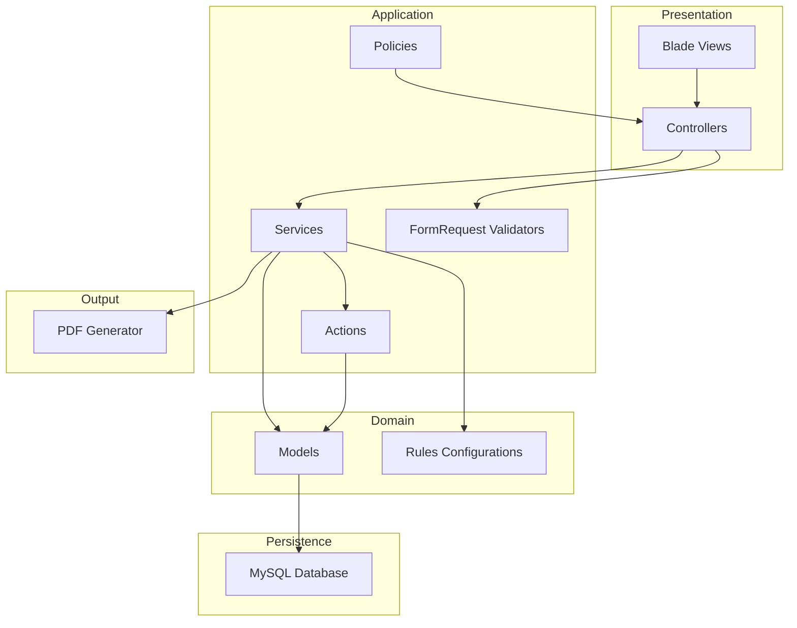
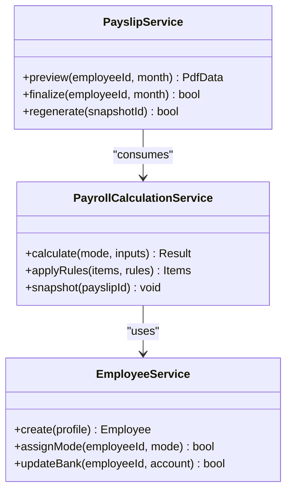
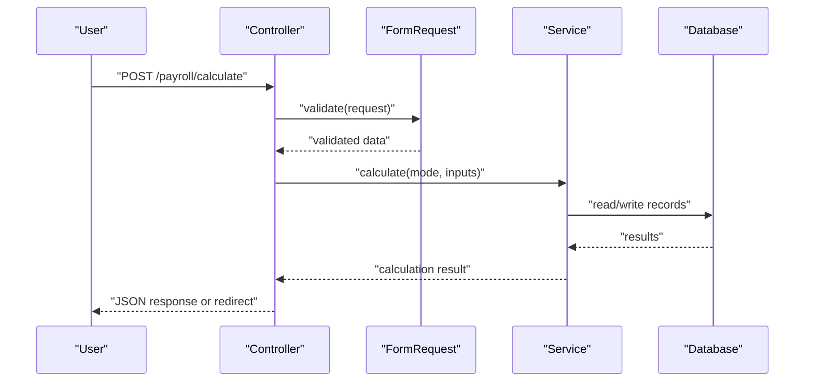
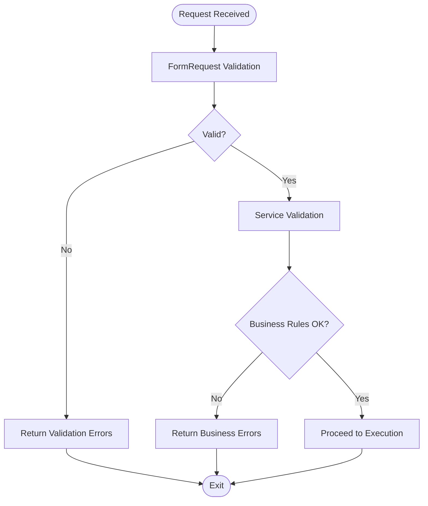
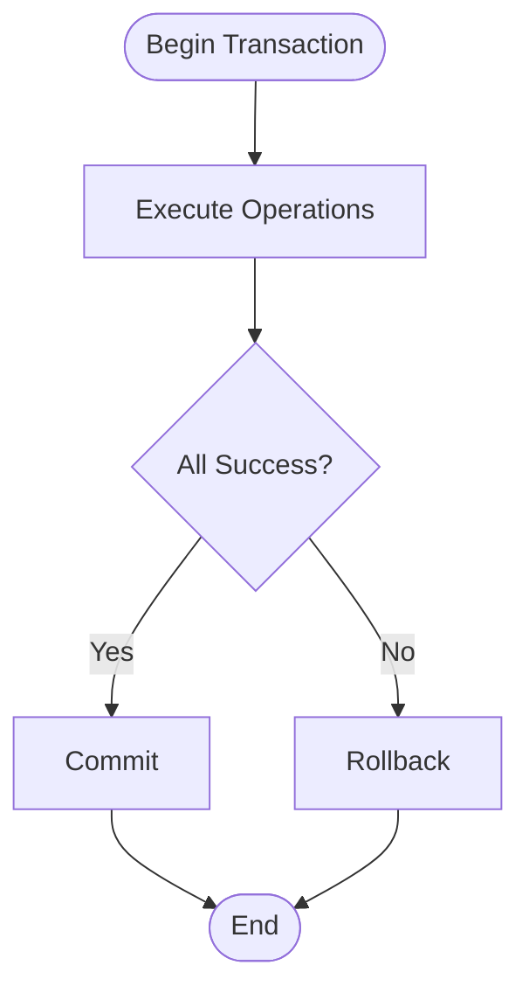
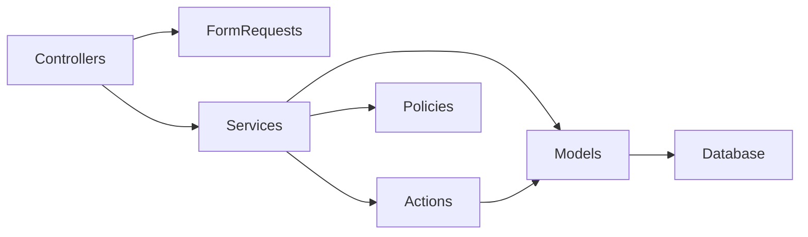

# Development Guidelines

<cite>
**Referenced Files in This Document**
- [AGENTS.md](file://AGENTS.md)
</cite>

## Table of Contents
1. [Introduction](#introduction)
2. [Project Structure](#project-structure)
3. [Core Components](#core-components)
4. [Architecture Overview](#architecture-overview)
5. [Detailed Component Analysis](#detailed-component-analysis)
6. [Dependency Analysis](#dependency-analysis)
7. [Performance Considerations](#performance-considerations)
8. [Testing Strategy](#testing-strategy)
9. [Code Review and Quality Assurance](#code-review-and-quality-assurance)
10. [Development Workflow and Branching](#development-workflow-and-branching)
11. [Deployment Procedures](#deployment-procedures)
12. [Troubleshooting Guide](#troubleshooting-guide)
13. [Conclusion](#conclusion)

## Introduction
This document consolidates development guidelines for the xHR Payroll & Finance System with a focus on PHP/Laravel practices. It defines coding standards, testing strategies, architectural patterns, and operational procedures aligned with the project’s principles: rule-driven design, single source of truth, maintainability, and dynamic yet auditable data entry. The guidance is derived from the repository’s authoritative agent contract and development framework.

## Project Structure
The recommended folder layout follows Laravel conventions while emphasizing separation of concerns:
- app/Models: Eloquent models representing core entities
- app/Services: Business logic services encapsulating calculations and orchestration
- app/Actions: Action classes for command-style operations
- app/Enums or app/Support: Enum-like constants and shared utilities
- app/Http/Controllers: Thin controllers handling HTTP requests
- app/Http/Requests: FormRequest classes for validation
- app/Policies: Authorization policies
- resources/views: Blade templates
- database/migrations and database/seeders: Schema and seed data

Suggested service modules include EmployeeService, PayrollCalculationService, AttendanceService, WorkLogService, BonusRuleService, SocialSecurityService, PayslipService, CompanyFinanceService, AuditLogService, and ModuleToggleService.

**Section sources**
- [AGENTS.md:622-647](file://AGENTS.md#L622-L647)

## Core Components
- Service classes: Encapsulate business logic and are preferred over heavy controllers
- Controllers: Keep thin and focused on request/response handling
- Validation: Prefer FormRequest classes or service-level validation
- Transactions: Use database transactions for critical operations
- Avoid: God classes, magic numbers, hardcoded values, and logic in views

Naming conventions emphasize domain clarity:
- Class names reflect domain actions (e.g., PayrollCalculationService)
- Methods named as explicit actions
- Constants organized as enum-like classes or configuration

**Section sources**
- [AGENTS.md:599-621](file://AGENTS.md#L599-L621)

## Architecture Overview
The system is designed around record-based persistence, single source of truth, and rule-driven computation. Controllers delegate to services, which coordinate models, rules, and external outputs (PDFs). Audit logging is mandatory for sensitive changes.

[No sources needed since this diagram shows conceptual architecture, not a direct code mapping]

## Detailed Component Analysis

### Service Layer Organization
- Responsibilities: Encapsulate business logic, orchestrate models, apply rules, manage transactions, and coordinate outputs
- Examples: PayrollCalculationService, EmployeeService, PayslipService
- Principles: Single responsibility, testability, and reuse

[No sources needed since this diagram illustrates conceptual service relationships]

### Controller Design Patterns
- Keep controllers thin: route HTTP to services
- Use FormRequest for validation
- Return structured responses or redirects
- Enforce authorization via policies

[No sources needed since this diagram shows conceptual controller flow]

### Validation Approaches
- Prefer FormRequest classes for request validation
- Apply service-level validation for complex business rules
- Centralize validation messages and error handling

[No sources needed since this diagram shows conceptual validation flow]

### Transaction Management
- Wrap critical operations (e.g., payroll calculation, payslip finalize) in transactions
- Rollback on errors and ensure idempotency where possible
- Use database transactions to maintain consistency

[No sources needed since this diagram shows conceptual transaction flow]

## Dependency Analysis
- Controllers depend on FormRequest validators and Services
- Services depend on Models and Rules configurations
- Actions encapsulate write-heavy commands
- Policies enforce authorization at the controller boundary
- Models persist to the database; rules drive computation

[No sources needed since this diagram shows conceptual dependencies]

## Performance Considerations
- Prefer batch operations for grid updates
- Use database indexing on frequently filtered columns
- Cache rule configurations and lookup tables
- Minimize N+1 queries in controllers and services
- Optimize PDF generation by precomputing totals and snapshots

[No sources needed since this section provides general guidance]

## Testing Strategy
Minimum test coverage categories:
- Payroll mode calculation tests: Verify monthly staff, freelance layer, freelance fixed, youtuber salary, and youtuber settlement
- Social Security calculation tests: Validate Thailand SSO rules and configuration changes
- Layer rate tests: Confirm tiered rate computations
- Payslip snapshot tests: Ensure finalized items and totals are preserved
- Audit logging tests: Verify who, what, when, old/new values, and reasons

Recommended practices:
- Unit tests for pure functions and service methods
- Integration tests for controller flows and database transactions
- Business logic validation through scenario-based tests
- Mock external dependencies (e.g., PDF generator) during unit tests

**Section sources**
- [AGENTS.md:612-619](file://AGENTS.md#L612-L619)

## Code Review and Quality Assurance
Review checklist aligned with anti-patterns and standards:
- No Excel-style cell references or hardcoded values
- No business logic in views
- No god classes; services are cohesive and focused
- No copy-pasted logic across services
- Clear audit trail for sensitive changes
- Consistent naming and domain-aligned class/method names
- Validation handled via FormRequest or service validation
- Transactions used for critical operations

Quality gates:
- All changes must answer the five change management questions before merging
- High-priority audit areas require additional scrutiny

**Section sources**
- [AGENTS.md:663-672](file://AGENTS.md#L663-L672)
- [AGENTS.md:650-661](file://AGENTS.md#L650-L661)
- [AGENTS.md:599-621](file://AGENTS.md#L599-L621)

## Development Workflow and Branching
Branching strategy:
- Feature branches per agent or feature
- Release branches for stabilization
- Hotfix branches for urgent production fixes

Workflow steps:
- Create feature branch from develop
- Implement changes with tests
- Open pull request with checklist completed
- Peer review and CI checks pass
- Merge to develop, then release branch, then main

Change management rule:
- Every system change answers five questions before merge:
  1. Master or monthly?
  2. Which payroll modes affected?
  3. Impacts payslip/report/finance summary?
  4. Requires migration?
  5. Requires additional audit/test coverage?

**Section sources**
- [AGENTS.md:650-661](file://AGENTS.md#L650-L661)

## Deployment Procedures
- Tag releases with semantic versioning
- Run migrations on deploy target
- Seed minimal configuration data for new environments
- Verify audit logs and rule configurations post-deploy
- Monitor PDF generation and payslip previews

[No sources needed since this section provides general guidance]

## Troubleshooting Guide
Common issues and resolutions:
- Validation failures: Ensure FormRequest rules match service expectations
- Transaction rollbacks: Verify error handling and nested transaction scopes
- Audit gaps: Confirm high-priority audit areas are covered
- Performance regressions: Profile queries and cache rule lookups

**Section sources**
- [AGENTS.md:576-595](file://AGENTS.md#L576-L595)

## Conclusion
These guidelines align development practices with the project’s core principles: rule-driven, maintainable, and auditable systems. By adhering to service-oriented architecture, strict validation, transactional integrity, and comprehensive testing, teams can deliver reliable payroll and finance capabilities that evolve with business needs.