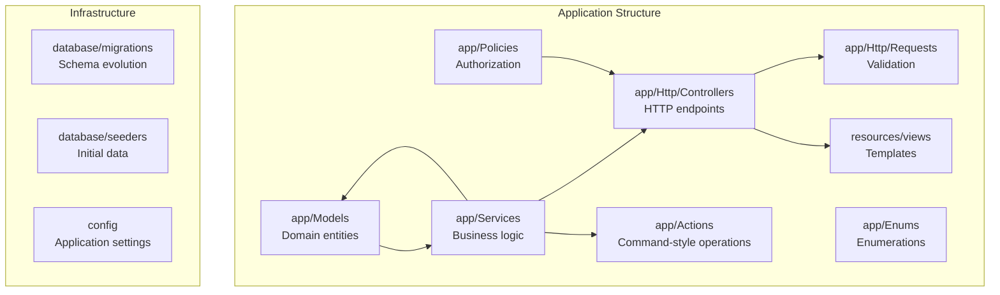
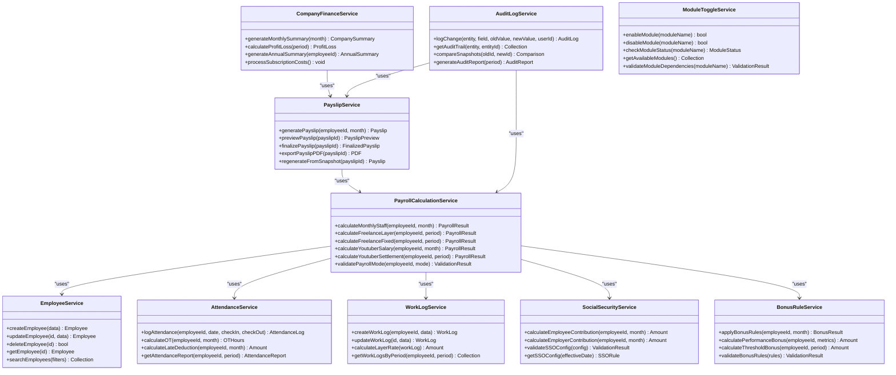
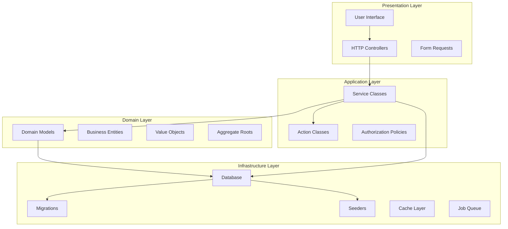
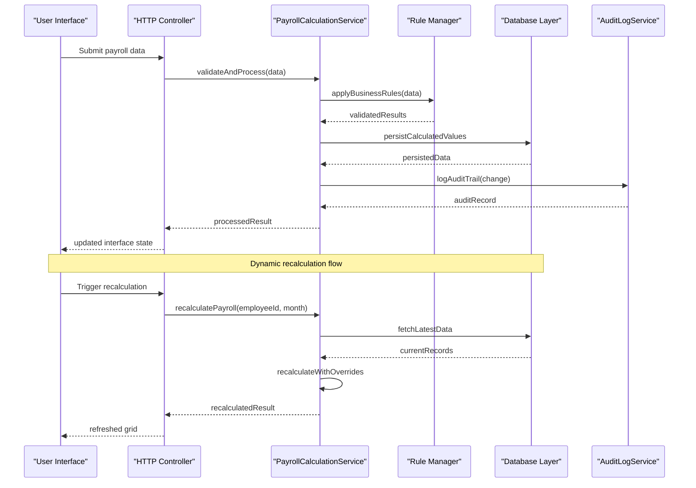
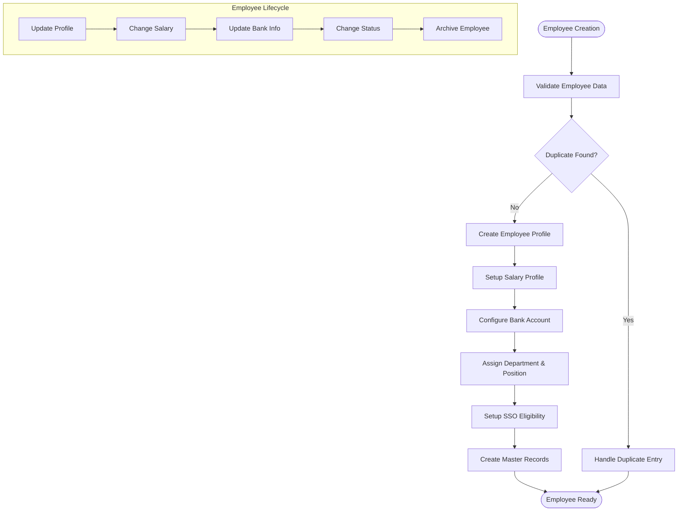
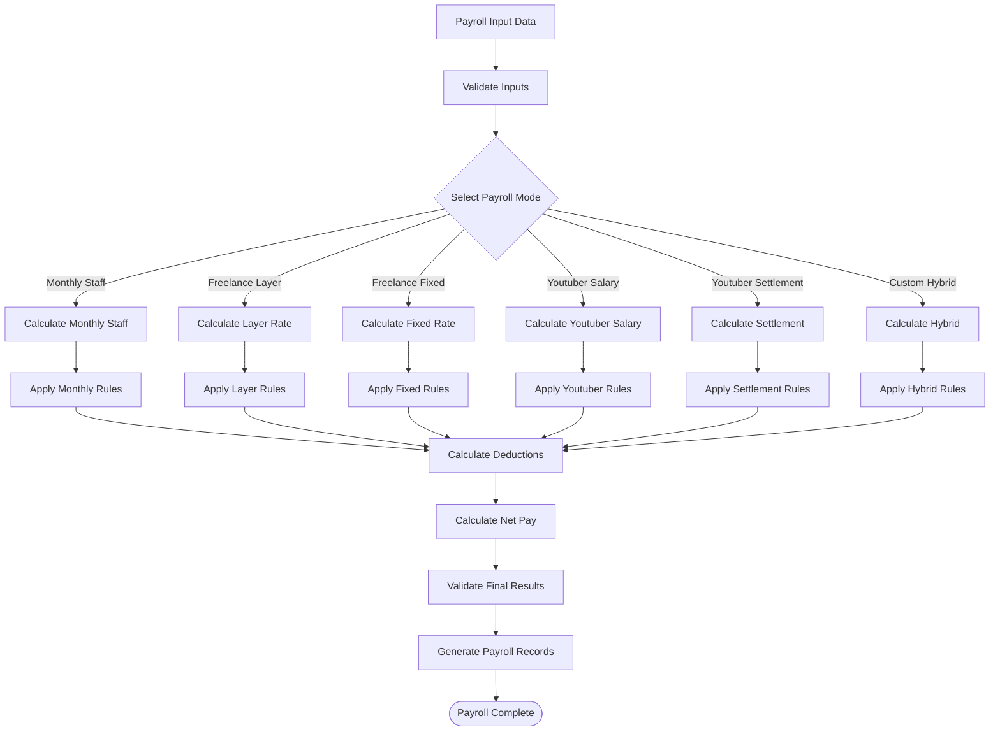
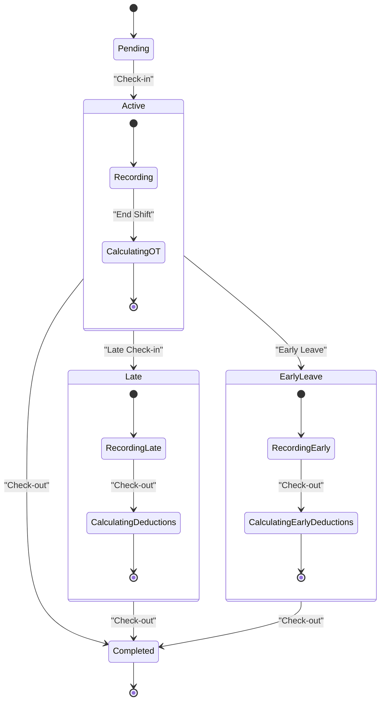
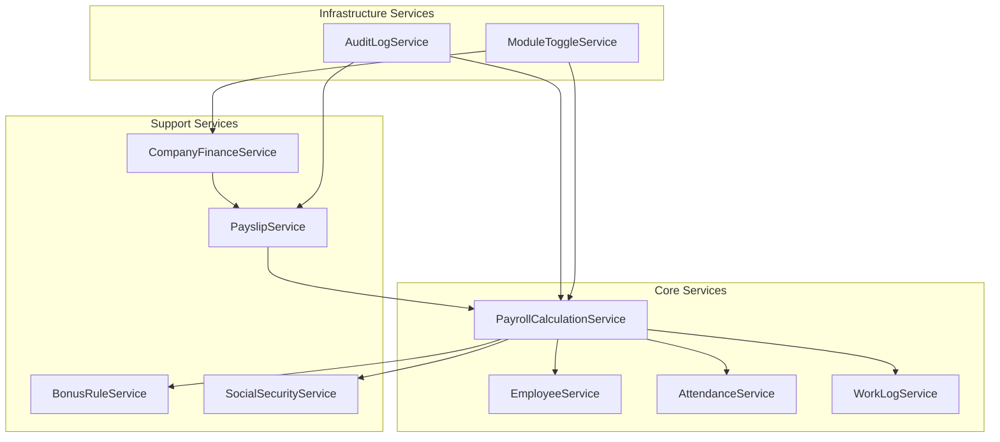
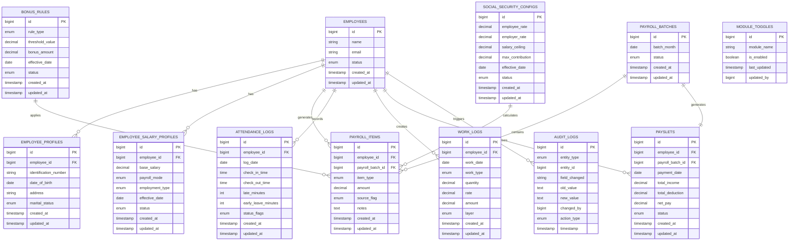

# Development Workflow

<cite>
**Referenced Files in This Document**
- [AGENTS.md](file://AGENTS.md)
</cite>

## Table of Contents
1. [Introduction](#introduction)
2. [Project Structure](#project-structure)
3. [Core Components](#core-components)
4. [Architecture Overview](#architecture-overview)
5. [Detailed Component Analysis](#detailed-component-analysis)
6. [Dependency Analysis](#dependency-analysis)
7. [Performance Considerations](#performance-considerations)
8. [Troubleshooting Guide](#troubleshooting-guide)
9. [Conclusion](#conclusion)
10. [Appendices](#appendices)

## Introduction
This document provides comprehensive development workflow guidance for the xHR Payroll & Finance System. The project follows a PHP-first approach with Laravel framework, emphasizing dynamic data entry, rule-driven architecture, and auditability. The system replaces traditional Excel-based payroll management with a structured database-driven solution while maintaining spreadsheet-like user experience.

The development workflow is organized around specialized agent roles that ensure separation of concerns and maintainability. The system supports multiple payroll modes including monthly staff, freelance workers, and content creators, requiring robust service architecture and clear data governance.

## Project Structure
The recommended Laravel project structure follows clean separation of concerns with dedicated folders for each architectural layer:

**Diagram sources**
- [AGENTS.md:622-647](file://AGENTS.md#L622-L647)

The structure emphasizes service-oriented architecture where business logic is encapsulated in service classes rather than being scattered across controllers or models. This approach ensures maintainability and testability while supporting the complex payroll calculations required by the system.

**Section sources**
- [AGENTS.md:622-647](file://AGENTS.md#L622-L647)

## Core Components

### Service Architecture Organization
The system employs a comprehensive service layer architecture designed to handle the complexity of payroll calculations and financial management:

**Diagram sources**
- [AGENTS.md:636-646](file://AGENTS.md#L636-L646)

Each service class encapsulates specific business capabilities while maintaining loose coupling through well-defined interfaces. The service layer promotes testability, reusability, and maintainability essential for complex payroll systems.

**Section sources**
- [AGENTS.md:636-646](file://AGENTS.md#L636-L646)

## Architecture Overview

### Domain-Driven Design Implementation
The system follows domain-driven design principles with clear separation between core business logic and infrastructure concerns:

**Diagram sources**
- [AGENTS.md:158-283](file://AGENTS.md#L158-L283)

The architecture enforces clean boundaries between layers, ensuring that business logic remains independent of presentation concerns and infrastructure details. This separation enables easier testing, maintenance, and evolution of the system.

### Data Flow Architecture
The system implements a rule-driven data flow architecture that maintains data integrity while allowing dynamic user interactions:

**Diagram sources**
- [AGENTS.md:508-547](file://AGENTS.md#L508-L547)

**Section sources**
- [AGENTS.md:158-283](file://AGENTS.md#L158-L283)
- [AGENTS.md:508-547](file://AGENTS.md#L508-L547)

## Detailed Component Analysis

### Employee Management System
The Employee Management component serves as the foundation for all payroll operations, providing comprehensive employee lifecycle management:

**Diagram sources**
- [AGENTS.md:294-302](file://AGENTS.md#L294-L302)

The system maintains separate master records for employee profiles, salary configurations, and bank information, ensuring data integrity and auditability throughout the employee lifecycle.

### Payroll Calculation Engine
The Payroll Calculation Engine handles multiple payroll modes with sophisticated rule application and validation:

**Diagram sources**
- [AGENTS.md:440-487](file://AGENTS.md#L440-L487)

Each payroll mode follows specific calculation rules while maintaining consistent data structures and audit trails. The engine supports manual overrides and rule-based calculations with proper validation at each step.

### Attendance and Work Logging System
The Attendance and Work Logging system provides comprehensive time tracking and work recording capabilities:

**Diagram sources**
- [AGENTS.md:322-328](file://AGENTS.md#L322-L328)

The system tracks various attendance states including normal attendance, late arrivals, early departures, and work-from-home scenarios, applying appropriate calculations for overtime, deductions, and leave policies.

**Section sources**
- [AGENTS.md:294-302](file://AGENTS.md#L294-L302)
- [AGENTS.md:440-487](file://AGENTS.md#L440-L487)
- [AGENTS.md:322-328](file://AGENTS.md#L322-L328)

## Dependency Analysis

### Service Interdependencies
The service layer exhibits well-defined dependency relationships that support maintainability and testability:

**Diagram sources**
- [AGENTS.md:636-646](file://AGENTS.md#L636-L646)

The dependency graph reveals a hierarchical service architecture where core services depend on basic data services, while higher-level services provide specialized functionality. This structure minimizes circular dependencies and promotes clear separation of concerns.

### Data Model Dependencies
The database schema maintains referential integrity through carefully designed relationships:

**Diagram sources**
- [AGENTS.md:387-417](file://AGENTS.md#L387-L417)

**Section sources**
- [AGENTS.md:636-646](file://AGENTS.md#L636-L646)
- [AGENTS.md:387-417](file://AGENTS.md#L387-L417)

## Performance Considerations

### Scalability Architecture
The system is designed with scalability in mind through several architectural patterns:

- **Service Layer Isolation**: Business logic encapsulation allows for horizontal scaling of individual services
- **Database Indexing Strategy**: Strategic indexing on frequently queried fields like employee_id, payroll_batch_id, and date ranges
- **Caching Strategy**: Application-level caching for frequently accessed rule configurations and employee data
- **Batch Processing**: Support for batch payroll calculations to handle large datasets efficiently

### Memory Management
The system employs memory-efficient patterns for handling large payroll datasets:

- **Chunked Processing**: Large dataset operations are performed in chunks to prevent memory exhaustion
- **Lazy Loading**: Related data is loaded only when needed to minimize memory footprint
- **Stream Processing**: PDF generation and report creation use streaming to handle large outputs

### Database Optimization
Performance optimization strategies include:

- **Connection Pooling**: Efficient database connection management for concurrent operations
- **Query Optimization**: Optimized queries with proper indexing and minimal N+1 query patterns
- **Transaction Management**: Proper use of database transactions to maintain data consistency

## Troubleshooting Guide

### Common Development Issues
Several anti-patterns and common pitfalls are explicitly identified in the development guidelines:

#### Architecture Anti-Patterns
- **Cell-based Thinking**: Avoid designing logic based on spreadsheet cell positions
- **Magic Numbers**: Never hardcode legal values that may change over time
- **Business Logic in Views**: Keep all business logic out of presentation layers
- **God Classes**: Prevent single classes from handling too many responsibilities

#### Data Integrity Issues
- **Source Flag Management**: Ensure proper tracking of data sources (auto, manual, override, master)
- **Audit Trail Completeness**: Maintain complete audit logs for all significant changes
- **Rule Validation**: Validate rule dependencies and interconnections before deployment

#### Performance Troubleshooting
- **Memory Leaks**: Monitor for memory leaks in long-running processes
- **Database Locking**: Implement proper locking mechanisms for concurrent access
- **Calculation Accuracy**: Verify payroll calculations against known test cases

**Section sources**
- [AGENTS.md:663-672](file://AGENTS.md#L663-L672)

## Conclusion
The xHR Payroll & Finance System represents a comprehensive approach to replacing traditional Excel-based payroll management with a modern, scalable, and maintainable solution. The development workflow emphasizes clean architecture, service-oriented design, and strict adherence to domain-driven principles.

The system's strength lies in its modular service architecture, comprehensive audit capabilities, and rule-driven calculation engine. By following the established patterns and guidelines, development teams can maintain system quality while continuously adding new features and capabilities.

The documented workflow provides a solid foundation for team collaboration, ensuring that all developers understand the architectural principles and implementation standards required for successful payroll system development.

## Appendices

### Development Team Roles and Responsibilities
The system defines specialized agent roles that ensure proper separation of concerns:

- **Architecture Agent**: Oversees system design and maintains architectural integrity
- **Database Agent**: Manages database schema design and optimization
- **Payroll Rules Agent**: Develops and maintains business rule configurations
- **UI/UX Agent**: Creates intuitive user interfaces with spreadsheet-like functionality
- **PDF/Payslip Agent**: Handles payslip generation and PDF rendering
- **Audit & Compliance Agent**: Ensures compliance with audit requirements
- **Refactor Agent**: Maintains code quality and prevents technical debt accumulation

### Quality Assurance Standards
The system maintains high-quality standards through:

- **Minimum Deliverables**: Comprehensive feature coverage including database schema, migrations, seed data, and complete functionality
- **Definition of Done**: Clear criteria for feature completion including all supported payroll modes and reporting capabilities
- **Testing Requirements**: Mandatory test coverage for all critical business logic and calculations