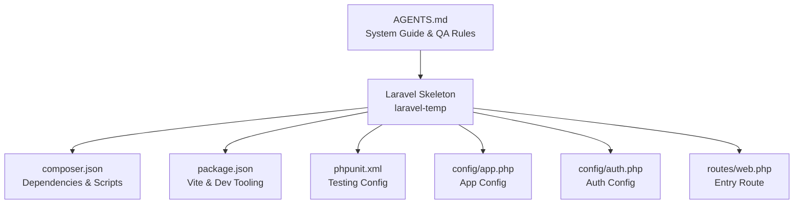
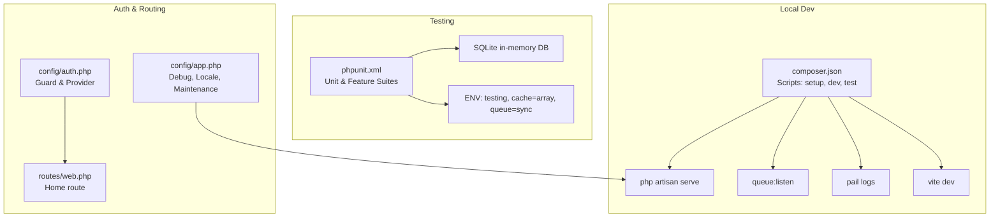
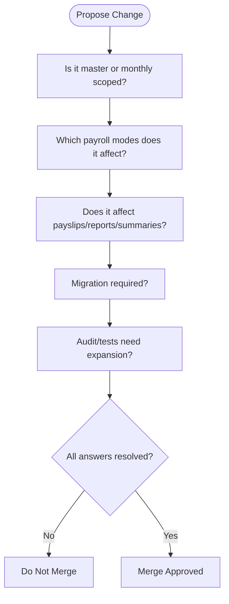
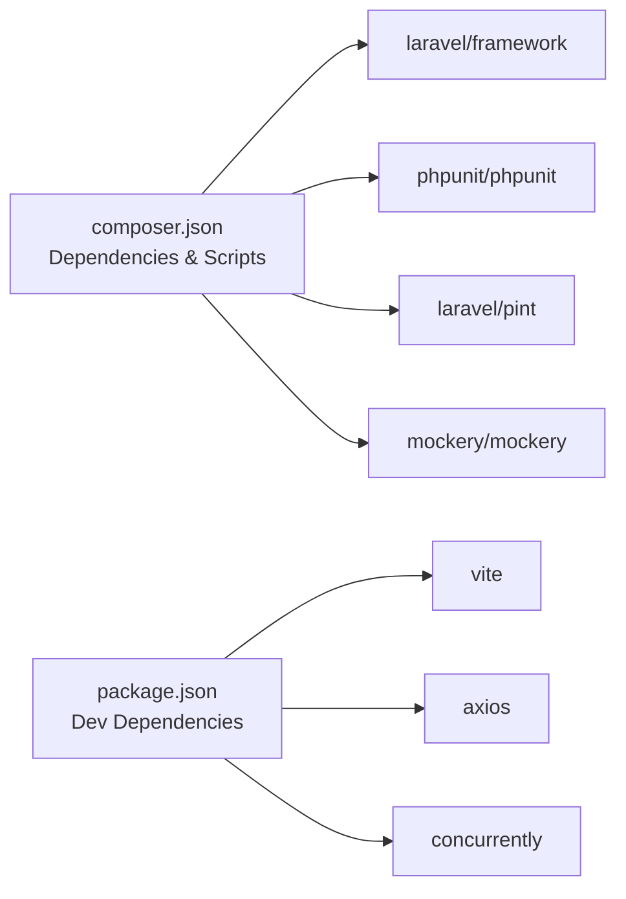

# Quality Assurance

<cite>
**Referenced Files in This Document**
- [AGENTS.md](file://AGENTS.md)
- [composer.json](file://laravel-temp/composer.json)
- [package.json](file://laravel-temp/package.json)
- [phpunit.xml](file://laravel-temp/phpunit.xml)
- [config/app.php](file://laravel-temp/config/app.php)
- [config/auth.php](file://laravel-temp/config/auth.php)
- [routes/web.php](file://laravel-temp/routes/web.php)
</cite>

## Table of Contents
1. [Introduction](#introduction)
2. [Project Structure](#project-structure)
3. [Core Components](#core-components)
4. [Architecture Overview](#architecture-overview)
5. [Detailed Component Analysis](#detailed-component-analysis)
6. [Dependency Analysis](#dependency-analysis)
7. [Performance Considerations](#performance-considerations)
8. [Troubleshooting Guide](#troubleshooting-guide)
9. [Conclusion](#conclusion)
10. [Appendices](#appendices)

## Introduction
This document defines quality assurance procedures for the xHR Payroll & Finance System. It consolidates the project’s change management framework, anti-patterns, technical debt prevention, peer review standards, and continuous improvement practices. It also outlines debugging strategies, performance optimization, and reliability practices aligned with the repository’s development stack and guidelines.

## Project Structure
The repository contains:
- A comprehensive development contract and system guide (AGENTS.md) that prescribes architecture, database, business rules, UI behavior, audit requirements, coding standards, and change management.
- A Laravel skeleton project (laravel-temp) with Composer and NPM scripts, PHPUnit configuration, and basic Laravel configuration files.

**Diagram sources**
- [AGENTS.md](file://AGENTS.md)
- [composer.json](file://laravel-temp/composer.json)
- [package.json](file://laravel-temp/package.json)
- [phpunit.xml](file://laravel-temp/phpunit.xml)
- [config/app.php](file://laravel-temp/config/app.php)
- [config/auth.php](file://laravel-temp/config/auth.php)
- [routes/web.php](file://laravel-temp/routes/web.php)

**Section sources**
- [AGENTS.md](file://AGENTS.md)
- [composer.json](file://laravel-temp/composer.json)
- [package.json](file://laravel-temp/package.json)
- [phpunit.xml](file://laravel-temp/phpunit.xml)
- [config/app.php](file://laravel-temp/config/app.php)
- [config/auth.php](file://laravel-temp/config/auth.php)
- [routes/web.php](file://laravel-temp/routes/web.php)

## Core Components
Quality assurance in this project is driven by:
- Five-question change management framework to evaluate system modifications before merging.
- Anti-patterns catalog to prevent problematic design decisions.
- Peer review standards derived from roles and responsibilities.
- Continuous improvement practices grounded in maintainability, auditability, and rule-driven design.
- Testing and linting tooling integrated via Composer and NPM scripts.

Key artifacts:
- Change management rules and questions.
- Anti-patterns and prohibited practices.
- Coding standards and folder/service guidance.
- Test suite configuration and minimum deliverables.

**Section sources**
- [AGENTS.md](file://AGENTS.md)

## Architecture Overview
Quality assurance spans the entire system lifecycle:
- Development lifecycle: local setup, dev server, queue listener, and Vite asset pipeline.
- Testing lifecycle: unit and feature tests with SQLite memory database and controlled environment variables.
- CI/CD lifecycle: Composer scripts orchestrate setup, dev loop, and test execution.

**Diagram sources**
- [composer.json](file://laravel-temp/composer.json)
- [phpunit.xml](file://laravel-temp/phpunit.xml)
- [config/auth.php](file://laravel-temp/config/auth.php)
- [routes/web.php](file://laravel-temp/routes/web.php)
- [config/app.php](file://laravel-temp/config/app.php)

**Section sources**
- [composer.json](file://laravel-temp/composer.json)
- [phpunit.xml](file://laravel-temp/phpunit.xml)
- [config/auth.php](file://laravel-temp/config/auth.php)
- [routes/web.php](file://laravel-temp/routes/web.php)
- [config/app.php](file://laravel-temp/config/app.php)

## Detailed Component Analysis

### Five-Question Change Management Framework
Before merging any system change, answer these five questions:
1. Is the change scoped to master data or monthly data?
2. Which payroll modes does it impact?
3. Does it affect payslips, reports, or financial summaries?
4. Does it require a schema migration?
5. Should audit coverage or tests be expanded?

If any answer is unresolved, do not merge.

**Diagram sources**
- [AGENTS.md](file://AGENTS.md)

**Section sources**
- [AGENTS.md](file://AGENTS.md)

### Anti-Pattern Detection and Prevention
Anti-patterns explicitly prohibited to avoid technical debt and maintain system integrity:
- Using spreadsheet-style positional references for data relationships.
- Embedding payroll calculations in views.
- Hardcoding values that should be configurable.
- Copying logic across multiple services.
- Using human names as identifiers.
- Treating reports as authoritative sources of truth.
- Computing PDF content during rendering.
- Concealing manual overrides from users.

Detection strategy:
- Review against the anti-patterns list during pull requests.
- Enforce rule-driven design and single-source-of-truth principles.
- Require explicit audit coverage for high-risk changes.

**Section sources**
- [AGENTS.md](file://AGENTS.md)

### Peer Review Standards by Role
Roles and responsibilities define quality gates:
- Architecture Agent: ensures domain boundaries, eliminates cell-thinking, and maintains separation of concerns.
- Database Agent: enforces schema correctness, indexing, data types, and phpMyAdmin compatibility.
- Payroll Rules Agent: validates rule configurability and interdependencies across modes.
- UI/UX Agent: ensures spreadsheet-like usability with instant recalculation and clear state indicators.
- PDF/Payslip Agent: mandates snapshot-based rendering and Thai language support.
- Audit & Compliance Agent: audits critical changes and supports rollback capability.
- Refactor Agent: reduces duplication, improves modularity, and detects code smells.

Review checklist:
- Adheres to design principles and single-source-of-truth.
- Maintains auditability and permission controls.
- Includes tests and audit coverage for high-priority areas.
- Avoids anti-patterns and preserves maintainability.

**Section sources**
- [AGENTS.md](file://AGENTS.md)

### Technical Debt Management
Prevention tactics:
- Prefer service classes for business logic; keep controllers thin.
- Use transactions for critical operations.
- Separate reusable services and avoid god classes.
- Store formulas and rules in configuration tables; avoid hardcoded values.
- Maintain consistent naming and enums-like constants.
- Keep migrations minimal and backward compatible where possible.

Monitoring:
- Track anti-patterns flagged during reviews.
- Measure complexity and duplication via static analysis and peer feedback.
- Schedule refactors for high-risk modules identified by the Refactor Agent.

**Section sources**
- [AGENTS.md](file://AGENTS.md)

### Quality Checkpoints
Checkpoints to enforce at each stage:
- Planning: Apply the five-question framework; define acceptance criteria aligned with Definition of Done.
- Implementation: Follow coding standards; ensure rule-driven design; maintain audit fields.
- Testing: Run unit and feature tests; verify payroll modes, SSO, layer rates, payslip snapshots, and audit logs.
- Review: Validate adherence to roles and responsibilities; confirm no anti-patterns; approve audit/test coverage.
- Release: Confirm Definition of Done; ensure migrations and seed data are included; verify PDF rendering and annual/company summaries.

**Section sources**
- [AGENTS.md](file://AGENTS.md)

### Continuous Improvement Practices
- Maintainability-first design: modular services, clear boundaries, and extensibility for new payroll modes and rules.
- Audit-first mindset: log who changed what, when, and why; support history and rollback.
- Rule-driven evolution: externalize configurations; avoid hardcoded thresholds and rates.
- Incremental delivery: meet minimum deliverables; iterate based on feedback.

**Section sources**
- [AGENTS.md](file://AGENTS.md)

### Debugging Strategies
Recommended practices:
- Use the Laravel dev server and queue listener for local debugging.
- Tail logs with the integrated log tailing script.
- Leverage PHPUnit with SQLite in-memory database for deterministic tests.
- Enable application debug mode locally to surface errors during development.
- Utilize browser dev tools and network inspection for UI/UX issues.

Operational tips:
- Configure environment variables for testing to isolate state.
- Use maintenance mode configuration for controlled deployments.
- Keep timezone and locale settings consistent across environments.

**Section sources**
- [composer.json](file://laravel-temp/composer.json)
- [phpunit.xml](file://laravel-temp/phpunit.xml)
- [config/app.php](file://laravel-temp/config/app.php)

### Performance Optimization
Guidelines:
- Favor rule-driven computation over embedded logic in views or controllers.
- Use efficient database queries; leverage migrations for proper indexing and data types.
- Minimize heavy client-side computations; precompute where appropriate.
- Optimize PDF generation by relying on snapshot data and server-side rendering.

Tooling:
- Composer scripts automate setup and dev loops.
- Vite handles asset bundling and hot reload for responsive UI iteration.

**Section sources**
- [AGENTS.md](file://AGENTS.md)
- [composer.json](file://laravel-temp/composer.json)
- [package.json](file://laravel-temp/package.json)

### System Reliability Practices
- Authentication and authorization: configure guards and providers appropriately; protect sensitive endpoints.
- Routing: keep entry routes minimal; delegate logic to controllers/services.
- Environment isolation: testing vs production via environment variables and database selection.
- Maintenance mode: use supported drivers to control deployments.

**Section sources**
- [config/auth.php](file://laravel-temp/config/auth.php)
- [routes/web.php](file://laravel-temp/routes/web.php)
- [config/app.php](file://laravel-temp/config/app.php)

## Dependency Analysis
The Laravel skeleton integrates development and testing dependencies via Composer and NPM. Composer scripts coordinate local development, while PHPUnit configuration defines test suites and environment variables for reliable test runs.

**Diagram sources**
- [composer.json](file://laravel-temp/composer.json)
- [package.json](file://laravel-temp/package.json)

**Section sources**
- [composer.json](file://laravel-temp/composer.json)
- [package.json](file://laravel-temp/package.json)

## Performance Considerations
- Keep business logic in services and avoid heavy logic in views or controllers.
- Use transactions for atomic operations; minimize round trips to the database.
- Prefer configuration-driven rules over hardcoded values to reduce recompiles and redeployments.
- Optimize UI interactions with instant recalculation and clear state indicators to reduce user errors and rework.

[No sources needed since this section provides general guidance]

## Troubleshooting Guide
Common issues and remedies:
- Tests failing due to environment mismatch: verify PHPUnit environment variables and database configuration.
- Dev server not reflecting changes: ensure Vite dev server is running and assets are rebuilt.
- Authentication issues: confirm guard/provider configuration and user model binding.
- Logs not visible: use the integrated log tailing script and verify log settings.

**Section sources**
- [phpunit.xml](file://laravel-temp/phpunit.xml)
- [composer.json](file://laravel-temp/composer.json)
- [config/auth.php](file://laravel-temp/config/auth.php)

## Conclusion
Quality assurance for the xHR Payroll & Finance System is anchored in a five-question change management framework, strict anti-pattern avoidance, role-based peer review, and continuous improvement practices. Combined with robust testing, debugging, and reliability strategies, these procedures ensure maintainability, auditability, and system integrity across payroll modes and evolving business rules.

[No sources needed since this section summarizes without analyzing specific files]

## Appendices
- Minimum deliverables and Definition of Done align with the system’s core modules and audit/logging requirements.

**Section sources**
- [AGENTS.md](file://AGENTS.md)