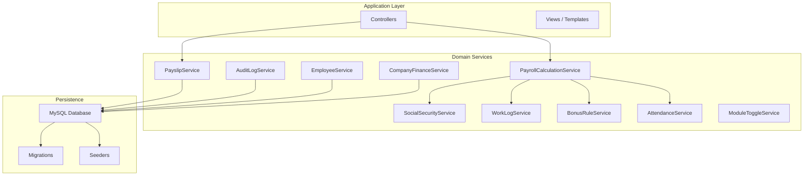
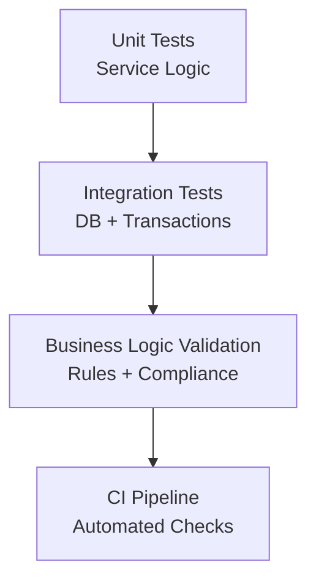
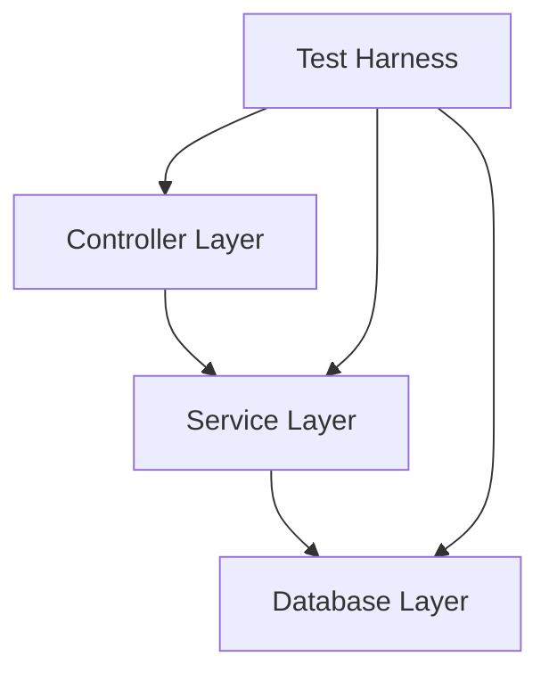

# Testing Strategy

<cite>
**Referenced Files in This Document**
- [AGENTS.md](file://AGENTS.md)
</cite>

## Table of Contents
1. [Introduction](#introduction)
2. [Project Structure](#project-structure)
3. [Core Components](#core-components)
4. [Architecture Overview](#architecture-overview)
5. [Detailed Component Analysis](#detailed-component-analysis)
6. [Dependency Analysis](#dependency-analysis)
7. [Performance Considerations](#performance-considerations)
8. [Troubleshooting Guide](#troubleshooting-guide)
9. [Conclusion](#conclusion)
10. [Appendices](#appendices)

## Introduction
This document defines a comprehensive testing strategy for the xHR Payroll & Finance System. It covers unit testing, integration testing, and business logic validation approaches aligned with the system’s domain model and documented requirements. It also specifies minimum test requirements for payroll mode calculations, SSO calculations, layer rate computations, payslip snapshot functionality, and audit logging. The strategy outlines testing methodologies for services, controllers, and database operations, test case organization, mocking strategies, continuous integration practices, and quality assurance procedures.

## Project Structure
The repository currently contains a requirements and design guide that defines the system’s domain model, modules, database guidelines, and testing minimums. The guide indicates a Laravel-oriented structure with suggested folders and service classes. The testing strategy leverages this structure to organize unit and integration tests effectively.

**Diagram sources**
- [AGENTS.md:622-647](file://AGENTS.md#L622-L647)
- [AGENTS.md:385-435](file://AGENTS.md#L385-L435)

**Section sources**
- [AGENTS.md:622-647](file://AGENTS.md#L622-L647)
- [AGENTS.md:385-435](file://AGENTS.md#L385-L435)

## Core Components
The testing strategy targets the following core components and capabilities:
- Payroll mode calculation tests
- SSO calculation tests
- Layer rate tests
- Payslip snapshot tests
- Audit logging tests

These components align with the system’s modules and business rules, ensuring correctness across payroll modes, benefit calculations, and compliance logging.

**Section sources**
- [AGENTS.md:612-619](file://AGENTS.md#L612-L619)
- [AGENTS.md:438-506](file://AGENTS.md#L438-L506)
- [AGENTS.md:576-595](file://AGENTS.md#L576-L595)

## Architecture Overview
The testing architecture emphasizes layered isolation and deterministic behavior:
- Unit tests validate service logic and pure functions.
- Integration tests validate database operations, transactions, and cross-service interactions.
- Business logic validation ensures adherence to domain rules and audit requirements.

[No sources needed since this diagram shows conceptual workflow, not actual code structure]

## Detailed Component Analysis

### Payroll Mode Calculations
Focus areas:
- Monthly staff: income aggregation, deductions, net pay computation.
- Freelance layer: duration conversion and rate application.
- Freelance fixed: quantity and fixed rate multiplication.
- Youtuber salary and settlement: module-specific totals and expense adjustments.
- Hybrid overrides: precedence of manual vs. rule-generated values.

Testing methodology:
- Unit tests for each payroll mode service with varied inputs (OT, allowances, deductions).
- Integration tests to verify batch creation and item persistence.
- Edge-case validations for thresholds, caps, and rounding.

Mocking strategies:
- Mock external services (SSO, bonus rules) behind interfaces.
- Use in-memory database for isolated transactions.

Quality assurance:
- Cross-check totals against manual calculations.
- Validate state transitions (draft → finalized) and audit trail entries.

**Section sources**
- [AGENTS.md:440-487](file://AGENTS.md#L440-L487)
- [AGENTS.md:636-646](file://AGENTS.md#L636-L646)

### SSO Calculations
Focus areas:
- Configurable rates, ceilings, and monthly contributions.
- Effective date handling and rule updates.

Testing methodology:
- Parameterized tests for different effective dates and configurations.
- Boundary tests around salary ceiling and maximum contribution.

Mocking strategies:
- Stub rule retrieval from configuration tables.
- Simulate rule changes without altering production data.

Quality assurance:
- Compare computed contributions with expected values from rule sets.
- Verify audit logs for SSO config changes.

**Section sources**
- [AGENTS.md:488-497](file://AGENTS.md#L488-L497)
- [AGENTS.md:588-594](file://AGENTS.md#L588-L594)

### Layer Rate Computations
Focus areas:
- Duration normalization (minutes + seconds).
- Amount calculation using rate per minute.

Testing methodology:
- Unit tests for conversion and multiplication logic.
- Integration tests for work log persistence and derived amounts.

Mocking strategies:
- Mock rate rule lookups.
- Isolate time conversions from real-time dependencies.

Quality assurance:
- Validate precision and rounding policies.
- Confirm snapshot consistency after finalize.

**Section sources**
- [AGENTS.md:472-479](file://AGENTS.md#L472-L479)
- [AGENTS.md:344-352](file://AGENTS.md#L344-L352)

### Payslip Snapshot Functionality
Focus areas:
- Snapshot creation upon finalize.
- Rendering metadata storage and PDF generation from snapshot.

Testing methodology:
- Unit tests for snapshot cloning and totals computation.
- Integration tests for snapshot persistence and PDF generation pipeline.
- Regression tests to prevent accidental mutation of finalized items.

Mocking strategies:
- Mock PDF engine to assert invocation and metadata.
- Use transactional fixtures to simulate finalize workflows.

Quality assurance:
- Enforce immutable snapshot reads post-finalize.
- Validate audit trail for finalize/unfinalize actions.

**Section sources**
- [AGENTS.md:567-573](file://AGENTS.md#L567-L573)
- [AGENTS.md:576-595](file://AGENTS.md#L576-L595)

### Audit Logging
Focus areas:
- Who, what, where, old/new values, action, timestamp, reason.
- High-priority audit areas: salary profile, payroll item amount, payslip finalize/unfinalize, rule/module/SO changes.

Testing methodology:
- Unit tests for audit event construction and enrichment.
- Integration tests for audit log persistence and retrieval.
- Compliance checks for required fields and high-priority events.

Mocking strategies:
- Stub identity/context provider.
- Capture audit events without writing to production logs.

Quality assurance:
- Enforce mandatory fields and action categorization.
- Periodic audits of audit coverage for new features.

**Section sources**
- [AGENTS.md:578-595](file://AGENTS.md#L578-L595)

### Controllers
Focus areas:
- Request validation via FormRequest or service-level validators.
- Delegation to services and transactional boundary enforcement.
- Response composition and error handling.

Testing methodology:
- Unit tests for controller logic and response shaping.
- Integration tests for request flows and middleware effects.
- Security tests for permissions and role-based access.

Mocking strategies:
- Mock service calls to isolate controller behavior.
- Use test database snapshots for repeatable scenarios.

Quality assurance:
- Validate HTTP status codes and response shapes.
- Ensure no business logic leaks into controllers.

**Section sources**
- [AGENTS.md:600-606](file://AGENTS.md#L600-L606)

### Database Operations
Focus areas:
- Transactions for critical operations.
- Indexes, foreign keys, and data types for performance and integrity.
- Migrations and seeders for schema and baseline data.

Testing methodology:
- Transaction tests to verify rollback and commit semantics.
- Schema tests to validate constraints and relationships.
- Load tests for bulk operations and concurrency.

Mocking strategies:
- Use test containers or in-memory databases for isolation.
- Apply migrations per-test or per-suite with cleanup.

Quality assurance:
- Enforce referential integrity and data type constraints.
- Monitor slow queries and missing indexes.

**Section sources**
- [AGENTS.md:385-435](file://AGENTS.md#L385-L435)
- [AGENTS.md:622-647](file://AGENTS.md#L622-L647)

## Dependency Analysis
Testing dependencies emphasize service isolation and deterministic environments:
- Services depend on repositories/models and configuration rules.
- Controllers depend on services and validation layers.
- Tests depend on mocks, test databases, and assertion libraries.

[No sources needed since this diagram shows conceptual workflow, not actual code structure]

## Performance Considerations
- Prefer unit tests for hot-path logic to minimize overhead.
- Use transactional fixtures and test containers to reduce setup costs.
- Profile integration tests to detect regressions in critical workflows.
- Limit heavy PDF generation in unit tests; mock engines and assert invocation.

[No sources needed since this section provides general guidance]

## Troubleshooting Guide
Common issues and resolutions:
- Flaky tests due to time-sensitive logic: inject time via interfaces or use frozen time mocks.
- Non-deterministic DB order: sort assertions or use deterministic identifiers.
- Missing audit logs: verify audit triggers and ensure tests capture events.
- Transaction failures: wrap tests in transactions and assert rollback behavior.

**Section sources**
- [AGENTS.md:578-595](file://AGENTS.md#L578-L595)

## Conclusion
This testing strategy ensures correctness, reliability, and compliance for the xHR Payroll & Finance System. By focusing on service-level unit tests, robust integration tests, and strict business logic validation, the system maintains accuracy across payroll modes, SSO calculations, layer rates, payslip snapshots, and audit logging. The outlined practices promote maintainability, continuous delivery, and strong quality assurance.

[No sources needed since this section summarizes without analyzing specific files]

## Appendices

### Test Case Organization
- Group by feature area (payroll modes, SSO, layer rates, payslip, audit).
- Separate unit and integration suites.
- Use descriptive test names that reflect preconditions, actions, and expected outcomes.

[No sources needed since this section provides general guidance]

### Continuous Integration Practices
- Run unit tests on every commit.
- Run integration tests on pull requests targeting main.
- Enforce minimum coverage thresholds per module.
- Gate merges on passing tests and audit coverage checks.

[No sources needed since this section provides general guidance]