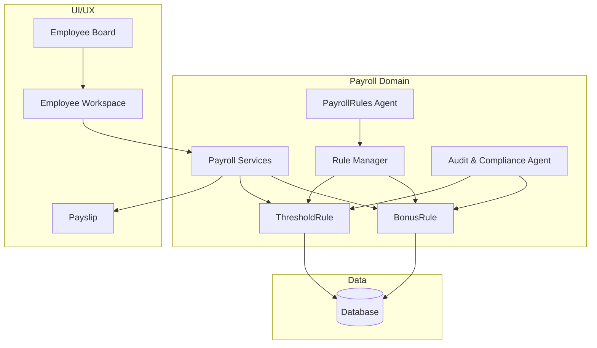
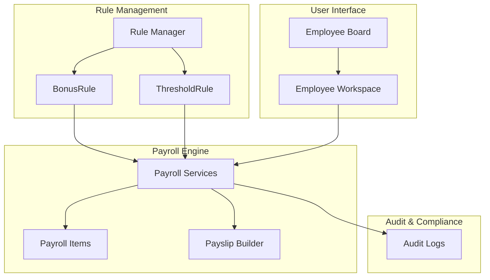
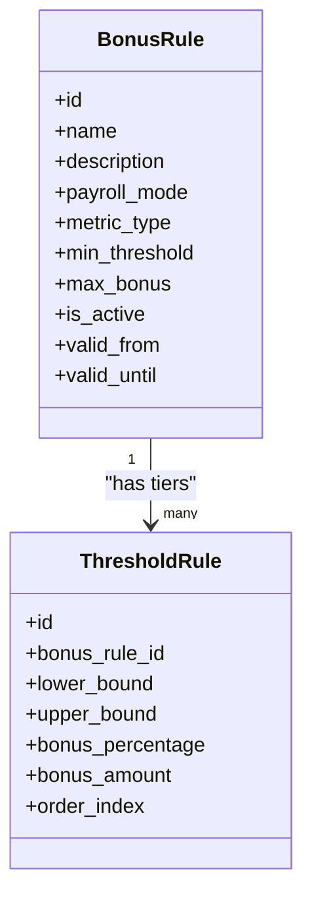
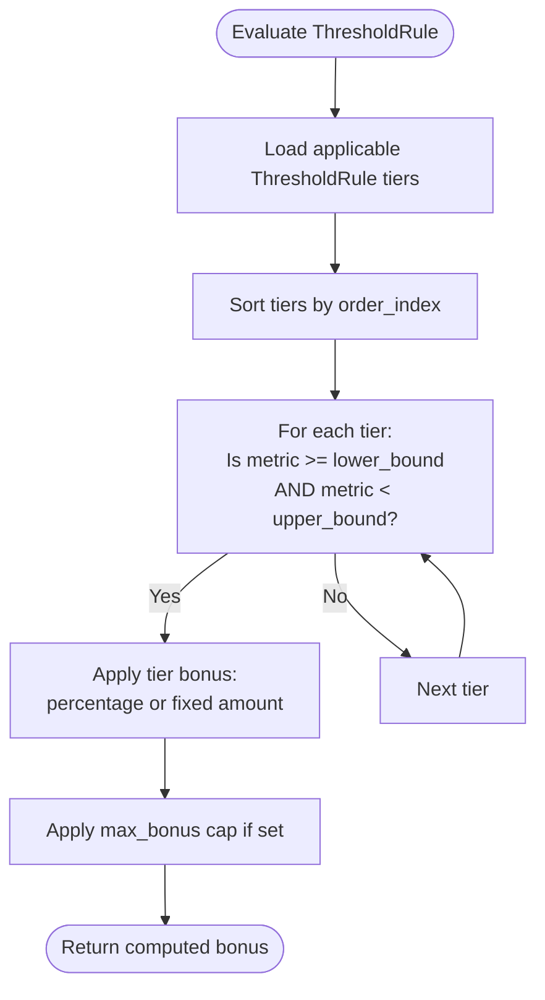
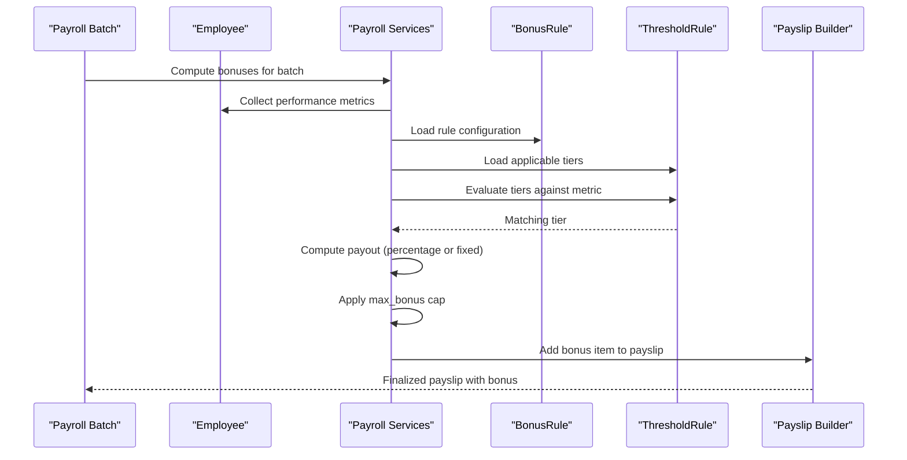
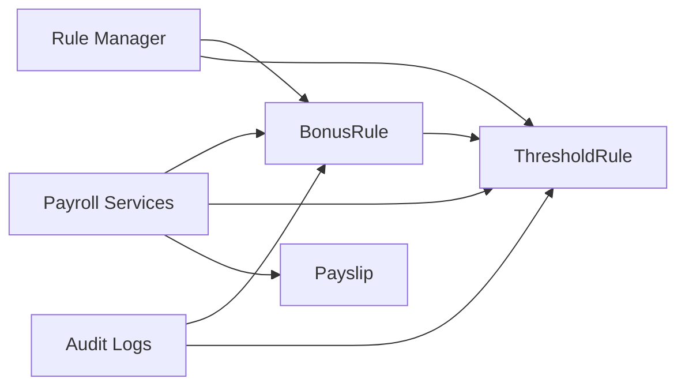

# Bonus Rules

<cite>
**Referenced Files in This Document**
- [AGENTS.md](file://AGENTS.md)
- [User.php](file://app/Models/User.php)
- [AppServiceProvider.php](file://app/Providers/AppServiceProvider.php)
- [0001_01_01_000000_create_users_table.php](file://database/migrations/0001_01_01_000000_create_users_table.php)
- [0001_01_01_01_000001_create_cache_table.php](file://database/migrations/0001_01_01_000001_create_cache_table.php)
</cite>

## Table of Contents
1. [Introduction](#introduction)
2. [Project Structure](#project-structure)
3. [Core Components](#core-components)
4. [Architecture Overview](#architecture-overview)
5. [Detailed Component Analysis](#detailed-component-analysis)
6. [Dependency Analysis](#dependency-analysis)
7. [Performance Considerations](#performance-considerations)
8. [Troubleshooting Guide](#troubleshooting-guide)
9. [Conclusion](#conclusion)
10. [Appendices](#appendices)

## Introduction
This document explains the BonusRule entity and ThresholdRule configuration system for performance-based bonuses. It covers how threshold-based rules are defined, validated, and evaluated to compute bonus payouts. It also documents the relationship between performance metrics and bonus outcomes, including minimum thresholds, tiered structures, and maximum bonus limits. The guide includes common scenarios such as sales targets, productivity thresholds, and performance ratings, along with rule validation, precedence, and audit trail implications for bonus modifications. Finally, it outlines how bonus calculations integrate with payroll processing.

## Project Structure
The repository defines the conceptual structure and responsibilities for payroll and bonus systems. The following diagram maps the conceptual layout of the payroll domain, highlighting entities and modules that underpin the bonus system.

**Diagram sources**
- [AGENTS.md](file://AGENTS.md)

**Section sources**
- [AGENTS.md](file://AGENTS.md)

## Core Components
- BonusRule: Defines the configuration for performance-based bonuses, including applicable payroll modes, target metrics, and payout computation parameters. It encapsulates rule metadata such as validity periods, statuses, and linkage to threshold tiers.
- ThresholdRule: Defines the performance thresholds and corresponding bonus percentages or amounts. It supports minimum thresholds, tiered structures, and maximum bonus caps.

These components are part of the payroll configuration domain and are intended to be managed via the Rule Manager module. They are designed to be dynamic and configurable, enabling rule-driven computation rather than hardcoded logic.

**Section sources**
- [AGENTS.md](file://AGENTS.md)

## Architecture Overview
The bonus system operates within a rule-driven payroll engine. The conceptual architecture below illustrates how BonusRule and ThresholdRule integrate with payroll services and UI modules.

**Diagram sources**
- [AGENTS.md](file://AGENTS.md)

## Detailed Component Analysis

### BonusRule Entity
- Purpose: Encapsulates the configuration for performance-based bonuses, including target metrics, applicable payroll modes, validity windows, and rule status.
- Inputs: Performance metric values (e.g., sales, productivity, rating), payroll batch context, and employee profile.
- Outputs: Computed bonus amount per employee for the batch.
- Validation: Must validate interdependencies with ThresholdRule and payroll mode compatibility.

**Diagram sources**
- [AGENTS.md](file://AGENTS.md)

**Section sources**
- [AGENTS.md](file://AGENTS.md)

### ThresholdRule Configuration
- Purpose: Defines performance thresholds and corresponding bonus tiers.
- Structure:
  - Lower and upper bounds for each tier.
  - Bonus percentage or fixed amount per tier.
  - Ordering index to establish precedence.
- Evaluation: Tiers are evaluated in order; the first matching tier applies.

**Diagram sources**
- [AGENTS.md](file://AGENTS.md)

**Section sources**
- [AGENTS.md](file://AGENTS.md)

### Evaluation Logic and Calculation Algorithms
- Metric Aggregation: Aggregate performance metrics per employee and payroll batch.
- Tier Matching: Match the aggregated metric against ThresholdRule tiers.
- Payout Computation:
  - Percentage-based: metric_value × (tier.bonus_percentage / 100).
  - Fixed-amount: tier.bonus_amount.
- Cap Application: If a maximum bonus is defined at the BonusRule level, cap the computed amount accordingly.
- Finalization: Include the bonus as a payroll item in the payslip.

**Diagram sources**
- [AGENTS.md](file://AGENTS.md)

**Section sources**
- [AGENTS.md](file://AGENTS.md)

### Common Bonus Scenarios
- Sales Targets:
  - Metric: Total sales amount for the period.
  - Tiers: Thresholds for minimum sales with percentage or fixed bonus increments.
  - Cap: Maximum bonus per period.
- Productivity Thresholds:
  - Metric: Units produced or tasks completed.
  - Tiers: Minimum thresholds with tiered percentage bonuses.
  - Cap: Upper limit to prevent excessive payouts.
- Performance Ratings:
  - Metric: Average rating score.
  - Tiers: Thresholds for rating bands with fixed bonus amounts per band.

**Section sources**
- [AGENTS.md](file://AGENTS.md)

### Rule Validation and Interdependencies
- Interdependency Validation:
  - ThresholdRule tiers must be mutually exclusive and collectively exhaustive within the rule’s scope.
  - Order index determines precedence; gaps or duplicates must be prevented.
- Boundary Checks:
  - Lower and upper bounds must be consistent across tiers.
  - Minimum thresholds must align with the rule’s intent.
- Payroll Mode Compatibility:
  - BonusRule must specify applicable payroll modes; mismatch should be flagged during validation.
- Audit Trail Implications:
  - Changes to BonusRule or ThresholdRule must be logged with who, what, when, old/new values, and reason.

**Section sources**
- [AGENTS.md](file://AGENTS.md)

### Integration with Payroll Processing
- Data Flow:
  - Metrics collected per employee and batch.
  - BonusRule and ThresholdRule evaluated to compute payouts.
  - Payouts recorded as payroll items and included in payslips.
- UI Integration:
  - Employee Workspace displays rule-applied values with source badges and audit history.
  - Rule Manager allows editing and validation of rules.
- Compliance:
  - Audit logs capture all rule changes and their effects on payroll items.

**Section sources**
- [AGENTS.md](file://AGENTS.md)

## Dependency Analysis
The following diagram shows conceptual dependencies among components involved in bonus rule management and evaluation.

**Diagram sources**
- [AGENTS.md](file://AGENTS.md)

**Section sources**
- [AGENTS.md](file://AGENTS.md)

## Performance Considerations
- Efficient Tier Evaluation:
  - Sort and index ThresholdRule tiers by order_index for fast lookup.
  - Use boundary checks to short-circuit evaluation after the first match.
- Caching:
  - Cache active BonusRule and ThresholdRule configurations per payroll mode to reduce repeated loads.
- Batch Processing:
  - Evaluate bonuses in batches aligned with payroll runs to minimize redundant computations.
- Data Types:
  - Use appropriate numeric types for thresholds and bonuses to avoid precision loss.

[No sources needed since this section provides general guidance]

## Troubleshooting Guide
- Symptom: No bonus applied despite meeting targets.
  - Verify ThresholdRule tiers and order_index.
  - Confirm BonusRule validity window and payroll mode compatibility.
  - Check for max_bonus cap preventing payout.
- Symptom: Incorrect bonus amount.
  - Review tier bounds and bonus computation method (percentage vs fixed).
  - Validate metric aggregation and unit consistency.
- Symptom: Rule changes not reflected.
  - Confirm audit logs and ensure rule activation status.
  - Re-run payroll batch to re-evaluate rules.

**Section sources**
- [AGENTS.md](file://AGENTS.md)

## Conclusion
The BonusRule and ThresholdRule system provides a flexible, rule-driven framework for configuring performance-based bonuses. By defining clear thresholds, tiers, and caps, organizations can tailor bonus structures to various performance metrics while maintaining auditability and compliance. Proper validation, precedence, and integration with payroll processing ensure accurate and transparent bonus calculations.

[No sources needed since this section summarizes without analyzing specific files]

## Appendices

### Appendix A: Database Schema Concepts
- Tables:
  - bonus_rules: Stores BonusRule configurations.
  - threshold_rules: Stores ThresholdRule tiers linked to BonusRule.
- Fields:
  - Numeric types for amounts and percentages; timestamps for auditability.
  - Status flags and validity windows to manage lifecycle.
- Relationships:
  - One-to-many between BonusRule and ThresholdRule.

**Section sources**
- [AGENTS.md](file://AGENTS.md)

### Appendix B: Example Workflows
- Sales Target Workflow:
  - Define BonusRule with metric_type sales.
  - Create ThresholdRule tiers with lower_bounds and bonus_percentages.
  - Run payroll batch; verify payslip items reflect computed bonuses.
- Productivity Threshold Workflow:
  - Define BonusRule with metric_type units.
  - Configure tiers with fixed bonus_amounts.
  - Apply max_bonus cap; review audit logs for changes.

**Section sources**
- [AGENTS.md](file://AGENTS.md)