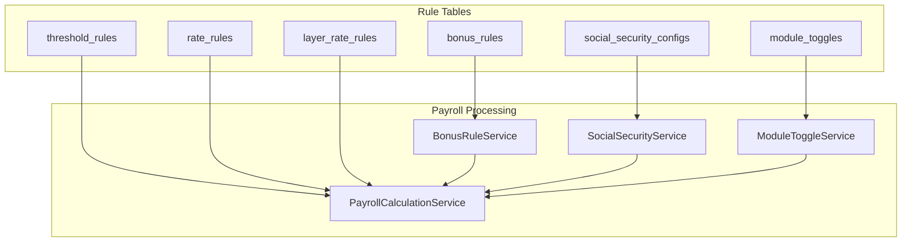
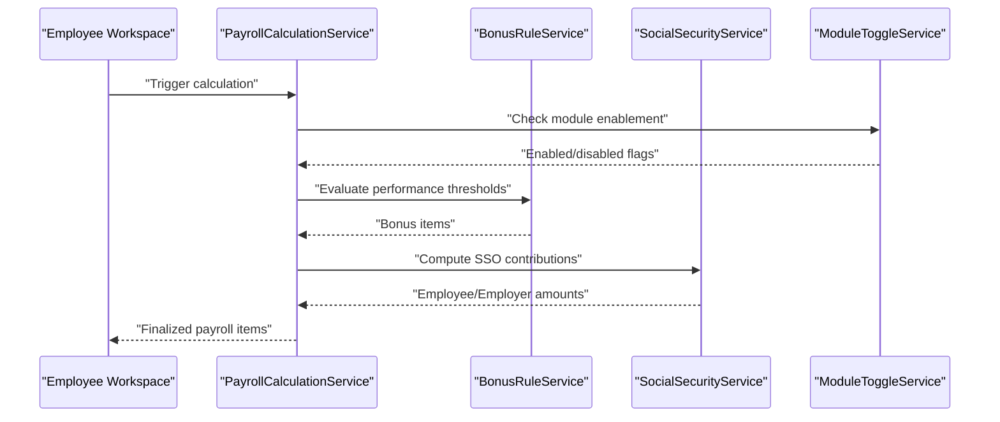
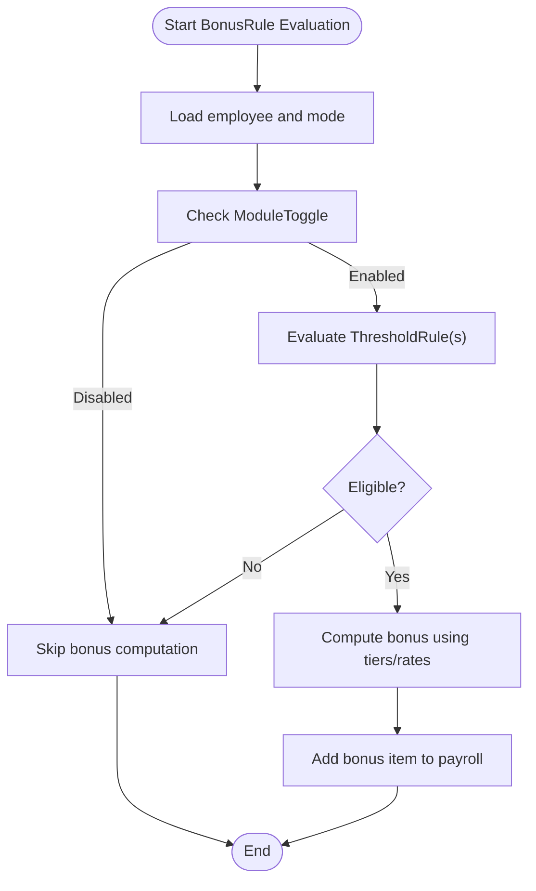
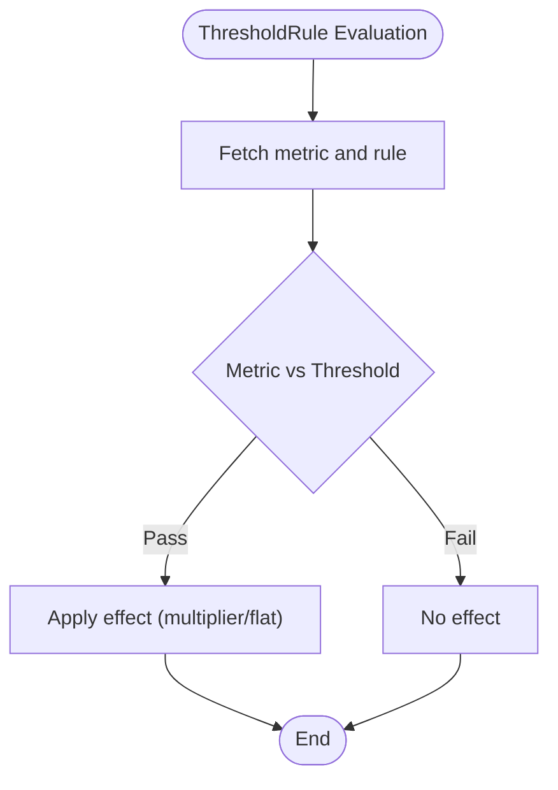
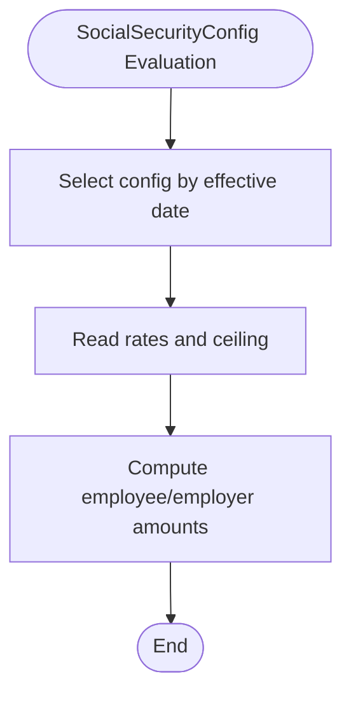
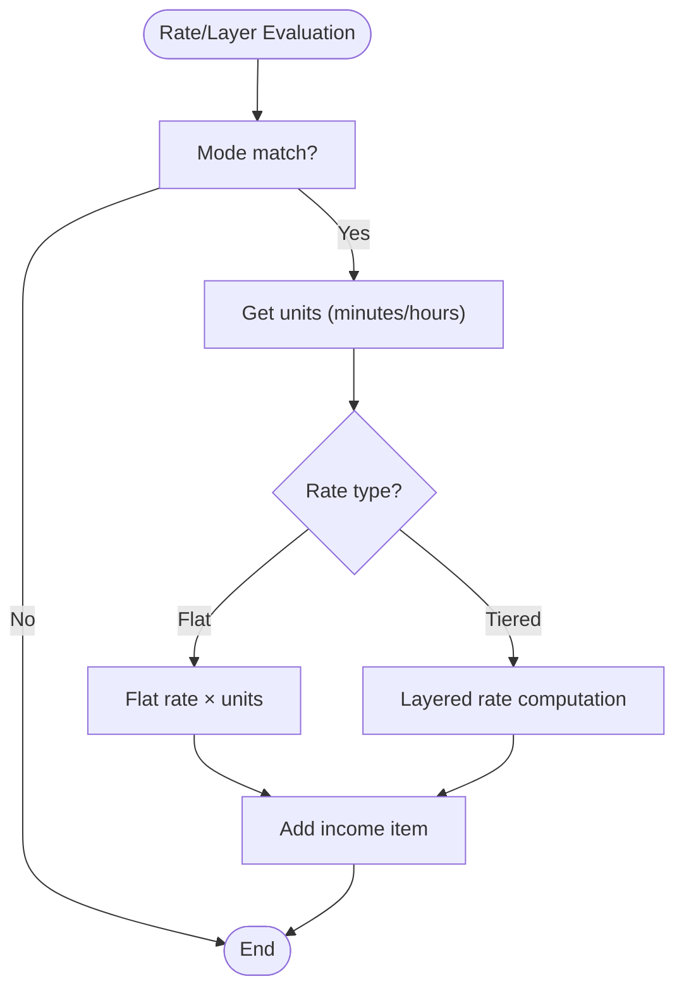
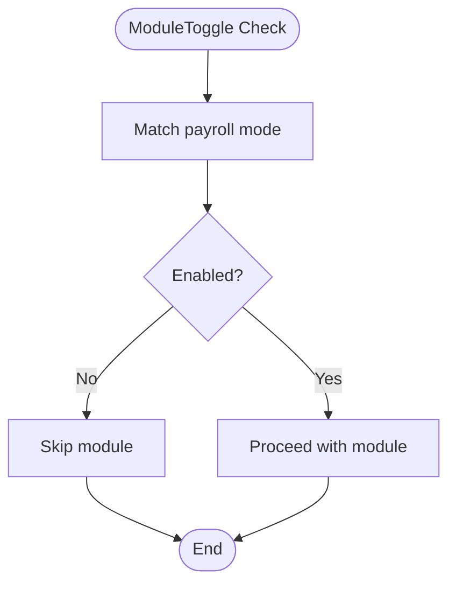
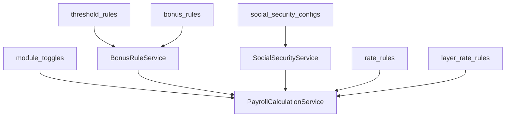

# Business Rule Entities

<cite>
**Referenced Files in This Document**
- [AGENTS.md](file://AGENTS.md)
</cite>

## Table of Contents
1. [Introduction](#introduction)
2. [Project Structure](#project-structure)
3. [Core Components](#core-components)
4. [Architecture Overview](#architecture-overview)
5. [Detailed Component Analysis](#detailed-component-analysis)
6. [Dependency Analysis](#dependency-analysis)
7. [Performance Considerations](#performance-considerations)
8. [Troubleshooting Guide](#troubleshooting-guide)
9. [Conclusion](#conclusion)
10. [Appendices](#appendices)

## Introduction
This document explains the business rule entities that underpin the rule-driven payroll architecture: BonusRule, ThresholdRule, SocialSecurityConfig, RateRules, LayerRateRules, and ModuleToggle. These entities store configurable business logic separately from code so that payroll calculations remain dynamic, auditable, and easy to evolve. The document covers how rule evaluation works, how rules depend on and cascade through payroll processing, practical configuration scenarios, validation and audit requirements, and the impact on final payroll outcomes.

## Project Structure
The repository provides a comprehensive specification for the payroll system, including the rule-driven design principles, database schema suggestions, and the roles of rule-related tables. The rule entities are defined conceptually in the documentation and are intended to be persisted in dedicated tables.

**Diagram sources**
- [AGENTS.md:387-416](file://AGENTS.md#L387-L416)
- [AGENTS.md:636-646](file://AGENTS.md#L636-L646)

**Section sources**
- [AGENTS.md:23-511](file://AGENTS.md#L23-L511)
- [AGENTS.md:387-416](file://AGENTS.md#L387-L416)
- [AGENTS.md:636-646](file://AGENTS.md#L636-L646)

## Core Components
This section introduces each rule entity and its role in the rule-driven architecture.

- BonusRule
  - Purpose: Defines performance or achievement-based bonus formulas and thresholds.
  - Typical fields: Eligibility criteria, target metrics, bonus tiers, effective date range.
  - Impact: Adds variable income items during payroll calculation based on evaluated thresholds and targets.

- ThresholdRule
  - Purpose: Encapsulates conditions that trigger adjustments or bonuses.
  - Typical fields: Metric name, operator, threshold value, effect (e.g., multiplier, flat amount).
  - Impact: Drives conditional income or deduction adjustments depending on whether thresholds are met.

- SocialSecurityConfig
  - Purpose: Stores Thailand-style social security parameters and effective date ranges.
  - Typical fields: Employee/Employer rates, salary ceiling, max monthly contribution, effective_from.
  - Impact: Computes mandatory contributions and ensures compliance with regulatory changes over time.

- RateRules
  - Purpose: Provides rate configurations for different modes (e.g., OT, diligence allowance).
  - Typical fields: Mode identifier, rate type, unit (minute/hour), minimum threshold, enable flag.
  - Impact: Supplies rates used to compute earnings or penalties during payroll.

- LayerRateRules
  - Purpose: Supports tiered or layered rate computation (e.g., freelance billing).
  - Typical fields: Layer boundaries, rates per tier, aggregation method, currency scale.
  - Impact: Enables progressive or stepped computations for billing or allowances.

- ModuleToggle
  - Purpose: Controls feature availability per payroll mode or globally.
  - Typical fields: Module name, enabled modes, effective date, override flag.
  - Impact: Enables/disables specific calculation modules (e.g., OT, SSO, threshold rules) without code changes.

**Section sources**
- [AGENTS.md:61-74](file://AGENTS.md#L61-L74)
- [AGENTS.md:403-416](file://AGENTS.md#L403-L416)
- [AGENTS.md:438-505](file://AGENTS.md#L438-L505)
- [AGENTS.md:636-646](file://AGENTS.md#L636-L646)

## Architecture Overview
The rule-driven architecture separates business logic from code by persisting rules in dedicated tables. Services evaluate these rules against runtime data to produce payroll items. Module toggles gate features, while thresholds and bonuses adjust income or deductions dynamically.

**Diagram sources**
- [AGENTS.md:636-646](file://AGENTS.md#L636-L646)
- [AGENTS.md:343-353](file://AGENTS.md#L343-L353)

## Detailed Component Analysis

### BonusRule
- Evaluation mechanism:
  - Match employee profile and payroll mode.
  - Apply threshold checks and performance metrics.
  - Compute bonus amount using applicable tiers or multipliers.
- Dependencies:
  - Often depends on ThresholdRule for qualifying metrics.
  - Influenced by ModuleToggle to enable/disable bonus computation.
- Outcome:
  - Produces additional income items reflected in the payslip.

**Diagram sources**
- [AGENTS.md:636-646](file://AGENTS.md#L636-L646)
- [AGENTS.md:438-505](file://AGENTS.md#L438-L505)

**Section sources**
- [AGENTS.md:61-74](file://AGENTS.md#L61-L74)
- [AGENTS.md:438-505](file://AGENTS.md#L438-L505)

### ThresholdRule
- Evaluation mechanism:
  - Compare metric against threshold with operator.
  - Determine effect (e.g., multiplier or flat adjustment).
- Dependencies:
  - Used by BonusRule and potentially other income/deduction calculators.
  - Affected by effective date ranges stored in related configs.
- Outcome:
  - Adjusts income or deduction amounts based on threshold crossing.

**Diagram sources**
- [AGENTS.md:438-505](file://AGENTS.md#L438-L505)

**Section sources**
- [AGENTS.md:438-505](file://AGENTS.md#L438-L505)

### SocialSecurityConfig
- Evaluation mechanism:
  - Select config by effective_from <= payroll month.
  - Compute employee and employer portions using ceiling and rates.
- Dependencies:
  - Influences SocialSecurityService outputs.
  - Impacted by ModuleToggle for SSO enablement.
- Outcome:
  - Generates mandatory deduction and employer contribution items.

**Diagram sources**
- [AGENTS.md:488-497](file://AGENTS.md#L488-L497)

**Section sources**
- [AGENTS.md:488-497](file://AGENTS.md#L488-L497)

### RateRules and LayerRateRules
- Evaluation mechanism:
  - RateRules: Apply per-unit rates for modes like OT or allowances.
  - LayerRateRules: Apply stepped rates across defined layers.
- Dependencies:
  - Used by PayrollCalculationService for income computation.
  - Can be gated by ModuleToggle.
- Outcome:
  - Produces computed amounts for income items based on units and tiers.

**Diagram sources**
- [AGENTS.md:472-480](file://AGENTS.md#L472-L480)
- [AGENTS.md:438-505](file://AGENTS.md#L438-L505)

**Section sources**
- [AGENTS.md:472-480](file://AGENTS.md#L472-L480)
- [AGENTS.md:438-505](file://AGENTS.md#L438-L505)

### ModuleToggle
- Evaluation mechanism:
  - Gate feature availability by payroll mode and effective date.
  - Allow global or per-mode overrides.
- Dependencies:
  - Consumed by PayrollCalculationService to decide whether to run specific calculators.
- Outcome:
  - Enables/disables computation paths (e.g., OT, SSO, threshold rules) without code changes.

**Diagram sources**
- [AGENTS.md:636-646](file://AGENTS.md#L636-L646)

**Section sources**
- [AGENTS.md:636-646](file://AGENTS.md#L636-L646)

## Dependency Analysis
The rule entities interact through services and module toggles. ModuleToggle acts as a gatekeeper, while ThresholdRule and BonusRule collaborate to produce bonus items. SocialSecurityConfig integrates with SocialSecurityService. RateRules and LayerRateRules feed PayrollCalculationService with computed amounts.

**Diagram sources**
- [AGENTS.md:387-416](file://AGENTS.md#L387-L416)
- [AGENTS.md:636-646](file://AGENTS.md#L636-L646)

**Section sources**
- [AGENTS.md:387-416](file://AGENTS.md#L387-L416)
- [AGENTS.md:636-646](file://AGENTS.md#L636-L646)

## Performance Considerations
- Rule caching: Cache effective rule sets per employee and payroll month to avoid repeated lookups.
- Batch evaluation: Group rule evaluations to minimize database round-trips.
- Indexing: Ensure rule tables are indexed by effective_from, mode, and employee references.
- Layer computation: For LayerRateRules, precompute boundaries and memoize tier sums to reduce CPU overhead.
- Toggle short-circuit: Early exit disabled modules to avoid unnecessary computation.

## Troubleshooting Guide
Common issues and resolutions:
- Rule not applied
  - Verify ModuleToggle is enabled for the payroll mode.
  - Confirm effective_from date precedence for SocialSecurityConfig and similar time-bound rules.
- Incorrect bonus amount
  - Check ThresholdRule pass/fail logic and boundary conditions.
  - Validate BonusRule tiers and multipliers align with intended policy.
- SSO mismatch
  - Ensure the selected SocialSecurityConfig matches the payroll month and employee eligibility.
  - Confirm rates and ceilings are within legal limits.
- Layer rate errors
  - Re-check layer boundaries and aggregation method.
  - Validate units conversion (minutes vs hours) and rounding rules.

Validation and audit requirements:
- Validation
  - Enforce numeric ranges for rates and ceilings.
  - Prevent overlapping effective_from dates for the same entity.
  - Require explicit enable flags for OT and other optional modules.
- Audit
  - Log all rule changes with who, what, old/new values, timestamp, and reason.
  - Track payslip edits and rule-generated item changes distinctly.

**Section sources**
- [AGENTS.md:576-596](file://AGENTS.md#L576-L596)
- [AGENTS.md:600-619](file://AGENTS.md#L600-L619)

## Conclusion
The rule-driven architecture centralizes business logic in dedicated entities—BonusRule, ThresholdRule, SocialSecurityConfig, RateRules, LayerRateRules, and ModuleToggle—enabling flexible, auditable, and maintainable payroll processing. Services evaluate these rules against runtime data, applying module toggles and effective-date precedence to compute accurate outcomes. Clear validation and audit practices ensure compliance and traceability.

## Appendices
- Example configuration scenarios
  - Performance bonus: Define ThresholdRule to qualify targets, then configure BonusRule with tiers and effective_from.
  - OT computation: Enable OT via ModuleToggle, set RateRules with per-minute rates and minimum thresholds.
  - SSO: Configure SocialSecurityConfig with employee/employer rates, ceiling, and effective_from; gate via ModuleToggle.
  - Layer billing: Set LayerRateRules with boundaries and rates; ensure units are normalized to minutes or hours.
- Relationship to payroll outcomes
  - Rule changes propagate into monthly overrides and manual items, visible in the payslip and audit timeline.
  - Finalization snapshots preserve rule-generated items for PDF rendering and compliance.