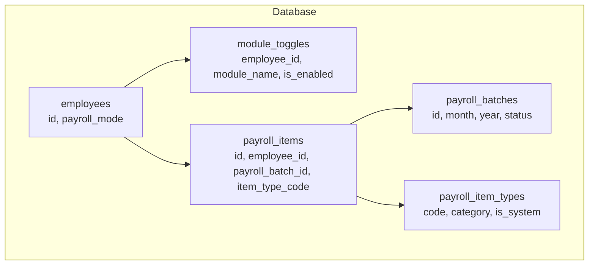
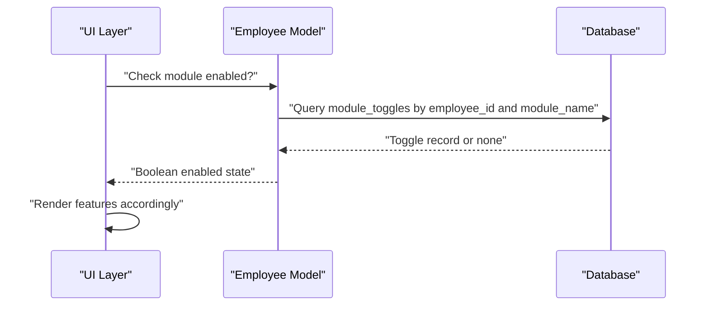
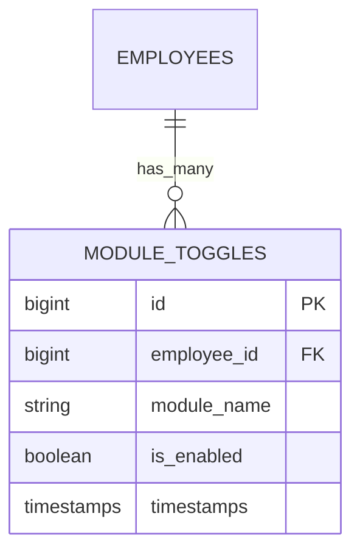
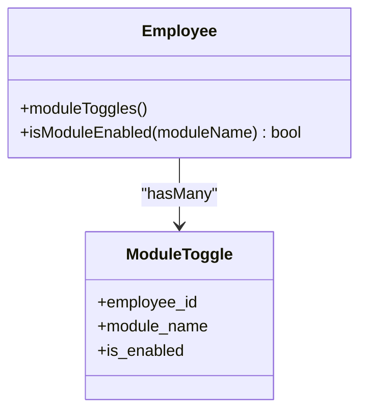
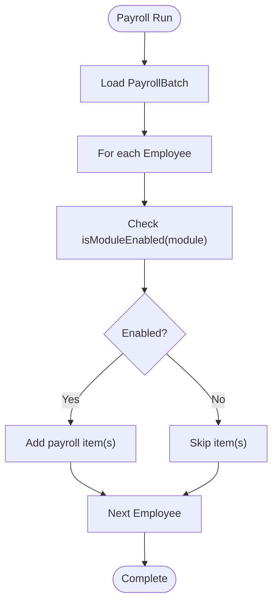
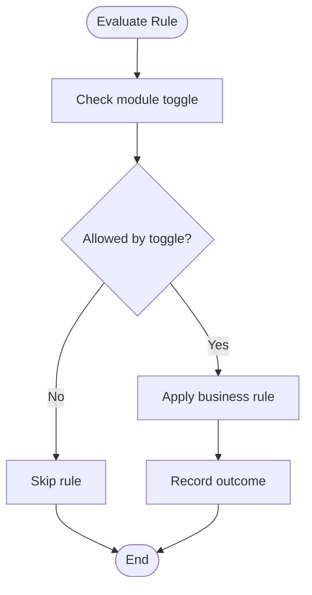
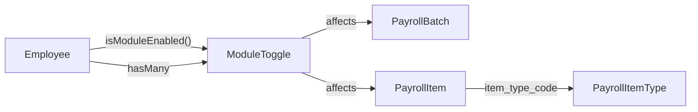

# Module Toggle Configuration

<cite>
**Referenced Files in This Document**
- [0001_01_01_000008_create_rules_config_tables.php](file://database/migrations/0001_01_01_000008_create_rules_config_tables.php)
- [Employee.php](file://app/Models/Employee.php)
- [PayrollBatch.php](file://app/Models/PayrollBatch.php)
- [PayrollItem.php](file://app/Models/PayrollItem.php)
- [PayrollItemType.php](file://app/Models/PayrollItemType.php)
</cite>

## Table of Contents
1. [Introduction](#introduction)
2. [Project Structure](#project-structure)
3. [Core Components](#core-components)
4. [Architecture Overview](#architecture-overview)
5. [Detailed Component Analysis](#detailed-component-analysis)
6. [Dependency Analysis](#dependency-analysis)
7. [Performance Considerations](#performance-considerations)
8. [Troubleshooting Guide](#troubleshooting-guide)
9. [Conclusion](#conclusion)

## Introduction
This document explains the ModuleToggle entity that controls feature availability and system functionality across payroll modes, business features, and system capabilities. It covers configuration management for toggle states, dependency relationships between modules, and impact assessment for changes. It also documents integration points with payroll processing, UI rendering, and business logic execution, and provides examples of common toggle scenarios such as enabling/disabling specific payroll modes, activating/deactivating business rules, and controlling feature visibility. Finally, it outlines audit trail considerations, rollback procedures, and system-wide impact analysis.

## Project Structure
The ModuleToggle feature is implemented via a dedicated database table and integrated into the Employee model. Payroll-related entities (payroll batches, items, and item types) are defined alongside rules and configurations that can be governed by module toggles.

**Diagram sources**
- [0001_01_01_000008_create_rules_config_tables.php:80-89](file://database/migrations/0001_01_01_000008_create_rules_config_tables.php#L80-L89)
- [Employee.php:97-116](file://app/Models/Employee.php#L97-L116)
- [PayrollBatch.php:1-31](file://app/Models/PayrollBatch.php#L1-L31)
- [PayrollItem.php:1-29](file://app/Models/PayrollItem.php#L1-L29)
- [PayrollItemType.php:1-16](file://app/Models/PayrollItemType.php#L1-L16)

**Section sources**
- [0001_01_01_000008_create_rules_config_tables.php:80-89](file://database/migrations/0001_01_01_000008_create_rules_config_tables.php#L80-L89)
- [Employee.php:97-116](file://app/Models/Employee.php#L97-L116)
- [PayrollBatch.php:1-31](file://app/Models/PayrollBatch.php#L1-L31)
- [PayrollItem.php:1-29](file://app/Models/PayrollItem.php#L1-L29)
- [PayrollItemType.php:1-16](file://app/Models/PayrollItemType.php#L1-L16)

## Core Components
- ModuleToggle table: Stores per-employee feature toggles with a unique constraint on employee and module name.
- Employee model: Provides a method to check whether a specific module is enabled for an employee.
- Payroll entities: PayrollBatch, PayrollItem, and PayrollItemType define the payroll domain and support toggle-driven behavior.

Key responsibilities:
- Persist toggle state per employee and module.
- Evaluate toggle state during payroll processing and business logic execution.
- Support UI rendering decisions and feature visibility.

**Section sources**
- [0001_01_01_000008_create_rules_config_tables.php:80-89](file://database/migrations/0001_01_01_000008_create_rules_config_tables.php#L80-L89)
- [Employee.php:97-116](file://app/Models/Employee.php#L97-L116)
- [PayrollBatch.php:1-31](file://app/Models/PayrollBatch.php#L1-L31)
- [PayrollItem.php:1-29](file://app/Models/PayrollItem.php#L1-L29)
- [PayrollItemType.php:1-16](file://app/Models/PayrollItemType.php#L1-L16)

## Architecture Overview
Module toggles integrate with payroll processing and business logic by allowing conditional activation of features. The Employee model exposes a method to evaluate whether a given module is enabled for a specific employee. Payroll entities (batches, items, and item types) form the processing pipeline that can branch based on toggle states.

**Diagram sources**
- [Employee.php:112-116](file://app/Models/Employee.php#L112-L116)
- [0001_01_01_000008_create_rules_config_tables.php:80-89](file://database/migrations/0001_01_01_000008_create_rules_config_tables.php#L80-L89)

## Detailed Component Analysis

### ModuleToggle Entity
The ModuleToggle entity is represented by the module_toggles table:
- Composite unique key ensures one toggle per employee per module.
- Foreign key to employees supports per-user feature control.
- Boolean flag determines whether the module is enabled.

**Diagram sources**
- [0001_01_01_000008_create_rules_config_tables.php:80-89](file://database/migrations/0001_01_01_000008_create_rules_config_tables.php#L80-L89)

**Section sources**
- [0001_01_01_000008_create_rules_config_tables.php:80-89](file://database/migrations/0001_01_01_000008_create_rules_config_tables.php#L80-L89)

### Employee Model Integration
The Employee model encapsulates toggle evaluation:
- Relationship to ModuleToggle records.
- Helper method to resolve the effective toggle state for a module.

**Diagram sources**
- [Employee.php:97-116](file://app/Models/Employee.php#L97-L116)

**Section sources**
- [Employee.php:97-116](file://app/Models/Employee.php#L97-L116)

### Payroll Processing Integration
Payroll processing involves batches, items, and item types. Toggle states can gate inclusion or behavior of items depending on module configuration.

**Diagram sources**
- [PayrollBatch.php:1-31](file://app/Models/PayrollBatch.php#L1-L31)
- [PayrollItem.php:1-29](file://app/Models/PayrollItem.php#L1-L29)
- [PayrollItemType.php:1-16](file://app/Models/PayrollItemType.php#L1-L16)
- [Employee.php:112-116](file://app/Models/Employee.php#L112-L116)

**Section sources**
- [PayrollBatch.php:1-31](file://app/Models/PayrollBatch.php#L1-L31)
- [PayrollItem.php:1-29](file://app/Models/PayrollItem.php#L1-L29)
- [PayrollItemType.php:1-16](file://app/Models/PayrollItemType.php#L1-L16)
- [Employee.php:112-116](file://app/Models/Employee.php#L112-L116)

### Business Rules and Feature Visibility
Module toggles can control visibility and applicability of business rules:
- Toggle-driven inclusion of bonus rules, threshold rules, or attendance rules.
- Conditional rendering of UI features based on employee-specific toggle states.

[No sources needed since this diagram shows conceptual workflow, not actual code structure]

## Dependency Analysis
Module toggles introduce controlled dependencies between:
- Employees and their feature sets.
- Payroll processing and module availability.
- Business rules and module activation.

**Diagram sources**
- [Employee.php:97-116](file://app/Models/Employee.php#L97-L116)
- [0001_01_01_000008_create_rules_config_tables.php:80-89](file://database/migrations/0001_01_01_000008_create_rules_config_tables.php#L80-L89)
- [PayrollBatch.php:1-31](file://app/Models/PayrollBatch.php#L1-L31)
- [PayrollItem.php:1-29](file://app/Models/PayrollItem.php#L1-L29)
- [PayrollItemType.php:1-16](file://app/Models/PayrollItemType.php#L1-L16)

**Section sources**
- [Employee.php:97-116](file://app/Models/Employee.php#L97-L116)
- [0001_01_01_000008_create_rules_config_tables.php:80-89](file://database/migrations/0001_01_01_000008_create_rules_config_tables.php#L80-L89)
- [PayrollBatch.php:1-31](file://app/Models/PayrollBatch.php#L1-L31)
- [PayrollItem.php:1-29](file://app/Models/PayrollItem.php#L1-L29)
- [PayrollItemType.php:1-16](file://app/Models/PayrollItemType.php#L1-L16)

## Performance Considerations
- Indexing: The unique index on employee_id and module_name optimizes lookups for toggle resolution.
- Caching: Consider caching per-employee toggle sets in memory for high-throughput payroll runs.
- Batch evaluation: Group toggle checks by module to minimize repeated queries.

[No sources needed since this section provides general guidance]

## Troubleshooting Guide
Common issues and resolutions:
- Duplicate toggle entries: The unique constraint prevents multiple rows per employee and module. If conflicts occur, reconcile by removing duplicates or updating the intended row.
- Missing toggle records: Absence implies the module is disabled for that employee. Verify expected defaults and update toggle state as needed.
- Payroll discrepancies: Confirm toggle states for employees included in a batch and validate that items are added or skipped according to module rules.

Audit and rollback:
- Audit trail: Track changes to module_toggles via database logs or application-level auditing to capture who changed what and when.
- Rollback: Revert to previous toggle states by restoring prior records or re-applying known-good configurations.

Impact analysis:
- Scope assessment: Identify affected employees and payroll batches when toggling a module.
- Regression testing: Validate payroll calculations and UI behavior after changes.

**Section sources**
- [0001_01_01_000008_create_rules_config_tables.php:80-89](file://database/migrations/0001_01_01_000008_create_rules_config_tables.php#L80-L89)

## Conclusion
Module toggles provide a flexible mechanism to control feature availability and system capabilities. By integrating with the Employee model and payroll entities, they enable selective activation of payroll modes, business features, and system capabilities. Proper configuration management, dependency modeling, and impact assessment ensure reliable operation during payroll processing and business logic execution.