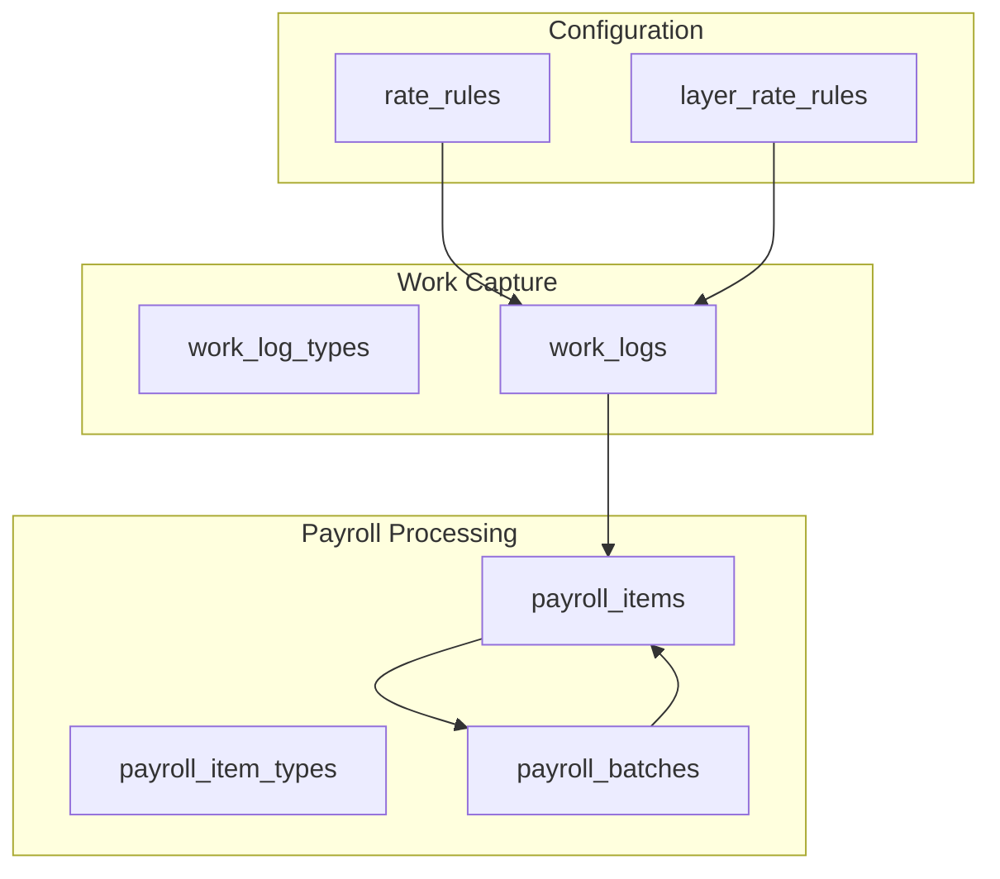
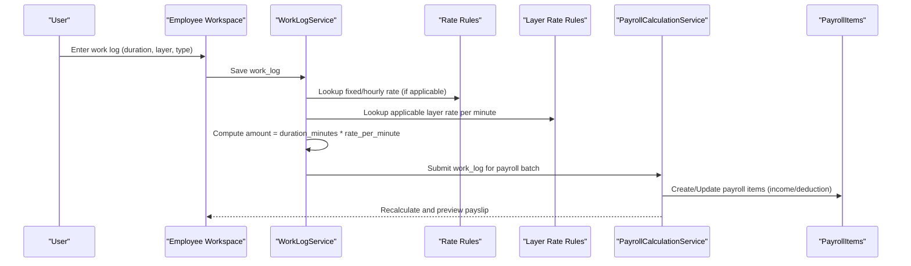
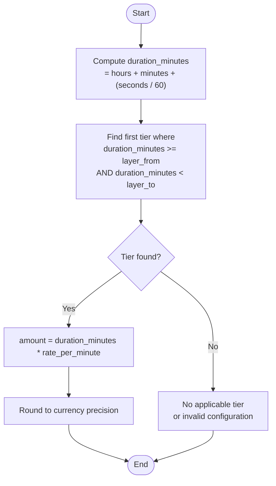
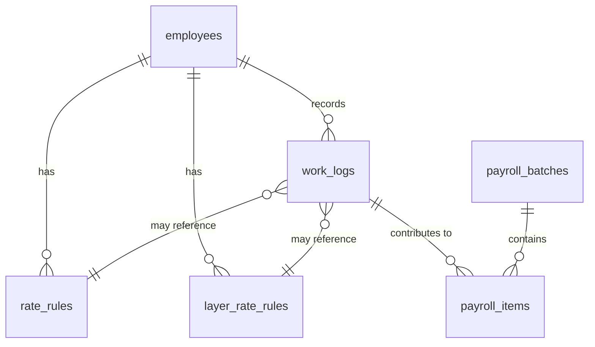

# Rate Rules and Layer Rate Rules

<cite>
**Referenced Files in This Document**
- [AGENTS.md](file://AGENTS.md)
- [0001_01_01_000008_create_rules_config_tables.php](file://database/migrations/0001_01_01_000008_create_rules_config_tables.php)
- [0001_01_01_000006_create_attendance_worklogs_tables.php](file://database/migrations/0001_01_01_000006_create_attendance_worklogs_tables.php)
- [0001_01_01_000007_create_payroll_tables.php](file://database/migrations/0001_01_01_000007_create_payroll_tables.php)
</cite>

## Table of Contents
1. [Introduction](#introduction)
2. [Project Structure](#project-structure)
3. [Core Components](#core-components)
4. [Architecture Overview](#architecture-overview)
5. [Detailed Component Analysis](#detailed-component-analysis)
6. [Dependency Analysis](#dependency-analysis)
7. [Performance Considerations](#performance-considerations)
8. [Troubleshooting Guide](#troubleshooting-guide)
9. [Conclusion](#conclusion)

## Introduction
This document explains the Rate Rules and Layer Rate Rules entities used in freelance and performance-based compensation calculations. It covers:
- Rate configuration system: fixed rates and layered/tiered rate structures
- Calculation algorithms for layer-rate scenarios, converting duration-based work into monetary amounts
- Relationship between work logs, rate configurations, and final compensation
- Examples of common layer-rate scenarios (video editing time rates, content creation billing, performance-based pricing)
- Rate validation, tier precedence, and integration with work log processing and payroll calculation workflows

## Project Structure
The system is designed around rule-driven compensation with explicit configuration tables and transactional records:
- Rate configuration tables define how compensation is calculated
- Work logs capture duration-based work entries
- Payroll tables aggregate and snapshot calculated results

**Diagram sources**
- [0001_01_01_000008_create_rules_config_tables.php:11-35](file://database/migrations/0001_01_01_000008_create_rules_config_tables.php#L11-L35)
- [0001_01_01_000006_create_attendance_worklogs_tables.php:40-60](file://database/migrations/0001_01_01_000006_create_attendance_worklogs_tables.php#L40-L60)
- [0001_01_01_000007_create_payroll_tables.php:11-51](file://database/migrations/0001_01_01_000007_create_payroll_tables.php#L11-L51)

**Section sources**
- [AGENTS.md:438-506](file://AGENTS.md#L438-L506)
- [0001_01_01_000008_create_rules_config_tables.php:11-35](file://database/migrations/0001_01_01_000008_create_rules_config_tables.php#L11-L35)
- [0001_01_01_000006_create_attendance_worklogs_tables.php:40-60](file://database/migrations/0001_01_01_000006_create_attendance_worklogs_tables.php#L40-L60)
- [0001_01_01_000007_create_payroll_tables.php:11-51](file://database/migrations/0001_01_01_000007_create_payroll_tables.php#L11-L51)

## Core Components
- Rate Rules (rate_rules)
  - Stores per-employee fixed or hourly rates with effective dates and activation flags
  - Supports payroll modes and future expansion
- Layer Rate Rules (layer_rate_rules)
  - Defines tiered rates per minute for freelancers, with inclusive lower bounds and exclusive upper bounds implied by ordering
  - Indexed by employee and active status for fast lookup
- Work Logs (work_logs)
  - Captures duration (hours, minutes, seconds), optional layer, quantity, rate, and computed amount
  - Links to employees and supports monthly aggregation
- Payroll Items (payroll_items)
  - Aggregates calculated compensation into income/deduction categories with source flags and audit trail

Key business rules:
- Freelance layer calculation converts duration to minutes and multiplies by the applicable rate per minute
- Layer precedence follows defined ranges; higher ranges take effect when duration exceeds thresholds
- Amounts are stored with precision suitable for currency

**Section sources**
- [0001_01_01_000008_create_rules_config_tables.php:11-35](file://database/migrations/0001_01_01_000008_create_rules_config_tables.php#L11-L35)
- [0001_01_01_000006_create_attendance_worklogs_tables.php:40-60](file://database/migrations/0001_01_01_000006_create_attendance_worklogs_tables.php#L40-L60)
- [AGENTS.md:472-479](file://AGENTS.md#L472-L479)

## Architecture Overview
The rate configuration system integrates with work log capture and payroll processing:

**Diagram sources**
- [0001_01_01_000006_create_attendance_worklogs_tables.php:40-60](file://database/migrations/0001_01_01_000006_create_attendance_worklogs_tables.php#L40-L60)
- [0001_01_01_000008_create_rules_config_tables.php:11-35](file://database/migrations/0001_01_01_000008_create_rules_config_tables.php#L11-L35)
- [0001_01_01_000007_create_payroll_tables.php:35-51](file://database/migrations/0001_01_01_000007_create_payroll_tables.php#L35-L51)

## Detailed Component Analysis

### Rate Rules (rate_rules)
Purpose:
- Define fixed or hourly compensation rates per employee with effective dates and activation flags

Fields and constraints:
- employee_id: FK to employees; nullable to support global defaults
- rate_type: fixed or hourly
- rate: decimal with precision for currency
- effective_date: determines rule applicability
- is_active: enables/disables rule selection

Usage:
- Used by freelancers with fixed or hourly modes
- Can be extended to support monthly staff by mapping to appropriate payroll modes

Integration:
- Linked to work_logs for rate resolution when applicable
- Supports audits via timestamps and activation flags

**Section sources**
- [0001_01_01_000008_create_rules_config_tables.php:11-21](file://database/migrations/0001_01_01_000008_create_rules_config_tables.php#L11-L21)
- [AGENTS.md:477-479](file://AGENTS.md#L477-L479)

### Layer Rate Rules (layer_rate_rules)
Purpose:
- Define tiered rates per minute for freelancers based on duration ranges

Fields and constraints:
- employee_id: FK to employees
- layer_from: inclusive lower bound (minutes)
- layer_to: exclusive upper bound (minutes)
- rate_per_minute: decimal with sufficient precision for fine-grained rates
- effective_date and is_active: lifecycle controls

Tier precedence and validation:
- Tiers are ordered by layer_from; higher ranges take precedence when duration exceeds thresholds
- Overlapping ranges should be avoided; non-overlapping tiers ensure deterministic precedence
- Index on (employee_id, is_active) optimizes lookups

Calculation algorithm:
- Convert duration to total minutes (including fractional minutes from seconds)
- Select the first tier where duration falls within [layer_from, layer_to)
- Multiply total minutes by selected rate_per_minute
- Round to currency precision at the end of computation

**Diagram sources**
- [AGENTS.md:472-475](file://AGENTS.md#L472-L475)
- [0001_01_01_000008_create_rules_config_tables.php:23-35](file://database/migrations/0001_01_01_000008_create_rules_config_tables.php#L23-L35)

**Section sources**
- [0001_01_01_000008_create_rules_config_tables.php:23-35](file://database/migrations/0001_01_01_000008_create_rules_config_tables.php#L23-L35)
- [AGENTS.md:472-475](file://AGENTS.md#L472-L475)

### Work Logs (work_logs)
Purpose:
- Capture duration-based work entries for freelancers and hybrid modes

Fields and constraints:
- employee_id: FK to employees
- month/year: for monthly aggregation
- log_date: optional date stamp
- work_type: categorized under work_log_types
- layer: optional layer identifier for tiered rates
- hours, minutes, seconds: integer fields for duration
- quantity: integer for unit-based fixed-rate scenarios
- rate: decimal for manual override
- amount: decimal for computed or manual amount
- sort_order and notes: metadata for UI and audit

Integration:
- Linked to rate_rules and layer_rate_rules for automatic amount computation
- Indexed by employee_id, month, year for efficient monthly queries

**Section sources**
- [0001_01_01_000006_create_attendance_worklogs_tables.php:40-60](file://database/migrations/0001_01_01_000006_create_attendance_worklogs_tables.php#L40-L60)

### Payroll Items (payroll_items)
Purpose:
- Aggregate calculated compensation into income/deduction categories with source tracking

Fields and constraints:
- employee_id and payroll_batch_id: FKs to employees and payroll_batches
- item_type_code: references payroll_item_types
- category: income or deduction
- label: display label
- amount: decimal with currency precision
- source_flag: auto/manual/override/master/rule_applied
- sort_order and notes: UI and audit metadata

Integration:
- Generated from work_logs and rate configurations during payroll calculation
- Supports snapshotting upon payslip finalization

**Section sources**
- [0001_01_01_000007_create_payroll_tables.php:35-51](file://database/migrations/0001_01_01_000007_create_payroll_tables.php#L35-L51)

## Dependency Analysis
Relationships between rate configuration, work logs, and payroll items:

**Diagram sources**
- [0001_01_01_000008_create_rules_config_tables.php:11-35](file://database/migrations/0001_01_01_000008_create_rules_config_tables.php#L11-L35)
- [0001_01_01_000006_create_attendance_worklogs_tables.php:40-60](file://database/migrations/0001_01_01_000006_create_attendance_worklogs_tables.php#L40-L60)
- [0001_01_01_000007_create_payroll_tables.php:35-51](file://database/migrations/0001_01_01_000007_create_payroll_tables.php#L35-L51)

**Section sources**
- [0001_01_01_000008_create_rules_config_tables.php:11-35](file://database/migrations/0001_01_01_000008_create_rules_config_tables.php#L11-L35)
- [0001_01_01_000006_create_attendance_worklogs_tables.php:40-60](file://database/migrations/0001_01_01_000006_create_attendance_worklogs_tables.php#L40-L60)
- [0001_01_01_000007_create_payroll_tables.php:35-51](file://database/migrations/0001_01_01_000007_create_payroll_tables.php#L35-L51)

## Performance Considerations
- Indexes
  - layer_rate_rules: composite index on (employee_id, is_active) to quickly fetch active tiers per employee
  - work_logs: composite index on (employee_id, month, year) for monthly aggregation
- Decimal precision
  - rate_per_minute uses sufficient precision to avoid rounding errors in tiered calculations
  - Currency fields use standard precision for storage and display
- Tier lookup
  - Order tiers by layer_from ascending; select the first matching tier to minimize comparisons
- Batch processing
  - Aggregate work logs by month and employee to reduce repeated lookups

[No sources needed since this section provides general guidance]

## Troubleshooting Guide
Common issues and resolutions:
- No applicable tier found
  - Cause: duration does not fall within any tier range
  - Resolution: adjust tier ranges or add a catch-all higher-tier rule
- Overlapping tiers
  - Cause: multiple tiers with overlapping ranges
  - Resolution: ensure non-overlapping ranges; higher tiers take precedence when duration exceeds thresholds
- Incorrect amount calculation
  - Cause: wrong tier selected or incorrect rate_per_minute
  - Resolution: verify tier boundaries and effective dates; confirm work log duration conversion
- Precision loss
  - Cause: insufficient decimal precision in rate_per_minute or amount
  - Resolution: use adequate precision for rate_per_minute and round at the end of computation
- Activation and effective date conflicts
  - Cause: multiple active rules with overlapping effective dates
  - Resolution: ensure only one active rule per effective date window; use proper effective_date sequencing

**Section sources**
- [0001_01_01_000008_create_rules_config_tables.php:23-35](file://database/migrations/0001_01_01_000008_create_rules_config_tables.php#L23-L35)
- [AGENTS.md:472-475](file://AGENTS.md#L472-L475)

## Conclusion
The Rate Rules and Layer Rate Rules system provides a flexible, rule-driven framework for freelance and performance-based compensation:
- Fixed and hourly rates are configured per employee with effective dates
- Layered/tiered rates enable nuanced pricing across duration ranges
- Work logs capture duration-based work with optional layers and quantities
- Payroll items aggregate computed results with source tracking and auditability
- Clear tier precedence and validation ensure predictable and accurate calculations

This design supports common scenarios such as video editing time rates, content creation billing, and performance-based pricing while maintaining maintainability and compliance with audit requirements.