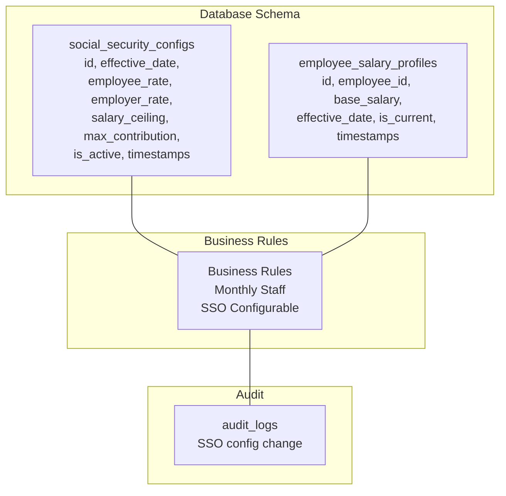
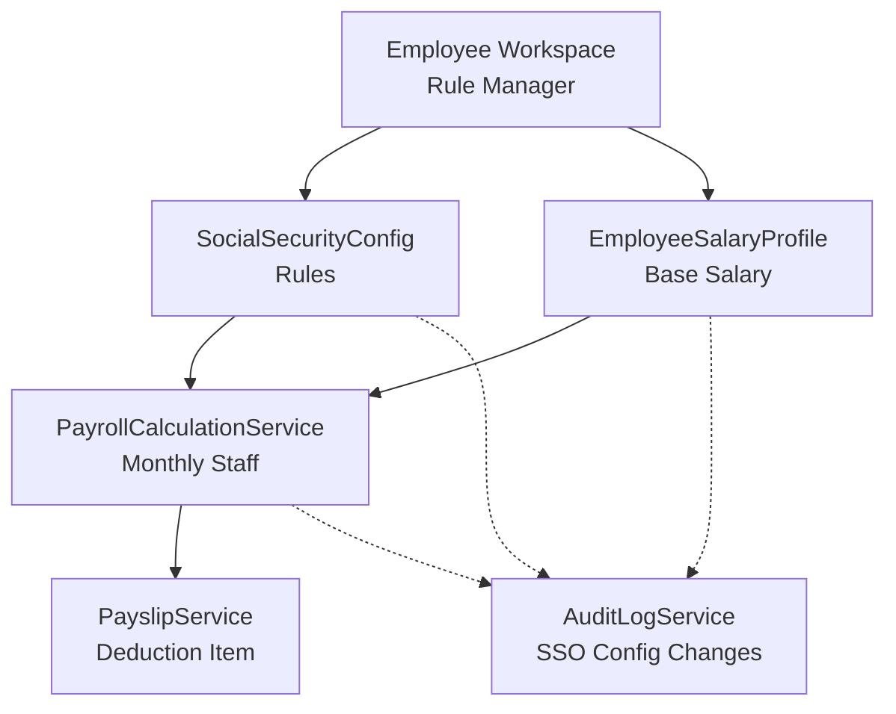
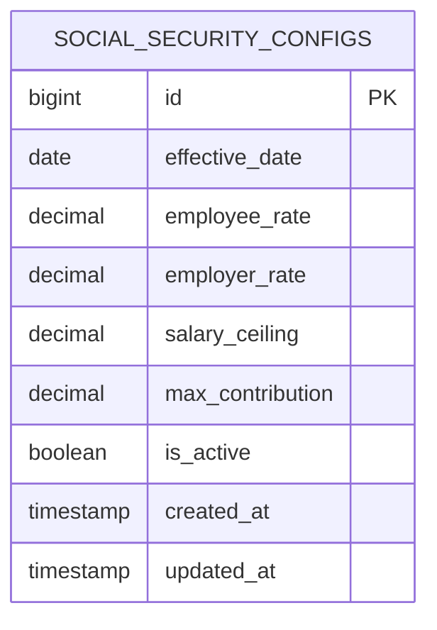
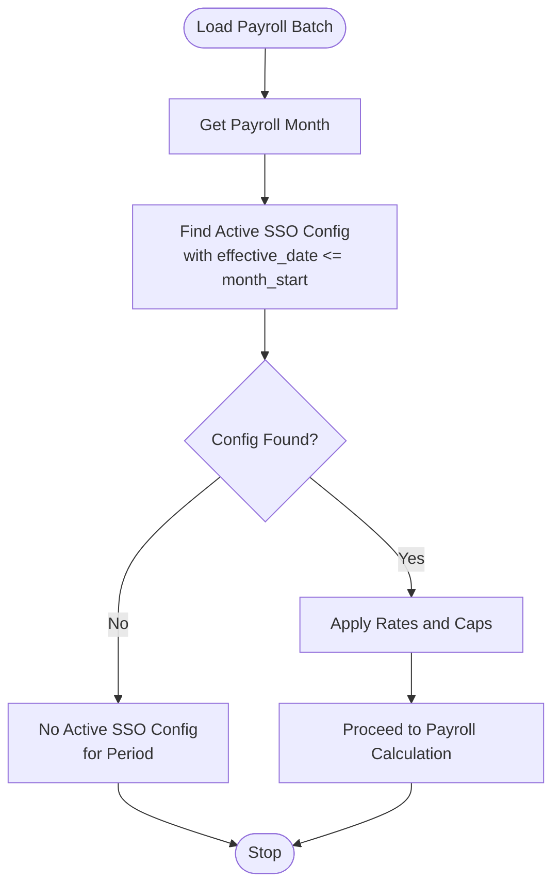
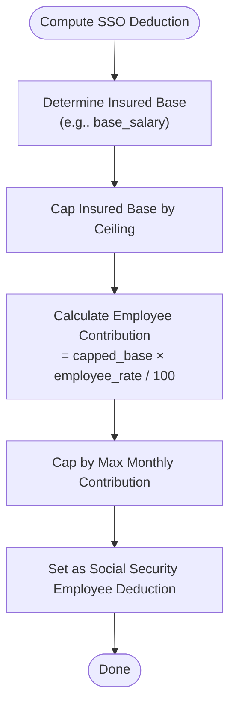
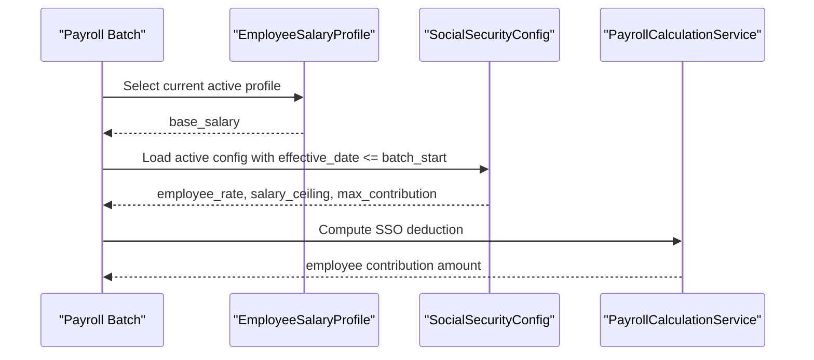
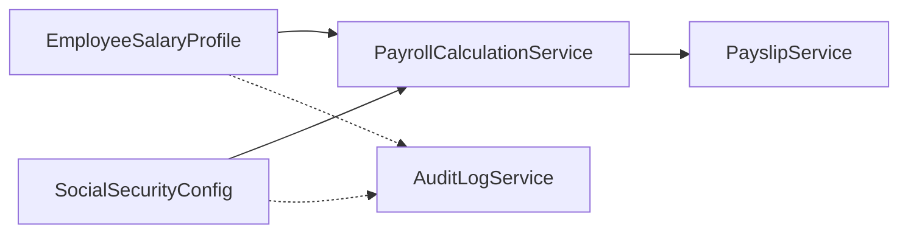

# Social Security Configuration

<cite>
**Referenced Files in This Document**
- [AGENTS.md](file://AGENTS.md)
- [0001_01_01_000008_create_rules_config_tables.php](file://database/migrations/0001_01_01_000008_create_rules_config_tables.php)
- [0001_01_01_000005_create_employees_tables.php](file://database/migrations/0001_01_01_000005_create_employees_tables.php)
</cite>

## Table of Contents
1. [Introduction](#introduction)
2. [Project Structure](#project-structure)
3. [Core Components](#core-components)
4. [Architecture Overview](#architecture-overview)
5. [Detailed Component Analysis](#detailed-component-analysis)
6. [Dependency Analysis](#dependency-analysis)
7. [Performance Considerations](#performance-considerations)
8. [Troubleshooting Guide](#troubleshooting-guide)
9. [Conclusion](#conclusion)

## Introduction
This document describes the SocialSecurityConfig entity and its role in Thailand social security compliance within the payroll system. It covers configuration parameters, effective date management, rate calculation algorithms, integration with payroll processing, and the relationship between salary profiles and social security computations. It also documents compliance requirements, regulatory change handling, and audit trail for modifications.

## Project Structure
The repository defines the SocialSecurityConfig as a configurable rule with effective date support and integrates with payroll calculations and audit systems. The relevant schema and business rules are documented in the project guidelines.

**Diagram sources**
- [0001_01_01_000008_create_rules_config_tables.php:60-69](file://database/migrations/0001_01_01_000008_create_rules_config_tables.php#L60-L69)
- [0001_01_01_000005_create_employees_tables.php:49-60](file://database/migrations/0001_01_01_000005_create_employees_tables.php#L49-L60)
- [AGENTS.md:488-497](file://AGENTS.md#L488-L497)
- [AGENTS.md:576-595](file://AGENTS.md#L576-L595)

**Section sources**
- [AGENTS.md:488-497](file://AGENTS.md#L488-L497)
- [0001_01_01_000008_create_rules_config_tables.php:60-69](file://database/migrations/0001_01_01_000008_create_rules_config_tables.php#L60-L69)
- [0001_01_01_000005_create_employees_tables.php:49-60](file://database/migrations/0001_01_01_000005_create_employees_tables.php#L49-L60)

## Core Components
- SocialSecurityConfig: Stores Thailand social security parameters with effective date support and activation flag.
- EmployeeSalaryProfile: Provides the salary basis for SSO computation and supports current/active profile selection.
- Business Rules: Define Thailand-specific SSO configuration parameters and require configurable rates.
- Audit Logs: Track SSO configuration changes for compliance and rollback capability.

Key configuration parameters:
- Employee contribution rate: percentage applied to the insured base
- Employer contribution rate: percentage applied to the insured base
- Salary ceiling: maximum insured base for SSO calculations
- Maximum monthly contribution: cap on total SSO contribution per month

Effective date management:
- Rules are stored with an effective_date to support regulatory changes over time.
- is_active flag enables deactivation of outdated configurations while preserving history.

Integration with payroll:
- SSO employee contribution is included as a deduction item in monthly staff payroll calculations.
- Base salary is the primary insured base; adjustments are captured in salary profiles.

**Section sources**
- [AGENTS.md:488-497](file://AGENTS.md#L488-L497)
- [0001_01_01_000008_create_rules_config_tables.php:60-69](file://database/migrations/0001_01_01_000008_create_rules_config_tables.php#L60-L69)
- [0001_01_01_000005_create_employees_tables.php:49-60](file://database/migrations/0001_01_01_000005_create_employees_tables.php#L49-L60)
- [AGENTS.md:440-445](file://AGENTS.md#L440-L445)

## Architecture Overview
The SocialSecurityConfig operates as a rule-driven component integrated into the payroll engine and governed by audit controls.

**Diagram sources**
- [AGENTS.md:636-647](file://AGENTS.md#L636-L647)
- [AGENTS.md:576-595](file://AGENTS.md#L576-L595)
- [0001_01_01_000008_create_rules_config_tables.php:60-69](file://database/migrations/0001_01_01_000008_create_rules_config_tables.php#L60-L69)
- [0001_01_01_000005_create_employees_tables.php:49-60](file://database/migrations/0001_01_01_000005_create_employees_tables.php#L49-L60)

## Detailed Component Analysis

### SocialSecurityConfig Entity
The SocialSecurityConfig table stores Thailand social security parameters with effective date and activation control. It supports configurable employee and employer contribution rates, a salary ceiling, and a maximum monthly contribution cap.

**Diagram sources**
- [0001_01_01_000008_create_rules_config_tables.php:60-69](file://database/migrations/0001_01_01_000008_create_rules_config_tables.php#L60-L69)

**Section sources**
- [0001_01_01_000008_create_rules_config_tables.php:60-69](file://database/migrations/0001_01_01_000008_create_rules_config_tables.php#L60-L69)
- [AGENTS.md:488-497](file://AGENTS.md#L488-L497)

### Effective Date Management
Effective date management ensures that regulatory changes are applied prospectively and historically auditable.

**Diagram sources**
- [AGENTS.md:488-490](file://AGENTS.md#L488-L490)
- [0001_01_01_000008_create_rules_config_tables.php:60-69](file://database/migrations/0001_01_01_000008_create_rules_config_tables.php#L60-L69)

**Section sources**
- [AGENTS.md:488-490](file://AGENTS.md#L488-L490)
- [0001_01_01_000008_create_rules_config_tables.php:60-69](file://database/migrations/0001_01_01_000008_create_rules_config_tables.php#L60-L69)

### Rate Calculation Algorithm
The SSO calculation uses the employee’s insured base (typically base salary) and applies the employee rate with caps against the ceiling and monthly maximum.

**Diagram sources**
- [AGENTS.md:492-496](file://AGENTS.md#L492-L496)
- [0001_01_01_000008_create_rules_config_tables.php:60-69](file://database/migrations/0001_01_01_000008_create_rules_config_tables.php#L60-L69)
- [0001_01_01_000005_create_employees_tables.php:49-60](file://database/migrations/0001_01_01_000005_create_employees_tables.php#L49-L60)

**Section sources**
- [AGENTS.md:492-496](file://AGENTS.md#L492-L496)
- [0001_01_01_000008_create_rules_config_tables.php:60-69](file://database/migrations/0001_01_01_000008_create_rules_config_tables.php#L60-L69)
- [0001_01_01_000005_create_employees_tables.php:49-60](file://database/migrations/0001_01_01_000005_create_employees_tables.php#L49-L60)

### Relationship Between Salary Profiles and SSO Calculations
Salary profiles define the base salary used as the insured base for SSO. The current active profile is selected for the payroll period.

**Diagram sources**
- [0001_01_01_000005_create_employees_tables.php:49-60](file://database/migrations/0001_01_01_000005_create_employees_tables.php#L49-L60)
- [0001_01_01_000008_create_rules_config_tables.php:60-69](file://database/migrations/0001_01_01_000008_create_rules_config_tables.php#L60-L69)
- [AGENTS.md:440-445](file://AGENTS.md#L440-L445)

**Section sources**
- [0001_01_01_000005_create_employees_tables.php:49-60](file://database/migrations/0001_01_01_000005_create_employees_tables.php#L49-L60)
- [AGENTS.md:440-445](file://AGENTS.md#L440-L445)

### Proration for Partial Months and Special Circumstances
Proration logic adjusts SSO contributions when employees join mid-month or when special conditions apply. The payroll engine should:
- Scale contributions proportionally to days worked within the pay period.
- Apply separate rules for newly hired employees during their first month.
- Account for leaves or unpaid periods affecting insurable days.

These behaviors are part of the broader monthly staff payroll calculation and should be coordinated with SSO configuration.

**Section sources**
- [AGENTS.md:440-445](file://AGENTS.md#L440-L445)

### Configuration Scenarios
- Full-time employee with standard base salary:
  - Use current salary profile as insured base.
  - Apply latest active SSO config effective before or during the payroll month.
- Employee with adjusted base salary mid-month:
  - Use the appropriate salary profile effective during the pay period.
- Regulatory change requiring higher ceiling or reduced rates:
  - Create a new SSO config with future effective_date.
  - Keep previous config active until the new one takes effect.

**Section sources**
- [0001_01_01_000005_create_employees_tables.php:49-60](file://database/migrations/0001_01_01_000005_create_employees_tables.php#L49-L60)
- [0001_01_01_000008_create_rules_config_tables.php:60-69](file://database/migrations/0001_01_01_000008_create_rules_config_tables.php#L60-L69)
- [AGENTS.md:488-490](file://AGENTS.md#L488-L490)

### Compliance Requirements and Regulatory Changes
- Do not hardcode SSO values; keep all values configurable.
- Maintain audit logs for all SSO config changes.
- Support rollback by keeping historical configs with effective dates.

**Section sources**
- [AGENTS.md:218-221](file://AGENTS.md#L218-L221)
- [AGENTS.md:576-595](file://AGENTS.md#L576-L595)
- [AGENTS.md:488-490](file://AGENTS.md#L488-L490)

### Audit Trail for Modifications
- Track who changed SSO config, what fields were modified, old vs new values, action type, timestamp, and reason.
- Maintain a dedicated audit area for SSO config changes.

**Section sources**
- [AGENTS.md:576-595](file://AGENTS.md#L576-L595)

## Dependency Analysis
The SocialSecurityConfig depends on:
- EmployeeSalaryProfile for the insured base.
- Business rules for Thailand SSO parameters.
- Audit services for compliance tracking.

**Diagram sources**
- [0001_01_01_000005_create_employees_tables.php:49-60](file://database/migrations/0001_01_01_000005_create_employees_tables.php#L49-L60)
- [0001_01_01_000008_create_rules_config_tables.php:60-69](file://database/migrations/0001_01_01_000008_create_rules_config_tables.php#L60-L69)
- [AGENTS.md:636-647](file://AGENTS.md#L636-L647)
- [AGENTS.md:576-595](file://AGENTS.md#L576-L595)

**Section sources**
- [0001_01_01_000005_create_employees_tables.php:49-60](file://database/migrations/0001_01_01_000005_create_employees_tables.php#L49-L60)
- [0001_01_01_000008_create_rules_config_tables.php:60-69](file://database/migrations/0001_01_01_000008_create_rules_config_tables.php#L60-L69)
- [AGENTS.md:636-647](file://AGENTS.md#L636-L647)
- [AGENTS.md:576-595](file://AGENTS.md#L576-L595)

## Performance Considerations
- Index effective_date and is_active on social_security_configs to optimize lookup by payroll month.
- Use current active salary profile index to minimize joins.
- Cache frequently accessed SSO configs per payroll month to reduce database queries.

[No sources needed since this section provides general guidance]

## Troubleshooting Guide
Common issues and resolutions:
- No active SSO config for the payroll month:
  - Verify effective_date alignment and is_active flag.
- Incorrect SSO deduction:
  - Confirm base_salary from the correct salary profile and ceiling/max contribution values.
- Regulatory change not applied:
  - Ensure a newer effective_date exists and is set to active.

**Section sources**
- [0001_01_01_000008_create_rules_config_tables.php:60-69](file://database/migrations/0001_01_01_000008_create_rules_config_tables.php#L60-L69)
- [0001_01_01_000005_create_employees_tables.php:49-60](file://database/migrations/0001_01_01_000005_create_employees_tables.php#L49-L60)
- [AGENTS.md:488-490](file://AGENTS.md#L488-L490)

## Conclusion
The SocialSecurityConfig entity provides a configurable, auditable, and rule-driven mechanism for Thailand social security compliance. By leveraging effective dates, separating employee and employer rates, applying ceilings and monthly caps, and integrating with salary profiles and audit logs, the system supports accurate payroll processing and regulatory adaptability.