# Attendance and Work Log Entities

<cite>
**Referenced Files in This Document**
- [app/Models/AttendanceLog.php](file://app/Models/AttendanceLog.php)
- [app/Models/WorkLog.php](file://app/Models/WorkLog.php)
- [app/Models/WorkLogType.php](file://app/Models/WorkLogType.php)
- [app/Models/Employee.php](file://app/Models/Employee.php)
- [app/Models/EmployeeSalaryProfile.php](file://app/Models/EmployeeSalaryProfile.php)
- [app/Models/PayrollItemType.php](file://app/Models/PayrollItemType.php)
- [database/migrations/0001_01_01_000006_create_attendance_worklogs_tables.php](file://database/migrations/0001_01_01_000006_create_attendance_worklogs_tables.php)
</cite>

## Table of Contents
1. [Introduction](#introduction)
2. [Project Structure](#project-structure)
3. [Core Components](#core-components)
4. [Architecture Overview](#architecture-overview)
5. [Detailed Component Analysis](#detailed-component-analysis)
6. [Dependency Analysis](#dependency-analysis)
7. [Performance Considerations](#performance-considerations)
8. [Troubleshooting Guide](#troubleshooting-guide)
9. [Conclusion](#conclusion)

## Introduction
This document explains the AttendanceLog and WorkLog entities and their role in time-tracking and payroll processing. It covers:
- Check-in/check-out recording and duration calculations
- Work type classifications and payroll modes
- Attendance-to-payroll linkage (OT computation, late deductions, LWOP processing)
- Work log management for freelancers and contractors (layer rates, hourly billing)
- Validation rules, categorization, and payroll integration workflows

## Project Structure
The relevant models and schema for time tracking and payroll are organized as follows:
- AttendanceLog: stores daily attendance with check-in/out, lateness, early leave, overtime minutes, and LWOP flag
- WorkLog: stores work performed by employees with time breakdown (hours/minutes/seconds), quantity, rate, amount, and sort order
- WorkLogType: defines categories of work logs and their payroll modes
- Employee: connects individuals to attendance and work logs, and to payroll items and payslips
- EmployeeSalaryProfile: captures base salary history used in payroll computations
- PayrollItemType: defines payroll item categories and labels
- Migrations: define the database schema and foreign key relationships

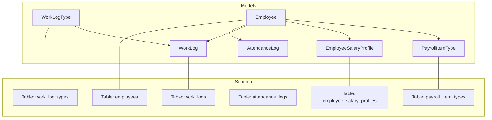

**Diagram sources**
- [database/migrations/0001_01_01_000006_create_attendance_worklogs_tables.php:11-29](file://database/migrations/0001_01_01_000006_create_attendance_worklogs_tables.php#L11-L29)
- [database/migrations/0001_01_01_000006_create_attendance_worklogs_tables.php:40-60](file://database/migrations/0001_01_01_000006_create_attendance_worklogs_tables.php#L40-L60)
- [database/migrations/0001_01_01_000006_create_attendance_worklogs_tables.php:31-38](file://database/migrations/0001_01_01_000006_create_attendance_worklogs_tables.php#L31-L38)

**Section sources**
- [database/migrations/0001_01_01_000006_create_attendance_worklogs_tables.php:11-60](file://database/migrations/0001_01_01_000006_create_attendance_worklogs_tables.php#L11-L60)

## Core Components
- AttendanceLog
  - Fields: employee_id, log_date, day_type, check_in, check_out, late_minutes, early_leave_minutes, ot_minutes, ot_enabled, lwop_flag, notes
  - Relationships: belongs to Employee; provides computed working minutes from check-in and check-out
  - Casting: log_date as date; ot_enabled and lwop_flag as booleans
- WorkLog
  - Fields: employee_id, month, year, log_date, work_type, layer, hours, minutes, seconds, quantity, rate, amount, sort_order, notes
  - Relationships: belongs to Employee; provides computed duration in minutes from hours/minutes/seconds
  - Casting: log_date as date; rate as decimal with 4 decimals; amount as decimal with 2 decimals
- WorkLogType
  - Fields: name, code, payroll_mode, is_active
  - Casting: is_active as boolean
- Employee
  - Relationships: hasMany AttendanceLog, hasMany WorkLog, hasMany PayrollItem, hasMany Payslip
  - Additional: hasOne EmployeeProfile, hasOne EmployeeSalaryProfile (current), hasMany EmployeeSalaryProfile (history)
- EmployeeSalaryProfile
  - Fields: employee_id, base_salary, effective_date, notes, is_current
  - Casting: base_salary and effective_date as decimal/date respectively; is_current as boolean
- PayrollItemType
  - Fields: code, label_th, label_en, category, is_system, sort_order
  - Casting: is_system as boolean

**Section sources**
- [app/Models/AttendanceLog.php:9-37](file://app/Models/AttendanceLog.php#L9-L37)
- [app/Models/WorkLog.php:9-33](file://app/Models/WorkLog.php#L9-L33)
- [app/Models/WorkLogType.php:9-15](file://app/Models/WorkLogType.php#L9-L15)
- [app/Models/Employee.php:77-110](file://app/Models/Employee.php#L77-L110)
- [app/Models/EmployeeSalaryProfile.php:9-25](file://app/Models/EmployeeSalaryProfile.php#L9-L25)
- [app/Models/PayrollItemType.php:9-15](file://app/Models/PayrollItemType.php#L9-L15)

## Architecture Overview
The time-tracking and payroll pipeline integrates attendance and work logs with employee profiles and payroll item types. Attendance records feed into daily pay calculations (including OT, lateness, and LWOP), while work logs support hourly billing and layer-rate computations for freelancers and contractors.

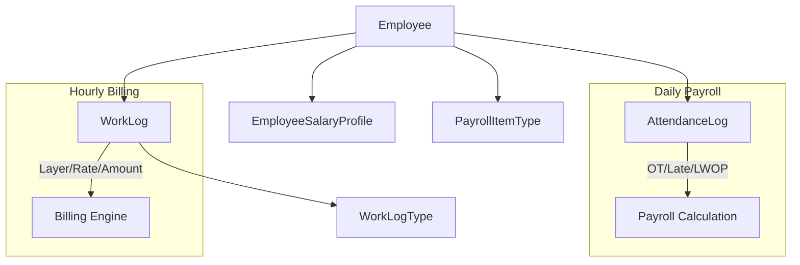

**Diagram sources**
- [app/Models/Employee.php:77-110](file://app/Models/Employee.php#L77-L110)
- [app/Models/AttendanceLog.php:23-37](file://app/Models/AttendanceLog.php#L23-L37)
- [app/Models/WorkLog.php:24-33](file://app/Models/WorkLog.php#L24-L33)
- [app/Models/WorkLogType.php:9-15](file://app/Models/WorkLogType.php#L9-L15)
- [app/Models/EmployeeSalaryProfile.php:22-25](file://app/Models/EmployeeSalaryProfile.php#L22-L25)
- [app/Models/PayrollItemType.php:9-15](file://app/Models/PayrollItemType.php#L9-L15)

## Detailed Component Analysis

### AttendanceLog Entity
- Purpose: Track daily attendance with precise timing and derived metrics
- Key attributes
  - Timing: check_in, check_out
  - Derived: working_minutes (computed from check_in and check_out)
  - Behavioral flags: ot_enabled, lwop_flag
  - Metrics: late_minutes, early_leave_minutes, ot_minutes
  - Categorization: day_type (e.g., workday, holiday, sick_leave, personal_leave, ot_full_day, vacation)
- Relationships
  - Belongs to Employee
- Computed property
  - working_minutes: sum of minutes between check_in and check_out; returns 0 if either is missing

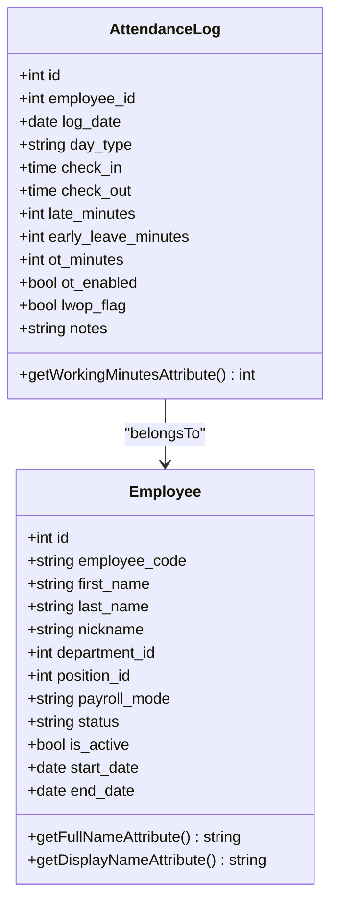

**Diagram sources**
- [app/Models/AttendanceLog.php:23-37](file://app/Models/AttendanceLog.php#L23-L37)
- [app/Models/Employee.php:37-50](file://app/Models/Employee.php#L37-L50)

**Section sources**
- [app/Models/AttendanceLog.php:9-37](file://app/Models/AttendanceLog.php#L9-L37)
- [database/migrations/0001_01_01_000006_create_attendance_worklogs_tables.php:11-29](file://database/migrations/0001_01_01_000006_create_attendance_worklogs_tables.php#L11-L29)

### WorkLog Entity
- Purpose: Capture work performed by employees with granular time and financial details
- Key attributes
  - Period: month, year
  - Date: log_date
  - Type: work_type (linked to WorkLogType)
  - Layer: layer (used for tiered or contractor pricing)
  - Duration: hours, minutes, seconds (converted to duration_minutes)
  - Quantity and value: quantity, rate (decimal with 4 decimals), amount (decimal with 2 decimals)
  - Ordering: sort_order
  - Notes: notes
- Relationships
  - Belongs to Employee
  - Connected to WorkLogType via work_type
- Computed property
  - duration_minutes: total minutes from hours/minutes/seconds

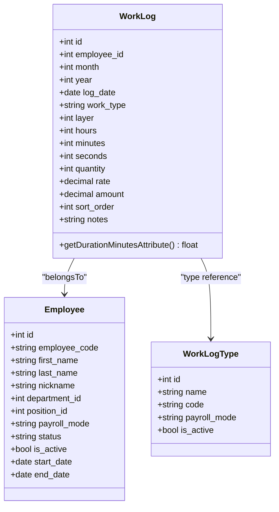

**Diagram sources**
- [app/Models/WorkLog.php:24-33](file://app/Models/WorkLog.php#L24-L33)
- [app/Models/WorkLogType.php:9-15](file://app/Models/WorkLogType.php#L9-L15)
- [app/Models/Employee.php:37-50](file://app/Models/Employee.php#L37-L50)

**Section sources**
- [app/Models/WorkLog.php:9-33](file://app/Models/WorkLog.php#L9-L33)
- [database/migrations/0001_01_01_000006_create_attendance_worklogs_tables.php:40-60](file://database/migrations/0001_01_01_000006_create_attendance_worklogs_tables.php#L40-L60)

### WorkLogType Entity
- Purpose: Define categories of work logs and their payroll modes
- Attributes
  - name, code, payroll_mode, is_active
- Usage
  - Associates work logs with payroll computation modes (e.g., hourly billing, flat rate, overtime)

**Section sources**
- [app/Models/WorkLogType.php:9-15](file://app/Models/WorkLogType.php#L9-L15)
- [database/migrations/0001_01_01_000006_create_attendance_worklogs_tables.php:31-38](file://database/migrations/0001_01_01_000006_create_attendance_worklogs_tables.php#L31-L38)

### Employee and Payroll Integration
- Employee relationships
  - Has many AttendanceLog and WorkLog
  - Has many PayrollItem and Payslip
  - Has one current EmployeeSalaryProfile and historical EmployeeSalaryProfile
- PayrollItemType
  - Defines categories and labels for payroll items (e.g., basic pay, overtime, deductions)

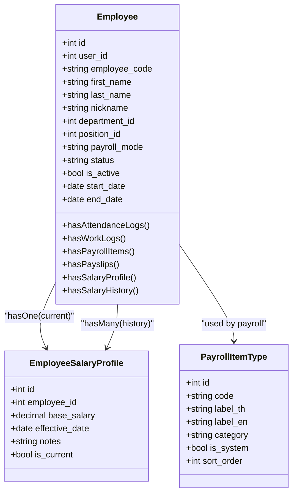

**Diagram sources**
- [app/Models/Employee.php:77-110](file://app/Models/Employee.php#L77-L110)
- [app/Models/EmployeeSalaryProfile.php:22-25](file://app/Models/EmployeeSalaryProfile.php#L22-L25)
- [app/Models/PayrollItemType.php:9-15](file://app/Models/PayrollItemType.php#L9-L15)

**Section sources**
- [app/Models/Employee.php:77-110](file://app/Models/Employee.php#L77-L110)
- [app/Models/EmployeeSalaryProfile.php:9-25](file://app/Models/EmployeeSalaryProfile.php#L9-L25)
- [app/Models/PayrollItemType.php:9-15](file://app/Models/PayrollItemType.php#L9-L15)

### Attendance Recording Workflow
This sequence illustrates how an attendance record is created and processed for payroll.

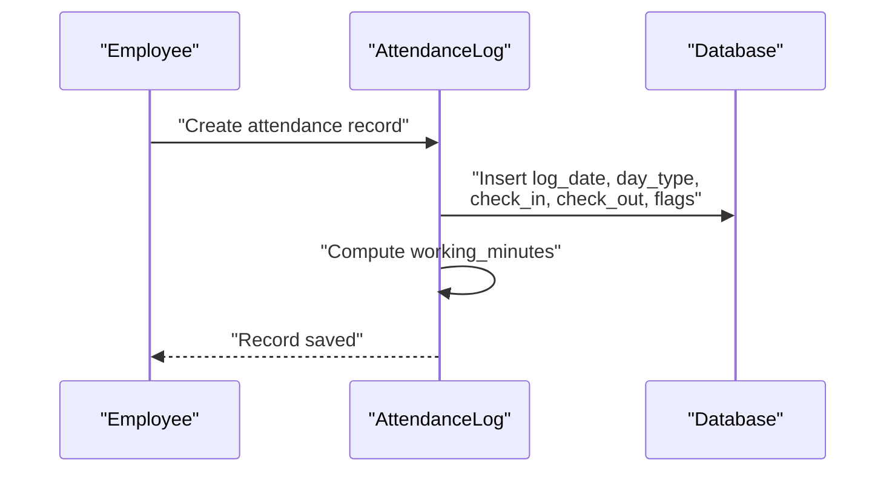

**Diagram sources**
- [app/Models/AttendanceLog.php:28-36](file://app/Models/AttendanceLog.php#L28-L36)
- [database/migrations/0001_01_01_000006_create_attendance_worklogs_tables.php:11-29](file://database/migrations/0001_01_01_000006_create_attendance_worklogs_tables.php#L11-L29)

### Work Log Entry Workflow
This sequence shows how a work log is recorded for billing and payroll.

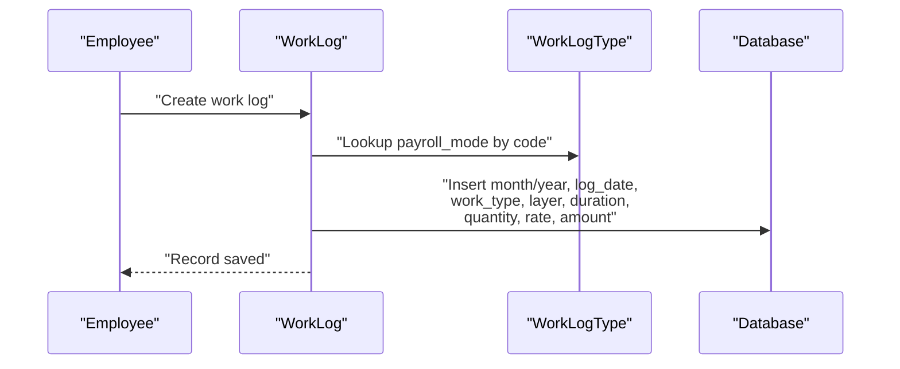

**Diagram sources**
- [app/Models/WorkLog.php:24-33](file://app/Models/WorkLog.php#L24-L33)
- [app/Models/WorkLogType.php:9-15](file://app/Models/WorkLogType.php#L9-L15)
- [database/migrations/0001_01_01_01_000006_create_attendance_worklogs_tables.php:40-60](file://database/migrations/0001_01_01_000006_create_attendance_worklogs_tables.php#L40-L60)

### Overtime (OT) Calculation Flow
Overtime is tracked per day and can be enabled per record. The flow below outlines how OT minutes are accumulated and flagged.

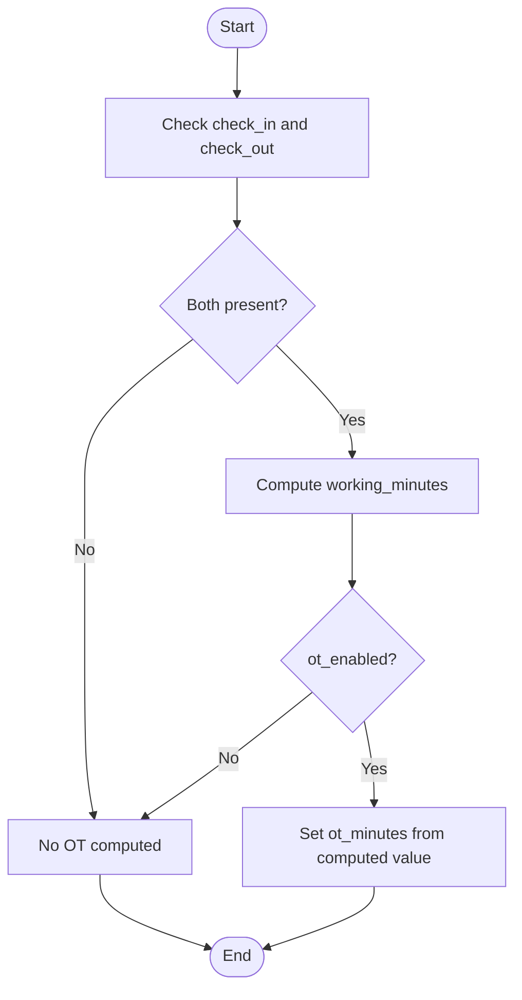

**Diagram sources**
- [app/Models/AttendanceLog.php:28-36](file://app/Models/AttendanceLog.php#L28-L36)
- [database/migrations/0001_01_01_000006_create_attendance_worklogs_tables.php:11-29](file://database/migrations/0001_01_01_000006_create_attendance_worklogs_tables.php#L11-L29)

### Late Deductions and LWOP Processing
Late minutes and early leave are captured per day. LWOP flag marks a day as unpaid leave. These fields integrate with payroll rules to compute deductions or zero pay for the day.

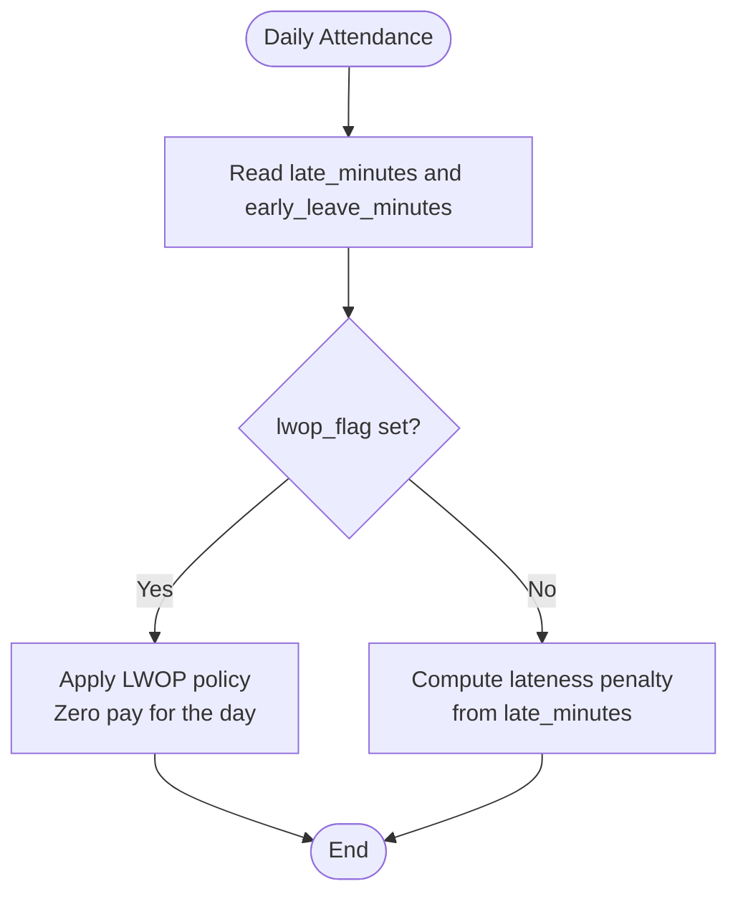

**Diagram sources**
- [database/migrations/0001_01_01_000006_create_attendance_worklogs_tables.php:11-29](file://database/migrations/0001_01_01_000006_create_attendance_worklogs_tables.php#L11-L29)

### Hourly Billing and Layer Rate Calculations
For freelancers and contractors, work logs capture hours/minutes/seconds and convert to duration_minutes. Rates and amounts are stored as decimals with appropriate precision. Amount equals rate multiplied by quantity (or duration in some modes).

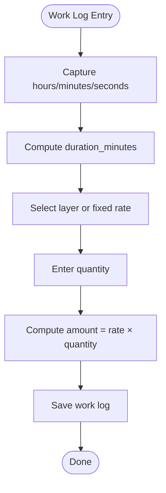

**Diagram sources**
- [app/Models/WorkLog.php:29-32](file://app/Models/WorkLog.php#L29-L32)
- [database/migrations/0001_01_01_000006_create_attendance_worklogs_tables.php:40-60](file://database/migrations/0001_01_01_000006_create_attendance_worklogs_tables.php#L40-L60)

## Dependency Analysis
- AttendanceLog depends on Employee and uses Carbon for time arithmetic
- WorkLog depends on Employee and WorkLogType; amount depends on rate and quantity
- Employee aggregates AttendanceLog and WorkLog for payroll aggregation
- PayrollItemType supports categorizing payroll items during computation

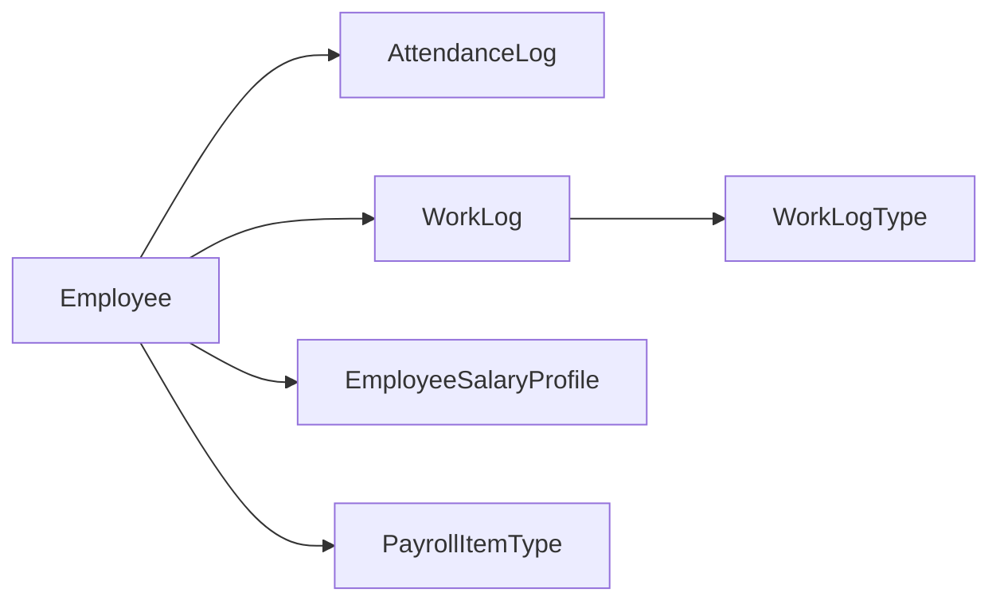

**Diagram sources**
- [app/Models/Employee.php:77-110](file://app/Models/Employee.php#L77-L110)
- [app/Models/AttendanceLog.php:23-26](file://app/Models/AttendanceLog.php#L23-L26)
- [app/Models/WorkLog.php:24-27](file://app/Models/WorkLog.php#L24-L27)
- [app/Models/WorkLogType.php:9-15](file://app/Models/WorkLogType.php#L9-L15)
- [app/Models/EmployeeSalaryProfile.php:22-25](file://app/Models/EmployeeSalaryProfile.php#L22-L25)
- [app/Models/PayrollItemType.php:9-15](file://app/Models/PayrollItemType.php#L9-L15)

**Section sources**
- [app/Models/Employee.php:77-110](file://app/Models/Employee.php#L77-L110)
- [app/Models/AttendanceLog.php:23-37](file://app/Models/AttendanceLog.php#L23-L37)
- [app/Models/WorkLog.php:24-33](file://app/Models/WorkLog.php#L24-L33)
- [app/Models/WorkLogType.php:9-15](file://app/Models/WorkLogType.php#L9-L15)
- [app/Models/EmployeeSalaryProfile.php:22-25](file://app/Models/EmployeeSalaryProfile.php#L22-L25)
- [app/Models/PayrollItemType.php:9-15](file://app/Models/PayrollItemType.php#L9-L15)

## Performance Considerations
- Indexes
  - attendance_logs: unique(employee_id, log_date), index(log_date)
  - work_logs: index(employee_id, month, year)
- Casting
  - Decimals with fixed precision reduce rounding errors and improve report accuracy
- Computed properties
  - working_minutes and duration_minutes avoid repeated time parsing and improve readability
- Recommendations
  - Batch queries for monthly payroll runs using indexed columns
  - Cache frequently accessed WorkLogType payroll_mode values
  - Use soft-deleted Employee records consistently to prevent orphaned logs

[No sources needed since this section provides general guidance]

## Troubleshooting Guide
- Missing check-in or check-out
  - Symptom: working_minutes returns 0
  - Cause: Either check_in or check_out is null
  - Resolution: Ensure both timestamps are recorded before computing durations
- LWOP days
  - Symptom: Zero pay for a day despite presence
  - Cause: lwop_flag is set
  - Resolution: Verify leave policies and flagging procedures
- Incorrect OT computation
  - Symptom: OT minutes not applied
  - Cause: ot_enabled not set or check_in/check_out missing
  - Resolution: Enable ot_enabled and ensure accurate timestamps
- Hourly billing discrepancies
  - Symptom: Amount differs from expected
  - Cause: Incorrect rate, quantity, or layer selection
  - Resolution: Recompute amount = rate × quantity and validate duration_minutes

**Section sources**
- [app/Models/AttendanceLog.php:28-36](file://app/Models/AttendanceLog.php#L28-L36)
- [app/Models/WorkLog.php:29-32](file://app/Models/WorkLog.php#L29-L32)
- [database/migrations/0001_01_01_000006_create_attendance_worklogs_tables.php:11-29](file://database/migrations/0001_01_01_000006_create_attendance_worklogs_tables.php#L11-L29)
- [database/migrations/0001_01_01_000006_create_attendance_worklogs_tables.php:40-60](file://database/migrations/0001_01_01_000006_create_attendance_worklogs_tables.php#L40-L60)

## Conclusion
AttendanceLog and WorkLog form the backbone of time-tracking and payroll processing. AttendanceLog captures daily timing metrics and flags for OT, lateness, and LWOP, while WorkLog supports flexible hourly billing and layer-rate computations for freelancers and contractors. Proper indexing, casting, and computed properties ensure reliable aggregations and accurate payroll outcomes.