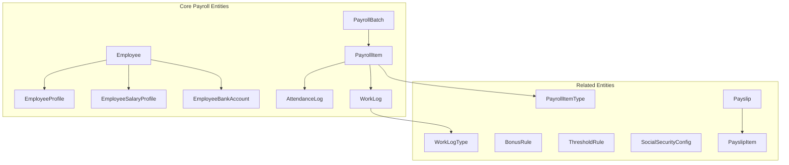
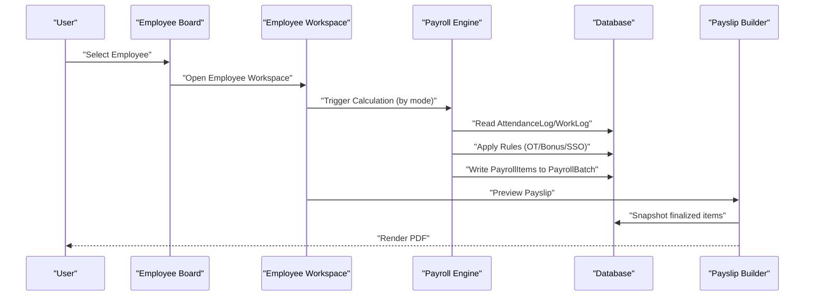
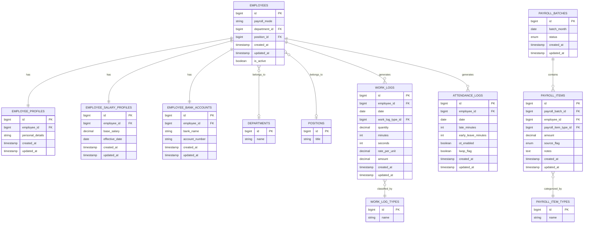
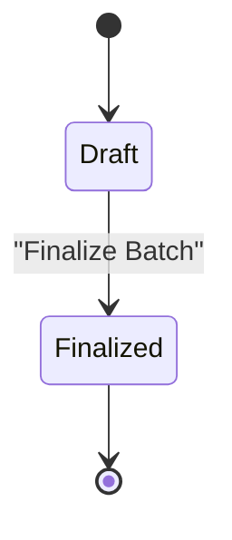
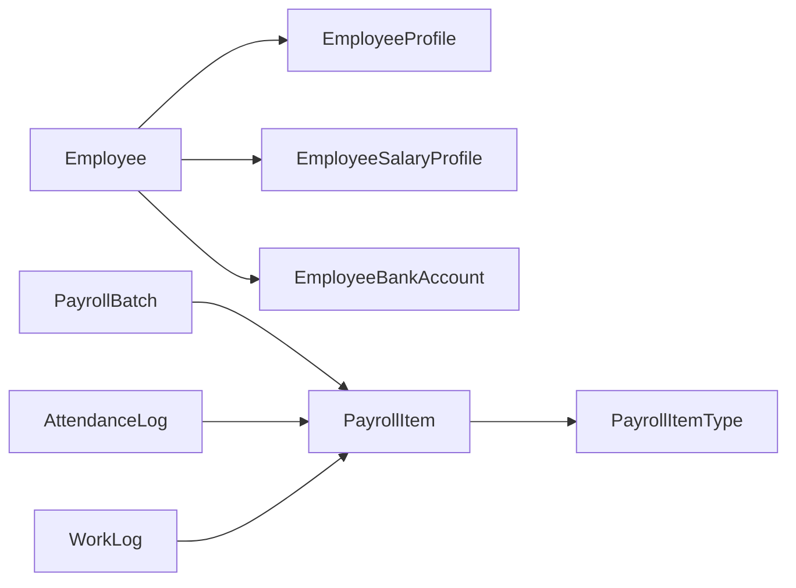

# Core Payroll Entities

<cite>
**Referenced Files in This Document**
- [AGENTS.md](file://AGENTS.md)
</cite>

## Table of Contents
1. [Introduction](#introduction)
2. [Project Structure](#project-structure)
3. [Core Components](#core-components)
4. [Architecture Overview](#architecture-overview)
5. [Detailed Component Analysis](#detailed-component-analysis)
6. [Dependency Analysis](#dependency-analysis)
7. [Performance Considerations](#performance-considerations)
8. [Troubleshooting Guide](#troubleshooting-guide)
9. [Conclusion](#conclusion)

## Introduction
This document describes the core payroll entities that form the backbone of the xHR Payroll & Finance System. It focuses on the fundamental domain objects: Employee, EmployeeProfile, EmployeeSalaryProfile, EmployeeBankAccount, PayrollBatch, PayrollItem, AttendanceLog, and WorkLog. For each entity, we explain responsibilities, data attributes, business significance, relationships, primary/foreign key associations, lifecycle/state transitions, validation rules, and typical payroll processing workflows. We also outline database schema implications and indexing strategies for optimal performance.

## Project Structure
The repository provides a comprehensive domain model and database guidelines. The core entities are defined and grouped under the domain model and database guidelines sections. The suggested tables include the core payroll entities and related modules.

**Diagram sources**
- [AGENTS.md:387-417](file://AGENTS.md#L387-L417)
- [AGENTS.md:132-149](file://AGENTS.md#L132-L149)

**Section sources**
- [AGENTS.md:121-150](file://AGENTS.md#L121-L150)
- [AGENTS.md:387-417](file://AGENTS.md#L387-L417)

## Core Components
This section introduces the core payroll entities and their roles in the system.

- Employee: Represents a person employed by the organization. Maintains identity and assignment to payroll modes and departments.
- EmployeeProfile: Stores personal and employment-related details linked to Employee.
- EmployeeSalaryProfile: Holds base salary and salary-related configurations tied to Employee.
- EmployeeBankAccount: Stores bank account details for salary disbursement linked to Employee.
- PayrollBatch: A container for a set of payroll calculations generated for a specific period/month.
- PayrollItem: A line item representing income or deduction entries for an employee within a batch.
- AttendanceLog: Records daily attendance events (check-in/out, late minutes, early leave, OT enabled, LWOP).
- WorkLog: Captures work performed by freelancers or hybrid workers (date, type, quantity/time, layer, rate, amount).

These entities collectively support dynamic, rule-driven payroll processing with auditability and maintainability.

**Section sources**
- [AGENTS.md:132-149](file://AGENTS.md#L132-L149)
- [AGENTS.md:387-417](file://AGENTS.md#L387-L417)

## Architecture Overview
The payroll system follows a record-based, rule-driven architecture. Entities are stored as records in relational tables with explicit foreign keys. Payroll processing is driven by configurable rules and modes, and outputs are captured in snapshots for auditability.

**Diagram sources**
- [AGENTS.md:513-515](file://AGENTS.md#L513-L515)
- [AGENTS.md:338-343](file://AGENTS.md#L338-L343)
- [AGENTS.md:413-416](file://AGENTS.md#L413-L416)

## Detailed Component Analysis

### Employee
Responsibilities:
- Maintain identity and employment metadata.
- Link to EmployeeProfile, EmployeeSalaryProfile, EmployeeBankAccount.
- Assign payroll mode and department/position.

Attributes (based on conventions):
- id (PK)
- personal identifiers and contact info
- payroll_mode
- department_id, position_id
- timestamps and status flags

Lifecycle and state:
- Active/Inactive
- Mode changes trigger recalculations
- Profile updates may require audit trail

Validation rules:
- Unique identifiers
- Valid payroll mode
- Department/position assignment

Relationships:
- One-to-one with EmployeeProfile
- One-to-one with EmployeeSalaryProfile
- One-to-one with EmployeeBankAccount
- Many-to-one with departments and positions

**Section sources**
- [AGENTS.md:294-301](file://AGENTS.md#L294-L301)
- [AGENTS.md:418-427](file://AGENTS.md#L418-L427)

### EmployeeProfile
Responsibilities:
- Store personal and employment details.
- Provide master-level profile data for payroll calculations.

Attributes:
- id (PK)
- employee_id (FK)
- personal details (name, ID, address)
- timestamps and status flags

Relationships:
- Belongs to Employee (one-to-one)

**Section sources**
- [AGENTS.md:392-393](file://AGENTS.md#L392-L393)
- [AGENTS.md:418-427](file://AGENTS.md#L418-L427)

### EmployeeSalaryProfile
Responsibilities:
- Define base salary and salary-related configurations.
- Provide master salary data for monthly staff and hybrid modes.

Attributes:
- id (PK)
- employee_id (FK)
- base_salary
- effective_date
- timestamps and status flags

Relationships:
- Belongs to Employee (one-to-one)

**Section sources**
- [AGENTS.md:393-394](file://AGENTS.md#L393-L394)
- [AGENTS.md:418-427](file://AGENTS.md#L418-L427)

### EmployeeBankAccount
Responsibilities:
- Store bank account details for salary disbursement.
- Provide bank information for payslip and payroll exports.

Attributes:
- id (PK)
- employee_id (FK)
- bank_name, account_number
- timestamps and status flags

Relationships:
- Belongs to Employee (one-to-one)

**Section sources**
- [AGENTS.md:394-395](file://AGENTS.md#L394-L395)
- [AGENTS.md:418-427](file://AGENTS.md#L418-L427)

### PayrollBatch
Responsibilities:
- Encapsulate a payroll calculation run for a given month/period.
- Group PayrollItems produced during processing.

Attributes:
- id (PK)
- batch_month (date)
- status (draft/finalized)
- timestamps and audit references

Relationships:
- Contains many PayrollItems
- Triggers payslip generation

**Section sources**
- [AGENTS.md:397-398](file://AGENTS.md#L397-L398)
- [AGENTS.md:418-427](file://AGENTS.md#L418-L427)

### PayrollItem
Responsibilities:
- Represent individual income or deduction entries for an employee.
- Capture source flags (auto/manual/override/master) and rule application.

Attributes:
- id (PK)
- payroll_batch_id (FK)
- employee_id (FK)
- payroll_item_type_id (FK)
- amount
- source_flag (auto/manual/override/master)
- notes/reason
- timestamps and status flags

Relationships:
- Belongs to PayrollBatch
- Belongs to Employee
- Belongs to PayrollItemType
- Optionally references AttendanceLog or WorkLog

**Section sources**
- [AGENTS.md:398-399](file://AGENTS.md#L398-L399)
- [AGENTS.md:400](file://AGENTS.md#L400)
- [AGENTS.md:418-427](file://AGENTS.md#L418-L427)

### AttendanceLog
Responsibilities:
- Track daily attendance events for monthly staff.
- Provide data for OT, late deductions, and LWOP calculations.

Attributes:
- id (PK)
- employee_id (FK)
- date (day)
- check_in_minutes, check_out_minutes
- late_minutes, early_leave_minutes
- ot_enabled, lwop_flag
- timestamps and status flags

Relationships:
- Belongs to Employee
- Supports PayrollItem derivation

**Section sources**
- [AGENTS.md:401](file://AGENTS.md#L401)
- [AGENTS.md:418-427](file://AGENTS.md#L418-L427)

### WorkLog
Responsibilities:
- Record work performed by freelancers or hybrid workers.
- Feed amounts into PayrollItems for layer or fixed-rate modes.

Attributes:
- id (PK)
- employee_id (FK)
- date
- work_log_type_id (FK)
- quantity, minutes, seconds
- layer, rate_per_unit
- amount
- timestamps and status flags

Relationships:
- Belongs to Employee
- Belongs to WorkLogType
- Supports PayrollItem derivation

**Section sources**
- [AGENTS.md:402](file://AGENTS.md#L402)
- [AGENTS.md:403](file://AGENTS.md#L403)
- [AGENTS.md:418-427](file://AGENTS.md#L418-L427)

### Entity Relationships and Data Flow
The following diagram shows how core entities relate and flow data during payroll processing.

**Diagram sources**
- [AGENTS.md:387-417](file://AGENTS.md#L387-L417)
- [AGENTS.md:418-427](file://AGENTS.md#L418-L427)

### Lifecycle Management and State Transitions
- Employee: Activate/Deactivate; change payroll mode; update profile/salary/bank info.
- PayrollBatch: draft → finalized; snapshot and freeze for audit.
- PayrollItem: auto/manual/override/master; monthly-only vs master; draft/finalized.
- AttendanceLog/WorkLog: daily records; feed into PayrollItems; support recalculations.

**Diagram sources**
- [AGENTS.md:528-538](file://AGENTS.md#L528-L538)
- [AGENTS.md:567-573](file://AGENTS.md#L567-L573)

## Dependency Analysis
The core entities depend on each other through foreign keys and business rules. PayrollItems depend on PayrollBatch, Employee, and PayrollItemType. AttendanceLog and WorkLog feed into PayrollItems. Employee-related entities (Profile, SalaryProfile, BankAccount) provide master data for calculations.

**Diagram sources**
- [AGENTS.md:392-400](file://AGENTS.md#L392-L400)
- [AGENTS.md:401-403](file://AGENTS.md#L401-L403)

**Section sources**
- [AGENTS.md:387-417](file://AGENTS.md#L387-L417)

## Performance Considerations
Indexing strategies for optimal performance:
- Primary keys: implicit on all tables.
- Foreign keys: create indexes on payroll_batch_id, employee_id, payroll_item_type_id, work_log_type_id, department_id, position_id.
- Date-based queries: index batch_month on PayrollBatch; date on AttendanceLog; date on WorkLog.
- Monetary fields: use decimal precision as per conventions.
- Status flags: add indexes for frequently filtered columns (is_active, status).
- Audit references: ensure audit_logs reference columns are indexed for fast lookups.

Data types and conventions:
- Use unsigned big integers for foreign keys.
- Monetary fields: decimal(12,2) or larger as needed.
- Durations: integer minutes/seconds.
- Avoid rigid enums; prefer lookup tables for extensibility.

**Section sources**
- [AGENTS.md:184-189](file://AGENTS.md#L184-L189)
- [AGENTS.md:418-427](file://AGENTS.md#L418-L427)

## Troubleshooting Guide
Common issues and resolutions:
- Duplicate or missing payroll items: verify PayrollBatch status and PayrollItem source flags.
- Incorrect attendance-derived amounts: check AttendanceLog entries and OT/LWOP flags.
- Work log discrepancies: confirm WorkLogType rates and layer configurations.
- Audit gaps: ensure audit logs capture who, what, when, old/new values, and reasons.
- Soft deletes: apply soft deletes selectively to entities requiring historical tracking.

Validation checklist:
- Unique employee identifiers and payroll modes.
- Base salary effective dates and currency precision.
- Bank account completeness for disbursement.
- AttendanceLog date ranges aligned with PayrollBatch month.

**Section sources**
- [AGENTS.md:578-595](file://AGENTS.md#L578-L595)
- [AGENTS.md:190-195](file://AGENTS.md#L190-L195)

## Conclusion
The core payroll entities—Employee, EmployeeProfile, EmployeeSalaryProfile, EmployeeBankAccount, PayrollBatch, PayrollItem, AttendanceLog, and WorkLog—form a robust, rule-driven foundation for dynamic payroll processing. Their relationships, lifecycle states, and validation rules ensure maintainability, auditability, and scalability across multiple payroll modes. Proper indexing and data type conventions support performance and reliability in production environments.