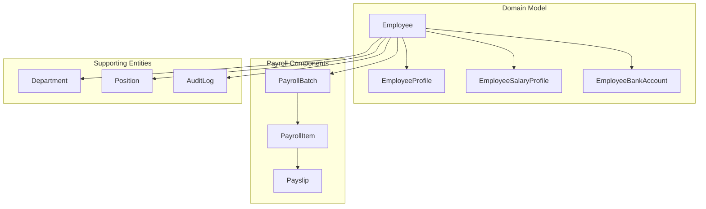
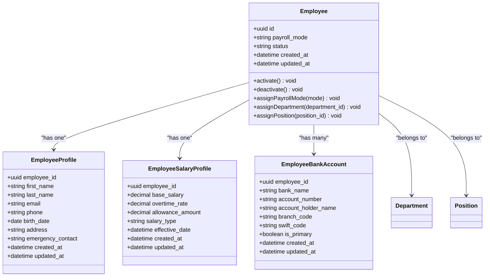
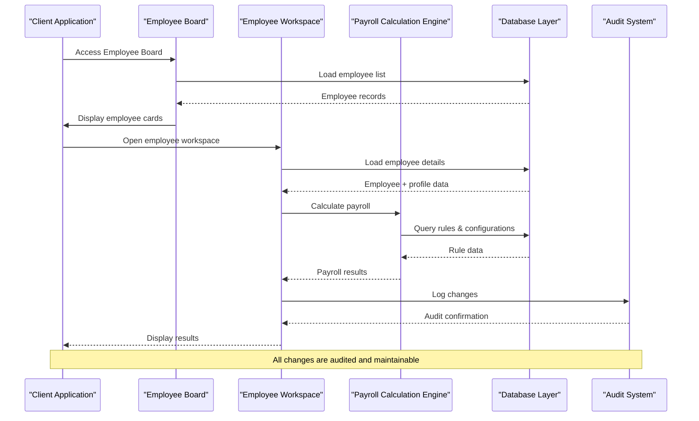
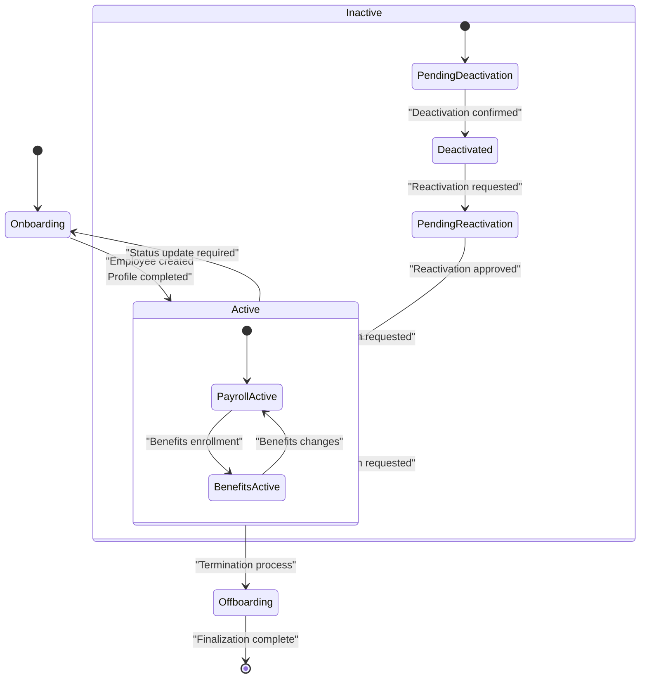
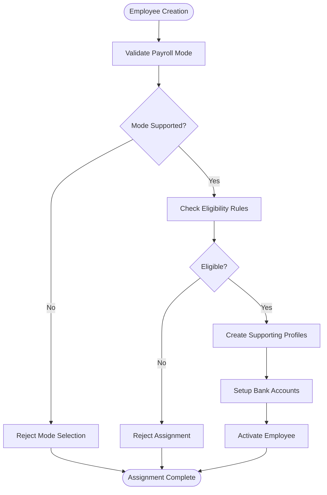
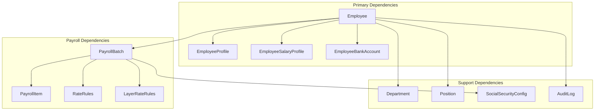

# Employee Entity

<cite>
**Referenced Files in This Document**
- [AGENTS.md](file://AGENTS.md)
</cite>

## Table of Contents
1. [Introduction](#introduction)
2. [Project Structure](#project-structure)
3. [Core Components](#core-components)
4. [Architecture Overview](#architecture-overview)
5. [Detailed Component Analysis](#detailed-component-analysis)
6. [Dependency Analysis](#dependency-analysis)
7. [Performance Considerations](#performance-considerations)
8. [Troubleshooting Guide](#troubleshooting-guide)
9. [Conclusion](#conclusion)

## Introduction

The Employee entity serves as the central hub for all payroll-related activities in the HRX system. It represents the complete employment profile of an individual and acts as the primary reference point for all payroll calculations, benefits administration, and employment lifecycle management. The Employee entity integrates seamlessly with related components including EmployeeProfile, EmployeeSalaryProfile, and EmployeeBankAccount to provide a comprehensive payroll ecosystem.

This documentation provides detailed insights into the Employee entity's structure, relationships, lifecycle management, and business logic that governs employee data access and modifications within the payroll system.

## Project Structure

The Employee entity is part of a larger domain-driven architecture that emphasizes record-based data storage, rule-driven configurations, and maintainable system design. The system follows Laravel conventions while maintaining database compatibility with phpMyAdmin environments.

**Diagram sources**
- [AGENTS.md:132-149](file://AGENTS.md#L132-L149)
- [AGENTS.md:392-395](file://AGENTS.md#L392-L395)

**Section sources**
- [AGENTS.md:121-150](file://AGENTS.md#L121-L150)
- [AGENTS.md:385-417](file://AGENTS.md#L385-L417)

## Core Components

The Employee entity encompasses several critical components that define its functionality and relationships within the payroll ecosystem:

### Primary Data Structure

The Employee entity maintains comprehensive personal and employment information through its associated profiles:

- **Personal Information Fields**: Complete demographic and contact details
- **Employment Status Tracking**: Active/inactive states and lifecycle management
- **Payroll Mode Assignment**: Flexible payroll configuration options
- **Department/Position Assignments**: Organizational structure integration
- **Bank Account Information**: Direct deposit and payment processing

### Payroll Mode Support

The system supports six distinct payroll modes to accommodate various employment types:

- **Monthly Staff**: Traditional salaried employees
- **Freelance Layer**: Hourly-based freelance work with layered rates
- **Freelance Fixed**: Fixed-rate freelance contracts
- **Youtuber Salary**: Content creator compensation
- **Youtuber Settlement**: Content creator settlement calculations
- **Custom Hybrid**: Mixed-mode payroll configurations

### Relationship Architecture

**Diagram sources**
- [AGENTS.md:132-136](file://AGENTS.md#L132-L136)
- [AGENTS.md:392-395](file://AGENTS.md#L392-L395)

**Section sources**
- [AGENTS.md:123-131](file://AGENTS.md#L123-L131)
- [AGENTS.md:132-136](file://AGENTS.md#L132-L136)
- [AGENTS.md:392-395](file://AGENTS.md#L392-L395)

## Architecture Overview

The Employee entity operates within a sophisticated payroll architecture that emphasizes data integrity, auditability, and maintainability. The system follows record-based storage principles, avoiding spreadsheet-style cell-based thinking.

**Diagram sources**
- [AGENTS.md:510-515](file://AGENTS.md#L510-L515)
- [AGENTS.md:228-244](file://AGENTS.md#L228-L244)

The architecture ensures that all payroll calculations are rule-driven, configurable, and maintainable. The Employee entity serves as the central coordinator for all payroll-related activities, maintaining data consistency across all related components.

**Section sources**
- [AGENTS.md:34-48](file://AGENTS.md#L34-L48)
- [AGENTS.md:510-515](file://AGENTS.md#L510-L515)
- [AGENTS.md:228-244](file://AGENTS.md#L228-L244)

## Detailed Component Analysis

### Employee Lifecycle Management

The Employee entity manages a comprehensive lifecycle from onboarding to offboarding, with robust status tracking and validation mechanisms.

**Diagram sources**
- [AGENTS.md:294-302](file://AGENTS.md#L294-L302)
- [AGENTS.md:438-445](file://AGENTS.md#L438-L445)

### Status Management and Validation

The Employee entity implements strict validation rules to ensure data integrity throughout the employment lifecycle:

- **Activation/Deactivation**: Controlled status transitions with audit trails
- **Payroll Mode Changes**: Validation against supported modes and configurations
- **Department/Position Assignments**: Hierarchical validation and inheritance
- **Bank Information Updates**: Multi-account support with primary designation

### Payroll Mode Assignment Logic

**Diagram sources**
- [AGENTS.md:294-302](file://AGENTS.md#L294-L302)
- [AGENTS.md:123-131](file://AGENTS.md#L123-L131)

**Section sources**
- [AGENTS.md:294-302](file://AGENTS.md#L294-L302)
- [AGENTS.md:123-131](file://AGENTS.md#L123-L131)

### Data Integrity and Business Rules

The Employee entity enforces comprehensive business rules to maintain data consistency:

- **Single Source of Truth**: All payroll calculations reference master data
- **Rule-Driven Calculations**: No hardcoded values for legal thresholds
- **Audit Trail Requirements**: Every significant change is logged
- **Validation Layers**: Multi-tier validation for all data modifications

**Section sources**
- [AGENTS.md:438-445](file://AGENTS.md#L438-L445)
- [AGENTS.md:576-595](file://AGENTS.md#L576-L595)

## Dependency Analysis

The Employee entity maintains carefully managed dependencies to ensure system coherence and maintainability:

**Diagram sources**
- [AGENTS.md:132-149](file://AGENTS.md#L132-L149)
- [AGENTS.md:392-416](file://AGENTS.md#L392-L416)

The dependency structure ensures loose coupling while maintaining strong relationships necessary for payroll processing. Each dependency serves a specific purpose in the payroll calculation and management workflow.

**Section sources**
- [AGENTS.md:132-149](file://AGENTS.md#L132-L149)
- [AGENTS.md:392-416](file://AGENTS.md#L392-L416)

## Performance Considerations

The Employee entity is designed with performance optimization in mind:

- **Database Indexing**: Strategic indexing on frequently queried fields
- **Query Optimization**: Efficient joins and minimal N+1 query scenarios
- **Caching Strategies**: Appropriate caching for static reference data
- **Batch Processing**: Optimized batch operations for payroll calculations

The system employs unsigned big integers for foreign keys, decimal precision for monetary values, and appropriate data types for timestamps and durations to ensure optimal performance across all operations.

## Troubleshooting Guide

Common issues and their resolutions when working with the Employee entity:

### Status Management Issues
- **Problem**: Employee remains inactive despite successful activation
- **Solution**: Verify payroll mode compatibility and required profile completion
- **Prevention**: Implement proper validation before status transitions

### Payroll Mode Assignment Failures
- **Problem**: Cannot assign specific payroll mode
- **Solution**: Check eligibility rules and configuration requirements
- **Prevention**: Validate mode support before assignment attempts

### Data Integrity Violations
- **Problem**: Audit trail inconsistencies
- **Solution**: Review change logs and restore from audit snapshots
- **Prevention**: Implement comprehensive validation layers

**Section sources**
- [AGENTS.md:576-595](file://AGENTS.md#L576-L595)
- [AGENTS.md:663-672](file://AGENTS.md#L663-L672)

## Conclusion

The Employee entity represents a sophisticated, rule-driven approach to payroll management that balances user experience with system integrity. Its comprehensive design accommodates various employment types while maintaining strict data governance and auditability.

Key strengths of the Employee entity implementation include:

- **Comprehensive Coverage**: Handles all aspects of employee payroll lifecycle
- **Flexible Configuration**: Supports multiple payroll modes and organizational structures
- **Robust Validation**: Multi-layer validation ensures data integrity
- **Maintainable Architecture**: Rule-driven design enables easy system evolution
- **Audit-Ready**: Complete change tracking for compliance requirements

The Employee entity successfully transforms traditional spreadsheet-based payroll management into a modern, maintainable, and scalable system while preserving the intuitive user experience that makes payroll processing efficient and error-free.