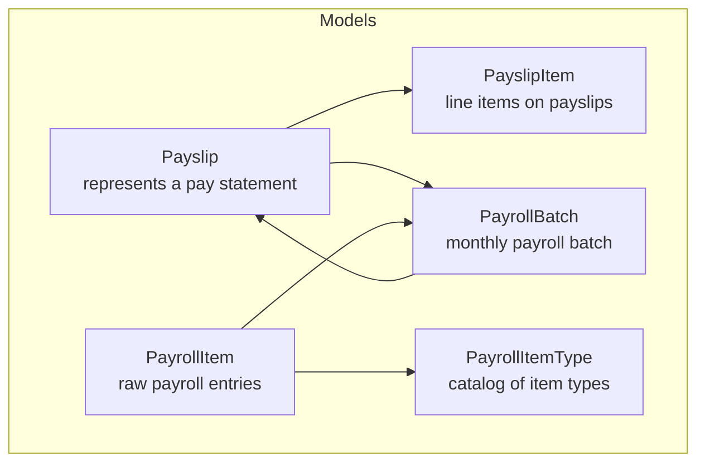
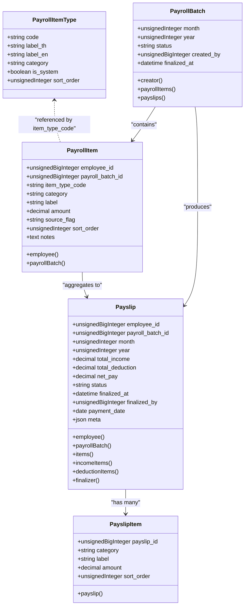
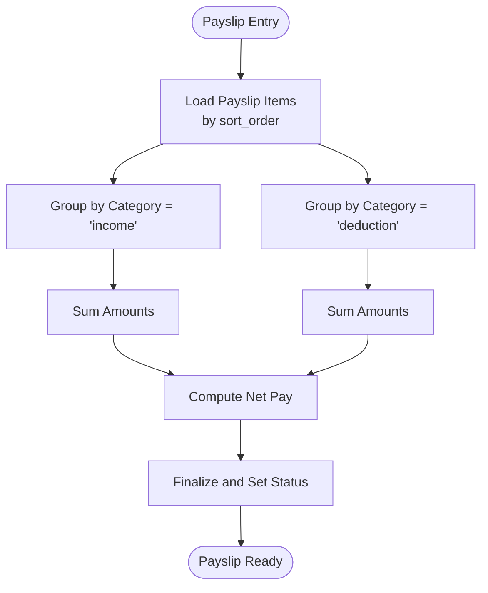
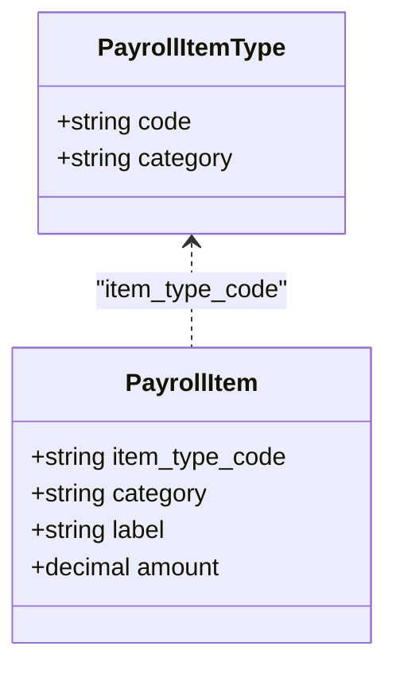
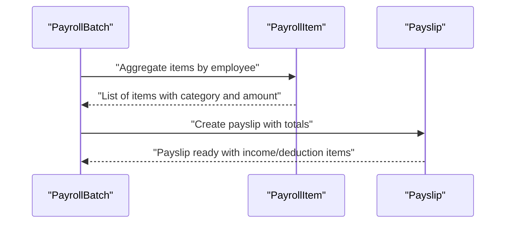
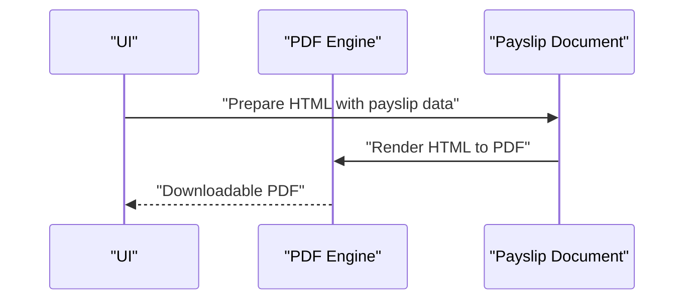

# Financial and Reporting Entities

<cite>
**Referenced Files in This Document**
- [Payslip.php](file://app/Models/Payslip.php)
- [PayslipItem.php](file://app/Models/PayslipItem.php)
- [PayrollItem.php](file://app/Models/PayrollItem.php)
- [PayrollItemType.php](file://app/Models/PayrollItemType.php)
- [PayrollBatch.php](file://app/Models/PayrollBatch.php)
- [0001_01_01_000007_create_payroll_tables.php](file://database/migrations/0001_01_01_000007_create_payroll_tables.php)
- [0001_01_01_000009_create_payslips_tables.php](file://database/migrations/0001_01_01_000009_create_payslips_tables.php)
- [composer.lock](file://composer.lock)
- [README.md](file://README.md)
</cite>

## Table of Contents
1. [Introduction](#introduction)
2. [Project Structure](#project-structure)
3. [Core Components](#core-components)
4. [Architecture Overview](#architecture-overview)
5. [Detailed Component Analysis](#detailed-component-analysis)
6. [Dependency Analysis](#dependency-analysis)
7. [Performance Considerations](#performance-considerations)
8. [Troubleshooting Guide](#troubleshooting-guide)
9. [Conclusion](#conclusion)
10. [Appendices](#appendices)

## Introduction
This document describes the financial and reporting entities within the system, focusing on payslips, payroll items, and payroll batches. It explains the structure of payslips, itemization requirements, and the PDF generation workflow. It also documents company financial tracking including revenue streams, expense categories, and subscription cost management, along with the relationship between payroll items and financial reporting, including tax implications and regulatory compliance. Finally, it covers financial data aggregation, reporting requirements, and audit trail maintenance for financial transactions, with examples of payslip generation, financial statement preparation, and compliance reporting workflows.

## Project Structure
The financial domain is primarily implemented using Eloquent models and database migrations. The core entities are:
- Payslip: represents an individual employee pay statement
- PayslipItem: line items on a payslip (income and deduction)
- PayrollItem: raw payroll entries generated per batch
- PayrollItemType: catalog of payroll item types (income/deduction)
- PayrollBatch: monthly payroll processing batch

**Diagram sources**
- [Payslip.php:1-57](file://app/Models/Payslip.php#L1-L57)
- [PayslipItem.php:1-21](file://app/Models/PayslipItem.php#L1-L21)
- [PayrollItem.php:1-29](file://app/Models/PayrollItem.php#L1-L29)
- [PayrollItemType.php:1-16](file://app/Models/PayrollItemType.php#L1-L16)
- [PayrollBatch.php:1-31](file://app/Models/PayrollBatch.php#L1-L31)

**Section sources**
- [README.md:1-59](file://README.md#L1-L59)

## Core Components
This section outlines the primary financial entities and their responsibilities.

- Payslip
  - Purpose: Holds summarized earnings, deductions, and net pay for an employee in a given month/year.
  - Key attributes: employee linkage, payroll batch linkage, totals, status, finalization metadata, payment date, and rendering metadata.
  - Relationships: belongs to Employee; belongs to PayrollBatch; has many PayslipItems; filtered relations for income and deductions; belongs to User for finalizer.

- PayslipItem
  - Purpose: Line items on a payslip grouped by category (income/deduction).
  - Key attributes: category, label, amount, sort order, and payslip linkage.
  - Relationships: belongs to Payslip.

- PayrollItem
  - Purpose: Raw payroll entries generated during a batch run, capturing item type, category, label, amount, source flag, and notes.
  - Key attributes: employee, batch, item type code, category, label, amount, source flag, sort order, notes.
  - Relationships: belongs to Employee; belongs to PayrollBatch.

- PayrollItemType
  - Purpose: Catalog of payroll item types with localized labels and categorization.
  - Key attributes: code, Thai/English labels, category, system flag, sort order.

- PayrollBatch
  - Purpose: Monthly processing batch for payroll, tracking status and finalization.
  - Key attributes: month, year, status, creator, finalized timestamp.
  - Relationships: creator linkage; has many PayrollItems and Payslips.

**Section sources**
- [Payslip.php:1-57](file://app/Models/Payslip.php#L1-L57)
- [PayslipItem.php:1-21](file://app/Models/PayslipItem.php#L1-L21)
- [PayrollItem.php:1-29](file://app/Models/PayrollItem.php#L1-L29)
- [PayrollItemType.php:1-16](file://app/Models/PayrollItemType.php#L1-L16)
- [PayrollBatch.php:1-31](file://app/Models/PayrollBatch.php#L1-L31)

## Architecture Overview
The financial architecture centers around batch-driven payroll processing:
- PayrollItemType defines standardized item types (income/deduction).
- PayrollBatch orchestrates monthly processing and links to PayrollItems.
- PayrollItems are aggregated and transformed into Payslips.
- Payslips consolidate income and deduction items and support PDF rendering.

**Diagram sources**
- [PayrollItemType.php:1-16](file://app/Models/PayrollItemType.php#L1-L16)
- [PayrollBatch.php:1-31](file://app/Models/PayrollBatch.php#L1-L31)
- [PayrollItem.php:1-29](file://app/Models/PayrollItem.php#L1-L29)
- [Payslip.php:1-57](file://app/Models/Payslip.php#L1-L57)
- [PayslipItem.php:1-21](file://app/Models/PayslipItem.php#L1-L21)

## Detailed Component Analysis

### Payslip Structure and Itemization
- Structure
  - Summary fields: total_income, total_deduction, net_pay, payment_date, status, and finalization metadata.
  - Relationships: employee, payroll batch, finalizer, and line items.
- Itemization
  - Income and deduction items are ordered by sort_order.
  - Filtering helpers provide incomeItems and deductionItems for reporting and rendering.

**Diagram sources**
- [Payslip.php:37-50](file://app/Models/Payslip.php#L37-L50)
- [PayslipItem.php:1-21](file://app/Models/PayslipItem.php#L1-L21)

**Section sources**
- [Payslip.php:1-57](file://app/Models/Payslip.php#L1-L57)
- [PayslipItem.php:1-21](file://app/Models/PayslipItem.php#L1-L21)

### Payroll Item Types and Categories
- PayrollItemType defines standardized item types with category classification (income/deduction) and localized labels.
- PayrollItem references PayrollItemType via item_type_code to ensure consistent categorization across batches.

**Diagram sources**
- [PayrollItemType.php:1-16](file://app/Models/PayrollItemType.php#L1-L16)
- [PayrollItem.php:1-29](file://app/Models/PayrollItem.php#L1-L29)

**Section sources**
- [PayrollItemType.php:1-16](file://app/Models/PayrollItemType.php#L1-L16)
- [PayrollItem.php:1-29](file://app/Models/PayrollItem.php#L1-L29)

### Payroll Batch Processing
- PayrollBatch encapsulates monthly processing with status tracking and finalization timestamps.
- PayrollItems are indexed by employee and batch for efficient aggregation.
- Payslips are produced per batch and linked to employees.

**Diagram sources**
- [PayrollBatch.php:1-31](file://app/Models/PayrollBatch.php#L1-L31)
- [PayrollItem.php:1-29](file://app/Models/PayrollItem.php#L1-L29)
- [Payslip.php:1-57](file://app/Models/Payslip.php#L1-L57)

**Section sources**
- [PayrollBatch.php:1-31](file://app/Models/PayrollBatch.php#L1-L31)
- [PayrollItem.php:1-29](file://app/Models/PayrollItem.php#L1-L29)
- [Payslip.php:1-57](file://app/Models/Payslip.php#L1-L57)

### PDF Generation Workflow
- The system includes a PDF library dependency for rendering HTML to PDF.
- Typical workflow:
  - Build payslip HTML using payslip data and itemization.
  - Render with the PDF engine to produce a downloadable document.

**Diagram sources**
- [composer.lock:457-557](file://composer.lock#L457-L557)

**Section sources**
- [composer.lock:457-557](file://composer.lock#L457-L557)

### Company Financial Tracking: Revenue Streams, Expenses, and Subscription Costs
- Revenue streams and expense categories are not modeled in the current codebase snapshot.
- Recommendation:
  - Introduce dedicated models for revenue and expense tracking aligned with accounting standards.
  - Define categories and tax classifications for regulatory compliance.
  - Maintain audit trails with timestamps and user attribution.

[No sources needed since this section provides general guidance]

### Relationship Between Payroll Items and Financial Reporting
- Payroll items feed into payslips and can be reported as:
  - Wages and salaries (income)
  - Taxes withheld (deduction)
  - Benefits and contributions (income/deduction depending on nature)
- Tax implications and regulatory compliance:
  - Categorize items by statutory requirements.
  - Track withholding and reporting thresholds.
  - Maintain supporting documentation and audit trails.

[No sources needed since this section provides general guidance]

### Financial Data Aggregation and Reporting
- Aggregation:
  - Summarize PayrollItems by item_type_code and category to build payslips.
  - Consolidate monthly totals per employee and department.
- Reporting:
  - Generate payslips, payroll summaries, and statutory reports.
  - Ensure data integrity with unique constraints (e.g., payslip uniqueness by employee/month/year).
- Audit trail:
  - Record creation/modification timestamps, creators, and finalizers.
  - Preserve meta data for rendering and reconciliation.

**Section sources**
- [0001_01_01_000007_create_payroll_tables.php:1-60](file://database/migrations/0001_01_01_000007_create_payroll_tables.php#L1-L60)
- [0001_01_01_000009_create_payslips_tables.php:1-51](file://database/migrations/0001_01_01_000009_create_payslips_tables.php#L1-L51)

## Dependency Analysis
External dependencies relevant to financial reporting and PDF generation:
- dompdf/dompdf: HTML-to-PDF rendering engine enabling payslip PDF generation.

**Diagram sources**
- [composer.lock:457-557](file://composer.lock#L457-L557)

**Section sources**
- [composer.lock:457-557](file://composer.lock#L457-L557)

## Performance Considerations
- Indexing: Ensure queries on employee_id and payroll_batch_id are efficient for aggregation.
- Sorting: Use sort_order for deterministic itemization and rendering.
- Decimal precision: Use decimal casting to maintain accuracy for monetary values.
- Unique constraints: Prevent duplicate payslips per employee per period.

**Section sources**
- [PayrollItem.php:1-29](file://app/Models/PayrollItem.php#L1-L29)
- [Payslip.php:1-57](file://app/Models/Payslip.php#L1-L57)
- [0001_01_01_000007_create_payroll_tables.php:35-51](file://database/migrations/0001_01_01_000007_create_payroll_tables.php#L35-L51)
- [0001_01_01_000009_create_payslips_tables.php:11-31](file://database/migrations/0001_01_01_000009_create_payslips_tables.php#L11-L31)

## Troubleshooting Guide
- Duplicate payslips: Verify unique constraint on employee_id, month, and year.
- Incorrect totals: Confirm income and deduction sums match aggregated items.
- Missing items: Check sort_order ordering and category filtering.
- PDF rendering issues: Validate HTML template and dompdf configuration.

**Section sources**
- [0001_01_01_000009_create_payslips_tables.php:11-31](file://database/migrations/0001_01_01_000009_create_payslips_tables.php#L11-L31)
- [Payslip.php:37-50](file://app/Models/Payslip.php#L37-L50)
- [composer.lock:457-557](file://composer.lock#L457-L557)

## Conclusion
The system provides a solid foundation for payslip generation and payroll itemization through Eloquent models and migrations. The architecture supports batch-driven processing, item categorization, and PDF rendering. To expand to full financial reporting, introduce revenue/expense models, define categories and tax classifications, and enforce audit trails and compliance controls.

## Appendices

### Example Workflows
- Payslip generation
  - Aggregate PayrollItems by employee and batch.
  - Create Payslip with computed totals and finalize.
  - Render PDF using the PDF engine.
- Financial statement preparation
  - Summarize PayrollItems by item_type_code and category.
  - Report wages, taxes, and benefits for the period.
- Compliance reporting
  - Export categorized payroll data with audit trail metadata.

[No sources needed since this section provides general guidance]