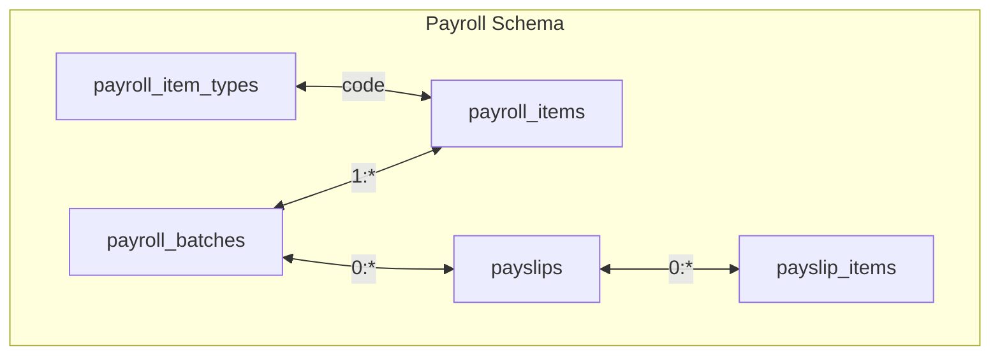
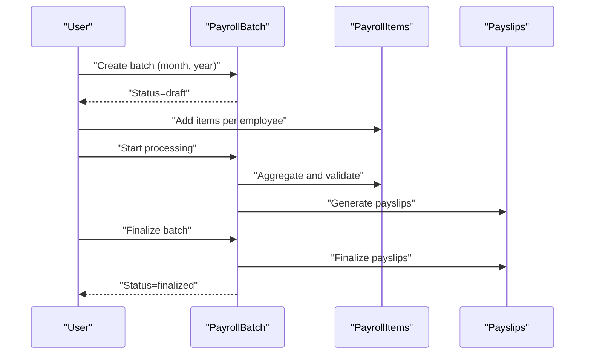
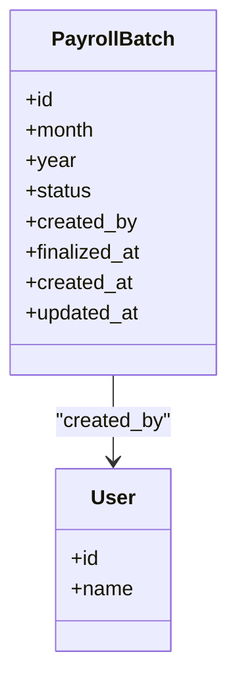
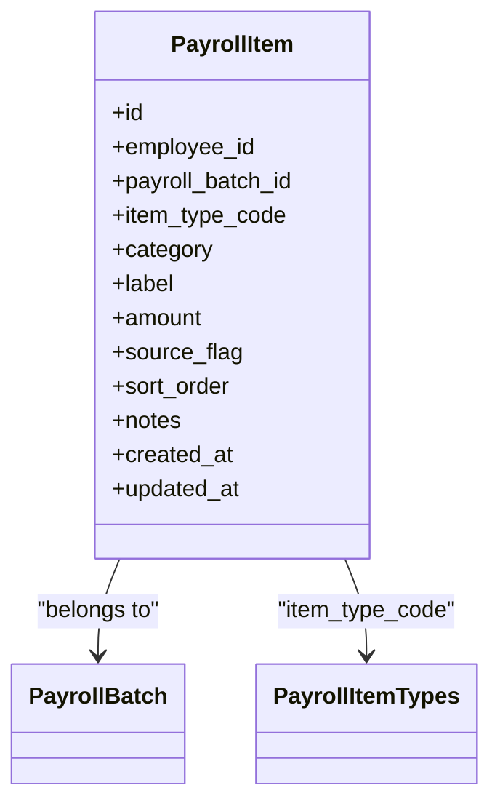
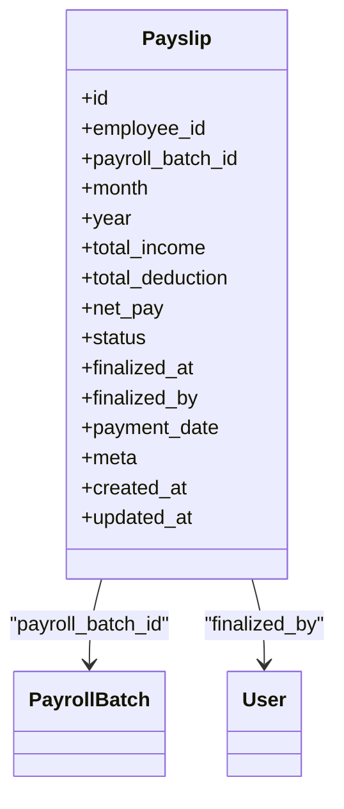
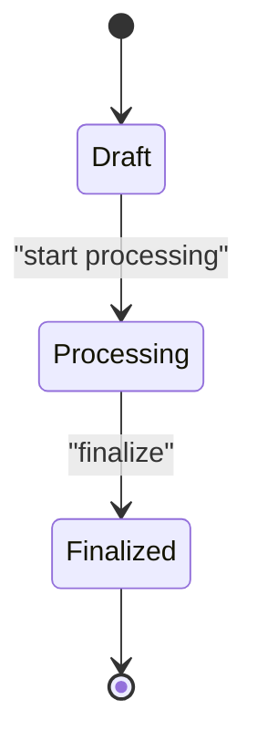
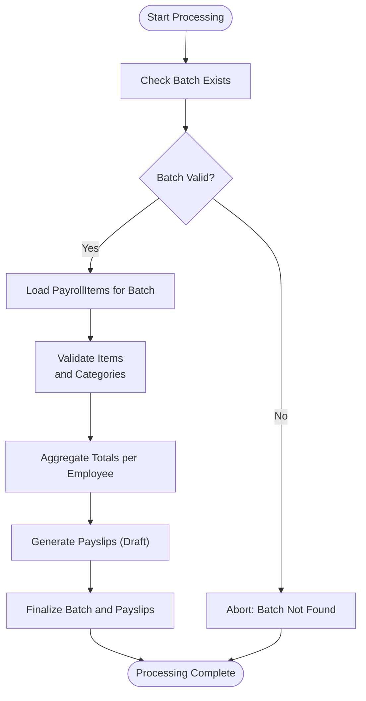
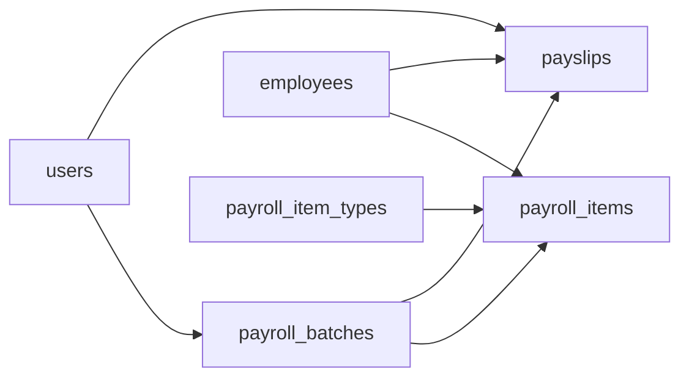

# PayrollBatch Entity

<cite>
**Referenced Files in This Document**
- [0001_01_01_000007_create_payroll_tables.php](file://database/migrations/0001_01_01_000007_create_payroll_tables.php)
- [0001_01_01_000009_create_payslips_tables.php](file://database/migrations/0001_01_01_000009_create_payslips_tables.php)
- [AGENTS.md](file://AGENTS.md)
</cite>

## Table of Contents
1. [Introduction](#introduction)
2. [Project Structure](#project-structure)
3. [Core Components](#core-components)
4. [Architecture Overview](#architecture-overview)
5. [Detailed Component Analysis](#detailed-component-analysis)
6. [Dependency Analysis](#dependency-analysis)
7. [Performance Considerations](#performance-considerations)
8. [Troubleshooting Guide](#troubleshooting-guide)
9. [Conclusion](#conclusion)
10. [Appendices](#appendices)

## Introduction
This document describes the PayrollBatch entity and its role as the container for payroll processing cycles. It explains batch creation, status management, lifecycle progression, and coordination with payroll items and payslips. It also documents validation requirements, processing constraints, error handling mechanisms, and audit trail expectations derived from the schema and system guidelines.

## Project Structure
The PayrollBatch entity is defined in the payroll schema migration and is central to organizing monthly payroll runs. Supporting tables include payroll items and payslips, which are linked to batches to compute per-employee results.

**Diagram sources**
- [0001_01_01_000007_create_payroll_tables.php:22-51](file://database/migrations/0001_01_01_000007_create_payroll_tables.php#L22-L51)
- [0001_01_01_000009_create_payslips_tables.php:11-43](file://database/migrations/0001_01_01_000009_create_payslips_tables.php#L11-L43)

**Section sources**
- [0001_01_01_000007_create_payroll_tables.php:11-51](file://database/migrations/0001_01_01_000007_create_payroll_tables.php#L11-L51)
- [0001_01_01_000009_create_payslips_tables.php:11-43](file://database/migrations/0001_01_01_000009_create_payslips_tables.php#L11-L43)

## Core Components
- PayrollBatch: A monthly container with status and ownership metadata. It groups payroll items and drives payslip generation for employees within that month/year.
- PayrollItem: Per-employee earnings or deductions linked to a batch; supports categorization, ordering, and source tracking.
- Payslip: Per-employee statement generated from a batch; stores totals and finalization metadata.

Key characteristics:
- Unique constraint on month and year ensures one batch per calendar period.
- Status lifecycle: draft → processing → finalized.
- Finalization timestamp and creator tracking for auditability.
- Cascade deletion semantics preserve referential integrity during cleanup.

**Section sources**
- [0001_01_01_000007_create_payroll_tables.php:22-32](file://database/migrations/0001_01_01_000007_create_payroll_tables.php#L22-L32)
- [0001_01_01_000007_create_payroll_tables.php:35-51](file://database/migrations/0001_01_01_000007_create_payroll_tables.php#L35-L51)
- [0001_01_01_000009_create_payslips_tables.php:11-31](file://database/migrations/0001_01_01_000009_create_payslips_tables.php#L11-L31)

## Architecture Overview
The PayrollBatch orchestrates monthly payroll processing:
- Creation: A batch is created for a given month and year with draft status.
- Population: PayrollItems are inserted per employee within the batch.
- Processing: Items are aggregated and validated; payslips are produced.
- Finalization: Batch and associated payslips are marked finalized; audit trail is maintained.

**Diagram sources**
- [0001_01_01_000007_create_payroll_tables.php:22-32](file://database/migrations/0001_01_01_000007_create_payroll_tables.php#L22-L32)
- [0001_01_01_000007_create_payroll_tables.php:35-51](file://database/migrations/0001_01_01_000007_create_payroll_tables.php#L35-L51)
- [0001_01_01_000009_create_payslips_tables.php:11-31](file://database/migrations/0001_01_01_000009_create_payslips_tables.php#L11-L31)

## Detailed Component Analysis

### PayrollBatch Entity
- Purpose: Container for a single monthly payroll cycle.
- Identity: Composite identity (month, year) with unique constraint.
- Status model: draft → processing → finalized.
- Ownership: created_by references users; cascade delete set to null for referential safety.
- Audit fields: timestamps, finalized_at, finalized_by (via payslips).

**Diagram sources**
- [0001_01_01_000007_create_payroll_tables.php:22-32](file://database/migrations/0001_01_01_000007_create_payroll_tables.php#L22-L32)
- [0001_01_01_000007_create_payroll_tables.php:31](file://database/migrations/0001_01_01_000007_create_payroll_tables.php#L31)

**Section sources**
- [0001_01_01_000007_create_payroll_tables.php:22-32](file://database/migrations/0001_01_01_000007_create_payroll_tables.php#L22-L32)

### PayrollItem Entity
- Purpose: Per-employee earnings or deductions within a batch.
- Categorization: category (income/deduction), item_type_code (linked to payroll_item_types).
- Ordering: sort_order for deterministic aggregation.
- Source tracking: source_flag supports auto/manual/override/master/rule_applied.
- Indexing: composite index on (employee_id, payroll_batch_id) for efficient batch queries.

**Diagram sources**
- [0001_01_01_000007_create_payroll_tables.php:35-51](file://database/migrations/0001_01_01_000007_create_payroll_tables.php#L35-L51)
- [0001_01_01_000007_create_payroll_tables.php:11-20](file://database/migrations/0001_01_01_000007_create_payroll_tables.php#L11-L20)

**Section sources**
- [0001_01_01_000007_create_payroll_tables.php:35-51](file://database/migrations/0001_01_01_000007_create_payroll_tables.php#L35-L51)

### Payslip Entity
- Purpose: Per-employee payroll statement tied to a batch.
- Totals: total_income, total_deduction, net_pay.
- Status: draft → finalized; finalized_by and finalized_at track approvals.
- Relationship: nullable payroll_batch_id allows future re-linking or orphaned records if needed.

**Diagram sources**
- [0001_01_01_000009_create_payslips_tables.php:11-31](file://database/migrations/0001_01_01_000009_create_payslips_tables.php#L11-L31)
- [0001_01_01_000009_create_payslips_tables.php:27-29](file://database/migrations/0001_01_01_000009_create_payslips_tables.php#L27-L29)

**Section sources**
- [0001_01_01_000009_create_payslips_tables.php:11-31](file://database/migrations/0001_01_01_000009_create_payslips_tables.php#L11-L31)

### Batch Lifecycle and Status Transitions
- Draft: Initial state when created; ready for item population.
- Processing: Indicates ongoing computation/validation/aggregation.
- Finalized: Batch and related payslips are locked; further edits typically require reversal or new batch.

**Diagram sources**
- [0001_01_01_000007_create_payroll_tables.php:26](file://database/migrations/0001_01_01_000007_create_payroll_tables.php#L26)

**Section sources**
- [0001_01_01_000007_create_payroll_tables.php:26](file://database/migrations/0001_01_01_000007_create_payroll_tables.php#L26)

### Processing Workflow and Dependencies
- Pre-requisites:
  - Batch exists for the target month/year.
  - PayrollItems exist per employee within the batch.
- Processing steps:
  - Aggregate income and deduction categories per employee.
  - Compute totals and net pay.
  - Generate payslips with status draft.
- Post-processing:
  - Finalize batch and payslips; capture finalized_by and finalized_at.

**Diagram sources**
- [0001_01_01_000007_create_payroll_tables.php:35-51](file://database/migrations/0001_01_01_000007_create_payroll_tables.php#L35-L51)
- [0001_01_01_000009_create_payslips_tables.php:11-31](file://database/migrations/0001_01_01_000009_create_payslips_tables.php#L11-L31)

**Section sources**
- [0001_01_01_000007_create_payroll_tables.php:35-51](file://database/migrations/0001_01_01_000007_create_payroll_tables.php#L35-L51)
- [0001_01_01_000009_create_payslips_tables.php:11-31](file://database/migrations/0001_01_01_000009_create_payslips_tables.php#L11-L31)

### Validation Requirements
- Uniqueness: One PayrollBatch per (month, year).
- Referential integrity: created_by references users; cascade deletes on items/batches.
- Category consistency: PayrollItem.category must align with payroll_item_types.category.
- Monetary precision: Amounts stored as decimal with appropriate scale.
- Indexing: Composite index on (employee_id, payroll_batch_id) for efficient queries.

**Section sources**
- [0001_01_01_000007_create_payroll_tables.php:31](file://database/migrations/0001_01_01_000007_create_payroll_tables.php#L31)
- [0001_01_01_000007_create_payroll_tables.php:32](file://database/migrations/0001_01_01_000007_create_payroll_tables.php#L32)
- [0001_01_01_000007_create_payroll_tables.php:48](file://database/migrations/0001_01_01_000007_create_payroll_tables.php#L48)
- [0001_01_01_000007_create_payroll_tables.php:49](file://database/migrations/0001_01_01_000007_create_payroll_tables.php#L49)
- [0001_01_01_000007_create_payroll_tables.php:50](file://database/migrations/0001_01_01_000007_create_payroll_tables.php#L50)

### Error Handling Mechanisms
- Constraint violations: Unique constraint on (month, year) prevents duplicate batches.
- Cascade behavior: Deleting a batch removes items; deleting a user sets created_by to null.
- Finalization locks: Once finalized, batch and payslips should not be modified without explicit reversal procedures.

**Section sources**
- [0001_01_01_000007_create_payroll_tables.php:32](file://database/migrations/0001_01_01_000007_create_payroll_tables.php#L32)
- [0001_01_01_000007_create_payroll_tables.php:49](file://database/migrations/0001_01_01_000007_create_payroll_tables.php#L49)
- [0001_01_01_000007_create_payroll_tables.php:31](file://database/migrations/0001_01_01_000007_create_payroll_tables.php#L31)

### Audit Trail Requirements
- Audit scope: Changes to payroll items, payslip edits/finalization, rule/module/config changes.
- Required fields: Who, what entity, what field, old/new values, action, timestamp, optional reason.
- Snapshot rule: Finalized payslips should persist item snapshots and rendering metadata.

**Section sources**
- [AGENTS.md:576-595](file://AGENTS.md#L576-L595)
- [AGENTS.md:567-573](file://AGENTS.md#L567-L573)

## Dependency Analysis
- PayrollBatch depends on:
  - Users for created_by.
  - PayrollItems for per-employee entries.
  - Payslips for per-employee statements.
- PayrollItem depends on:
  - Employees and PayrollBatch.
  - PayrollItemTypes for categorization.
- Payslip depends on:
  - Employees and PayrollBatch.
  - Users for finalized_by.

**Diagram sources**
- [0001_01_01_000007_create_payroll_tables.php:31](file://database/migrations/0001_01_01_000007_create_payroll_tables.php#L31)
- [0001_01_01_000007_create_payroll_tables.php:48](file://database/migrations/0001_01_01_000007_create_payroll_tables.php#L48)
- [0001_01_01_000007_create_payroll_tables.php:49](file://database/migrations/0001_01_01_000007_create_payroll_tables.php#L49)
- [0001_01_01_000009_create_payslips_tables.php:27](file://database/migrations/0001_01_01_000009_create_payslips_tables.php#L27)

**Section sources**
- [0001_01_01_000007_create_payroll_tables.php:31-49](file://database/migrations/0001_01_01_000007_create_payroll_tables.php#L31-L49)
- [0001_01_01_000009_create_payslips_tables.php:27-29](file://database/migrations/0001_01_01_000009_create_payslips_tables.php#L27-L29)

## Performance Considerations
- Indexing: Composite index on (employee_id, payroll_batch_id) accelerates batch-scoped queries.
- Cascading deletes: Ensure appropriate indexing on foreign keys to minimize overhead.
- Decimal precision: Use decimal fields for monetary values to avoid floating-point errors.
- Unique constraints: Enforce (month, year) uniqueness to prevent duplicate batch creation overhead.

**Section sources**
- [0001_01_01_000007_create_payroll_tables.php:50](file://database/migrations/0001_01_01_000007_create_payroll_tables.php#L50)
- [0001_01_01_000007_create_payroll_tables.php:32](file://database/migrations/0001_01_01_000007_create_payroll_tables.php#L32)

## Troubleshooting Guide
- Duplicate batch creation:
  - Symptom: Unique constraint violation on (month, year).
  - Resolution: Check existing batch; reuse or adjust month/year.
- Missing items:
  - Symptom: Empty payslips or zero totals.
  - Resolution: Verify PayrollItems exist for employees within the batch.
- Finalization lock:
  - Symptom: Cannot modify finalized batch/payslips.
  - Resolution: Reversal process or create a new batch for corrections.
- Audit gaps:
  - Symptom: Missing change history.
  - Resolution: Implement audit logging for payroll item updates and payslip finalization.

**Section sources**
- [0001_01_01_000007_create_payroll_tables.php:32](file://database/migrations/0001_01_01_000007_create_payroll_tables.php#L32)
- [0001_01_01_000007_create_payroll_tables.php:49](file://database/migrations/0001_01_01_000007_create_payroll_tables.php#L49)
- [AGENTS.md:576-595](file://AGENTS.md#L576-L595)

## Conclusion
PayrollBatch serves as the backbone of monthly payroll processing. It defines the lifecycle, coordinates with PayrollItem and Payslip entities, and enforces constraints and auditability. By adhering to the documented status model, validation rules, and processing workflow, systems can reliably manage multi-employee payroll cycles while maintaining compliance and traceability.

## Appendices

### Example Scenarios
- Batch creation:
  - Create a new PayrollBatch for a given month and year with status draft.
- Processing workflow:
  - Populate PayrollItems per employee; aggregate totals; generate payslips; finalize batch and payslips.
- Status transitions:
  - draft → processing → finalized; ensure audit trail captures each transition.

[No sources needed since this section provides general guidance]